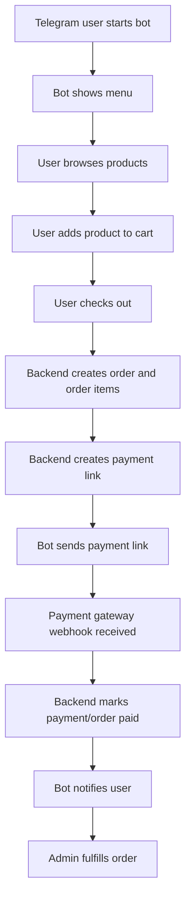

# Backend Flows

Folder ini berisi dokumen flow backend untuk aplikasi **Telegram-first Marketplace MVP** yang dibangun di atas fondasi **Chatbot CRM multi-platform**.

Dokumen ini menjelaskan alur proses dari sudut pandang backend dan produk, bukan detail endpoint API. Detail endpoint sebaiknya berada di folder `05-api-spec`, detail schema berada di `06-data`, dan aturan keamanan berada di `08-security`.

## Target Sistem

Aplikasi saat ini memiliki fondasi:

- CRM inbox.
- Telegram/WhatsApp/Instagram webhook.
- AI agent.
- Human takeover.
- Contact management.
- Order/complaint capture.
- Local file upload.

Target MVP baru:

```txt
Telegram user
  -> browse product
  -> add to cart
  -> checkout
  -> receive payment link
  -> pay through sandbox gateway
  -> receive order/payment status
```

Admin tetap bisa:

```txt
Login dashboard
  -> manage products
  -> view chats
  -> takeover chat
  -> view orders
  -> update fulfillment status
```

## File List

| File | Purpose |
|---|---|
| `admin-flow.md` | Flow admin dashboard, owner, super, human agent |
| `auth-flow.md` | Register, verify OTP, login, reset password, logout |
| `product-catalog-flow.md` | Flow admin mengelola produk dan user melihat produk |
| `telegram-commerce-flow.md` | Flow belanja user melalui Telegram |
| `checkout-flow.md` | Cart, checkout, order creation, confirmation |
| `payment-flow.md` | Payment link, sandbox gateway, webhook, reconciliation |
| `order-fulfillment-flow.md` | Order setelah paid sampai completed/cancelled |
| `webhook-message-flow.md` | Telegram/Meta incoming webhook hingga message tersimpan |
| `chatbot-ai-flow.md` | AI assistant, guardrails, action proposal |
| `human-takeover-flow.md` | Flow CS/human takeover dari AI |
| `complaint-flow.md` | Flow complaint dari user hingga resolved/dismissed |
| `media-file-flow.md` | Flow attachment/media dengan local storage + file metadata |
| `edge-cases.md` | Edge cases penting across auth, webhook, checkout, payment, AI |

## Placement Rule

Dokumen ini fokus pada **flow behavior**. Jika flow membutuhkan detail tambahan:

- Database table/detail index -> `06-data`.
- Endpoint payload/response -> `05-api-spec`.
- Security/auth/signature -> `08-security`.
- Test cases -> `10-testing`.
- Sprint task -> `11-sprint`.

## Flow Design Principles

1. **Backend is source of truth** untuk cart, order, payment, dan status fulfillment.
2. **AI is assistant, not authority**. AI boleh menyarankan action, tetapi backend yang memvalidasi dan mengeksekusi.
3. **Payment status only changes from trusted payment webhook** atau admin action yang audited.
4. **Every tenant-owned action must be workspace-scoped**.
5. **Every external webhook should be idempotent**.
6. **Human takeover disables AI reply for that chat** sampai dilepas/diresolve.
7. **Local file storage stores binaries, database stores metadata**.

## Core Happy Path


