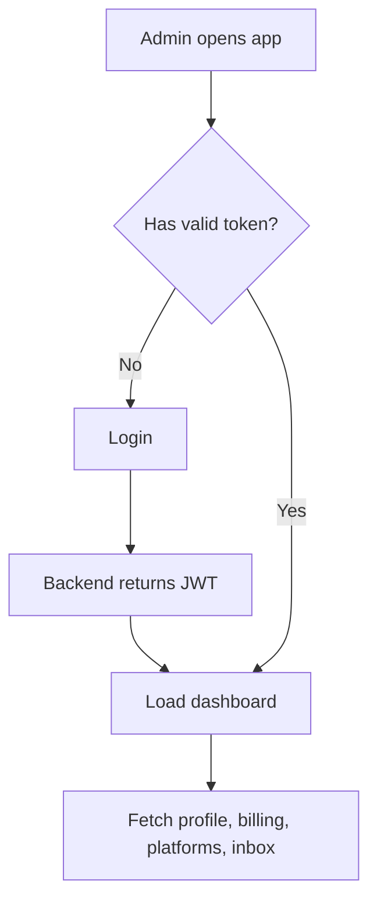
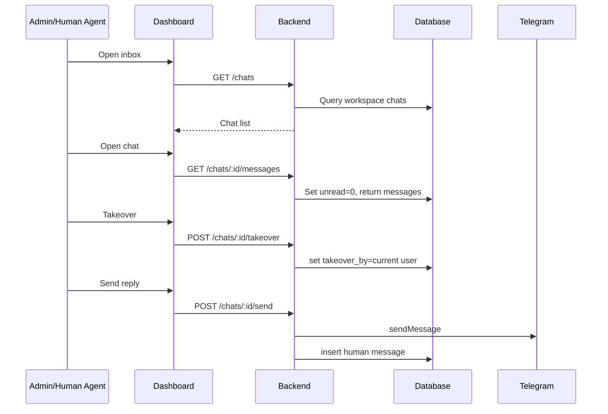

# Admin Flow

Dokumen ini menjelaskan flow admin dashboard untuk owner, super, dan human agent.

## Admin Dashboard Areas

| Area | Purpose |
|---|---|
| Dashboard/Inbox | Melihat conversation dari Telegram/WhatsApp/Instagram |
| Contacts | Melihat customer profile, tags, notes |
| Platforms | Menghubungkan Telegram/Meta platform |
| AI Agents | Mengatur behavior, knowledge, files, welcome message |
| Products | Mengelola product catalog marketplace MVP |
| Orders | Melihat order, item, payment, fulfillment status |
| Complaints | Melihat dan resolve complaint |
| Analytics | Traffic, agent performance, order metrics |
| Settings | Provider AI, workspace preferences |

## Admin Login to Dashboard



## Platform Management Flow

```txt
Admin opens Platforms
-> creates platform record
-> selects type telegram/whatsapp/instagram
-> enters token/account config
-> saves platform
-> optionally clicks set webhook
-> backend calls provider setWebhook API
-> platform becomes enabled
```

### Telegram Platform Setup

```txt
Create telegram platform
-> save bot token
-> call /integrations/telegram/:id/setWebhook
-> backend sets PUBLIC_BASE_URL/webhook/telegram/:token or token-aware endpoint
-> send test message to bot
-> verify chat appears in inbox
```

## Agent Setup Flow

```txt
Admin creates AI agent
-> assigns platform
-> sets prompt/behavior/welcome message
-> uploads knowledge/files if needed
-> configures complaint/order behavior
-> saves agent
-> webhook will select agent by platform_id
```

## Product Management Flow

```txt
Admin opens Products
-> create category optional
-> create product
-> create variant optional
-> upload product image optional
-> set price/stock/status
-> publish product
-> product becomes visible in Telegram commerce flow
```

## Inbox and Human Takeover Flow



## Order Management Flow

```txt
Admin opens Orders
-> filter by status/payment/created_at
-> open order detail
-> verify items/payment status
-> update fulfillment status
-> optionally send Telegram notification
```

### Order Status Changes

| From | To | Actor | Notes |
|---|---|---|---|
| new | accepted | Payment webhook | Trusted gateway event sets payment_status paid |
| accepted | preparing | Admin | Merchant starts preparation |
| preparing | ready | Admin | Ready for pickup/delivery |
| ready | completed | Admin | Order fulfilled |
| new | cancelled | Admin/system | Expired or manually cancelled |
| accepted | cancelled | Admin/payment process | Requires policy and audit |

## Admin Guardrails

- Admin cannot access another workspace's data.
- Human agent role should only see assigned/taken chats unless workspace policy allows otherwise.
- Order/payment status updates should be audited.
- Product deletion should be soft delete/archive if historical order items reference it.
