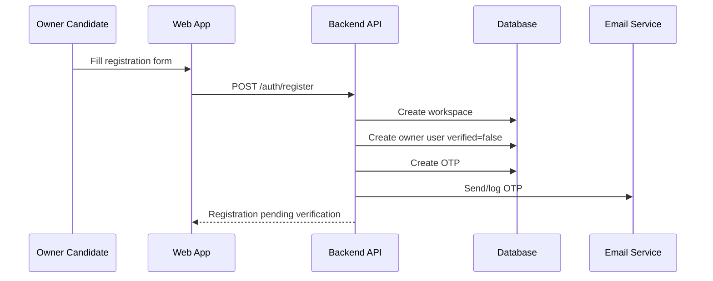
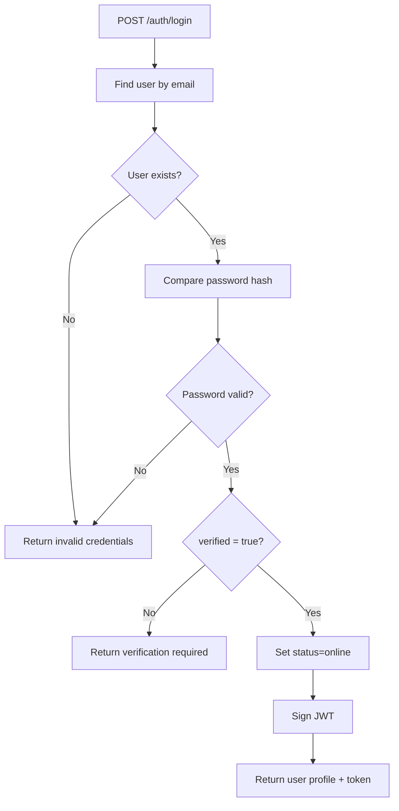

# Auth Flow

Dokumen ini menjelaskan flow autentikasi backend untuk owner, super user, dan human agent.

## Actors

| Actor | Description |
|---|---|
| Owner | Pemilik workspace, bisa mengelola user/platform/agent/order |
| Super | Admin internal workspace dengan akses tinggi |
| Agent | Human CS/agent yang menangani chat tertentu |
| Public user | Customer dari Telegram/WhatsApp/Instagram, bukan app user dashboard |

Customer Telegram tidak login ke dashboard. Identitas customer disimpan di `contacts` berdasarkan platform identity.

## Registration Flow



### Rules

- Registration creates a new `workspace`.
- First user should be role `owner`.
- Email should be case-insensitive unique.
- User cannot login until `verified = true`.
- Password must be hashed before storage.

## OTP Verification Flow

```txt
User submits email + OTP
-> backend verifies OTP exists and not expired
-> set users.verified = true
-> delete/expire used OTP
-> user can login
```

### Failure Cases

| Case | Expected Behavior |
|---|---|
| Wrong OTP | Return validation error |
| Expired OTP | Ask user to request new OTP |
| Already verified | Return success-safe response |
| Too many attempts | Rate limit or temporarily block |

## Login Flow



## Attach User Flow

Every protected backend route should:

```txt
Read Authorization: Bearer <token>
-> verify JWT
-> load users row by id
-> attach user to request
-> use user.workspace_id for tenant-scoped queries
```

## Role Rules

| Role | Can Manage Workspace | Can Manage Agents | Can See All Chats | Can Takeover Chat |
|---|---:|---:|---:|---:|
| owner | Yes | Yes | Yes | Yes |
| super | Yes, limited | Yes | Yes | Yes |
| agent | No | No | Assigned/taken chats only | Yes |

## Password Reset Flow

```txt
POST /auth/forgot-password
-> find user by email
-> create password reset token
-> send reset link

POST /auth/reset-password
-> validate token
-> hash new password
-> update user
-> delete/expire token
```

## Logout Flow

```txt
POST /auth/logout
-> set users.status = offline
-> client removes token
```

JWT remains stateless unless token blacklist is implemented.

## Security Requirements

- Do not expose whether an email exists during forgot-password.
- Do not log password, token, OTP, or reset link with real secrets in production.
- Use workspace scope on every protected route.
- Service role key must never be available to frontend.
