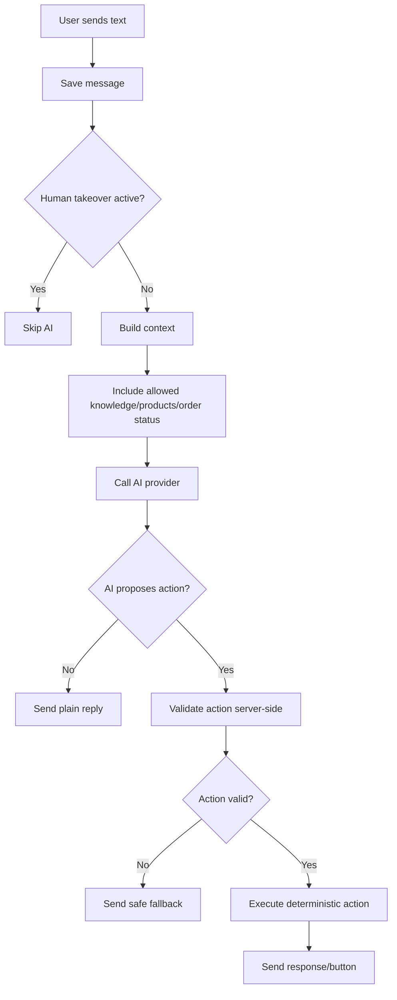

# Chatbot AI Flow

Dokumen ini menjelaskan flow AI assistant untuk CRM dan marketplace.

## AI Role

AI berperan sebagai:

```txt
customer service assistant
product recommendation assistant
FAQ assistant
complaint triage assistant
handoff assistant
```

AI bukan sumber kebenaran untuk:

```txt
price
stock
payment status
order finalization
refund decision
admin permission
```

## Current Compatibility

Sistem lama mendukung marker seperti:

```txt
FILE_ORDER_JSON:
FILE_COMPLAINT_JSON:
ESCALATE_TO_HUMAN
```

Untuk marketplace MVP, marker lama boleh dipertahankan untuk legacy order/complaint, tetapi commerce baru sebaiknya memakai deterministic backend actions.

## AI Flow for Free Text



## Allowed AI Action Types

| Action | Backend Validation Required |
|---|---|
| `recommend_product` | Product must be active |
| `show_product` | Product belongs to workspace |
| `start_checkout` | Cart must be valid |
| `check_order_status` | Order belongs to contact/workspace |
| `create_complaint_draft` | Required fields present |
| `handoff_to_human` | Always allowed with reason |

## Disallowed AI Actions

AI must not directly:

- Mark payment as paid.
- Change order total.
- Override product price.
- Create payment link without checkout/order validation.
- Cancel/refund orders without admin flow.
- Access another user's chat/order.
- Invent unavailable products or promos.

## AI Context Sources

Recommended context order:

```txt
System instruction
Workspace/agent behavior
Current channel/platform
Recent chat history
Product catalog snippets
FAQ/knowledge snippets
Current cart summary
Relevant order status
Safety/business rules
```

## AI Commerce Reply Pattern

When AI recommends a product, prefer button handoff:

```txt
AI: Kamu mungkin cocok dengan Salty Caramel. Rasanya manis creamy dan cocok buat yang suka caramel.

[View Product]
[Browse More]
```

Do not only answer with free text if user can take an action.

## Escalation/Handoff Criteria

AI should escalate when:

- User is angry or threatens complaint.
- Payment/order mismatch occurs.
- Refund request appears.
- AI confidence is low.
- User asks for human/admin.
- Sensitive policy question requires admin decision.

## Logging

Save AI decisions to `ai_actions` when possible:

```txt
chat_id
message_id
action_type
status proposed/validated/executed/failed
input_summary
output_summary
error
created_at
```

This helps audit and debugging.
