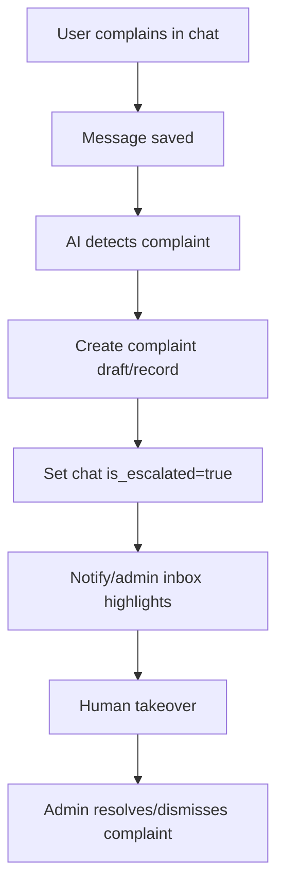

# Complaint Flow

Dokumen ini menjelaskan flow complaint/keluhan customer.

## Purpose

Complaint flow membantu sistem mencatat keluhan dari chat dan mengarahkan ke human/admin jika diperlukan.

## Sources

| Source | Description |
|---|---|
| AI marker legacy | AI emits `FILE_COMPLAINT_JSON` |
| Admin manual | Admin creates complaint from dashboard/chat |
| Deterministic flow future | Telegram button/form for complaint |

## Complaint Happy Path



## Complaint Status

| Status | Meaning |
|---|---|
| open | Complaint needs attention |
| resolved | Issue handled |
| dismissed | Not a valid complaint / no action needed |

## Required Data

Complaint should store:

```txt
workspace_id
chat_id
contact_id
agent_id optional
platform_type
text
form_data jsonb
status
created_at
updated_at
```

## AI Complaint Handling Rules

AI may:

- Acknowledge user frustration.
- Ask clarifying questions.
- Create complaint draft/record.
- Escalate to human.

AI must not:

- Promise refunds unless policy explicitly allows.
- Mark payment/order refunded.
- Blame user or provider.
- Invent resolution timeline.

## Admin Resolution Flow

```txt
Admin opens Complaints
-> filters open complaints
-> opens linked chat
-> takes over if needed
-> resolves issue
-> updates complaint status resolved/dismissed
-> optional note added
```

## Linked Order Handling

If complaint mentions an order:

```txt
Try match contact's recent orders
Ask user/admin confirmation
Link complaint to order if schema supports it
```

If schema does not yet support `complaints.order_id`, keep order reference inside `form_data` and plan future migration.

## Edge Cases

| Case | Behavior |
|---|---|
| Duplicate complaint from same message | Use message_id reference or idempotency |
| Complaint during human takeover | Save complaint or show admin suggestion, do not AI reply |
| Complaint about payment | Escalate; do not update payment status manually |
| Complaint with attachment | Save attachment file metadata and link to message |
