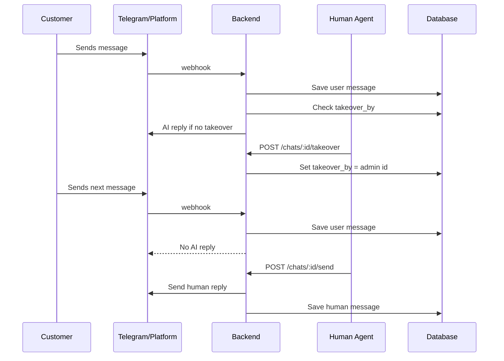

# Human Takeover Flow

Dokumen ini menjelaskan flow ketika human agent mengambil alih percakapan dari AI.

## Purpose

Human takeover memastikan AI tidak membalas otomatis ketika chat sedang ditangani manusia.

## Takeover State

Primary field:

```txt
chats.takeover_by
```

If `takeover_by` is not null:

```txt
AI must stop replying to incoming user messages.
```

Supporting fields:

```txt
chats.is_escalated
chats.status
chats.unread
chats.last_message_at
```

## Takeover Happy Path



## Escalation vs Takeover

| Field | Meaning |
|---|---|
| `is_escalated = true` | AI/system flags chat needs human attention |
| `takeover_by != null` | A specific human is handling it; AI stops |

A chat can be escalated before any human accepts takeover.

## Admin Takeover Flow

```txt
Admin opens inbox
-> sees escalated/unassigned chat
-> clicks Takeover
-> backend validates role/workspace
-> set chats.takeover_by = current user
-> set chats.is_escalated = false
-> set chats.status = open
```

## Release/Resolve Flow

Recommended options:

### Resolve chat

```txt
POST /chats/:id/resolve
-> set status = resolved
-> optionally clear takeover_by
-> AI may remain disabled until new user message reopens chat depending product choice
```

### Release takeover

```txt
POST /chats/:id/release
-> set takeover_by = null
-> AI can answer future messages again
```

If release endpoint does not exist yet, add it when needed.

## Human Send Flow

```txt
Admin sends message
-> validate chat workspace
-> validate admin access
-> send to platform provider
-> insert message sender=human
-> store platform_message_id if returned
-> update chat.last_message_at
```

## Role Access Rules

| Role | Can Takeover | Can Release Others | Can Resolve |
|---|---:|---:|---:|
| owner | Yes | Yes | Yes |
| super | Yes | Yes | Yes |
| agent | Yes | No/limited | Assigned chat only |

## Edge Cases

| Case | Behavior |
|---|---|
| AI job already running when takeover happens | Check takeover before sending AI reply |
| Two agents takeover simultaneously | Use DB update guard or latest write policy |
| User sends messages during takeover | Save messages, increase unread, do not AI reply |
| Chat resolved but user sends new message | Reopen chat or create new session based on product rule |
| Agent deleted | Set `takeover_by = null` or restrict deletion |
