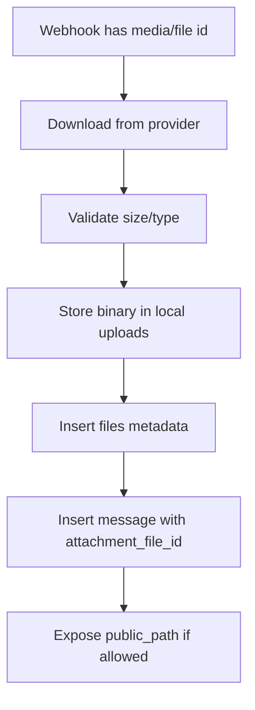

# Media and File Flow

Dokumen ini menjelaskan flow file/media untuk attachment chat, agent files, payment proof, dan product images.

## Storage Decision

```txt
Structured metadata -> Supabase/Postgres files table
Binary files        -> local server filesystem
Public serving      -> /files or future protected /media/:fileId
```

## File Categories

| Category | Folder | Source |
|---|---|---|
| Chat media | `uploads/chat` | Telegram/WA/IG inbound or human reply |
| Agent files | `uploads/agent-files` | Admin upload knowledge/database files |
| Payment proofs | `uploads/payment-proofs` | Manual payment proof fallback |
| Product images | `uploads/product-images` | Admin product image upload |
| Public assets | `uploads/public-assets` | Stickers/static assets |
| Temp | `uploads/temp` | Temporary downloads before persistence |

## Inbound Media Flow



## Admin Upload Flow

```txt
Admin uploads file/image
-> backend validates auth/workspace
-> backend validates file size/type
-> stores file under correct category
-> inserts files row
-> links file to agent/product/order/message
```

## File Metadata Fields

Recommended:

```txt
workspace_id
storage_provider = local
disk = uploads
relative_path
public_path
original_name
stored_name
mime_type
size_bytes
source
created_by
created_at
```

## Path Convention

```txt
<category>/<yyyy>/<mm>/<uuid>-<safe-name>
```

Examples:

```txt
chat/2026/06/019xxx-photo.jpg
product-images/2026/06/019xxx-salty-caramel.jpg
payment-proofs/2026/06/019xxx-proof.jpg
```

## Public vs Protected Access

### MVP public path

```txt
GET /files/<relative_path>
```

### Future protected access

```txt
GET /media/:fileId
-> auth required
-> check workspace_id
-> stream file from local storage
```

## Deletion Rule

Avoid hard deleting files that are referenced by:

```txt
messages
orders
products
agent_database_files
```

Prefer soft-delete metadata or archive if needed.

## Backup Rule

Because binary files stay local, production backup must include:

```txt
Database backup
+ uploads directory backup
```

Backups should be from close time windows to avoid broken file references.

## Edge Cases

| Case | Behavior |
|---|---|
| Provider media expired before download | Save message, mark attachment download failed |
| File type unsupported | Reject or save as generic file depending policy |
| Upload too large | Reject with clear error |
| File exists in DB but missing on disk | Show broken file warning; include in health check |
| Path traversal filename | Sanitize filename and generate UUID stored name |
