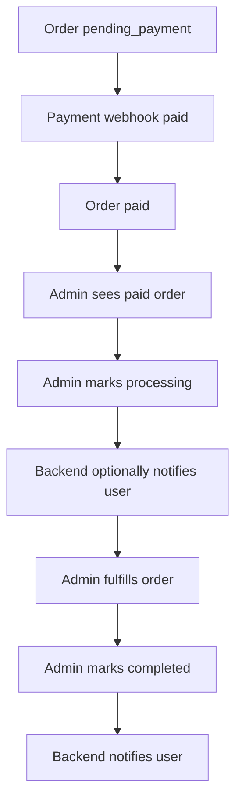

# Order Fulfillment Flow

Dokumen ini menjelaskan flow order setelah payment berhasil hingga completed/cancelled.

## Order Sources

| Source | Description |
|---|---|
| `telegram` | Order created from Telegram cart/checkout |
| `ai_form` | Legacy order created from AI `FILE_ORDER_JSON` marker |
| `admin` | Order manually created by admin if supported |

## Recommended Order Statuses

```txt
new
pending_payment
paid
processing
completed
cancelled
refunded
```

If legacy enum cannot be changed immediately, map marketplace statuses into existing compatible values while planning enum migration.

## Fulfillment Happy Path



## Admin Update Flow

```txt
Admin opens Orders
-> filters paid orders
-> opens order detail
-> checks item/payment/customer info
-> updates status to processing/completed/cancelled
-> backend validates transition
-> backend writes audit log if available
-> backend sends Telegram notification if enabled
```

## Status Transition Rules

| From | To | Allowed Actor | Notes |
|---|---|---|---|
| pending_payment | paid | Payment webhook | Normal payment success |
| pending_payment | cancelled | Admin/system | Payment expired/cancelled |
| paid | processing | Admin | Start fulfillment |
| processing | completed | Admin | Finish order |
| paid | cancelled | Admin | Requires reason |
| completed | refunded | Admin/payment process | Requires refund flow |

## Telegram Notifications

Recommended notification events:

| Event | Message |
|---|---|
| Order paid | Pembayaran berhasil, pesanan diproses |
| Order processing | Pesanan sedang disiapkan |
| Order completed | Pesanan selesai, terima kasih |
| Order cancelled | Pesanan dibatalkan, alasan: ... |

## Order Detail for Admin

Order detail should show:

```txt
Order ID
Customer/contact
Chat link
Product items
Subtotal/grand total
Payment status
Payment provider reference
Fulfillment status
Notes
Timestamps
```

## Order Immutability Rule

After order is created:

- Do not mutate `order_items` casually.
- If correction is needed, use adjustment/refund/manual admin note.
- Product price/name changes should not affect existing order items.

## Edge Cases

| Case | Behavior |
|---|---|
| Payment paid after order cancelled | Flag for admin review |
| Admin cancels paid order | Require reason and refund policy |
| User asks order status | Bot reads latest order/payment/fulfillment status |
| Product deleted after order | Order item snapshots remain visible |
