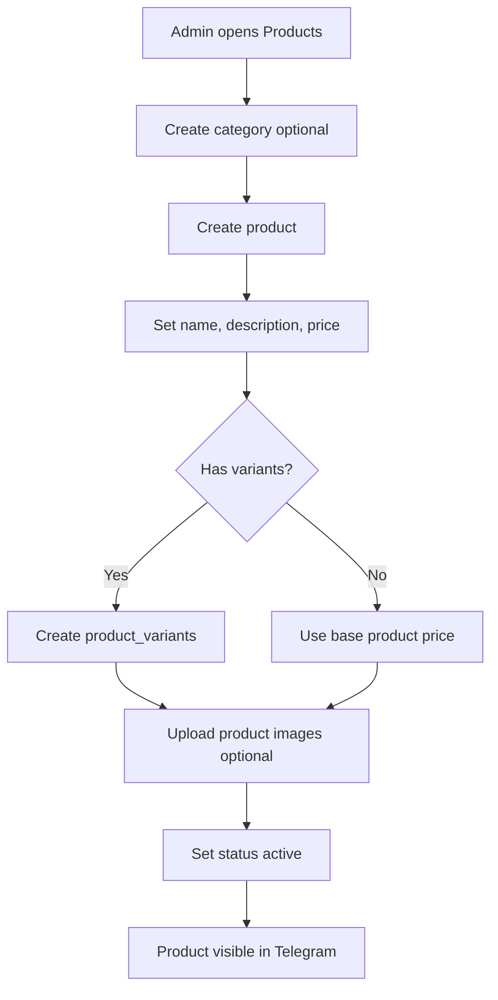

# Product Catalog Flow

Dokumen ini menjelaskan flow product catalog untuk Telegram-first Marketplace MVP.

## Purpose

Product catalog adalah sumber data utama untuk produk yang bisa dilihat customer lewat Telegram dan dikelola admin lewat dashboard.

## Entities Involved

```txt
product_categories
products
product_variants
product_images
files
cart_items
order_items
```

## Admin Product Creation Flow



## Product Status

| Status | Visible to Customer | Can Add to Cart | Notes |
|---|---:|---:|---|
| draft | No | No | Admin still editing |
| active | Yes | Yes | Normal sellable state |
| inactive | No | No | Temporarily hidden |
| archived | No | No | Kept for historical references |

## Product Variant Rules

Use variants when product has meaningful purchasable options:

```txt
Size: small / medium / large
Flavor: original / caramel / matcha
Package: single / bundle
```

Each variant may have:

```txt
sku
name
price
stock_quantity
is_default
status
```

## Telegram Product Browsing Flow

```txt
User clicks Browse Products
-> backend verifies active outlet context
-> backend queries active products available in selected outlet
-> bot sends category/product list
-> user selects product
-> bot shows product detail
-> user chooses variant/quantity
-> backend validates availability
-> user can add item to cart
```

Current runtime rule:

```txt
Customer-facing Telegram product list requires outlet_id.
Products are shown only when product_outlet_availability is active and available for the selected outlet.
```

## Product Detail Message

Telegram product detail should include:

```txt
Product name
Short description
Price or variant price
Availability
Optional image
Buttons:
- Add to cart
- Choose variant
- Back to catalog
```

## Inventory MVP Rule

For MVP, inventory can be simple:

```txt
If track_inventory = false:
  allow add to cart while product active

If track_inventory = true:
  allow only if stock_quantity > 0
```

Advanced reservation is optional and should not be required for MVP.

## Historical Order Safety

When an order is created, copy product snapshot into `order_items`:

```txt
product_name_snapshot
variant_name_snapshot
unit_price_snapshot
quantity
line_total
```

This protects historical orders if product name/price changes later.

## Edge Cases

| Case | Behavior |
|---|---|
| Product inactive after being added to cart | Block checkout and ask user to remove/update item |
| Price changes after cart created | Recalculate during checkout and show updated total |
| Stock becomes unavailable | Block checkout for that item |
| Product image missing | Send text-only product detail |
| Variant required but not selected | Ask user to choose variant first |
