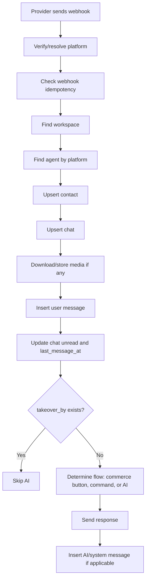

# Webhook Message Flow

Dokumen ini menjelaskan alur incoming webhook dari Telegram/Meta sampai message tersimpan dan dibalas.

## Supported Platforms

| Platform | Current Role |
|---|---|
| Telegram | Primary MVP commerce channel |
| WhatsApp | Existing CRM channel |
| Instagram | Existing CRM channel |
| Facebook/custom | Future/optional |

## Incoming Webhook Flow



## Platform Resolution

### Telegram

```txt
Find platform by:
platforms.type = telegram
platforms.token = webhook token param or bot token mapping
```

### Meta WhatsApp/Instagram

```txt
Find platform by:
platforms.type
platforms.account_id or phone_number_id
```

## Contact Upsert

Use unique external identity:

```txt
workspace_id + platform_type + platform_account_id
```

This prevents duplicate contacts for repeated webhooks from the same external user.

## Chat Upsert

Use:

```txt
workspace_id + platform_id + contact_id
```

If chat exists but has no `agent_id`, attach the current agent if available.

## Webhook Idempotency

Before inserting message, check:

```txt
platform_message_id already exists for same workspace/chat/platform
```

Or store raw webhook in `webhook_events` with unique key:

```txt
platform + provider_event_id
```

If duplicate:

```txt
Return success to provider, skip side effects.
```

## Message Routing

After message is saved:

| Message Type | Route |
|---|---|
| `/start` | Telegram main menu |
| Callback query commerce action | Deterministic commerce handler |
| Text product question | AI shopping assistant |
| Complaint phrase | AI/complaint flow |
| Human takeover active | No AI response |
| Unsupported media | Save media, respond fallback if needed |

## Media Handling

```txt
Provider media URL/file_id
-> backend downloads file
-> store binary in local uploads
-> insert files metadata
-> message.attachment_file_id = files.id
```

## Error Handling

Provider webhook endpoint should return 200 quickly when possible to avoid retries, but internal processing should still log errors.

Recommended:

```txt
Save webhook event
-> process synchronously for MVP
-> later move to queue/worker
```

## Future Queue Flow

For scale:

```txt
Webhook endpoint
-> save event
-> enqueue job
-> return 200
-> worker processes AI/commerce/reply
```
