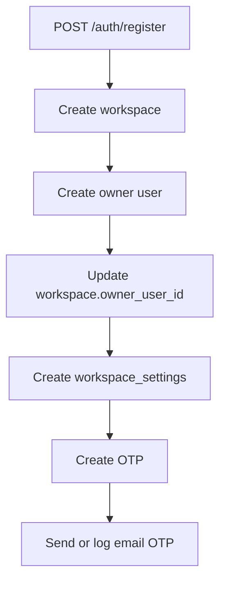
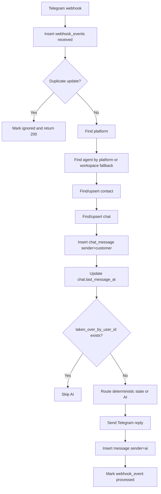
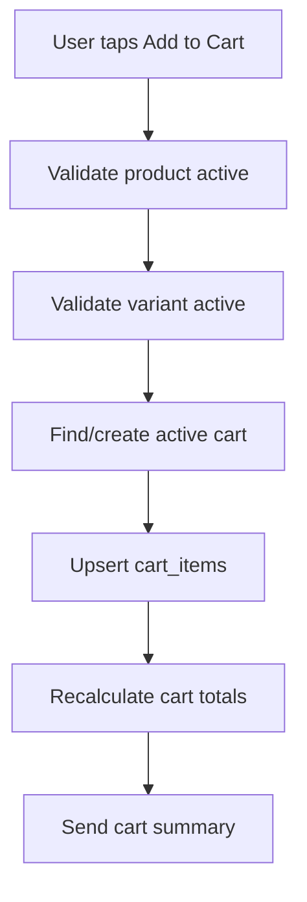
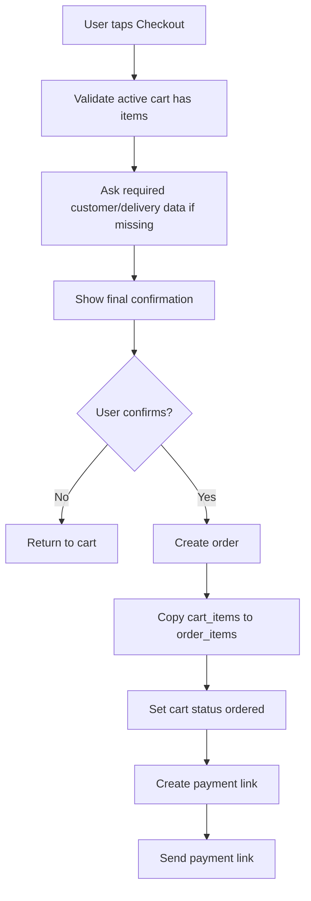
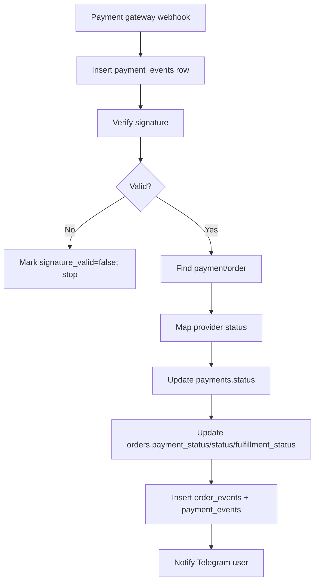

# Data Flow — CRM + Telegram Marketplace MVP

Dokumen ini menjelaskan bagaimana data bergerak setelah migrasi Supabase/Postgres, sambil mempertahankan behavior MongoDB saat ini.

## Principles

1. Existing CRM flow harus tetap berjalan.
2. Telegram marketplace flow harus deterministic.
3. AI adalah assistant, bukan source of truth.
4. Payment status hanya valid dari payment webhook atau authorized admin.
5. Semua write tenant-owned wajib membawa `workspace_id`.

---

# 1. Registration Flow



Writes:

```txt
workspaces
users
workspace_settings
otps
```

Rules:

- Email unique case-insensitive.
- Owner starts `verified=false`.
- Login blocked until verified.

# 2. Login Flow

```txt
Find user by email
-> compare password_hash
-> require verified=true
-> set status=online
-> sign JWT with app users.id + email
```

Reads: `users`  
Writes: `users.status`, `users.last_login_at`

# 3. Platform Setup Flow

```txt
CRM form
-> POST /platforms
-> insert platforms row
-> optional set webhook via /integrations/telegram/:id/setWebhook
```

Telegram webhook URL should ideally include a platform-specific secret or token param.

# 4. Agent Setup Flow

```txt
CRM agent form
-> POST /agents
-> insert agents row with embedded JSON config
-> replace agent_outlets rows by outlet_id
```

Writes:

```txt
agents
agent_outlets
files                    # optional, when uploading agent database/knowledge files
```

# 5. Incoming Telegram Message Flow



Critical fields:

```txt
platforms.token_encrypted
contacts.external_id
chats.taken_over_by_user_id
chats.state
chat_messages.platform_message_id
webhook_events.external_event_id
```

Idempotency:

- Store Telegram `update_id` in `webhook_events.external_event_id`.
- Store Telegram `message_id` in `chat_messages.platform_message_id`.
- Do not insert duplicate message for same chat/platform/message id.

# 6. Incoming Media Flow

```txt
Telegram/Meta sends media
-> backend downloads media
-> save to LOCAL_UPLOAD_ROOT category folder
-> insert files row
-> insert chat_messages row with attachment_file_id
```

# 7. Human Takeover Flow

```txt
POST /chats/:id/takeover
-> validate workspace
-> set chats.taken_over_by_user_id = current user
-> set is_escalated=false
-> set status=open
```

Next customer message:

```txt
Webhook saves chat_message
-> detects taken_over_by_user_id
-> skips AI
```

# 8. Human Send Flow

```txt
POST /chats/:id/send
-> validate workspace
-> insert chat_message sender=admin
-> send to provider
-> store platform_message_id
-> update chat.last_message_at
```

# 9. Existing AI Order/Complaint Flow

Current compatibility markers:

```txt
FILE_ORDER_JSON:
FILE_COMPLAINT_JSON:
ESCALATE_TO_HUMAN
```

Migration requirement:

```txt
AI marker parsing should call service functions:
  createLegacyOrderFromAI(workspace_id, ...)
  createComplaintFromAI(workspace_id, ...)
  escalateChat(workspace_id, ...)
```

Legacy orders should use:

```txt
orders.source = ai_form
orders.form_data = parsed legacy payload
orders.status = new
orders.payment_status = unpaid
```

# 10. Telegram Marketplace /start Flow

```txt
User sends /start
-> find/upsert contact
-> find/upsert chat
-> send welcome message
-> send menu buttons
```

Main menu:

```txt
🛍 Lihat Produk
🛒 Keranjang
📦 Pesanan Saya
👩‍💻 Bicara Admin
```

# 11. Product Browse Flow

```txt
User taps Browse Products
-> callback_query received
-> find active products by workspace
-> send paginated product list with buttons
```

Reads:

```txt
products
product_variants
product_categories
files
```

# 12. Product Detail Flow

```txt
User taps product
-> fetch product + variants
-> send detail
-> show buttons: Add to Cart, View Cart, Back
```

Backend must not trust product name/price from Telegram callback payload.

# 13. Add to Cart Flow



Writes:

```txt
carts
cart_items
```

Rules:

- Unit price comes from backend product/variant data.
- Save product snapshot.
- Quantity must be validated.

# 14. Checkout Flow



Writes:

```txt
orders
order_items
order_events
carts.status
payments
payment_attempts
payment_events
chat_messages
```

# 15. Payment Link Creation Flow

```txt
POST /payments/create-link
-> validate order workspace/status
-> call Midtrans/Xendit sandbox
-> insert payments row
-> return payment_url
-> Telegram bot sends payment_url
```

# 16. Payment Webhook Flow



Status mapping:

```txt
settlement/capture -> payments.status=paid, orders.payment_status=paid, orders.status=confirmed
pending -> payments.status=pending, orders.payment_status=pending
expire -> payments.status=expired, orders.payment_status=expired, orders.status=expired
cancel/deny/failure -> payments.status=failed, orders.payment_status=failed
refund -> payments.status=refunded, orders.payment_status=refunded
```

# 17. AI Shopping Assistant Flow

Free text flow:

```txt
check deterministic state
-> check command/callback
-> if normal text, call AI
-> AI may suggest products/actions
-> backend validates action before rendering buttons/executing
```

AI can suggest:

```json
{"type":"show_product","product_id":"..."}
```

AI must not directly mark paid, change price, or create final order without backend confirmation.
