# ERD

This ERD is the MVP database shape aligned to the current frontend: Platforms, Chats, Contacts, Products, Outlets, Orders, Payments, Settings, AI Agents, and Complaints.

Key rule:

```txt
workspace_id = tenant boundary
outlet_id = operational branch boundary
```

## Relationship View

```txt
USERS
  │
  ├── USER_WORKSPACE_MEMBERSHIPS ───── WORKSPACES ───── WORKSPACE_SETTINGS
  │                                      │
  │                                      ├── OUTLETS
  │                                      │     │
  │                                      │     └── USER_OUTLET_ACCESS ─── USERS
  │                                      │
  │                                      ├── PLATFORMS
  │                                      │     │
  │                                      │     ├── CONTACTS
  │                                      │     │     │
  │                                      │     │     ├── CHATS ─── CHAT_MESSAGES
  │                                      │     │     │
  │                                      │     │     ├── CARTS ─── CART_ITEMS
  │                                      │     │     │              │
  │                                      │     │     │              └── PRODUCTS / PRODUCT_VARIANTS
  │                                      │     │     │
  │                                      │     │     └── ORDERS ─── ORDER_ITEMS
  │                                      │     │              │
  │                                      │     │              ├── ORDER_EVENTS
  │                                      │     │              └── PAYMENTS ─── PAYMENT_ATTEMPTS
  │                                      │     │                         └── PAYMENT_EVENTS
  │                                      │     │
  │                                      │     └── CHATS / ORDERS / CARTS / PAYMENTS
  │                                      │
  │                                      ├── PRODUCT_CATEGORIES
  │                                      │     └── PRODUCTS ─── PRODUCT_VARIANTS
  │                                      │              │
  │                                      │              └── PRODUCT_OUTLET_AVAILABILITY ─── OUTLETS
  │                                      │
  │                                      ├── AGENTS
  │                                      │     └── AGENT_OUTLETS ─── OUTLETS
  │                                      │
  │                                      ├── COMPLAINTS ─── OUTLETS / CONTACTS / CHATS
  │                                      │
  │                                      └── PAYMENT_PROVIDER_SETTINGS
```

## Mermaid ERD

```mermaid
erDiagram
  USERS ||--o{ USER_WORKSPACE_MEMBERSHIPS : has
  USERS ||--o{ USER_OUTLET_ACCESS : has
  USERS ||--o{ OUTLETS : manages
  USERS ||--o{ CHATS : takes_over
  USERS ||--o{ ORDER_EVENTS : acts_on
  USERS ||--o{ AGENTS : configures
  USERS ||--o{ COMPLAINTS : assigned_to

  WORKSPACES ||--o{ WORKSPACE_SETTINGS : configures
  WORKSPACES ||--o{ OUTLETS : owns
  WORKSPACES ||--o{ USER_WORKSPACE_MEMBERSHIPS : has
  WORKSPACES ||--o{ USER_OUTLET_ACCESS : scopes
  WORKSPACES ||--o{ PLATFORMS : connects
  WORKSPACES ||--o{ CONTACTS : owns
  WORKSPACES ||--o{ CHATS : owns
  WORKSPACES ||--o{ CHAT_MESSAGES : owns
  WORKSPACES ||--o{ PRODUCT_CATEGORIES : owns
  WORKSPACES ||--o{ PRODUCTS : owns
  WORKSPACES ||--o{ PRODUCT_VARIANTS : owns
  WORKSPACES ||--o{ PRODUCT_OUTLET_AVAILABILITY : owns
  WORKSPACES ||--o{ CARTS : owns
  WORKSPACES ||--o{ CART_ITEMS : owns
  WORKSPACES ||--o{ ORDERS : owns
  WORKSPACES ||--o{ ORDER_ITEMS : owns
  WORKSPACES ||--o{ ORDER_EVENTS : owns
  WORKSPACES ||--o{ PAYMENT_PROVIDER_SETTINGS : configures
  WORKSPACES ||--o{ PAYMENTS : owns
  WORKSPACES ||--o{ PAYMENT_ATTEMPTS : owns
  WORKSPACES ||--o{ PAYMENT_EVENTS : owns
  WORKSPACES ||--o{ AGENTS : owns
  WORKSPACES ||--o{ AGENT_OUTLETS : owns
  WORKSPACES ||--o{ COMPLAINTS : owns

  OUTLETS ||--o{ USER_OUTLET_ACCESS : grants
  OUTLETS ||--o{ PRODUCT_OUTLET_AVAILABILITY : stocks
  OUTLETS ||--o{ CARTS : receives
  OUTLETS ||--o{ ORDERS : fulfills
  OUTLETS ||--o{ PAYMENTS : receives
  OUTLETS ||--o{ CHATS : contextualizes
  OUTLETS ||--o{ CONTACTS : last_seen_at

  PLATFORMS ||--o{ CONTACTS : identifies
  PLATFORMS ||--o{ CHATS : carries
  PLATFORMS ||--o{ CHAT_MESSAGES : carries
  PLATFORMS ||--o{ CARTS : creates
  PLATFORMS ||--o{ ORDERS : creates

  CONTACTS ||--o{ CHATS : has
  CONTACTS ||--o{ CHAT_MESSAGES : sends
  CONTACTS ||--o{ CARTS : owns
  CONTACTS ||--o{ ORDERS : places
  CONTACTS ||--o{ PAYMENTS : pays
  CONTACTS ||--o{ COMPLAINTS : raises

  CHATS ||--o{ COMPLAINTS : triggers

  CHATS ||--o{ CHAT_MESSAGES : contains
  CHATS ||--o{ ORDERS : originates

  PRODUCT_CATEGORIES ||--o{ PRODUCTS : groups
  PRODUCTS ||--o{ PRODUCT_VARIANTS : has
  PRODUCTS ||--o{ PRODUCT_OUTLET_AVAILABILITY : available_at
  PRODUCT_VARIANTS ||--o{ PRODUCT_OUTLET_AVAILABILITY : available_at
  PRODUCTS ||--o{ CART_ITEMS : selected_as
  PRODUCT_VARIANTS ||--o{ CART_ITEMS : selected_as
  PRODUCTS ||--o{ ORDER_ITEMS : sold_as
  PRODUCT_VARIANTS ||--o{ ORDER_ITEMS : sold_as

  AGENTS ||--o{ AGENT_OUTLETS : mapped_to
  OUTLETS ||--o{ AGENT_OUTLETS : hosts
  OUTLETS ||--o{ COMPLAINTS : related_to

  CARTS ||--o{ CART_ITEMS : contains
  CARTS ||--o{ ORDERS : converts_to
  ORDERS ||--o{ ORDER_ITEMS : contains
  ORDERS ||--o{ ORDER_EVENTS : has
  ORDERS ||--o{ PAYMENTS : has
  PAYMENTS ||--o{ PAYMENT_ATTEMPTS : has
  PAYMENTS ||--o{ PAYMENT_EVENTS : has
```


