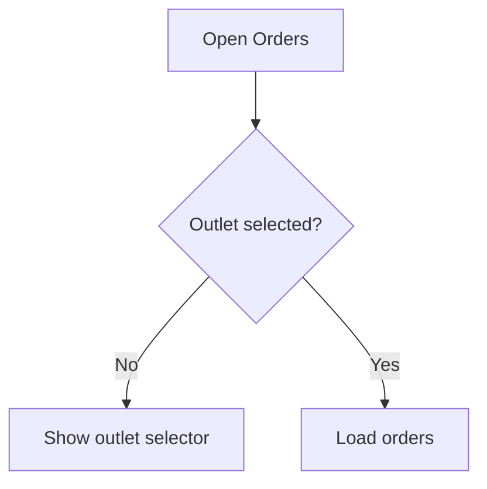

# Frontend Documentation

> Dokumentasi utama untuk seluruh pengembangan frontend **SelaluTeh Marketplace / KALIS.AI**.

Dokumentasi ini menjelaskan pengalaman pengguna, struktur halaman, sistem desain, komponen UI, arsitektur aplikasi client, integrasi data, pengujian, dan proses rilis frontend.

Dokumentasi frontend sengaja dipisahkan dari dokumentasi backend agar masing-masing bagian sistem dapat dipahami, dikembangkan, dan dipelihara secara independen.

---

## Documentation Metadata

| Field                  | Value                                    |
| ---------------------- | ---------------------------------------- |
| Documentation Type     | Frontend                                 |
| Project                | SelaluTeh Marketplace / KALIS.AI         |
| Status                 | Active Development                       |
| Primary Platform       | Web Dashboard                            |
| Architecture           | Multi-workspace ready, multi-outlet      |
| Main Entry Point       | `index.md`                               |
| Reading Guide          | [`READING-ORDER.md`](./READING-ORDER.md) |
| Documentation Language | Indonesian and English technical terms   |

---

# 1. Purpose

Dokumentasi frontend ini dibuat untuk menjadi sumber utama dalam memahami dan mengembangkan aplikasi dari sisi antarmuka pengguna.

Dokumentasi ini membantu developer dan AI coding agent memahami:

* apa yang harus ditampilkan kepada pengguna;
* bagaimana pengguna berpindah antarhalaman;
* bagaimana setiap fitur bekerja dari sisi UI;
* bagaimana aplikasi menangani loading, empty, error, dan permission state;
* bagaimana komponen frontend disusun;
* bagaimana data dari API digunakan oleh UI;
* bagaimana tampilan beradaptasi pada berbagai ukuran layar;
* bagaimana konsistensi desain dan pengalaman pengguna dipertahankan.

---

# 2. Frontend Scope

Dokumentasi ini hanya membahas bagian frontend.

## In Scope

* Struktur halaman dan navigasi
* User interface requirements
* User flow
* Information architecture
* Design system
* Page specifications
* Component system
* Responsive behavior
* Accessibility
* Frontend architecture
* Routing
* Client state management
* Server state management
* Form handling
* API consumption
* Query and cache strategy
* Authentication state di sisi client
* Permission-aware UI
* Loading, empty, error, and success states
* Frontend security practices
* Frontend testing
* Build and deployment frontend
* Frontend backlog dan sprint
* Context untuk AI coding agent

## Out of Scope

Hal-hal berikut tidak dijelaskan secara mendalam di dokumentasi frontend:

* Database schema
* Database migration
* Backend service architecture
* API endpoint implementation
* Server authorization implementation
* Queue dan background worker
* Webhook processing
* Payment processing di server
* AI model orchestration di server
* Cron jobs
* Server deployment
* Backend logging dan monitoring
* Infrastructure backend

Frontend boleh mendokumentasikan data atau response yang dibutuhkan oleh UI, tetapi tidak menjelaskan bagaimana backend menghasilkan atau menyimpan data tersebut.

---

# 3. Core Frontend Principles

Seluruh implementasi frontend harus mengikuti prinsip berikut.

## 3.1 User-Centered

Setiap keputusan UI harus membantu pengguna menyelesaikan pekerjaan dengan jelas, cepat, dan nyaman.

## 3.2 Multi-Outlet by Default

Setiap fitur yang berhubungan dengan order, produk, pembayaran, pelanggan, chat, dan operasional harus mempertimbangkan konteks outlet.

Frontend tidak boleh mengasumsikan bahwa satu workspace hanya memiliki satu outlet.

## 3.3 Multi-Workspace Ready

Walaupun MVP dapat berjalan dalam satu workspace, struktur frontend tidak boleh mengunci aplikasi pada satu akun bisnis atau satu brand.

Konteks berikut harus dibedakan:

```text
User
  └── Workspace / Business
        └── Outlet
```

## 3.4 State-Aware UI

Setiap halaman wajib mempertimbangkan minimal:

* initial loading;
* background loading;
* empty state;
* no search result;
* partial data;
* request error;
* permission denied;
* offline atau connection error;
* success feedback.

## 3.5 Reusable Components

Gunakan shared component yang sudah tersedia sebelum membuat komponen baru.

Komponen yang memiliki fungsi dan tampilan serupa tidak boleh dibuat berulang pada setiap feature.

## 3.6 Accessible by Default

Komponen dan halaman harus dapat digunakan dengan keyboard, screen reader, dan tidak hanya mengandalkan warna untuk menyampaikan informasi.

## 3.7 Responsive by Default

Setiap page specification harus menjelaskan perilakunya pada:

* desktop;
* laptop;
* tablet;
* mobile, apabila fitur tersebut mendukung mobile.

## 3.8 Clear Separation of Concerns

Frontend bertanggung jawab terhadap presentasi dan interaksi pengguna.

Backend tetap menjadi sumber kebenaran untuk:

* authorization;
* validation bisnis;
* data persistence;
* business rules;
* transaction processing.

Menyembunyikan tombol di frontend bukan pengganti authorization backend.

---

# 4. Documentation Structure

```text
frontend/
├── index.md
├── READING-ORDER.md
├── manifest.json
│
├── 00-overview/
├── 01-product-ui/
├── 02-information-architecture/
├── 03-user-flows/
├── 04-design-system/
├── 05-page-specs/
├── 06-component-system/
├── 07-frontend-architecture/
├── 08-data-integration/
├── 09-quality/
├── 10-security/
├── 11-build-release/
├── 12-roadmap/
├── 13-ai-context/
├── 90-decisions/
└── 99-archive/
```

---

# 5. Documentation Areas

## 5.1 Overview

📁 [`00-overview`](./00-overview/)

Berisi gambaran umum, tujuan, scope, prinsip, dan istilah utama frontend.

Dokumen utama:

* [`frontend-overview.md`](./00-overview/frontend-overview.md)
* [`frontend-scope.md`](./00-overview/frontend-scope.md)
* [`frontend-goals.md`](./00-overview/frontend-goals.md)
* [`frontend-principles.md`](./00-overview/frontend-principles.md)
* [`glossary.md`](./00-overview/glossary.md)

---

## 5.2 Product UI

📁 [`01-product-ui`](./01-product-ui/)

Menerjemahkan kebutuhan produk menjadi requirement antarmuka pengguna.

Dokumen utama:

* [`frontend-requirements.md`](./01-product-ui/frontend-requirements.md)
* [`feature-map.md`](./01-product-ui/feature-map.md)
* [`user-roles-and-ui-access.md`](./01-product-ui/user-roles-and-ui-access.md)
* [`ui-permission-matrix.md`](./01-product-ui/ui-permission-matrix.md)
* [`ui-state-matrix.md`](./01-product-ui/ui-state-matrix.md)

Bagian ini menjelaskan:

* fitur yang tersedia di UI;
* pengguna yang dapat melihat fitur;
* aksi yang dapat dilakukan;
* kondisi tombol atau menu ditampilkan;
* kondisi disabled;
* kondisi loading, empty, error, dan success.

---

## 5.3 Information Architecture

📁 [`02-information-architecture`](./02-information-architecture/)

Berisi struktur informasi, halaman, route, dan navigasi aplikasi.

Dokumen utama:

* [`sitemap.md`](./02-information-architecture/sitemap.md)
* [`route-map.md`](./02-information-architecture/route-map.md)
* [`navigation-structure.md`](./02-information-architecture/navigation-structure.md)
* [`page-inventory.md`](./02-information-architecture/page-inventory.md)
* [`breadcrumbs-and-context.md`](./02-information-architecture/breadcrumbs-and-context.md)

---

## 5.4 User Flows

📁 [`03-user-flows`](./03-user-flows/)

Menjelaskan perjalanan pengguna saat menyelesaikan tugas tertentu melalui UI.

Dokumen utama:

* [`authentication-flow.md`](./03-user-flows/authentication-flow.md)
* [`workspace-selection-flow.md`](./03-user-flows/workspace-selection-flow.md)
* [`outlet-selection-flow.md`](./03-user-flows/outlet-selection-flow.md)
* [`order-management-flow.md`](./03-user-flows/order-management-flow.md)
* [`payment-flow.md`](./03-user-flows/payment-flow.md)
* [`chatbot-flow.md`](./03-user-flows/chatbot-flow.md)
* [`error-recovery-flow.md`](./03-user-flows/error-recovery-flow.md)

Setiap user flow sebaiknya menjelaskan:

1. titik awal pengguna;
2. aksi pengguna;
3. respons antarmuka;
4. loading state;
5. success state;
6. error state;
7. recovery action;
8. hasil akhir flow.

---

## 5.5 Design System

📁 [`04-design-system`](./04-design-system/)

Berisi bahasa visual dan aturan desain aplikasi.

Dokumen utama:

* [`design-principles.md`](./04-design-system/design-principles.md)
* [`color-tokens.md`](./04-design-system/color-tokens.md)
* [`typography.md`](./04-design-system/typography.md)
* [`spacing-and-grid.md`](./04-design-system/spacing-and-grid.md)
* [`icons-and-illustrations.md`](./04-design-system/icons-and-illustrations.md)
* [`shadows-and-radius.md`](./04-design-system/shadows-and-radius.md)
* [`motion-guidelines.md`](./04-design-system/motion-guidelines.md)
* [`responsive-guidelines.md`](./04-design-system/responsive-guidelines.md)
* [`accessibility-guidelines.md`](./04-design-system/accessibility-guidelines.md)
* [`semantic-status-colors.md`](./04-design-system/semantic-status-colors.md)

Sistem warna harus membedakan:

* brand colors;
* AI interaction colors;
* semantic status colors;
* neutral interface colors.

---

## 5.6 Page Specifications

📁 [`05-page-specs`](./05-page-specs/)

Berisi spesifikasi implementasi untuk setiap halaman.

Area halaman utama:

* [`dashboard`](./05-page-specs/dashboard/)
* [`chats`](./05-page-specs/chats/)
* [`orders`](./05-page-specs/orders/)
* [`products`](./05-page-specs/products/)
* [`payments`](./05-page-specs/payments/)
* [`customers`](./05-page-specs/customers/)
* [`outlets`](./05-page-specs/outlets/)
* [`ai-agents`](./05-page-specs/ai-agents/)
* [`settings`](./05-page-specs/settings/)

Setiap page specification minimal harus memiliki:

* purpose;
* route;
* target users;
* layout;
* sections;
* main components;
* user actions;
* data requirements;
* loading state;
* empty state;
* error state;
* permission state;
* responsive behavior;
* accessibility requirements;
* acceptance criteria.

---

## 5.7 Component System

📁 [`06-component-system`](./06-component-system/)

Berisi standar dan daftar komponen yang digunakan di seluruh aplikasi.

Dokumen utama:

* [`component-principles.md`](./06-component-system/component-principles.md)
* [`component-inventory.md`](./06-component-system/component-inventory.md)
* [`component-hierarchy.md`](./06-component-system/component-hierarchy.md)
* [`shared-components.md`](./06-component-system/shared-components.md)
* [`form-components.md`](./06-component-system/form-components.md)
* [`table-patterns.md`](./06-component-system/table-patterns.md)
* [`modal-and-drawer-patterns.md`](./06-component-system/modal-and-drawer-patterns.md)
* [`feedback-components.md`](./06-component-system/feedback-components.md)
* [`component-api-guidelines.md`](./06-component-system/component-api-guidelines.md)

---

## 5.8 Frontend Architecture

📁 [`07-frontend-architecture`](./07-frontend-architecture/)

Menjelaskan bagaimana source code frontend disusun dan dikembangkan.

Dokumen utama:

* [`architecture-overview.md`](./07-frontend-architecture/architecture-overview.md)
* [`tech-stack.md`](./07-frontend-architecture/tech-stack.md)
* [`project-folder-structure.md`](./07-frontend-architecture/project-folder-structure.md)
* [`routing-strategy.md`](./07-frontend-architecture/routing-strategy.md)
* [`rendering-strategy.md`](./07-frontend-architecture/rendering-strategy.md)
* [`state-management.md`](./07-frontend-architecture/state-management.md)
* [`server-state-management.md`](./07-frontend-architecture/server-state-management.md)
* [`form-management.md`](./07-frontend-architecture/form-management.md)
* [`error-handling.md`](./07-frontend-architecture/error-handling.md)
* [`permission-handling.md`](./07-frontend-architecture/permission-handling.md)
* [`frontend-coding-rules.md`](./07-frontend-architecture/frontend-coding-rules.md)

---

## 5.9 Data Integration

📁 [`08-data-integration`](./08-data-integration/)

Menjelaskan bagaimana frontend meminta, menerima, mengubah, menyimpan sementara, dan menampilkan data.

Dokumen utama:

* [`data-requirements.md`](./08-data-integration/data-requirements.md)
* [`frontend-data-models.md`](./08-data-integration/frontend-data-models.md)
* [`api-consumption-rules.md`](./08-data-integration/api-consumption-rules.md)
* [`query-and-cache-strategy.md`](./08-data-integration/query-and-cache-strategy.md)
* [`mutation-strategy.md`](./08-data-integration/mutation-strategy.md)
* [`real-time-ui.md`](./08-data-integration/real-time-ui.md)
* [`mock-data-strategy.md`](./08-data-integration/mock-data-strategy.md)
* [`loading-empty-error-states.md`](./08-data-integration/loading-empty-error-states.md)

Bagian ini tidak mendokumentasikan implementasi internal API atau database.

---

## 5.10 Quality Assurance

📁 [`09-quality`](./09-quality/)

Berisi standar pengujian dan kualitas frontend.

Dokumen utama:

* [`testing-strategy.md`](./09-quality/testing-strategy.md)
* [`unit-testing.md`](./09-quality/unit-testing.md)
* [`component-testing.md`](./09-quality/component-testing.md)
* [`integration-testing.md`](./09-quality/integration-testing.md)
* [`end-to-end-testing.md`](./09-quality/end-to-end-testing.md)
* [`visual-regression-testing.md`](./09-quality/visual-regression-testing.md)
* [`accessibility-testing.md`](./09-quality/accessibility-testing.md)
* [`performance-budget.md`](./09-quality/performance-budget.md)
* [`browser-support.md`](./09-quality/browser-support.md)

---

## 5.11 Frontend Security

📁 [`10-security`](./10-security/)

Berisi aturan keamanan pada aplikasi client.

Dokumen utama:

* [`frontend-security-overview.md`](./10-security/frontend-security-overview.md)
* [`session-handling.md`](./10-security/session-handling.md)
* [`protected-routes.md`](./10-security/protected-routes.md)
* [`client-permission-handling.md`](./10-security/client-permission-handling.md)
* [`input-and-output-safety.md`](./10-security/input-and-output-safety.md)
* [`sensitive-data-display.md`](./10-security/sensitive-data-display.md)
* [`dependency-security.md`](./10-security/dependency-security.md)

Frontend tidak boleh dianggap sebagai lapisan keamanan utama. Semua keputusan authorization tetap harus diverifikasi oleh backend.

---

## 5.12 Build and Release

📁 [`11-build-release`](./11-build-release/)

Menjelaskan proses menjalankan, memeriksa, membangun, dan merilis frontend.

Dokumen utama:

* [`local-development.md`](./11-build-release/local-development.md)
* [`environment-variables.md`](./11-build-release/environment-variables.md)
* [`development-scripts.md`](./11-build-release/development-scripts.md)
* [`build-process.md`](./11-build-release/build-process.md)
* [`ci-cd.md`](./11-build-release/ci-cd.md)
* [`preview-environment.md`](./11-build-release/preview-environment.md)
* [`frontend-deployment.md`](./11-build-release/frontend-deployment.md)
* [`monitoring-and-logging.md`](./11-build-release/monitoring-and-logging.md)
* [`release-checklist.md`](./11-build-release/release-checklist.md)

---

## 5.13 Roadmap and Sprint

📁 [`12-roadmap`](./12-roadmap/)

Berisi prioritas, backlog, pekerjaan aktif, dan pekerjaan yang telah selesai.

Struktur yang direkomendasikan:

```text
12-roadmap/
├── mvp-priority.md
├── mvp-checklist.md
├── backlog/
├── active/
└── completed/
```

Dokumen utama:

* [`mvp-priority.md`](./12-roadmap/mvp-priority.md)
* [`mvp-checklist.md`](./12-roadmap/mvp-checklist.md)
* [`frontend-backlog.md`](./12-roadmap/frontend-backlog.md)

---

## 5.14 AI Context

📁 [`13-ai-context`](./13-ai-context/)

Berisi konteks ringkas dan aturan untuk AI coding agent.

Dokumen utama:

* [`frontend-context.md`](./13-ai-context/frontend-context.md)
* [`frontend-agent-rules.md`](./13-ai-context/frontend-agent-rules.md)
* [`design-rules.md`](./13-ai-context/design-rules.md)
* [`coding-preferences.md`](./13-ai-context/coding-preferences.md)
* [`forbidden-patterns.md`](./13-ai-context/forbidden-patterns.md)
* [`task-context-template.md`](./13-ai-context/task-context-template.md)

AI coding agent wajib membaca dokumen berikut sebelum mengubah frontend:

1. `frontend-context.md`
2. `frontend-agent-rules.md`
3. `design-rules.md`
4. page specification yang sedang dikerjakan
5. frontend architecture yang berhubungan dengan task
6. task atau spec aktif

---

## 5.15 Architecture Decisions

📁 [`90-decisions`](./90-decisions/)

Berisi Architecture Decision Record atau ADR untuk mencatat keputusan penting frontend.

Contoh:

* pemilihan framework;
* state management;
* server state library;
* component library;
* rendering strategy;
* folder architecture;
* testing framework.

Setiap ADR minimal berisi:

* status;
* context;
* decision;
* alternatives;
* consequences.

---

## 5.16 Archive

📁 [`99-archive`](./99-archive/)

Digunakan untuk menyimpan:

* dokumentasi yang sudah tidak aktif;
* page specification versi lama;
* desain yang telah digantikan;
* keputusan yang dibatalkan;
* sprint atau rencana lama yang masih perlu disimpan sebagai riwayat.

Dokumen yang dipindahkan ke archive harus diberi penjelasan mengenai dokumen penggantinya apabila tersedia.

---

# 6. Recommended Reading Order

Untuk memahami frontend dari awal, gunakan urutan berikut:

1. [`Frontend Overview`](./00-overview/frontend-overview.md)
2. [`Frontend Scope`](./00-overview/frontend-scope.md)
3. [`Frontend Requirements`](./01-product-ui/frontend-requirements.md)
4. [`User Roles and UI Access`](./01-product-ui/user-roles-and-ui-access.md)
5. [`UI State Matrix`](./01-product-ui/ui-state-matrix.md)
6. [`Sitemap`](./02-information-architecture/sitemap.md)
7. [`Route Map`](./02-information-architecture/route-map.md)
8. [`Core User Flows`](./03-user-flows/)
9. [`Design Principles`](./04-design-system/design-principles.md)
10. [`Page Specifications`](./05-page-specs/)
11. [`Component System`](./06-component-system/)
12. [`Frontend Architecture`](./07-frontend-architecture/architecture-overview.md)
13. [`Data Integration`](./08-data-integration/)
14. [`Testing Strategy`](./09-quality/testing-strategy.md)
15. [`Frontend Security`](./10-security/frontend-security-overview.md)
16. [`Current Roadmap`](./12-roadmap/)
17. [`AI Context`](./13-ai-context/frontend-context.md)

Lihat [`READING-ORDER.md`](./READING-ORDER.md) untuk panduan yang lebih lengkap berdasarkan kebutuhan pembaca.

---

# 7. Quick Navigation by Task

## Saya ingin memahami produk

Baca:

1. [`frontend-overview.md`](./00-overview/frontend-overview.md)
2. [`frontend-requirements.md`](./01-product-ui/frontend-requirements.md)
3. [`feature-map.md`](./01-product-ui/feature-map.md)
4. [`sitemap.md`](./02-information-architecture/sitemap.md)

## Saya ingin membuat halaman baru

Baca:

1. page specification terkait;
2. [`design-principles.md`](./04-design-system/design-principles.md);
3. [`component-inventory.md`](./06-component-system/component-inventory.md);
4. [`project-folder-structure.md`](./07-frontend-architecture/project-folder-structure.md);
5. [`frontend-coding-rules.md`](./07-frontend-architecture/frontend-coding-rules.md).

## Saya ingin membuat komponen baru

Baca:

1. [`component-principles.md`](./06-component-system/component-principles.md);
2. [`component-inventory.md`](./06-component-system/component-inventory.md);
3. [`component-api-guidelines.md`](./06-component-system/component-api-guidelines.md);
4. design token yang terkait.

## Saya ingin menghubungkan UI dengan API

Baca:

1. [`data-requirements.md`](./08-data-integration/data-requirements.md);
2. [`frontend-data-models.md`](./08-data-integration/frontend-data-models.md);
3. [`api-consumption-rules.md`](./08-data-integration/api-consumption-rules.md);
4. [`query-and-cache-strategy.md`](./08-data-integration/query-and-cache-strategy.md);
5. [`mutation-strategy.md`](./08-data-integration/mutation-strategy.md).

## Saya ingin mengerjakan testing

Baca:

1. [`testing-strategy.md`](./09-quality/testing-strategy.md);
2. jenis testing yang berhubungan dengan perubahan;
3. acceptance criteria pada page specification;
4. current release checklist.

## Saya menggunakan AI coding agent

Baca atau berikan kepada AI:

1. [`frontend-context.md`](./13-ai-context/frontend-context.md);
2. [`frontend-agent-rules.md`](./13-ai-context/frontend-agent-rules.md);
3. [`design-rules.md`](./13-ai-context/design-rules.md);
4. [`forbidden-patterns.md`](./13-ai-context/forbidden-patterns.md);
5. page specification terkait;
6. task aktif.

---

# 8. Main Application Areas

Frontend saat ini dirancang untuk mencakup area berikut:

| Area      | Purpose                                    | Documentation              |
| --------- | ------------------------------------------ | -------------------------- |
| Dashboard | Ringkasan aktivitas bisnis dan outlet      | `05-page-specs/dashboard/` |
| Chats     | Mengelola percakapan pelanggan             | `05-page-specs/chats/`     |
| Orders    | Mengelola order dari berbagai outlet       | `05-page-specs/orders/`    |
| Products  | Mengelola produk, menu, dan ketersediaan   | `05-page-specs/products/`  |
| Payments  | Melihat dan memantau transaksi pembayaran  | `05-page-specs/payments/`  |
| Customers | Melihat informasi dan histori pelanggan    | `05-page-specs/customers/` |
| Outlets   | Mengelola cabang dan konteks outlet        | `05-page-specs/outlets/`   |
| AI Agents | Mengatur perilaku dan konfigurasi AI Agent | `05-page-specs/ai-agents/` |
| Settings  | Mengelola workspace, akun, dan preferensi  | `05-page-specs/settings/`  |

---

# 9. Frontend Context Hierarchy

Frontend harus memahami konteks pengguna dengan urutan berikut:

```text
Authenticated User
        ↓
Active Workspace
        ↓
Active Outlet or All-Outlets View
        ↓
Current Feature
        ↓
Current Page State
```

Setiap fitur harus menentukan apakah fitur tersebut:

* berada pada level user;
* berada pada level workspace;
* berada pada level outlet;
* dapat menampilkan semua outlet;
* membutuhkan outlet aktif;
* tidak berhubungan dengan outlet.

---

# 10. UI State Requirements

Semua halaman harus menentukan dukungan terhadap state berikut:

| State              | Required                |
| ------------------ | ----------------------- |
| Initial loading    | Yes                     |
| Background refresh | When applicable         |
| Empty data         | Yes                     |
| No search result   | When search exists      |
| Request error      | Yes                     |
| Retry action       | Yes                     |
| Permission denied  | When protected          |
| Success feedback   | For mutations           |
| Confirmation       | For destructive actions |
| Offline state      | When relevant           |
| Partial data       | When relevant           |
| Disabled state     | For unavailable actions |

Happy path saja tidak cukup untuk dianggap sebagai page specification yang selesai.

---

# 11. Documentation Status

Gunakan status berikut pada setiap dokumen:

| Status       | Meaning                                |
| ------------ | -------------------------------------- |
| `Draft`      | Masih dalam penyusunan                 |
| `Review`     | Menunggu pemeriksaan                   |
| `Approved`   | Telah disetujui sebagai acuan          |
| `Active`     | Sedang digunakan                       |
| `Deprecated` | Masih tersedia tetapi tidak dianjurkan |
| `Archived`   | Tidak lagi digunakan                   |

Contoh metadata dokumen:

```yaml
---
title: Orders Page Specification
status: Draft
owner: Frontend
version: 0.1.0
last_updated: YYYY-MM-DD
related_pages:
  - /orders
related_features:
  - orders
  - outlets
---
```

---

# 12. Definition of Ready

Sebuah frontend task siap dikerjakan apabila:

* requirement sudah jelas;
* target user sudah diketahui;
* route atau lokasi fitur sudah ditentukan;
* user flow tersedia;
* page specification tersedia;
* data yang dibutuhkan sudah diketahui;
* loading, empty, error, dan permission state sudah ditentukan;
* responsive behavior sudah dijelaskan;
* acceptance criteria tersedia;
* dependency terhadap task lain sudah diketahui.

---

# 13. Definition of Done

Sebuah frontend task dianggap selesai apabila:

* implementasi sesuai page specification;
* menggunakan design token;
* menggunakan shared component yang tersedia;
* TypeScript tidak menghasilkan error;
* linting berhasil;
* testing yang dibutuhkan berhasil;
* loading state tersedia;
* empty state tersedia;
* error state tersedia;
* permission state ditangani;
* responsive behavior telah diperiksa;
* keyboard navigation telah diperiksa;
* tidak ada hardcoded secret;
* tidak ada perubahan backend yang tidak direncanakan;
* dokumentasi diperbarui;
* acceptance criteria terpenuhi.

---

# 14. Documentation Rules

## File Naming

Gunakan format:

```text
lowercase-kebab-case.md
```

Contoh:

```text
order-management-flow.md
frontend-coding-rules.md
query-and-cache-strategy.md
```

## Heading

Setiap file hanya memiliki satu heading level satu:

```md
# Document Title
```

Bagian selanjutnya dimulai dengan heading level dua:

```md
## Section
```

## Links

Gunakan relative link untuk menghubungkan dokumen:

```md
[Frontend Scope](./00-overview/frontend-scope.md)
```

## Diagrams

Gunakan Mermaid apabila diagram dapat direpresentasikan dalam bentuk teks.



## Source of Truth

Apabila terdapat konflik antardokumen, gunakan prioritas berikut:

1. Approved architecture decision
2. Active product requirement
3. Active page specification
4. Design system
5. Current sprint task
6. Older documentation

Konflik harus diselesaikan dengan memperbarui dokumen yang sudah tidak sesuai.

---

# 15. Change Management

Setiap perubahan besar frontend harus memperbarui dokumentasi terkait.

| Change                        | Documentation to Update            |
| ----------------------------- | ---------------------------------- |
| Menambahkan halaman           | Sitemap, route map, page specs     |
| Mengubah navigasi             | Navigation structure, sitemap      |
| Menambahkan role              | UI access, permission matrix       |
| Mengubah komponen             | Component inventory, component API |
| Mengubah warna                | Design tokens, semantic colors     |
| Mengubah state management     | Architecture dan ADR               |
| Mengubah data requirement     | Data models dan page specs         |
| Mengubah user flow            | User flow terkait                  |
| Menambah environment variable | Environment variables              |
| Menambah test requirement     | Testing strategy                   |
| Mengubah prioritas MVP        | Roadmap dan checklist              |

---

# 16. Current Priorities

Prioritas frontend MVP dikelola melalui:

* [`mvp-priority.md`](./12-roadmap/mvp-priority.md)
* [`mvp-checklist.md`](./12-roadmap/mvp-checklist.md)
* [`frontend-backlog.md`](./12-roadmap/frontend-backlog.md)
* [`active/`](./12-roadmap/active/)
* [`completed/`](./12-roadmap/completed/)

Jangan menjadikan `index.md` sebagai tempat menyimpan detail task harian. Gunakan folder roadmap dan sprint untuk pekerjaan yang terus berubah.

---

# 17. Important Notes for AI Coding Agents

Sebelum menghasilkan atau mengubah kode frontend:

1. Identifikasi feature dan page yang sedang dikerjakan.
2. Baca page specification terkait.
3. Periksa component inventory.
4. Periksa design system.
5. Periksa frontend architecture.
6. Periksa data integration rules.
7. Periksa active task.
8. Jangan membuat backend implementation.
9. Jangan mengubah API contract tanpa instruksi.
10. Jangan mengubah design system secara sepihak.
11. Jangan mengasumsikan aplikasi hanya memiliki satu outlet.
12. Jangan mengasumsikan aplikasi selamanya hanya memiliki satu workspace.
13. Tangani seluruh UI state yang diwajibkan.
14. Perbarui dokumentasi apabila implementasi mengubah keputusan yang sudah tercatat.

---

# 18. Start Here

Untuk mulai memahami project frontend:

1. Baca [`READING-ORDER.md`](./READING-ORDER.md).
2. Baca [`frontend-overview.md`](./00-overview/frontend-overview.md).
3. Baca [`frontend-scope.md`](./00-overview/frontend-scope.md).
4. Pelajari [`sitemap.md`](./02-information-architecture/sitemap.md).
5. Pelajari [`design-principles.md`](./04-design-system/design-principles.md).
6. Buka page specification dari fitur yang akan dikerjakan.
7. Baca frontend architecture sebelum mulai coding.

---

## Document Ownership

Dokumentasi ini dimiliki dan dipelihara sebagai bagian dari pengembangan frontend SelaluTeh Marketplace / KALIS.AI.

Perubahan terhadap struktur, aturan, atau keputusan utama frontend harus dicatat melalui dokumentasi yang sesuai dan, apabila diperlukan, melalui Architecture Decision Record.
