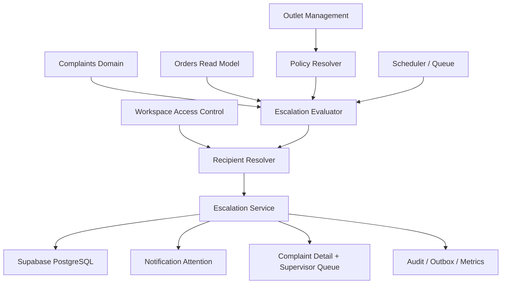
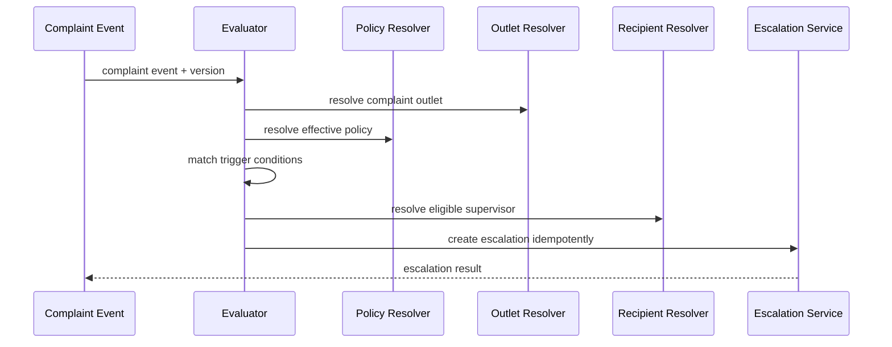
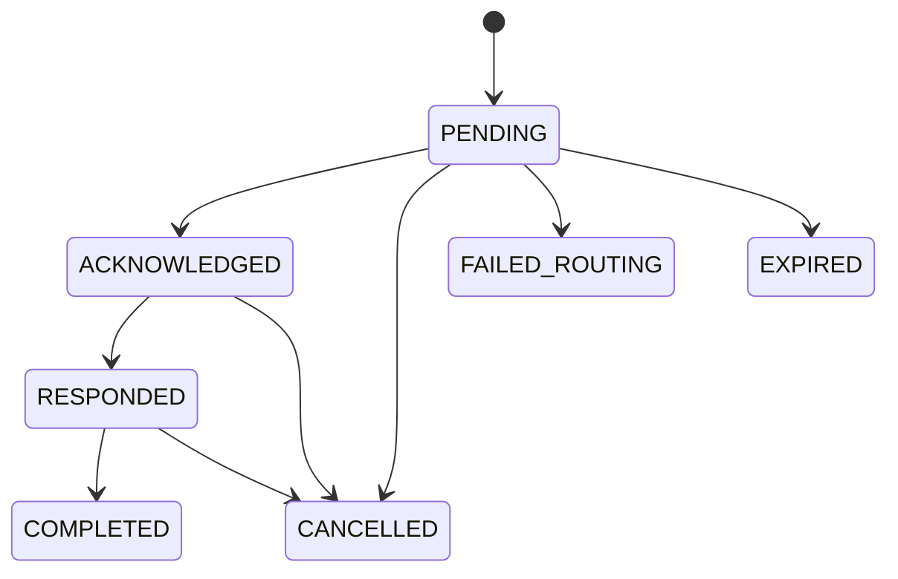

# Design Document: SelaluTeh Auto Escalate Complaints

## 1. Overview

```text
Complaint Event
→ AutoEscalationEvaluator
→ ComplaintOutletResolver
→ EffectivePolicyResolver
→ TriggerMatcher
→ SupervisorResolver
→ EscalationService
→ Notification + Attention
→ Supervisor Queue
→ Acknowledge / Respond / Complete
```

The complaint remains canonical. Escalation is a related operational workflow.

## 2. Core Decisions

```text
Complaint = canonical customer case
Escalation = internal outlet collaboration workflow

Workspace default policy
+ optional outlet override

Preferred outlet source:
related order outlet

Preferred recipient:
primary active outlet supervisor

MVP:
CS remains primary complaint handler
Supervisor is collaborator
Supervisor response is internal
No automatic customer message
```

## 3. Non-Goals

```text
duplicate ticket creation
payment refund execution
inventory mutation
order mutation
automatic customer resolution
hard-coded outlet-to-supervisor mapping
cross-workspace escalation
supervisor WhatsApp bot as primary MVP channel
```

## 4. Architecture



## 5. Domain Models

### Escalation Policy

```ts
type ComplaintEscalationPolicy = {
  id: string;
  workspaceId: string;
  enabled: boolean;

  matchMode: "ANY" | "ALL";
  immediatePriorities: string[];
  categoryIds: string[];
  unassignedAfterMinutes?: number;
  slaRemainingMinutes?: number;
  repeatedCustomerMessages?: {
    count: number;
    withinMinutes: number;
  };

  recipientStrategy:
    | "PRIMARY_ONLY"
    | "FIRST_AVAILABLE"
    | "ROUND_ROBIN"
    | "SUPERVISOR_QUEUE"
    | "ALL_SUPERVISORS";

  fallbackSteps: Array<
    | "OTHER_OUTLET_SUPERVISOR"
    | "OUTLET_MANAGER"
    | "WORKSPACE_SUPPORT_MANAGER"
    | "ATTENTION_ALERT"
  >;

  includeContext: {
    complaintSummary: boolean;
    customerSafeIdentity: boolean;
    relatedOrder: boolean;
    productDetails: boolean;
    attachments: boolean;
    currentSla: boolean;
    internalNotes: boolean;
  };

  afterEscalation: {
    complaintStatusMode: "KEEP" | "SET_IN_PROGRESS";
    primaryHandlerMode: "KEEP_CS" | "SUPERVISOR_PRIMARY";
    customerNotificationMode: "NONE" | "INVESTIGATING_MESSAGE";
  };

  supervisorSla: {
    acknowledgementMinutes: number;
    firstResponseMinutes: number;
    resolutionProposalMinutes?: number;
  };

  schedule: {
    mode: "ANY_TIME" | "OUTLET_HOURS" | "SUPERVISOR_SCHEDULE";
    outsideHoursPolicy:
      | "ESCALATE_IMMEDIATELY"
      | "QUEUE_UNTIL_OPEN"
      | "ESCALATE_TO_WORKSPACE_SUPPORT"
      | "CREATE_ATTENTION_ALERT";
  };

  version: number;
};
```

### Escalation

```ts
type ComplaintEscalation = {
  id: string;
  workspaceId: string;
  complaintId: string;
  outletId: string;

  triggerType:
    | "AUTO_PRIORITY"
    | "AUTO_CATEGORY"
    | "AUTO_UNASSIGNED"
    | "AUTO_SLA"
    | "AUTO_REPEATED_MESSAGE"
    | "MANUAL"
    | "RE_ESCALATION";

  status:
    | "PENDING"
    | "ACKNOWLEDGED"
    | "RESPONDED"
    | "COMPLETED"
    | "CANCELLED"
    | "FAILED_ROUTING"
    | "EXPIRED";

  recipientMembershipId?: string;
  escalatedByMembershipId?: string;
  policyId?: string;
  policyVersion?: number;

  complaintSnapshot: Record<string, unknown>;
  triggerSnapshot: Record<string, unknown>;
  routingSnapshot: Record<string, unknown>;

  acknowledgementDueAt?: string;
  responseDueAt?: string;
  resolutionDueAt?: string;

  acknowledgedAt?: string;
  respondedAt?: string;
  completedAt?: string;
  cancelledAt?: string;

  version: number;
};
```

## 6. Data Model

### `complaint_escalation_policies`

```text
id uuid pk
workspace_id uuid not null
enabled boolean not null
match_mode text not null
trigger_rules jsonb not null
recipient_strategy text not null
fallback_steps jsonb not null
include_context jsonb not null
after_escalation jsonb not null
supervisor_sla jsonb not null
schedule_policy jsonb not null
version integer not null
created_at
updated_at

unique(workspace_id)
```

### `outlet_complaint_escalation_overrides`

```text
id uuid pk
workspace_id uuid not null
outlet_id uuid not null
configuration_mode text not null
enabled_override boolean nullable
policy_override jsonb nullable
primary_supervisor_membership_id uuid nullable
version integer not null
created_at
updated_at

unique(workspace_id, outlet_id)
```

### `complaint_escalations`

```text
id uuid pk
workspace_id uuid not null
complaint_id uuid not null
outlet_id uuid not null
parent_escalation_id uuid nullable

trigger_type text not null
status text not null
escalation_level integer not null default 1

recipient_membership_id uuid nullable
escalated_by_membership_id uuid nullable

policy_id uuid nullable
policy_version integer nullable
idempotency_key text not null

complaint_snapshot jsonb not null
trigger_snapshot jsonb not null
routing_snapshot jsonb not null

acknowledgement_due_at timestamptz nullable
response_due_at timestamptz nullable
resolution_due_at timestamptz nullable

acknowledged_at timestamptz nullable
responded_at timestamptz nullable
completed_at timestamptz nullable
cancelled_at timestamptz nullable

version integer not null
created_at
updated_at

unique(workspace_id, idempotency_key)
```

A partial unique constraint should enforce one active escalation per complaint/outlet/level.

### `complaint_escalation_responses`

```text
id uuid pk
workspace_id uuid not null
outlet_id uuid not null
complaint_id uuid not null
escalation_id uuid not null
sender_membership_id uuid nullable
response_type text not null
message_text text nullable
structured_payload jsonb nullable
created_at
corrects_response_id uuid nullable
```

### `complaint_escalation_assignments`

```text
id uuid pk
workspace_id uuid not null
complaint_id uuid not null
escalation_id uuid not null
membership_id uuid not null
assignment_type text not null
assigned_at timestamptz not null
ended_at timestamptz nullable
```

### `complaint_escalation_scheduled_jobs`

```text
id uuid pk
workspace_id uuid not null
complaint_id uuid not null
policy_id uuid not null
policy_version integer not null
trigger_type text not null
due_at timestamptz not null
status text not null
expected_complaint_version integer nullable
idempotency_key text not null
attempt_count integer not null
last_error_code text nullable
created_at
updated_at

unique(workspace_id, idempotency_key)
```

## 7. Effective Policy Resolution

```text
Load workspace policy
→ load outlet override
→ if DISABLED: auto escalation off
→ if USE_WORKSPACE_DEFAULT: workspace policy
→ if CUSTOM: merge allowed override fields
→ validate effective policy
→ return policy + source metadata
```

Policy source metadata:

```text
WORKSPACE_DEFAULT
OUTLET_CUSTOM
OUTLET_DISABLED
INVALID_CONFIGURATION
```

## 8. Complaint Outlet Resolution

```text
1. Related order outlet
2. Explicit complaint outlet
3. Conversation selected outlet
4. Fail with OUTLET_UNRESOLVED
```

Resolution output:

```ts
type OutletResolution = {
  outletId?: string;
  source:
    | "RELATED_ORDER"
    | "COMPLAINT_FIELD"
    | "CONVERSATION_CONTEXT"
    | "UNRESOLVED";
  sourceReferenceId?: string;
};
```

## 9. Trigger Evaluation



Evaluation result:

```text
MATCHED
NOT_MATCHED
DISABLED
OUTLET_UNRESOLVED
NO_ELIGIBLE_RECIPIENT
DUPLICATE_ACTIVE_ESCALATION
STALE_EVENT
```

## 10. Supervisor Resolution

Default:

```text
Primary supervisor
→ another active supervisor
→ outlet manager
→ workspace support manager
→ attention alert
```

Eligibility:

```text
active membership
correct workspace
correct outlet access
complaints.receive_escalation
not suspended
optional schedule availability
```

## 11. Escalation Lifecycle



## 12. SLA Calculation

```text
acknowledgement_due_at
response_due_at
resolution_due_at
```

SLA uses:

```text
outlet timezone
effective business-hours policy
priority override
trigger time
```

Customer SLA remains owned by Complaints.

## 13. Scheduler Design

Scheduled triggers:

```text
UNASSIGNED_TIMEOUT
SLA_THRESHOLD
QUEUED_OUTSIDE_HOURS
SUPERVISOR_SLA_WARNING
SUPERVISOR_SLA_BREACH
```

Worker rules:

```text
load job
→ verify due
→ verify expected complaint/policy version
→ re-evaluate effective context
→ execute idempotently
→ mark completed/skipped/failed
```

## 14. Notification Design

MVP:

```text
in-app notification
dashboard attention queue
```

Safe payload:

```text
complaint ID
outlet
priority
order number
SLA remaining
short issue summary
authenticated deep link
```

Not included:

```text
raw payment payload
full phone
internal notes
unrestricted attachment URLs
```

## 15. Complaint Detail UI

Action bar:

```text
Assign
Change Status
Send Reply
Escalate to Outlet / View Escalation
Add Note
Resolve
```

Escalation banner:

```text
Escalated to Outlet Supervisor
Supervisor A
SelaluTeh Samarinda
Waiting for acknowledgement
Auto escalated · High Priority
Supervisor SLA: 12m left
```

Tabs or sections:

```text
Detail
Timeline
Attachments
Internal Notes
Escalation
```

## 16. Settings UI

Path:

```text
Settings
→ Complaints & SLA
→ Routing & Escalation
```

Sections:

```text
Enable Auto Escalation
Triggers
Recipient Strategy
Fallback
Included Context
After Escalation
Supervisor SLA
Notification Channels
Business Hours
Outlet Overrides
```

## 17. Outlet Override UI

Table:

```text
Outlet
Mode
Auto Escalate
Primary Supervisor
Trigger Summary
Configuration Health
Last Updated
```

Modes:

```text
Use Workspace Default
Custom Configuration
Disable Auto Escalation
```

## 18. Supervisor Queue UI

Columns:

```text
Complaint ID
Issue
Outlet
Priority
Trigger
Escalation Status
Supervisor SLA
Assigned Supervisor
Created
```

Quick actions:

```text
Acknowledge
Add Internal Response
Request Information
Propose Resolution
Complete
```

## 19. API Design

### Settings

```text
GET   /api/complaint-escalation/settings
PUT   /api/complaint-escalation/settings
GET   /api/complaint-escalation/outlet-overrides
PUT   /api/complaint-escalation/outlets/:outletId/override
DELETE /api/complaint-escalation/outlets/:outletId/override
POST  /api/complaint-escalation/settings/validate
```

### Escalations

```text
POST /api/complaints/:complaintId/escalations
GET  /api/complaints/:complaintId/escalations
GET  /api/escalations
GET  /api/escalations/:escalationId

POST /api/escalations/:escalationId/acknowledge
POST /api/escalations/:escalationId/responses
POST /api/escalations/:escalationId/reassign
POST /api/escalations/:escalationId/complete
POST /api/escalations/:escalationId/cancel
POST /api/escalations/:escalationId/re-escalate
```

### Diagnostics

```text
POST /api/complaints/:complaintId/escalation-evaluation/preview
GET  /api/complaints/:complaintId/escalation-evaluation/history
```

## 20. Error Model

```text
ESCALATION_POLICY_NOT_CONFIGURED
ESCALATION_POLICY_INVALID
AUTO_ESCALATION_DISABLED
COMPLAINT_OUTLET_UNRESOLVED
OUTLET_NOT_ELIGIBLE
SUPERVISOR_NOT_CONFIGURED
NO_ELIGIBLE_RECIPIENT
ESCALATION_ALREADY_ACTIVE
ESCALATION_INVALID_TRANSITION
ESCALATION_ALREADY_ACKNOWLEDGED
RECIPIENT_INELIGIBLE
OUTLET_SCOPE_DENIED
PERMISSION_DENIED
VERSION_CONFLICT
IDEMPOTENCY_CONFLICT
SCHEDULED_JOB_STALE
```

## 21. Permissions

```text
complaints.escalation.read
complaints.escalation.create
complaints.escalation.acknowledge
complaints.escalation.respond
complaints.escalation.reassign
complaints.escalation.complete
complaints.escalation.cancel
complaints.escalation.history
complaints.escalation.settings.read
complaints.escalation.settings.manage
complaints.escalation.override.manage
```

## 22. Events

```text
COMPLAINT_ESCALATION_EVALUATED
COMPLAINT_ESCALATION_MATCHED
COMPLAINT_ESCALATION_CREATED
COMPLAINT_ESCALATION_ROUTING_FAILED
COMPLAINT_ESCALATION_ACKNOWLEDGED
COMPLAINT_ESCALATION_RESPONDED
COMPLAINT_ESCALATION_REASSIGNED
COMPLAINT_ESCALATION_COMPLETED
COMPLAINT_ESCALATION_CANCELLED
COMPLAINT_ESCALATION_SLA_WARNING
COMPLAINT_ESCALATION_SLA_BREACHED
COMPLAINT_ESCALATION_POLICY_CHANGED
```

## 23. Security Threat Model

### Cross-outlet disclosure

```text
workspace/outlet-scoped repositories
RLS
recipient eligibility
safe not-found errors
```

### Supervisor spoofing

```text
server-side membership resolution
no client-selected arbitrary recipient without permission
version and permission checks
```

### Internal-note leakage

```text
off by default
policy-controlled inclusion
authorization at read time
notification minimization
```

### Duplicate escalation

```text
active escalation invariant
idempotency key
event/scheduler deduplication
transactional creation
```

## 24. Testing Strategy

### Unit

```text
effective policy merge
trigger matching
outlet resolution
recipient resolution
fallback
SLA calculation
status transitions
```

### Component

```text
PolicyService
Evaluator
OutletResolver
SupervisorResolver
EscalationService
Scheduler
NotificationComposer
```

### Integration

```text
Complaints
Orders
Outlet Management
Workspace Access Control
CRM
Notifications
Audit
Supabase RLS
```

### Property

```text
one active escalation per complaint/outlet/level
same event/idempotency key has one effect
other outlet never receives escalation
internal response never auto-sends to customer
policy history does not rewrite escalation snapshot
```

### Concurrency

```text
auto vs manual escalation
two supervisor acknowledgements
respond vs cancel
reassign vs acknowledge
policy update vs delayed job
```

### Resilience

```text
order lookup failure
outlet lookup failure
recipient lookup failure
notification failure
scheduler retry
database failure
outbox failure
```

## 25. Performance Targets

```text
immediate evaluation: < 300 ms backend typical
settings read: < 200 ms backend
supervisor queue: < 300 ms backend
acknowledge/respond: < 300 ms backend
scheduled evaluation throughput: horizontally scalable
```

Targets are measured, not guaranteed.

## 26. Rollout Strategy

### Phase 1 — Alpha

```text
workspace settings
outlet override
priority trigger
unassigned timeout
order outlet resolution
primary supervisor + fallback
in-app notification
supervisor queue
acknowledge/respond/complete
supervisor SLA
complaint detail integration
```

### Phase 2 — Operations

```text
category combinations
SLA threshold trigger
business hours
reassignment
re-escalation
email/push notification
analytics
```

### Phase 3 — Advanced

```text
round robin
multi-level escalation
operational WhatsApp notifications
AI-assisted recommendations
advanced schedule and capacity routing
```

## 27. Fastest Safe Alpha Slice

```text
policy tables and RLS
workspace default + outlet override
HIGH/CRITICAL immediate trigger
MEDIUM/LOW unassigned timeout
related-order outlet resolution
primary supervisor routing
fallback chain
one active escalation invariant
in-app notification
supervisor queue
acknowledge
internal response
complete/cancel
supervisor SLA
complaint detail banner and timeline
audit/events/metrics
security/concurrency/scheduler/E2E tests
```

## 28. Definition of Done

```text
complaint is never duplicated
correct order outlet is resolved
correct active supervisor is selected
fallback is deterministic
auto/manual race creates one escalation
CS remains primary handler by default
supervisor response remains internal
complaint and supervisor SLA stay separate
other outlets cannot access
all release-gate tests pass
implementation status reflects repository reality
specs check passes
```
