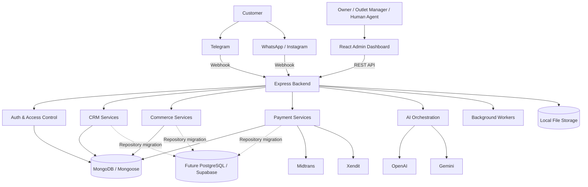
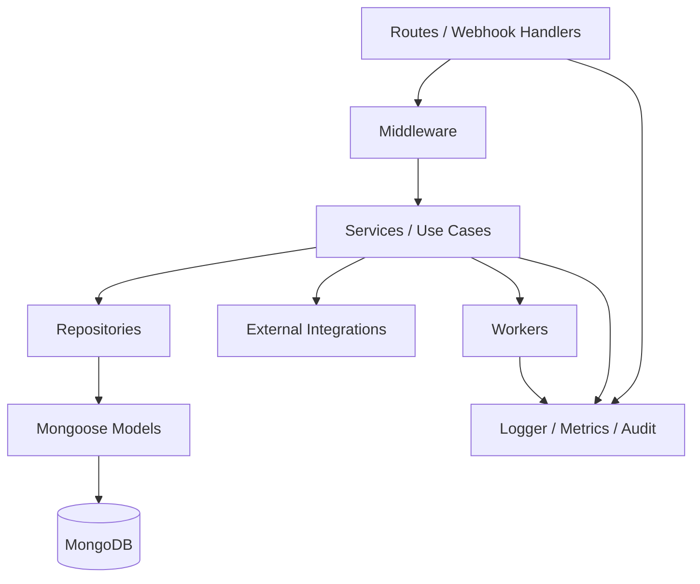
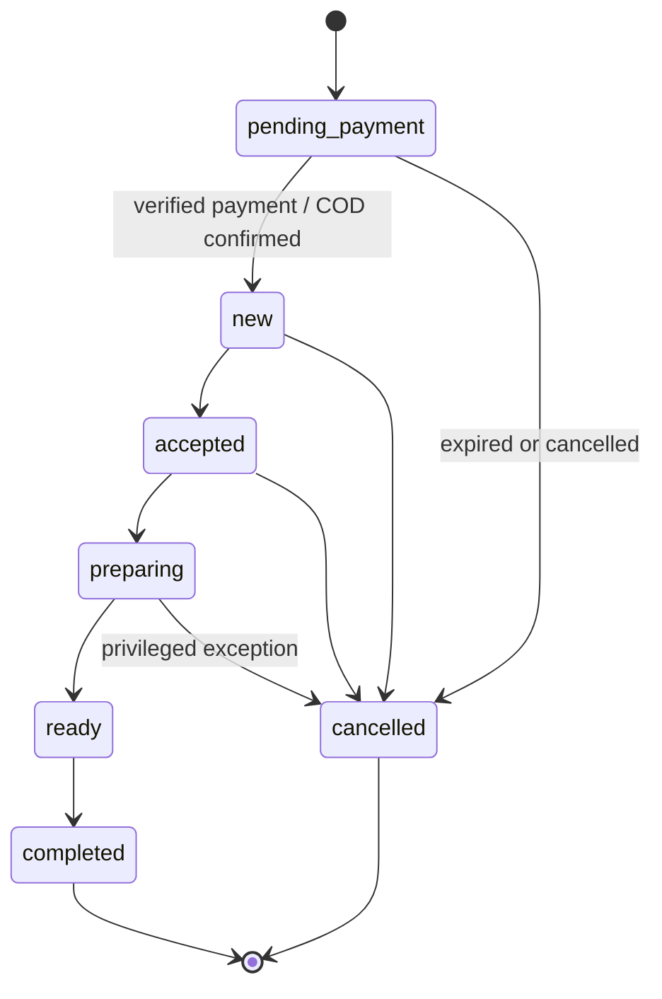
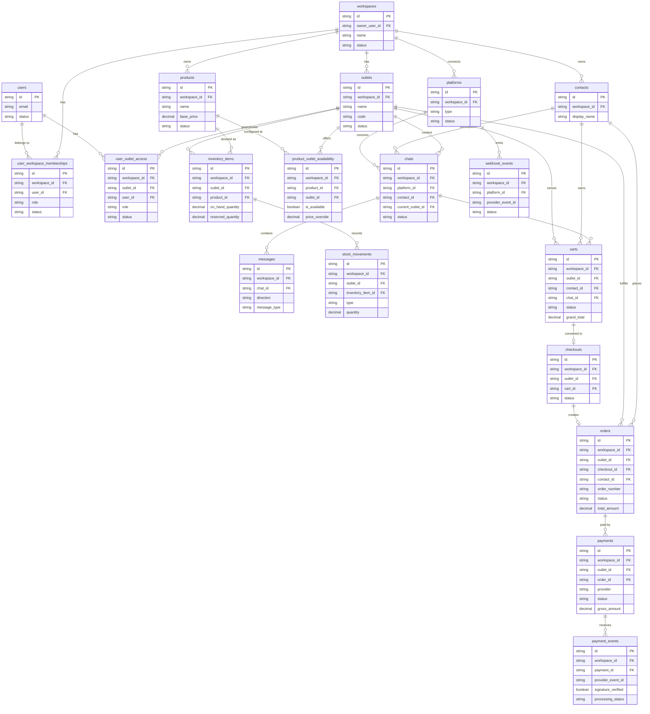
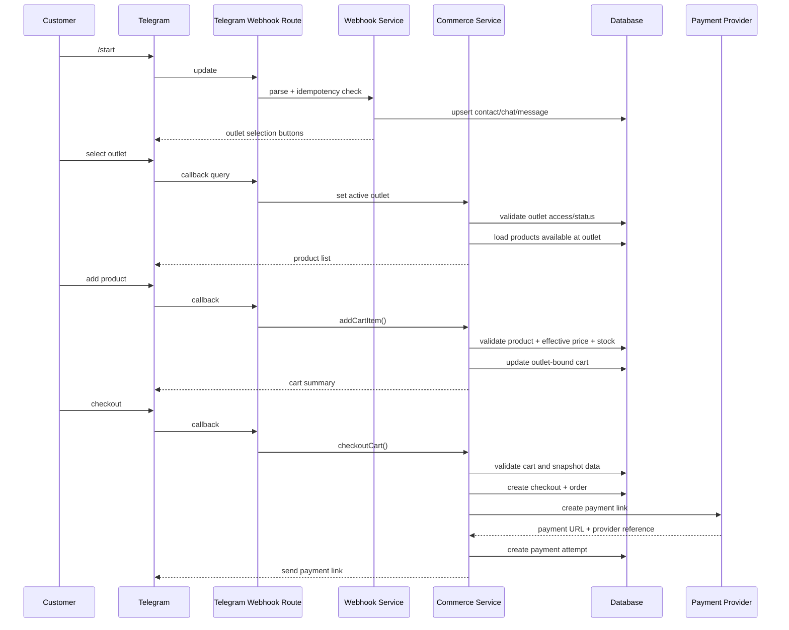
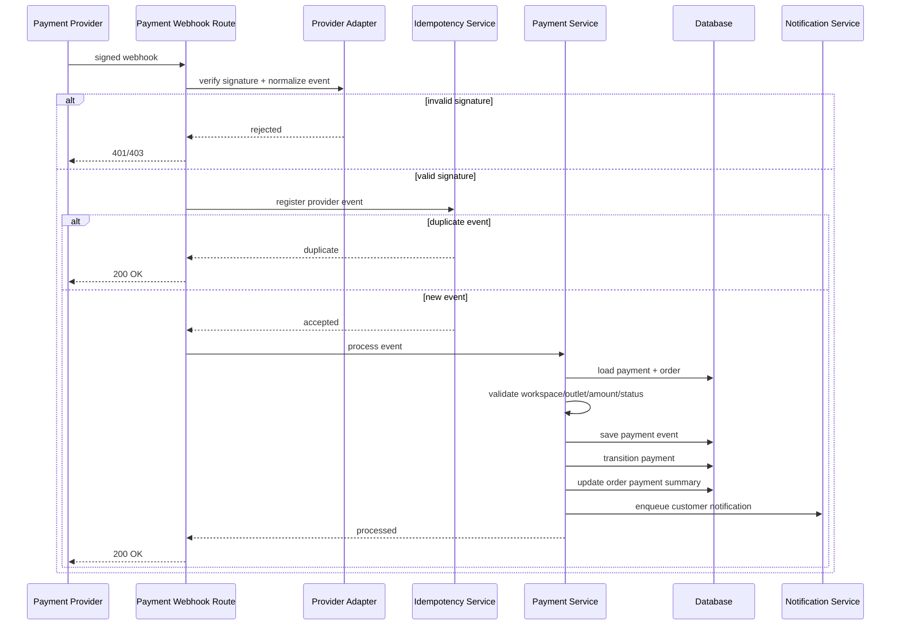
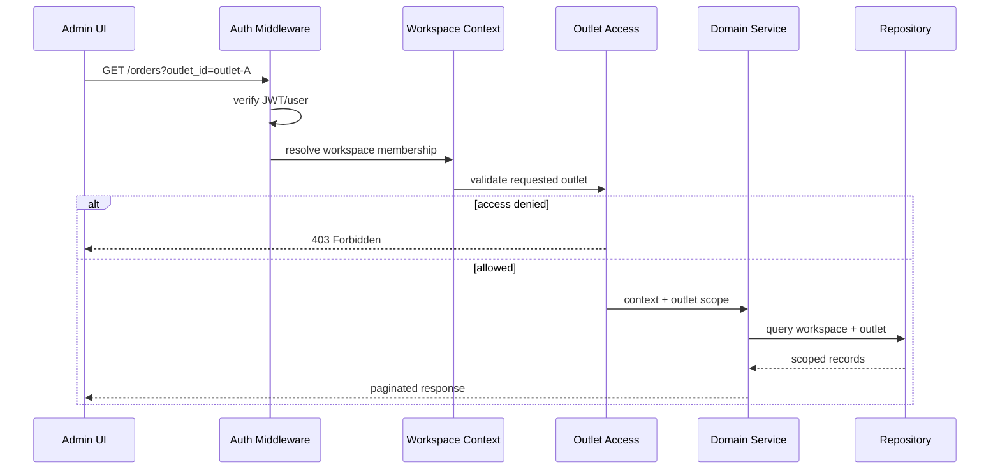
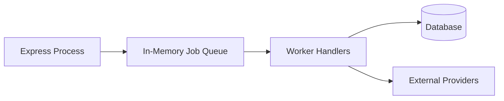
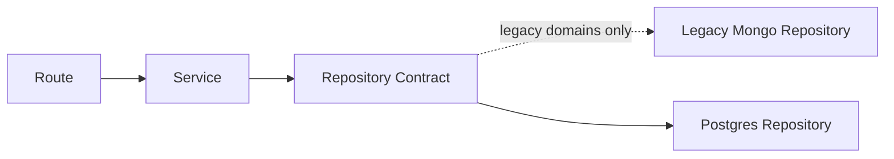

# Design Document: SelaluTeh Chatbot CRM & Telegram Marketplace Backend

## Overview

Dokumen ini mendefinisikan desain teknis backend terpadu untuk **SelaluTeh Chatbot CRM** yang sedang dikembangkan menjadi **Telegram-first Marketplace MVP** dengan dukungan **multi-outlet** dan fondasi **future multi-workspace / multi-account / franchise owner**.

Dokumen ini menjadi ringkasan teknis utama yang menyatukan keputusan dari dokumen:

- overview dan product scope;
- business rules;
- Telegram commerce flow;
- checkout dan payment flow;
- multi-outlet foundation;
- API specification;
- database dan migration design;
- security;
- AI guardrails;
- testing;
- sprint implementation plan;
- operations dan production readiness.

Dokumen ini tidak menggantikan semua dokumen spesifik, tetapi menjadi **design authority** untuk keputusan lintas domain dan titik awal sebelum implementasi backend besar.

---

## 1. Product and System Context

### 1.1 Existing System

Sistem yang sudah tersedia:

- Node.js + Express backend;
- Supabase/Postgres sebagai target runtime aktif dan final end-state;
- MongoDB + Mongoose sebagai legacy data/testing layer sampai domain runtime selesai diganti;
- React + Vite admin dashboard;
- custom JWT/OTP authentication;
- Telegram webhook;
- Meta webhook untuk WhatsApp/Instagram;
- AI agent dengan OpenAI/Gemini;
- contacts, chats, messages, human takeover;
- connected platforms;
- legacy orders dan complaints;
- local file storage;
- analytics dan admin operations.

### 1.2 Updated Product Direction

#### MVP

```txt
Platform
  └── Workspace / Business Account: SelaluTeh
        ├── Outlet Samarinda
        ├── Outlet Tenggarong
        ├── Outlet Bontang
        └── Outlet lainnya
```

MVP menggunakan:

```txt
1 workspace/account
→ many outlets
→ Telegram-first commerce
```

#### Future Production

```txt
Platform
  ├── Workspace / Account / Franchise Owner A
  │     ├── Outlet A1
  │     └── Outlet A2
  ├── Workspace / Account / Franchise Owner B
  │     ├── Outlet B1
  │     └── Outlet B2
  └── Workspace / Account / Franchise Owner C
        └── Outlet C1
```

Future production menggunakan:

```txt
many workspaces/accounts/franchise owners
→ each workspace has many outlets
```

### 1.3 Canonical Terminology

| Term | Meaning |
|---|---|
| Platform | Keseluruhan aplikasi/SaaS SelaluTeh |
| Workspace | Akun bisnis, merchant account, atau franchise owner |
| Outlet | Cabang fisik di bawah workspace |
| Workspace Membership | Keanggotaan dan role user dalam workspace |
| Outlet Access | Hak user untuk mengoperasikan outlet tertentu |
| Platform Connection | Integrasi Telegram, WhatsApp, Instagram, atau channel lain |
| Product | Produk katalog milik workspace |
| Product Outlet Availability | Ketersediaan, harga override, dan status produk per outlet |
| Inventory Item | Posisi stok produk/variant per outlet |
| Cart | Keranjang pelanggan yang terikat ke satu outlet |
| Checkout | Snapshot validasi dari cart sebelum order dibuat |
| Order | Transaksi pelanggan yang terikat ke satu workspace dan outlet |
| Payment | Percobaan/transaksi pembayaran untuk order |
| Payment Event | Event provider/webhook yang membentuk riwayat pembayaran |
| Chat | Percakapan customer melalui channel |
| Contact | Identitas customer lintas channel |
| Human Takeover | Pengambilalihan chat dari AI ke human agent |

---

## 2. Architecture Decisions

| Decision | Choice | Reason |
|---|---|---|
| Backend runtime | Node.js + Express | Mempertahankan existing system dan meminimalkan rewrite |
| Current database | Supabase/Postgres | Supabase project dan schema sudah dibuat; runtime code harus dipindahkan dari legacy Mongo |
| Legacy database | MongoDB + Mongoose | Dipertahankan sementara hanya untuk regression tests pada domain legacy sampai repository diganti |
| Target database direction | Supabase/Postgres-backed repository abstraction | Mendukung relational commerce, RLS, dan migration bertahap |
| Backend structure | `server/src` layer-based architecture | Umum, jelas, minim refactor, cocok untuk Express |
| Tenant boundary | `workspace_id` | Workspace adalah akun bisnis/franchise owner |
| Operational branch boundary | `outlet_id` | Outlet adalah cabang yang memproses operasi |
| Commerce channel MVP | Telegram | Flow deterministik, cepat diuji, backend dapat digunakan ulang |
| WhatsApp commerce | Follow-up phase | Menggunakan commerce services yang sama, bukan logic terpisah |
| Source of truth | Backend services/database | AI dan channel provider bukan sumber kebenaran |
| Payment authority | Verified gateway webhook | Mencegah spoofing status pembayaran |
| Provider abstraction | Adapter/client pada `integrations/` | Provider dapat diganti tanpa rewrite domain logic |
| File storage | Local filesystem + metadata DB | Sesuai existing system dan biaya MVP |
| Large binary in DB | Tidak diperbolehkan | Database menyimpan metadata/path saja |
| API style | REST + webhooks | Sesuai existing frontend dan provider integrations |
| Auth context | JWT → workspace membership → outlet access | Isolasi tenant dan outlet harus server-side |
| Background jobs MVP | In-process worker dengan boundary yang jelas | Cepat untuk MVP, tetapi tidak diklaim durable |
| Future queue | Redis/BullMQ atau queue equivalent | Untuk retry, notification, reconciliation, dan scale |
| Migration strategy | Full Supabase end-state, staged domain-by-domain cutover, fresh Supabase data | Tidak ada Mongo backfill, dual-write, atau legacy reconciliation |
| IDs | Supabase UUID contracts; legacy Mongo ObjectId must not leak into new runtime contracts | API tidak bergantung pada tipe ID legacy |
| Timestamps | UTC di backend, ISO 8601 di API | Konsisten lintas outlet/timezone |

---

## 3. Non-Negotiable Design Rules

1. Sistem tidak boleh dibangun ulang dari nol.
2. Workspace dan outlet adalah entitas berbeda.
3. Semua data tenant-owned wajib memiliki `workspace_id`.
4. Semua data operasional cabang wajib memiliki `outlet_id`.
5. Backend tidak boleh mempercayai `workspace_id` dari frontend tanpa memverifikasi auth context.
6. Backend harus memverifikasi akses outlet untuk setiap operasi outlet-scoped.
7. Customer harus memilih outlet sebelum product browsing, cart, checkout, dan order.
8. Satu cart hanya boleh terikat ke satu outlet.
9. Checkout, order, dan payment harus mempertahankan outlet yang sama.
10. Backend adalah source of truth untuk product, price, availability, stock, cart, checkout, order, dan payment.
11. AI tidak boleh menandai payment sebagai paid.
12. Payment status `paid` hanya dapat berasal dari verified provider event atau authorized audited manual workflow.
13. Duplicate webhook tidak boleh menghasilkan duplicate message, order, atau payment.
14. Jika human takeover aktif, AI tidak boleh auto-reply.
15. Route harus tipis; business logic berada pada service/use-case layer.
16. External provider calls berada di `integrations/`, bukan tersebar di route/model.
17. Repository menjadi boundary akses database untuk domain baru atau domain yang sedang dimigrasikan.
18. Secret provider tidak boleh dikirim ke frontend atau dicetak ke log.
19. File upload runtime tidak boleh menjadi bagian source control.
20. MVP dapat menggunakan satu workspace di UI, tetapi backend tetap multi-workspace-ready.

---

## 4. System Architecture

### 4.1 High-Level Context Diagram



### 4.2 Layered Backend Architecture



Canonical call chain:

```txt
HTTP/Webhook Request
→ Middleware
→ Route Handler
→ Service / Use Case
→ Repository
→ Model / Database
→ Response
```

External call chain:

```txt
Service
→ Provider Adapter / Client
→ Telegram / Meta / Payment Gateway / AI Provider
```

### 4.3 Runtime Boundaries

| Layer | Owns | Must Not Own |
|---|---|---|
| Routes | HTTP mapping, request extraction, response status | Business logic panjang, direct provider orchestration |
| Middleware | Auth, context, validation, rate limit, request ID | Domain mutation |
| Services | Business rules, state transition, orchestration | Raw HTTP provider details |
| Repositories | Query contract dan persistence | HTTP response formatting |
| Models | Schema, indexes, persistence mapping | Complex workflow |
| Integrations | Provider API request/response mapping | Tenant authorization |
| Workers | Deferred/retry processing | Unbounded hidden side effects |
| Utils | Stateless helpers | Database or provider orchestration |

---

## 5. Recommended Backend Folder Structure

```txt
server/
├── src/
│   ├── index.js
│   │
│   ├── config/
│   │   ├── env.js
│   │   ├── cors.js
│   │   ├── logger.js
│   │   └── constants.js
│   │
│   ├── db/
│   │   ├── mongo.js
│   │   └── repositories/
│   │       ├── index.js
│   │       ├── users.repository.js
│   │       ├── workspaces.repository.js
│   │       ├── workspace-memberships.repository.js
│   │       ├── user-outlet-access.repository.js
│   │       ├── outlets.repository.js
│   │       ├── platforms.repository.js
│   │       ├── agents.repository.js
│   │       ├── contacts.repository.js
│   │       ├── chats.repository.js
│   │       ├── messages.repository.js
│   │       ├── products.repository.js
│   │       ├── product-outlet-availability.repository.js
│   │       ├── inventory.repository.js
│   │       ├── stock-movements.repository.js
│   │       ├── carts.repository.js
│   │       ├── checkouts.repository.js
│   │       ├── orders.repository.js
│   │       ├── payments.repository.js
│   │       ├── payment-events.repository.js
│   │       └── webhook-events.repository.js
│   │
│   ├── integrations/
│   │   ├── ai/
│   │   │   ├── openai-client.js
│   │   │   ├── gemini-client.js
│   │   │   └── prompts/
│   │   ├── telegram/
│   │   │   ├── telegram-client.js
│   │   │   ├── telegram-parser.js
│   │   │   └── telegram-keyboards.js
│   │   ├── meta/
│   │   │   ├── meta-client.js
│   │   │   └── meta-parser.js
│   │   └── payments/
│   │       ├── payment-provider.types.js
│   │       ├── midtrans-client.js
│   │       └── xendit-client.js
│   │
│   ├── middleware/
│   │   ├── auth.js
│   │   ├── workspaceContext.js
│   │   ├── outletAccess.js
│   │   ├── validate.js
│   │   ├── rate-limit.js
│   │   ├── request-id.js
│   │   └── error-handler.js
│   │
│   ├── models/
│   │   ├── User.js
│   │   ├── Workspace.js
│   │   ├── UserWorkspaceMembership.js
│   │   ├── Outlet.js
│   │   ├── UserOutletAccess.js
│   │   ├── Platform.js
│   │   ├── Agent.js
│   │   ├── Contact.js
│   │   ├── Chat.js
│   │   ├── Message.js
│   │   ├── Product.js
│   │   ├── ProductOutletAvailability.js
│   │   ├── InventoryItem.js
│   │   ├── StockMovement.js
│   │   ├── Cart.js
│   │   ├── Checkout.js
│   │   ├── Order.js
│   │   ├── Payment.js
│   │   ├── PaymentEvent.js
│   │   ├── WebhookEvent.js
│   │   ├── Complaint.js
│   │   ├── Setting.js
│   │   └── AuditLog.js
│   │
│   ├── routes/
│   │   ├── auth.js
│   │   ├── users.js
│   │   ├── profile.js
│   │   ├── workspaces.js
│   │   ├── outlets.js
│   │   ├── outletAccess.js
│   │   ├── platforms.js
│   │   ├── agents.js
│   │   ├── contacts.js
│   │   ├── chats.js
│   │   ├── products.js
│   │   ├── inventory.js
│   │   ├── carts.js
│   │   ├── checkout.js
│   │   ├── orders.js
│   │   ├── payments.js
│   │   ├── complaints.js
│   │   ├── analytics.js
│   │   ├── settings.js
│   │   └── webhooks/
│   │       ├── index.js
│   │       ├── telegram.js
│   │       ├── meta.js
│   │       └── payments.js
│   │
│   ├── services/
│   │   ├── auth.service.js
│   │   ├── access-control.service.js
│   │   ├── outlet.service.js
│   │   ├── product.service.js
│   │   ├── inventory.service.js
│   │   ├── cart.service.js
│   │   ├── checkout.service.js
│   │   ├── order.service.js
│   │   ├── payment.service.js
│   │   ├── payment-webhook.service.js
│   │   ├── payment-reconciliation.service.js
│   │   ├── chat-message.service.js
│   │   ├── message-delivery.service.js
│   │   ├── ai.service.js
│   │   ├── complaint.service.js
│   │   ├── notification.service.js
│   │   └── webhook-idempotency.service.js
│   │
│   ├── validators/
│   │   ├── auth.schema.js
│   │   ├── outlets.schema.js
│   │   ├── products.schema.js
│   │   ├── inventory.schema.js
│   │   ├── carts.schema.js
│   │   ├── checkout.schema.js
│   │   ├── orders.schema.js
│   │   └── payments.schema.js
│   │
│   ├── workers/
│   │   ├── index.js
│   │   ├── webhook-retry.worker.js
│   │   ├── payment-reconciliation.worker.js
│   │   ├── notification.worker.js
│   │   └── followup.worker.js
│   │
│   └── utils/
│       ├── dates.js
│       ├── money.js
│       ├── ids.js
│       ├── errors.js
│       ├── safe-json.js
│       ├── downloader.js
│       └── messageSplitter.js
│
├── scripts/
│   ├── maintenance/
│   ├── debug/
│   ├── seed/
│   └── testing/
│
├── test/
│   ├── helpers/
│   ├── unit/
│   ├── integration/
│   ├── security/
│   └── e2e/
│
├── uploads/
│   └── .gitkeep
│
├── package.json
├── package-lock.json
├── .env.example
└── README.md
```

### 5.1 Folder Rules

- `src/` hanya berisi application source code.
- `scripts/` berisi executable manual seperti seed, maintenance, debug, dan migration tooling.
- `test/` berisi automated tests.
- `uploads/` berisi runtime files dan harus di-ignore oleh Git.
- `routes/` tidak boleh menjadi source of truth domain.
- `services/` tidak boleh langsung mengakses provider HTTP jika adapter tersedia.
- `repositories/` tidak boleh mengembalikan HTTP response.
- `integrations/` tidak boleh menentukan tenant authorization.
- Folder kosong tidak perlu dibuat sebelum dibutuhkan.
- Compatibility wrapper hanya sementara dan harus memiliki cleanup task.

---

## 6. Core Application Components and Interfaces

### 6.1 Application Bootstrap

`src/index.js` bertanggung jawab untuk:

1. memuat dan memvalidasi environment;
2. membuat Express application;
3. mengaktifkan request ID;
4. mengaktifkan CORS, JSON parser, rate limiting, dan logging;
5. menghubungkan database;
6. memasang routes;
7. memasang global error handler;
8. memulai workers yang diaktifkan;
9. membuka HTTP listener;
10. menangani graceful shutdown.

Pseudo-interface:

```js
async function bootstrap() {
  const config = loadAndValidateEnv();
  const db = await connectDatabase(config.database);
  const app = createApp({ config, db });

  registerMiddleware(app);
  registerRoutes(app);
  registerErrorHandler(app);

  const workers = await startWorkers({ config, db });
  const server = app.listen(config.port);

  registerGracefulShutdown({ server, workers, db });
}
```

### 6.2 Request Context

Setiap authenticated request memiliki context:

```ts
type RequestContext = {
  requestId: string;
  userId: string;
  workspaceId: string;
  workspaceRole: string;
  allowedOutletIds: string[];
  activeOutletId?: string;
};
```

Rules:

- `workspaceId` berasal dari verified membership/default workspace, bukan dipercaya dari body/query.
- `activeOutletId` boleh berasal dari route/query/header, tetapi harus divalidasi.
- `allowedOutletIds` dihasilkan server-side.
- super admin platform-level harus memiliki explicit privileged path, bukan bypass diam-diam.

### 6.3 Access Control Interface

```ts
interface AccessControlService {
  resolveWorkspaceContext(userId: string, requestedWorkspaceId?: string): Promise<WorkspaceContext>;
  assertWorkspacePermission(context: WorkspaceContext, permission: string): Promise<void>;
  assertOutletAccess(context: WorkspaceContext, outletId: string, permission?: string): Promise<void>;
  filterAllowedOutletIds(context: WorkspaceContext, requestedOutletIds?: string[]): string[];
}
```

### 6.4 Repository Interface

```ts
interface BaseRepository<T> {
  findById(id: string, scope: QueryScope): Promise<T | null>;
  create(data: Partial<T>, scope: QueryScope): Promise<T>;
  updateById(id: string, patch: Partial<T>, scope: QueryScope): Promise<T | null>;
  deleteById(id: string, scope: QueryScope): Promise<boolean>;
}

type QueryScope = {
  workspaceId: string;
  outletIds?: string[];
};
```

Repository rules:

- tenant-owned queries wajib menerima scope;
- repository tidak boleh silently menghapus workspace filter;
- cross-workspace query hanya melalui explicit system repository method;
- list query menggunakan pagination;
- update/delete menggunakan workspace ownership condition pada query yang sama.

### 6.5 Provider Adapter Interface

#### Payment Provider

```ts
interface PaymentProviderAdapter {
  createPayment(input: CreatePaymentInput): Promise<CreatePaymentResult>;
  getPayment(providerTransactionId: string): Promise<ProviderPayment>;
  cancelPayment(providerTransactionId: string): Promise<ProviderPayment>;
  verifyWebhook(headers: Record<string, string>, rawBody: Buffer): VerifiedPaymentEvent;
  refundPayment?(input: RefundInput): Promise<RefundResult>;
}
```

#### Messaging Provider

```ts
interface MessagingProviderAdapter {
  sendText(destination: string, text: string): Promise<SendResult>;
  sendButtons(destination: string, payload: ButtonMessage): Promise<SendResult>;
  sendMedia(destination: string, payload: MediaMessage): Promise<SendResult>;
  parseWebhook(headers: Record<string, string>, body: unknown): ParsedInboundEvent[];
}
```

#### AI Provider

```ts
interface AIProviderAdapter {
  generateResponse(input: AIRequest): Promise<AIResponse>;
  validateConnection(): Promise<ProviderHealth>;
}
```

---

## 7. Domain Architecture

### 7.1 Identity and Tenant Domain

#### Workspace

Represents business account/franchise owner.

Minimum fields:

```txt
id
name
slug
owner_user_id
account_type
status
timezone
settings
created_at
updated_at
```

#### User Workspace Membership

Represents user role within a workspace.

```txt
id
workspace_id
user_id
role
status
joined_at
created_at
updated_at
```

Suggested roles:

```txt
owner
admin
outlet_manager
human_agent
viewer
```

#### Outlet

Represents physical branch.

```txt
id
workspace_id
name
code
address
phone
timezone
opening_hours
status
metadata
created_at
updated_at
```

#### User Outlet Access

```txt
id
workspace_id
outlet_id
user_id
role
status
created_at
updated_at
```

Rule:

```txt
Workspace permission determines what a user may do.
Outlet access determines where the user may do it.
```

---

### 7.2 Platform and AI Domain

#### Platform

```txt
id
workspace_id
type
display_name
status
credentials_encrypted
webhook_secret_encrypted
provider_account_id
default_agent_id
routing_config
last_event_at
created_at
updated_at
```

Supported channel direction:

```txt
telegram
whatsapp
instagram
manual
future_web
```

#### Agent

```txt
id
workspace_id
name
provider
model
system_prompt
status
temperature
knowledge_config
commerce_enabled
created_at
updated_at
```

AI agent may:

- answer questions;
- recommend products;
- ask customer for missing details;
- propose a deterministic backend action;
- summarize context for human agent.

AI agent may not:

- alter product price;
- bypass outlet availability;
- create checkout without confirmation;
- mutate payment to paid;
- access another workspace;
- invent promotions or refund guarantees.

---

### 7.3 CRM Domain

#### Contact

```txt
id
workspace_id
display_name
phone
email
telegram_user_id
whatsapp_user_id
instagram_user_id
last_outlet_id
metadata
created_at
updated_at
```

#### Chat

```txt
id
workspace_id
platform_id
contact_id
assigned_user_id
takeover_by
ai_agent_id
current_outlet_id
status
unread_count
last_message_at
tags
created_at
updated_at
```

#### Message

```txt
id
workspace_id
chat_id
platform_message_id
direction
sender_type
message_type
text
media
reply_to_message_id
delivery_status
provider_timestamp
created_at
```

Human takeover invariant:

```txt
takeover_by != null
→ AI auto-reply disabled
```

---

### 7.4 Product Catalog Domain

#### Product

Product is workspace-level catalog entity.

```txt
id
workspace_id
name
slug
sku
description
category_id
base_price
currency
status
image_file_id
variants
modifiers
metadata
created_at
updated_at
```

Product lifecycle:

```txt
draft
active
archived
```

#### Product Outlet Availability

```txt
id
workspace_id
product_id
outlet_id
is_available
price_override
status
sold_out_reason
available_from
available_until
created_at
updated_at
```

Effective price:

```txt
price_override if present
otherwise product.base_price
```

A product may be active at workspace level but unavailable at one outlet.

---

### 7.5 Inventory Domain

Inventory is optional for the earliest marketplace slice, but required when stock quantities are enforced.

#### Inventory Item

```txt
id
workspace_id
outlet_id
product_id
variant_id
on_hand_quantity
reserved_quantity
available_quantity
low_stock_threshold
status
updated_at
```

Invariant:

```txt
available_quantity = on_hand_quantity - reserved_quantity
available_quantity >= 0
reserved_quantity >= 0
```

#### Stock Movement

```txt
id
workspace_id
outlet_id
inventory_item_id
type
quantity
before_quantity
after_quantity
reference_type
reference_id
reason
created_by
created_at
```

Movement types:

```txt
stock_in
stock_out
reservation
reservation_release
sale
return
adjustment
waste
transfer_in
transfer_out
```

Stock must not be mutated without creating a stock movement/audit record.

---

### 7.6 Cart and Checkout Domain

#### Cart

```txt
id
workspace_id
outlet_id
contact_id
chat_id
platform_id
status
currency
items
subtotal
discount_total
fee_total
grand_total
expires_at
created_at
updated_at
```

Cart statuses:

```txt
active
converted
abandoned
expired
cancelled
```

Cart invariants:

- exactly one workspace;
- exactly one outlet;
- every item belongs to the same workspace;
- every item must be available at the cart outlet;
- totals are recalculated server-side;
- customer cannot mix products from different outlets.

#### Checkout

```txt
id
workspace_id
outlet_id
cart_id
contact_id
chat_id
status
items_snapshot
pricing_snapshot
customer_snapshot
fulfillment_snapshot
expires_at
created_at
updated_at
```

Checkout statuses:

```txt
created
validated
converted
expired
failed
```

Checkout is an immutable-enough snapshot. Product price changes after checkout must not silently alter an existing order.

---

### 7.7 Order Domain

#### Order

```txt
id
workspace_id
outlet_id
contact_id
chat_id
platform_id
checkout_id
order_number
status
payment_status_summary
items
subtotal
discount_total
delivery_fee
total_amount
currency
customer_snapshot
fulfillment_snapshot
notes
created_at
updated_at
completed_at
cancelled_at
```

Canonical order statuses:

```txt
pending_payment
new
accepted
preparing
ready
completed
cancelled
```

Allowed transition example:



Transition rules:

- status cannot jump arbitrarily;
- transition is validated by service;
- actor and reason are logged;
- payment state and order state remain separate;
- completed orders cannot be casually reopened in MVP.

---

### 7.8 Payment Domain

#### Payment

One order may have multiple payment attempts.

```txt
id
workspace_id
outlet_id
order_id
checkout_id
attempt_number
provider
provider_transaction_id
merchant_reference
method
status
gross_amount
provider_fee
net_amount
currency
payment_url
expires_at
paid_at
cancelled_at
reconciliation_status
metadata
created_at
updated_at
```

Payment statuses:

```txt
created
pending
paid
failed
expired
cancelled
manual_review
partially_refunded
refunded
```

Reconciliation statuses:

```txt
pending
matched
missing_webhook
unmatched
amount_mismatch
duplicate
provider_paid_order_pending
```

#### Payment Event

```txt
id
workspace_id
outlet_id
payment_id
order_id
provider
provider_event_id
event_type
provider_status
signature_verified
processing_status
payload_hash
safe_payload
error_code
error_message
received_at
processed_at
created_at
```

Payment event processing states:

```txt
received
verified
processed
ignored_duplicate
rejected
failed
retry_scheduled
```

Payment authority:

```txt
verified payment event
→ payment state transition
→ order payment summary update
→ customer notification
```

No frontend, AI text, or unverified webhook may set payment to `paid`.

---

### 7.9 Webhook Domain

#### Webhook Event

```txt
id
workspace_id
platform_id
provider
provider_event_id
event_type
payload_hash
status
attempt_count
last_error
received_at
processed_at
created_at
```

Purpose:

- webhook idempotency;
- operational debugging;
- retry scheduling;
- audit trail;
- duplicate detection.

Unique/idempotency key preference:

```txt
provider + provider_event_id
```

Fallback:

```txt
provider + payload_hash + stable event timestamp/reference
```

---

## 8. Entity Relationship Diagram



---

## 9. Main Data Flows

### 9.1 Telegram Commerce Flow



### 9.2 Payment Webhook Flow



### 9.3 Admin Outlet-Scoped Request Flow



---

## 10. API Design

### 10.1 API Conventions

Base path:

```txt
/api
```

Recommended future versioning:

```txt
/api/v1
```

Response envelope:

```json
{
  "data": {},
  "meta": {
    "request_id": "req_...",
    "pagination": null
  }
}
```

Error envelope:

```json
{
  "error": {
    "code": "OUTLET_ACCESS_DENIED",
    "message": "You do not have access to this outlet.",
    "details": {}
  },
  "meta": {
    "request_id": "req_..."
  }
}
```

Pagination:

```txt
?page=1
&limit=20
&sort=-created_at
```

Filtering:

```txt
?outlet_id=
&status=
&date_from=
&date_to=
&channel=
&search=
```

### 10.2 Endpoint Groups

#### Auth and Identity

```txt
POST   /api/auth/login
POST   /api/auth/register
POST   /api/auth/verify
POST   /api/auth/forgot-password
POST   /api/auth/reset-password
GET    /api/profile
PATCH  /api/profile
```

#### Workspaces and Outlets

```txt
GET    /api/workspaces
GET    /api/workspaces/current
GET    /api/outlets
POST   /api/outlets
GET    /api/outlets/:outletId
PATCH  /api/outlets/:outletId
PATCH  /api/outlets/:outletId/status

GET    /api/users/:userId/outlet-access
PUT    /api/users/:userId/outlet-access
```

#### Products

```txt
GET    /api/products
POST   /api/products
GET    /api/products/:productId
PATCH  /api/products/:productId
DELETE /api/products/:productId

GET    /api/products/:productId/outlet-availability
PUT    /api/products/:productId/outlet-availability
```

#### Inventory

```txt
GET    /api/inventory
GET    /api/inventory/:inventoryItemId
POST   /api/inventory/adjustments
GET    /api/inventory/:inventoryItemId/movements
POST   /api/inventory/transfers
```

#### Carts and Checkout

```txt
GET    /api/carts/active
POST   /api/carts/items
PATCH  /api/carts/items/:itemId
DELETE /api/carts/items/:itemId
POST   /api/carts/clear

POST   /api/checkout
GET    /api/checkouts/:checkoutId
```

#### Orders

```txt
GET    /api/orders
POST   /api/orders
GET    /api/orders/:orderId
PATCH  /api/orders/:orderId/status
POST   /api/orders/:orderId/cancel
GET    /api/orders/:orderId/timeline
```

#### Payments

```txt
GET    /api/payments
GET    /api/payments/:paymentId
GET    /api/payments/:paymentId/events
POST   /api/payments/:paymentId/sync
POST   /api/payments/:paymentId/resend-link
POST   /api/payments/:paymentId/retry-processing
```

There is no public/admin endpoint:

```txt
POST /api/payments/:id/mark-paid
```

unless a future explicitly authorized manual payment workflow is designed with audit logs.

#### Chats and Contacts

```txt
GET    /api/chats
GET    /api/chats/:chatId/messages
POST   /api/chats/:chatId/messages
POST   /api/chats/:chatId/takeover
POST   /api/chats/:chatId/release
POST   /api/chats/:chatId/resolve

GET    /api/contacts
GET    /api/contacts/:contactId
PATCH  /api/contacts/:contactId
```

#### Platforms

```txt
GET    /api/platforms
POST   /api/platforms
GET    /api/platforms/:platformId
PATCH  /api/platforms/:platformId
POST   /api/platforms/:platformId/test
POST   /api/platforms/:platformId/enable
POST   /api/platforms/:platformId/disable
DELETE /api/platforms/:platformId
```

#### Webhooks

```txt
POST /api/webhooks/telegram/:platformId
POST /api/webhooks/meta
POST /api/webhooks/payments/:provider
```

Webhook endpoints have provider-specific authentication and should not use normal browser JWT.

---

## 11. Business State and Validation Rules

### 11.1 Product Validation

- workspace product name is required;
- SKU uniqueness is scoped to workspace;
- base price cannot be negative;
- active product must have valid price;
- outlet availability must reference product and outlet in same workspace;
- archived product cannot be added to a new cart;
- unavailable product cannot be offered by commerce services.

### 11.2 Cart Validation

- cart must have outlet;
- cart outlet cannot change while items remain without explicit clear/rebuild;
- product must be available at outlet;
- effective price is calculated by backend;
- quantity must be positive integer/allowed unit;
- stock reservation must be consistent if inventory enforcement is active;
- checkout requires non-empty active cart.

### 11.3 Checkout Validation

- cart is active and not expired;
- outlet is active/open or accepts future orders;
- all products remain available;
- all price calculations are repeated;
- customer data is complete enough;
- payment method is allowed for outlet/workspace;
- checkout uses idempotency key to prevent double order creation.

### 11.4 Order Validation

- order workspace/outlet must match checkout;
- totals come from checkout snapshot;
- order number is unique within workspace;
- status transition follows state machine;
- cancel operation records actor and reason;
- paid order cannot be treated as unpaid due to stale client state.

### 11.5 Payment Validation

Before marking a payment as paid:

```txt
signature verified
provider transaction recognized
workspace matches
outlet matches
order matches
amount matches
currency matches
provider status is acceptable
event is not conflicting or stale
```

### 11.6 Inventory Validation

- on-hand and reserved quantities cannot become negative;
- reservation and release are atomic;
- order completion consumes reserved stock;
- cancellation releases reservations;
- stock adjustments require reason and actor;
- stock movement is append-only for audit purposes.

---

## 12. Security Design

### 12.1 Authentication

- JWT or existing session mechanism remains supported;
- tokens are validated on every protected request;
- inactive user is rejected;
- token version/revocation must be supported for force logout;
- OTP and password reset data are short-lived and protected.

### 12.2 Workspace Isolation

Every tenant-owned access must verify:

```txt
authenticated user
→ active workspace membership
→ permitted role/action
→ resource.workspace_id matches context.workspaceId
```

Dangerous pattern:

```js
Model.find({ workspace_id: req.query.workspace_id })
```

Required pattern:

```js
Model.find({
  workspace_id: req.context.workspaceId,
  ...validatedFilters
})
```

### 12.3 Outlet Isolation

Every outlet-scoped access must verify:

```txt
resource.workspace_id matches current workspace
resource.outlet_id belongs to workspace
user has outlet access or workspace-wide role
```

Query filter is not authorization.

### 12.4 Webhook Security

Telegram/Meta/payment webhooks require:

- provider verification token/signature;
- payload size limit;
- raw body preservation when signature requires it;
- idempotency check;
- safe logging with secret redaction;
- fast acknowledgement;
- deferred processing for heavy work.

### 12.5 Payment Security

- provider secrets server-side only;
- signature verification before mutation;
- amount and currency validation;
- provider event idempotency;
- conflicting payment event handling;
- no manual `mark paid` button in standard admin UI;
- refund APIs disabled until audited approval flow exists.

### 12.6 AI Security

- AI receives minimum necessary context;
- secrets are excluded from prompt context;
- tool/action calls are schema validated;
- AI action does not bypass service permission;
- AI-generated prices/statuses are ignored unless resolved from backend;
- prompt injection does not grant new capabilities.

### 12.7 File Security

- validate MIME type and size;
- generate safe storage names;
- prevent path traversal;
- store metadata separately;
- protect private file routes with auth;
- uploads directory excluded from Git;
- do not execute uploaded files.

### 12.8 Secrets Policy

Secrets reside in environment/secret manager:

```txt
JWT_SECRET
MONGODB_URI
TELEGRAM_BOT_TOKEN
META_APP_SECRET
MIDTRANS_SERVER_KEY
XENDIT_SECRET_KEY
OPENAI_API_KEY
GEMINI_API_KEY
```

Logs must never contain full secrets, tokens, authorization headers, or payment credentials.

---

## 13. Idempotency and Consistency

### 13.1 Webhook Idempotency

For every provider event:

1. normalize provider and event identifier;
2. attempt to create webhook event record with unique key;
3. if duplicate, return provider-compatible success;
4. process only once;
5. persist processing result;
6. schedule retry only for retriable failures.

### 13.2 Checkout Idempotency

Checkout request should accept/generate idempotency key:

```txt
workspace_id
contact_id
cart_id
client_action_id
```

Repeated request with same key returns same checkout/order result.

### 13.3 Payment State Conflict Handling

Example safe transition:

```txt
pending + settlement → paid
paid + duplicate settlement → no-op
paid + failure → flag conflict, do not downgrade
expired + settlement → paid with reconciliation note if provider confirms
refunded + paid event → flag conflict
```

### 13.4 Inventory Consistency

Reservation workflow:

```txt
validate available
→ atomically increment reserved
→ create reservation movement
```

Completion workflow:

```txt
decrement on_hand
→ decrement reserved
→ create sale movement
```

Cancellation workflow:

```txt
decrement reserved
→ create reservation_release movement
```

---

## 14. Error Handling

### 14.1 Error Categories

| Category | HTTP | Example |
|---|---:|---|
| Validation | 422 | Invalid quantity or request payload |
| Authentication | 401 | Missing/expired token |
| Authorization | 403 | Outlet access denied |
| Not Found | 404 | Product/order not found in workspace |
| Conflict | 409 | Duplicate webhook, invalid state transition |
| Rate Limit | 429 | Excessive API or webhook requests |
| Provider Error | 502 | Payment/Telegram provider unavailable |
| Timeout | 504 | Provider or database timeout |
| Internal | 500 | Unexpected server error |

### 14.2 Domain Error Codes

```txt
AUTH_REQUIRED
TOKEN_INVALID
WORKSPACE_ACCESS_DENIED
OUTLET_ACCESS_DENIED
OUTLET_INACTIVE
PRODUCT_NOT_FOUND
PRODUCT_UNAVAILABLE_AT_OUTLET
INSUFFICIENT_STOCK
CART_OUTLET_MISMATCH
CART_EMPTY
CHECKOUT_EXPIRED
CHECKOUT_ALREADY_CONVERTED
ORDER_INVALID_TRANSITION
PAYMENT_PROVIDER_UNAVAILABLE
PAYMENT_SIGNATURE_INVALID
PAYMENT_AMOUNT_MISMATCH
PAYMENT_EVENT_DUPLICATE
PAYMENT_RECONCILIATION_REQUIRED
WEBHOOK_PROCESSING_FAILED
AI_ACTION_REJECTED
```

### 14.3 Error Object

```js
class AppError extends Error {
  constructor({
    code,
    message,
    status = 500,
    details = {},
    cause
  }) {
    super(message, { cause });
    this.code = code;
    this.status = status;
    this.details = details;
  }
}
```

### 14.4 Provider Error Strategy

| Condition | Handling |
|---|---|
| Network timeout | Retry if operation is idempotent |
| 429 provider rate limit | Exponential backoff |
| 401/403 provider | Do not blindly retry; flag credentials |
| 4xx invalid request | Fail fast and log safe details |
| 5xx provider | Retry with capped backoff |
| Unknown result after timeout | Query provider before creating duplicate transaction |
| Invalid payment signature | Reject without state mutation |

---

## 15. Background Jobs and Retry Architecture

### 15.1 MVP Worker Model

MVP may use in-process workers, but boundaries must remain explicit.



MVP jobs:

```txt
notification delivery
webhook retry
follow-up messages
payment reconciliation sync
cleanup expired carts/checkouts
```

### 15.2 Retry Policy

Suggested default:

```txt
attempt 1: immediate
attempt 2: 2 seconds
attempt 3: 10 seconds
attempt 4: 30 seconds
attempt 5: 2 minutes
```

Use jitter and operation-specific limits.

### 15.3 Future Durable Queue

Move to Redis/BullMQ or equivalent when:

- multiple server replicas run;
- jobs must survive process restart;
- payment reconciliation becomes operationally important;
- retry volume grows;
- delayed jobs are business-critical.

---

## 16. Database and Migration Strategy

### 16.1 Current Runtime

Current runtime remains:

```txt
MongoDB + Mongoose
```

The architecture must not falsely claim production PostgreSQL before migration is complete.

### 16.2 Target Direction

Target relational design supports:

- workspace tenant isolation;
- outlet-scoped commerce;
- relational product/order/payment integrity;
- future RLS;
- reporting and reconciliation;
- franchise owner isolation.

### 16.3 Repository-Led Migration



Migration sequence:

1. freeze query contract;
2. move direct model access behind repository;
3. add tests for current behavior;
4. create target schema/migration;
5. seed fresh Supabase dev/test data;
6. implement Postgres repository;
7. switch one domain/route;
8. add Supabase repository, integration, and security tests;
9. monitor;
10. remove Mongo/Mongoose path after all domains are Supabase-backed.

This cutover explicitly does not import Mongo data, does not dual-write, and does not reconcile legacy Mongo data because Mongo contains only non-critical testing data.

### 16.4 Migration File Convention

```txt
001_extensions_and_enums.sql
002_core_identity.sql
003_platforms_agents.sql
004_crm_chats_messages.sql
005_orders_complaints_files.sql
006_indexes.sql
007_rls_policies.sql
008_local_file_storage.sql
009_multi_workspace_outlet_foundation.sql
010_migration_validation_queries.sql
```

Validation queries should preferably live outside executable migrations:

```txt
migrations/
├── sql/
└── validation/
    └── post-migration-validation.sql
```

### 16.5 Migration Rules

- unique monotonically increasing number;
- no duplicate migration number;
- production migration is reviewed before execution;
- applied migration is never silently edited;
- rollback is a new forward migration unless transaction rollback occurs before commit;
- migration must document destructive changes;
- backup and validation checklist are required for destructive database work;
- Supabase service role key and database URL must stay backend-only and never appear in frontend bundles, Git, logs, or documentation with real secret values.

---

## 17. Correctness Properties

*A correctness property is an invariant that must hold across all valid executions and can be translated into automated tests.*

### Property 1: Workspace Isolation

*For any* authenticated user operating in workspace A, every tenant-owned query SHALL return or mutate only records with `workspace_id = A`, unless an explicit platform-admin operation is used.

### Property 2: Outlet Access Enforcement

*For any* outlet-scoped operation, a user without active access to the requested outlet SHALL receive `403 OUTLET_ACCESS_DENIED`, even if the user knows the outlet ID.

### Property 3: Workspace and Outlet Consistency

*For any* record containing both `workspace_id` and `outlet_id`, the referenced outlet SHALL belong to the same workspace.

### Property 4: Product Availability

*For any* add-to-cart action, the selected product SHALL be active and available for the cart outlet at the time of validation.

### Property 5: Effective Price Authority

*For any* cart item, the applied unit price SHALL equal the backend-calculated effective price at validation time, never an untrusted price from client or AI input.

### Property 6: Single-Outlet Cart

*For any* active cart, all items SHALL belong to the same `workspace_id` and `outlet_id`.

### Property 7: Checkout Recalculation

*For any* checkout creation, totals SHALL be recalculated from authoritative product, outlet availability, modifiers, fees, and discounts before order creation.

### Property 8: Checkout Idempotency

*For any* repeated checkout request with the same idempotency key, the backend SHALL create at most one order.

### Property 9: Order Snapshot Integrity

*For any* order already created, later product name or price updates SHALL not retroactively change the order item snapshot or total.

### Property 10: Valid Order Transition

*For any* order status transition not listed in the transition rules, the backend SHALL reject the operation with `ORDER_INVALID_TRANSITION`.

### Property 11: Payment Authority

*For any* payment, status SHALL not become `paid` from client request, AI response, Telegram text, or unverified webhook.

### Property 12: Payment Amount Match

*For any* provider-paid event, gross amount and currency SHALL match the expected payment values before status becomes paid.

### Property 13: Payment Event Idempotency

*For any* duplicate provider event, processing SHALL not create duplicate payment events, duplicate order transitions, or duplicate customer notifications.

### Property 14: No Payment Downgrade

*For any* payment already `paid`, a stale `pending`, `failed`, or `expired` event SHALL not downgrade the state; the event SHALL be ignored or flagged.

### Property 15: Payment and Order Scope

*For any* payment mutation, payment, order, workspace, and outlet identifiers SHALL be mutually consistent.

### Property 16: Webhook Signature Enforcement

*For any* payment webhook with invalid signature, no payment/order mutation SHALL occur.

### Property 17: Human Takeover

*For any* chat with `takeover_by != null`, inbound customer messages SHALL not trigger an automatic AI reply.

### Property 18: Message Idempotency

*For any* duplicate platform message ID, only one internal message record SHALL exist.

### Property 19: Inventory Non-Negativity

*For any* stock operation, `on_hand_quantity`, `reserved_quantity`, and `available_quantity` SHALL never become negative.

### Property 20: Reservation Release

*For any* cancelled or expired order with active stock reservation, reserved stock SHALL be released exactly once.

### Property 21: Stock Movement Auditability

*For any* inventory quantity change, a corresponding stock movement record SHALL exist with before, after, type, reference, actor, and timestamp.

### Property 22: Secret Confidentiality

*For any* API response or normal log entry, provider credentials and secrets SHALL not be included in plaintext.

### Property 23: File Path Safety

*For any* uploaded filename, the resulting storage path SHALL remain inside the configured upload root and SHALL not permit path traversal.

### Property 24: Repository Scope

*For any* tenant repository operation, workspace scope SHALL be mandatory and cannot be omitted by normal service calls.

### Property 25: Migration Ordering

*For any* pending migration set, migration files SHALL execute in strictly increasing unique version order; if migration N fails, N+1 SHALL not be applied.

### Property 26: Cross-Provider Abstraction

*For any* supported payment provider, normalized payment events SHALL produce equivalent domain transition behavior for the same logical payment state.

### Property 27: Notification After Commit

*For any* successful payment event, customer notification SHALL only be sent after the payment/order state mutation is persisted successfully.

### Property 28: Outlet Context Preservation

*For any* Telegram commerce session, subsequent product, cart, checkout, order, and payment actions SHALL use the currently confirmed outlet until the user explicitly changes it.

### Property 29: Outlet Change Safety

*For any* non-empty cart, changing outlet SHALL require explicit confirmation and either clear/rebuild the cart or reject the change.

### Property 30: Audit of Sensitive Actions

*For any* privileged action such as cancel paid order, stock adjustment, credential update, or manual reconciliation, an audit record SHALL be produced.

---

## 18. Testing Strategy

### 18.1 Test Pyramid

```txt
Few      E2E: complete customer/admin journeys
Some     Integration: API + database + mocked provider
Many     Unit: services, state transitions, validation, mappers
Always   Static: lint, schema checks, migration checks
```

### 18.2 Test Organization

```txt
server/test/
├── helpers/
│   ├── mongoMemory.js
│   ├── factories.js
│   ├── auth.js
│   └── webhookFixtures.js
│
├── unit/
│   ├── access-control.service.test.js
│   ├── product.service.test.js
│   ├── cart.service.test.js
│   ├── checkout.service.test.js
│   ├── order-state.test.js
│   ├── payment-state.test.js
│   └── inventory.service.test.js
│
├── integration/
│   ├── auth.integration.test.js
│   ├── outlets.integration.test.js
│   ├── products.integration.test.js
│   ├── telegram-commerce.integration.test.js
│   ├── checkout-payment.integration.test.js
│   ├── payment-webhook.integration.test.js
│   └── chat-takeover.integration.test.js
│
├── security/
│   ├── workspace-isolation.security.test.js
│   ├── outlet-access.security.test.js
│   ├── webhook-signature.security.test.js
│   └── file-upload.security.test.js
│
└── e2e/
    ├── telegram-order.e2e.test.js
    └── admin-order-fulfillment.e2e.test.js
```

### 18.3 Required Critical Tests

#### Workspace and Outlet

- user cannot access another workspace;
- outlet manager sees only assigned outlets;
- owner sees all outlets in workspace;
- query parameter cannot bypass access;
- resource workspace/outlet mismatch is rejected.

#### Telegram Commerce

- `/start` shows active outlets;
- customer cannot browse commerce without outlet context;
- unavailable product does not appear;
- cart cannot contain multiple outlets;
- repeated callback does not duplicate cart item unexpectedly;
- checkout button is idempotent.

#### Payments

- valid signed webhook updates payment/order;
- invalid signature changes nothing;
- duplicate webhook produces no duplicate mutation;
- amount mismatch requires reconciliation;
- paid payment is not downgraded;
- notification is not sent before persistence.

#### Human Takeover

- AI replies when eligible;
- AI stops when takeover is active;
- human reply is persisted and sent;
- release takeover restores AI according to policy.

#### Inventory

- reservation decreases available stock;
- cancellation releases reservation once;
- completion consumes stock;
- adjustment creates movement;
- concurrent reservation cannot oversell.

### 18.4 External Service Testing

| Service | Automated Strategy | Manual/Sandbox Strategy |
|---|---|---|
| Telegram | webhook fixtures + mocked client | test bot |
| Meta | payload fixtures + mocked client | test WABA/page |
| Midtrans | signed webhook fixtures | sandbox transaction |
| Xendit | signed webhook fixtures | test mode |
| OpenAI/Gemini | mocked deterministic responses | controlled quality check |
| Local storage | temporary test directory | upload/download smoke test |

---

## 19. Observability

### 19.1 Structured Logging

Every log should include when available:

```txt
request_id
workspace_id
outlet_id
user_id
chat_id
order_id
payment_id
provider
event_id
operation
duration_ms
result
```

Never log:

```txt
password
OTP
JWT
API secret
full authorization header
raw payment credential
sensitive unredacted customer payload
```

### 19.2 Health Checks

```txt
GET /health/live
GET /health/ready
```

Liveness:

- process running.

Readiness:

- database connection;
- required configuration valid;
- essential worker state;
- optional provider health reported separately, not necessarily blocking.

### 19.3 Metrics

Recommended:

```txt
http_request_count
http_request_duration
webhook_received_count
webhook_duplicate_count
webhook_failed_count
ai_request_count
ai_error_count
order_created_count
checkout_failure_count
payment_created_count
payment_paid_count
payment_reconciliation_count
notification_failure_count
inventory_adjustment_count
```

### 19.4 Audit Log

Sensitive operations:

- role changes;
- outlet access changes;
- platform credential changes;
- product price changes;
- stock adjustments;
- order cancellation;
- payment retry/reconciliation;
- refund request;
- security setting changes.

---

## 20. Deployment and Operations

### 20.1 Process Model

MVP deployment may run:

```txt
web container
server container
MongoDB service/external MongoDB
optional tunnel for webhook development
```

Production should avoid development tunnels.

### 20.2 Environment Separation

```txt
local
staging
production
```

Rules:

- staging uses provider sandbox;
- production credentials are separate;
- webhook URLs differ by environment;
- test data is not copied into production;
- production migration requires backup and checklist.

### 20.3 Graceful Shutdown

On SIGTERM/SIGINT:

1. stop accepting new requests;
2. wait for in-flight requests;
3. stop worker intake;
4. finish/cancel safe jobs;
5. close DB connection;
6. exit with bounded timeout.

### 20.4 Backup

Backup scope:

- database;
- upload metadata;
- required local media files;
- environment configuration inventory;
- migration state.

Restore test must be performed periodically, not only backup creation.

---

## 21. Current Implementation Status vs Target

### 21.1 Already Present

```txt
server/src/config
server/src/db/mongo.js
server/src/db/repositories
server/src/integrations/ai
server/src/integrations/meta
server/src/integrations/payments
server/src/integrations/telegram
server/src/middleware
server/src/models
server/src/routes
server/src/routes/webhooks
server/src/services
server/src/utils
server/src/validators
server/src/workers
server/test
```

Existing important components include:

- workspace context middleware;
- workspace, outlet, user outlet access models;
- product and product outlet availability models;
- product/order/outlet repositories;
- Telegram, Meta, payment provider clients;
- webhook idempotency service;
- workspace isolation and webhook idempotency tests.

### 21.2 Missing or Incomplete Core Domains

Priority additions:

```txt
UserWorkspaceMembership
Cart
Checkout
Payment
PaymentEvent
InventoryItem
StockMovement

cart.service
checkout.service
payment.service
payment-webhook.service
inventory.service

carts.repository
checkouts.repository
payments.repository
payment-events.repository
inventory.repository
stock-movements.repository

carts route
checkout route
payments route
inventory route
```

### 21.3 Cleanup Without Large Refactor

Recommended cleanup:

- move root maintenance/debug scripts into `server/scripts/`;
- keep `server/src` as application source;
- avoid duplicate AI provider client logic;
- clarify `sender.js` as delivery orchestration or replace with named service;
- split workers only when jobs become real;
- add test subfolders as tests grow;
- ignore `.env` and uploaded runtime files;
- keep route structure flat for MVP unless files become too large.

---

## 22. Implementation Sequence

### Phase 0 — Baseline and Safety

- confirm build/test baseline;
- protect `.env`;
- ignore uploads;
- preserve current CRM behavior;
- document current API contracts;
- ensure request ID and error format.

### Phase 1 — Multi-Outlet Identity Foundation

- workspace membership;
- outlet access middleware;
- outlet repository/service/API;
- current outlet context;
- outlet security tests.

### Phase 2 — Catalog and Availability

- product service/repository consistency;
- product outlet availability;
- effective price;
- product admin APIs;
- Telegram product listing by outlet.

### Phase 3 — Cart and Checkout

- cart model/service/repository;
- outlet-bound cart;
- checkout snapshot;
- idempotent checkout;
- create pending order.

### Phase 4 — Payments

- payment and payment event models;
- provider adapter normalization;
- payment link creation;
- signed webhook processing;
- reconciliation states;
- customer notification.

### Phase 5 — Admin Operations

- orders APIs and status transitions;
- payments monitoring APIs;
- product/outlet management;
- chat-order context;
- basic analytics.

### Phase 6 — Inventory

- inventory item and stock movement;
- reservations;
- order lifecycle integration;
- outlet stock API;
- oversell tests.

### Phase 7 — Hardening

- durable queue decision;
- observability;
- load testing;
- backup/restore;
- production readiness;
- incident runbooks.

---

## 23. Definition of Done

A backend feature is complete only when:

- business rule is documented;
- input is validated;
- workspace scope is enforced;
- outlet scope is enforced where applicable;
- route remains thin;
- service contains business logic;
- repository/query scope is correct;
- provider calls use adapter;
- errors use canonical format;
- sensitive logs are redacted;
- unit/integration/security tests exist;
- relevant docs are updated;
- no existing CRM regression is introduced;
- build/lint/tests pass;
- migration and rollback impact are known.

---

## 24. Explicit Non-Goals for MVP

Not part of the initial MVP unless re-approved:

- multi-seller marketplace;
- seller wallet;
- commission split;
- automated franchise payout;
- complex accounting ledger;
- automatic refund;
- dispute/chargeback management;
- public customer web storefront;
- advanced warehouse management;
- inter-warehouse planning;
- multi-currency;
- complex promotion engine;
- full ERP/POS replacement;
- Kubernetes/microservices rewrite.

---

## 25. Design Authority and Conflict Resolution

When documents conflict, use this priority:

1. latest approved architecture decision;
2. this `design.md`;
3. `READING-ORDER.md` and current implementation brief;
4. business rules;
5. security rules;
6. data/API contracts;
7. older overview or archived/generated combined docs.

Before coding, an AI or developer must report:

1. documents read;
2. relevant existing files inspected;
3. current behavior to preserve;
4. planned files to modify;
5. security and data-isolation risks;
6. test plan;
7. migration impact.

---

## 26. Final Architecture Summary

```txt
SelaluTeh Platform
└── Workspace / Business Account / Franchise Owner
    ├── Workspace Members
    ├── Platform Connections
    ├── AI Agents
    ├── Contacts and Chats
    ├── Products
    └── Outlets
        ├── Outlet Staff Access
        ├── Product Availability
        ├── Inventory
        ├── Carts
        ├── Checkouts
        ├── Orders
        └── Payments
```

Canonical backend execution:

```txt
Channel/Admin Request
→ Authentication / Webhook Verification
→ Workspace Context
→ Outlet Access
→ Validation
→ Domain Service
→ Repository
→ Database
→ Provider/Notification Side Effect
→ Audit / Observability
```

The target is not merely a chatbot with order fields. The target is a maintainable commerce backend where CRM channels, AI, products, carts, orders, payments, inventory, and outlets share one authoritative domain model without sacrificing existing functionality.
