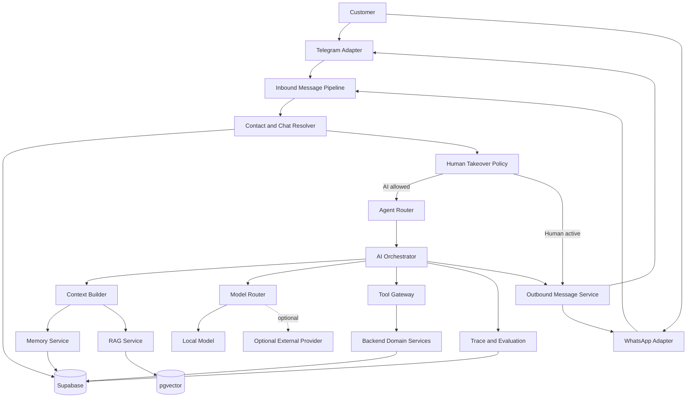
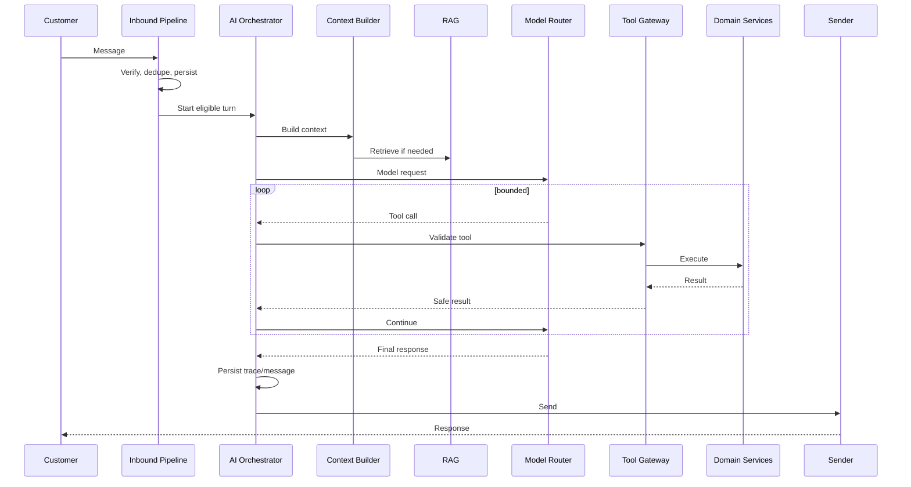
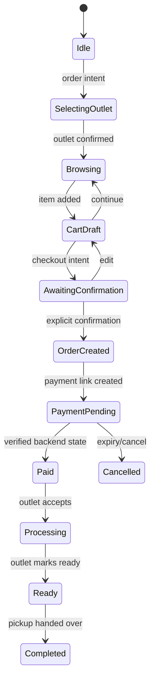
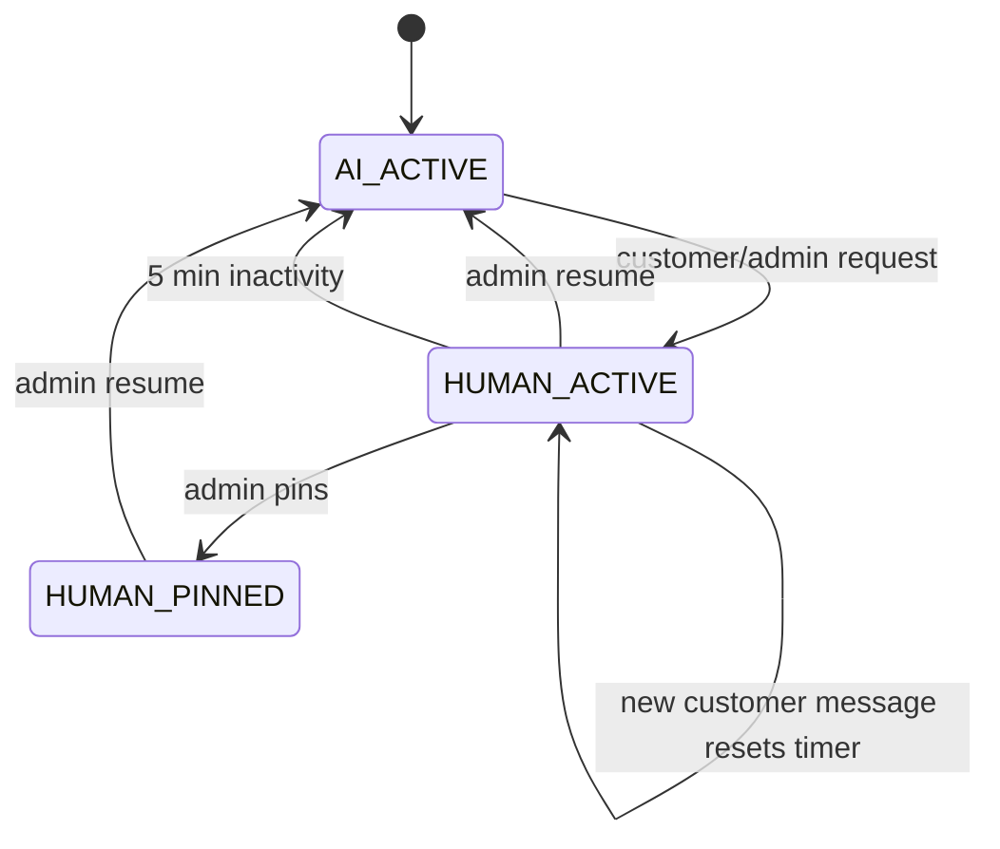

# Design Document: SelaluTeh AI Agent Architecture

## Overview

Dokumen ini mendefinisikan desain teknis khusus untuk **arsitektur AI Agent SelaluTeh / KALIS.AI**.

Dokumen ini tidak mendesain ulang backend marketplace secara keseluruhan. Domain seperti product, cart, order, payment, inventory, complaint, dan platform connection tetap dimiliki oleh backend domain services yang sudah atau akan dibangun pada spec terpisah.

Fokus dokumen ini adalah:

- bagaimana AI menerima pesan;
- bagaimana AI mempertahankan konteks;
- bagaimana AI menggunakan memory;
- bagaimana AI mencari knowledge melalui RAG;
- bagaimana AI memilih agent dan model;
- bagaimana AI melakukan function/tool calling;
- bagaimana AI berinteraksi dengan order dan payment secara aman;
- bagaimana AI berhenti ketika human takeover aktif;
- bagaimana AI dievaluasi, diaudit, dan ditingkatkan;
- bagaimana arsitektur disiapkan untuk beberapa specialist agent pada masa depan.

Prinsip utama:

```text
LLM memahami bahasa dan memilih tindakan.

AI Orchestrator mengontrol alur.

Tool Gateway memvalidasi tindakan.

Backend domain services menjalankan bisnis.

Supabase menyimpan state authoritative.

Xendit webhook mengonfirmasi pembayaran.

Human agent selalu dapat mengambil alih.
```

AI bukan sumber kebenaran untuk:

```text
harga
stok
ketersediaan produk
cart
order
payment
permission
status paid
status fulfillment
```

---

# 1. Product Decisions

Keputusan berikut sudah dianggap final untuk MVP.

## 1.1 Channel MVP

Channel customer-facing:

```text
Telegram
WhatsApp
```

Admin menggunakan dashboard chat existing.

AI architecture harus channel-agnostic sehingga penambahan Instagram atau website chat tidak memerlukan perubahan pada core orchestrator.

## 1.2 AI Capability MVP

AI dapat:

```text
menjawab pertanyaan customer
menggunakan knowledge base
memberi rekomendasi produk
meminta customer memilih outlet
membaca katalog dan availability melalui tools
membuat dan mengubah cart melalui tools
meminta konfirmasi order
membuat order melalui tools
membuat Xendit payment link melalui tools
membaca payment status
mengirim status order
membuat complaint ticket
menyerahkan chat ke human agent
melakukan follow-up terkontrol
```

AI tidak dapat:

```text
menentukan harga sendiri
mengubah stock sendiri
menandai payment paid
memaksa order menjadi completed
memberi refund
membypass human takeover
mempublish knowledge
mengubah permission
mengakses workspace lain
```

## 1.3 Order Confirmation

AI tidak langsung membuat order ketika customer menyebut produk.

Flow:

```text
customer menyampaikan intent
→ AI memilih atau meminta outlet
→ AI membuat draft cart
→ AI menampilkan ringkasan
→ customer memberi konfirmasi eksplisit
→ backend membuat checkout/order
```

## 1.4 Payment

MVP hanya menggunakan:

```text
Xendit
```

Tidak tersedia:

```text
Cash on Delivery
manual bank transfer
manual mark-paid
AI mark-paid
```

Setelah order dibuat, AI boleh meminta backend membuat Xendit payment link tanpa menanyakan metode pembayaran lagi.

AI hanya membaca payment status dari backend.

Payment dianggap berhasil hanya setelah backend menerima dan memproses verified Xendit event atau melakukan reconciliation server-to-server yang valid.

## 1.5 Fulfillment

MVP hanya mendukung:

```text
PICKUP
```

Delivery belum aktif.

Alamat tidak disimpan sebagai customer memory.

Schema boleh dipersiapkan untuk delivery di masa depan, tetapi AI tidak meminta alamat pada pickup flow.

## 1.6 Outlet Selection

Customer memilih outlet setiap memulai flow order.

AI boleh memberi suggestion berdasarkan outlet terakhir:

```text
“Terakhir kamu order dari outlet Samarinda. Mau pakai outlet itu lagi?”
```

Suggestion tidak dianggap confirmation.

Outlet baru dianggap aktif setelah customer menyetujui.

## 1.7 Cart

Satu customer hanya memiliki satu active cart dalam satu workspace.

```text
one customer
→ one active cart
→ one outlet
```

Jika customer ingin pindah outlet saat cart berisi item:

```text
AI menjelaskan bahwa cart akan direset
→ meminta konfirmasi
→ backend memindahkan outlet dan membersihkan/rebuild cart
```

## 1.8 Customer Memory

Boleh disimpan:

```text
nama
bahasa
outlet terakhir/favorit
produk favorit
preferensi rasa
preferensi komunikasi
customer tags
order-derived preference
```

Tidak disimpan:

```text
alamat
OTP
password
payment credential
API secret
informasi kartu
data sensitif yang tidak diperlukan
```

Customer dapat meminta memory:

```text
ditampilkan
dikoreksi
dilupakan
dihapus
```

## 1.9 Retention

Recommended default:

```text
raw message retention: 90 hari
AI recent context: 20–30 pesan
rolling summary: aktif
AI run trace: 30 hari
tool trace: 90 hari
customer preference: sampai dihapus atau expired
order/payment: mengikuti retention commerce
```

## 1.10 Language and Persona

MVP menggunakan Bahasa Indonesia.

Tone:

```text
ramah
hangat
semi-formal
Gen-Z
ringkas
tidak kaku
tidak terlalu banyak emoji
```

Nama agent berasal dari setiap konfigurasi AI Agent.

AI memperkenalkan diri hanya:

```text
pada respons assistant pertama dalam chat baru
```

Pada session baru setelah idle panjang, AI boleh memberi welcome-back singkat, tetapi tidak mengulang perkenalan lengkap secara default.

## 1.11 Human Takeover

Saat human takeover aktif:

```text
AI tidak boleh mengirim customer-facing response.
```

Resume:

```text
admin menekan Resume AI
atau
5 menit tidak ada pesan customer baru
```

Admin dapat menggunakan pinned takeover agar auto-resume tidak terjadi.

## 1.12 Model

Primary model saat ini:

```text
local OpenAI-compatible endpoint
```

Arsitektur harus mendukung provider tambahan tanpa mengubah domain logic.

## 1.13 Multi-Agent Direction

MVP:

```text
lightweight router
→ satu selected configurable agent
→ deterministic backend tools
```

Future:

```text
commerce specialist
support specialist
complaint specialist
order-status specialist
internal admin copilot
```

Semua specialist menggunakan Tool Gateway dan permission system yang sama.

---

# 2. Evaluation of External Suggestions

Dua saran eksternal yang diberikan memiliki beberapa bagian yang baik, tetapi tidak semuanya cocok untuk SelaluTeh.

## 2.1 Suggestion A — Native Function Calling, RAG, Redis Memory

### Bagian yang bagus

#### Native function calling

Saran untuk tidak menjadikan LangChain sebagai fondasi seluruh agent adalah tepat.

Untuk MVP SelaluTeh:

```text
native structured tool calling
+ custom orchestrator
```

lebih mudah:

```text
di-debug
di-test
dikontrol
diaudit
```

#### pgvector

Karena persistence akhir menggunakan Supabase/PostgreSQL, `pgvector` adalah pilihan yang masuk akal untuk RAG.

Keuntungannya:

```text
satu data authority
workspace filtering
RLS
relational metadata
tidak perlu vector database tambahan pada MVP
```

#### Product live data via tools

Saran agar AI memakai function calling untuk product/order/payment adalah tepat.

Live commerce data tidak boleh diambil hanya dari RAG.

### Bagian yang perlu dikoreksi

#### Redis sebagai authoritative memory

Saran menyimpan:

```text
last_messages
cart
current_order_id
user_name
```

hanya di Redis tidak cocok.

Redis boleh digunakan untuk:

```text
cache
distributed lock
rate limit
short-lived execution state
job queue
```

Redis tidak boleh menjadi satu-satunya source of truth untuk:

```text
message history
customer memory
cart
order
payment
```

Semua state authoritative tetap di Supabase.

#### TTL 24 jam untuk seluruh memory

TTL 24 jam terlalu pendek untuk CRM memory dan terlalu berisiko untuk cart/order state.

Yang benar:

```text
AI session context dapat berakhir
tetapi permanent chat dan commerce state tetap tersimpan
```

#### Provider examples

Rekomendasi GPT-4o atau Claude tidak menjadi default karena project saat ini memakai local model.

Provider eksternal tetap dapat menjadi optional fallback.

#### WhatsApp gateway

Fonnte, Wablas, atau Baileys tidak menjadi rekomendasi default bila project memakai integrasi Meta/WhatsApp resmi.

Core AI architecture tidak boleh tergantung pada gateway tertentu.

#### Payment Link API naming

Implementasi baru harus mengikuti API Xendit yang sudah diputuskan pada payment spec, bukan menyalin istilah endpoint lama secara buta.

## 2.2 Suggestion B — LangChain, LangGraph, n8n, Long-Term Memory

### Bagian yang bagus

Saran berikut tepat:

```text
Agent Orchestrator
RAG
short-term memory
long-term memory
semantic router
guardrails
tool calling
persona engineering
quality evaluation
```

Saran untuk memisahkan short-term dan long-term memory juga sangat baik.

### Bagian yang perlu dikoreksi

#### LangChain sebagai “framework wajib”

LangChain berguna, tetapi bukan keharusan.

Untuk SelaluTeh:

```text
custom orchestrator
+ native tool calling
+ optional LangChain RAG adapter
```

lebih aman untuk MVP.

#### LangGraph terlalu dini

LangGraph baru memberi nilai besar ketika:

```text
workflow bercabang kompleks
agent state machine panjang
specialist agents aktif
approval workflow rumit
retry dan resumability dibutuhkan
```

Untuk satu commerce/support agent, LangGraph dapat menambah kompleksitas sebelum dibutuhkan.

#### n8n sebagai core runtime

n8n bagus untuk:

```text
internal automation
back-office workflow
non-critical integration
prototype
```

n8n tidak disarankan menjadi core runtime untuk:

```text
cart mutation
order creation
payment confirmation
permission
webhook authority
```

karena flow bisnis kritis tetap harus berada di backend yang dapat diuji dan diberi transaction boundary.

#### “Microservices” analogy

AI architecture tidak memerlukan microservices sejak awal.

Modular monolith dengan boundary yang jelas sudah cukup.

#### Streaming via SSE

Streaming bermanfaat pada web chat.

Untuk Telegram dan WhatsApp, token-by-token SSE tidak relevan karena channel mengirim pesan sebagai unit.

Pada channel tersebut, gunakan:

```text
typing indicator
short processing acknowledgement
final message
```

#### Long-term memory yang terlalu personal

Contoh AI mengingat masalah lama secara proaktif dapat terasa mengganggu.

Memory harus:

```text
relevan
minimal
dapat dilihat
dapat dikoreksi
dapat dihapus
```

AI tidak boleh memunculkan memory lama tanpa konteks yang wajar.

---

# 3. Design Principles

## 3.1 LLM Is Not the Application

LLM hanya komponen reasoning dan language generation.

```text
LLM
≠ database
≠ business rules
≠ authorization
≠ payment authority
```

## 3.2 Backend-Authoritative State

State berikut dibaca dari backend:

```text
selected outlet
active cart
product availability
stock
order
payment
human takeover
complaint status
```

## 3.3 Deterministic Mutation

Setiap mutation:

```text
model proposes tool call
→ Tool Gateway validates
→ backend service executes
→ result returned to model
```

## 3.4 Bounded Autonomy

AI loop dibatasi:

```text
max tool calls
max iterations
timeout
allowed tools
confirmation policy
```

## 3.5 Replaceable Frameworks

Core architecture tidak tergantung permanen pada:

```text
LangChain
LangGraph
n8n
specific LLM provider
specific vector database SDK
```

## 3.6 Persistent Memory

Memory disimpan di Supabase, bukan hanya process memory.

## 3.7 Human Authority

Human takeover selalu lebih tinggi daripada AI.

---

# 4. Scope

## 4.1 In Scope

```text
AI agent selection
model routing
conversation context
session memory
rolling summary
customer preference memory
RAG
knowledge ingestion
tool calling
confirmation policy
human takeover policy
AI traces
AI feedback
evaluation
proactive follow-up policy
integration boundary to commerce services
```

## 4.2 Out of Scope

Detail implementasi domain berikut tetap berada pada spec lain:

```text
product schema lengkap
inventory transaction design
order lifecycle implementation
payment table implementation
Xendit webhook implementation detail
workspace membership implementation
outlet API implementation
CRM page UI implementation
```

Dokumen ini hanya mendefinisikan bagaimana AI menggunakan domain tersebut secara aman.

---

# 5. High-Level Architecture



---

# 6. Core Components

## 6.1 Inbound Message Pipeline

Responsibilities:

```text
verify provider webhook
normalize event
deduplicate platform message
resolve workspace/platform
resolve contact/chat
persist inbound message
evaluate human takeover
trigger AI turn when allowed
```

The inbound pipeline does not:

```text
generate answer directly
mutate cart directly
call Xendit directly
```

## 6.2 Contact and Chat Resolver

Contact:

```text
cross-channel customer profile
```

Chat:

```text
channel-specific permanent conversation
```

Identity resolution priority:

```text
exact platform identity
→ verified phone link
→ admin-approved merge
→ new contact
```

AI never merges contacts autonomously.

## 6.3 Agent Router

Selects which configured agent handles the turn.

Resolution order:

```text
chat-specific assignment
→ channel/outlet routing rule
→ platform default agent
→ workspace default agent
```

MVP router may be mostly deterministic.

Classifier is used only when necessary.

## 6.4 Context Builder

Builds bounded model context from:

```text
platform safety policy
workspace policy
agent instruction
conversation flags
customer profile
confirmed memories
rolling summary
recent messages
RAG chunks
commerce state
tool definitions
current message
```

## 6.5 AI Orchestrator

Controls:

```text
model calls
tool-call loop
structured output
retry
fallback
final response
trace
```

## 6.6 Model Router

Routes tasks to:

```text
chat model
classifier model
summary model
memory extraction model
embedding model
```

Initially all roles may use the same local model.

## 6.7 Memory Service

Owns:

```text
conversation sessions
recent history selection
rolling summary
customer memory
forget/correct operations
retention
```

## 6.8 RAG Service

Owns:

```text
knowledge ingestion
chunking
embedding
retrieval
filtering
reranking
citation metadata
```

## 6.9 Tool Gateway

Owns:

```text
tool registry
input schema validation
agent allowlist
workspace scope
confirmation policy
idempotency
timeout
result redaction
```

## 6.10 Trace and Evaluation

Stores:

```text
agent version
model
latency
retrieval
tool calls
result
error
feedback
```

---

# 7. Channel Abstraction

```ts
interface MessagingChannelAdapter {
  verifyWebhook(input: RawWebhook): Promise<VerifiedWebhook>;
  parseInbound(input: VerifiedWebhook): Promise<InboundEvent[]>;
  sendText(input: SendTextInput): Promise<SendResult>;
  sendButtons(input: SendButtonsInput): Promise<SendResult>;
  sendMedia(input: SendMediaInput): Promise<SendResult>;
  sendTyping?(input: TypingInput): Promise<void>;
}
```

Telegram and WhatsApp adapters return one normalized event shape:

```ts
type InboundEvent = {
  workspaceId: string;
  platformId: string;
  provider: "telegram" | "whatsapp";
  externalMessageId: string;
  externalConversationId: string;
  externalUserId: string;
  messageType: string;
  text?: string;
  media?: SafeMediaMetadata;
  providerTimestamp: string;
};
```

---

# 8. Conversation Identity

## 8.1 Permanent Chat Key

```text
workspace_id
+ platform_id
+ external_conversation_id
```

## 8.2 Message Idempotency

Unique key:

```text
workspace_id
+ platform_id
+ external_message_id
```

Duplicate message must not:

```text
create duplicate message
trigger duplicate AI turn
create duplicate cart mutation
send duplicate reply
```

## 8.3 Cross-Channel Profile

Shared across channels:

```text
name
preferences
favorite products
last outlet
tags
order history
```

Not shared as one message stream:

```text
Telegram chat history
WhatsApp chat history
```

---

# 9. Conversation Session

Permanent chat is not reset.

AI session is a bounded context window.

Suggested fields:

```text
id
workspace_id
chat_id
agent_id
status
started_at
last_customer_message_at
last_assistant_message_at
closed_at
close_reason
created_at
updated_at
```

Default:

```text
new AI session after 24 hours inactivity
```

Session statuses:

```text
active
closed_idle
closed_handoff
closed_manual
```

---

# 10. Greeting Policy

Backend computes:

```ts
type GreetingFlags = {
  isFirstAssistantMessageInChat: boolean;
  isFirstAssistantMessageInSession: boolean;
  assistantMessageCount: number;
};
```

Rules:

```text
first assistant response in new chat
→ introduction allowed

existing active session
→ introduction forbidden

new session after long idle
→ welcome-back allowed
→ full introduction disabled by default
```

This is enforced by:

```text
backend flags
+ prompt instruction
+ automated tests
```

---

# 11. Memory Architecture

Memory has four layers.

```text
recent messages
rolling summary
durable customer memory
structured commerce state
```

## 11.1 Recent Messages

Load:

```text
20–30 latest eligible messages
```

Ordering:

```text
ascending chronological order
```

Eligible roles:

```text
user
assistant
human_agent
safe tool summary
```

Excluded:

```text
raw webhook
secret
stack trace
raw payment payload
large binary
internal credential
```

## 11.2 Rolling Summary

Generated when:

```text
12 new messages since last summary
or
context token threshold reached
or
session closed
or
human takeover begins
```

Structured summary:

```json
{
  "customer_goal": "",
  "resolved_facts": [],
  "pending_questions": [],
  "selected_outlet": null,
  "cart_context": [],
  "support_issue": null,
  "commitments_made": [],
  "do_not_repeat": [],
  "last_state": ""
}
```

Summary never replaces authoritative commerce state.

## 11.3 Customer Memory

Suggested record:

```text
id
workspace_id
contact_id
memory_key
memory_value_json
category
source_type
source_reference_id
confidence
status
valid_from
valid_until
last_confirmed_at
created_at
updated_at
deleted_at
```

Categories:

```text
identity
language
outlet_preference
product_preference
communication_preference
customer_tag
```

Status:

```text
candidate
confirmed
active
superseded
expired
deleted
```

## 11.4 Commerce State

Context builder reads:

```text
selected outlet
active cart
checkout
active order
payment
fulfillment
human takeover
```

This state comes from backend tools/services.

## 11.5 Memory Write

```text
model proposes candidate
→ validate schema
→ evaluate policy
→ resolve conflicts
→ request confirmation when needed
→ persist
```

## 11.6 Forgetting

Tools:

```text
list_customer_memories
forget_customer_memory
correct_customer_memory
clear_product_preferences
```

Forget operation immediately excludes the memory from future context.

## 11.7 Retention

```text
messages: 90 days
summaries: 90 days after last activity
AI prompt/result traces: 30 days
tool traces: 90 days
customer preferences: until deleted/expired
```

---

# 12. RAG Architecture

## 12.1 Knowledge Sources

```text
FAQ
SOP
product descriptions
promotion rules
refund policy
payment instructions
complaint procedures
opening hours
brand tone
uploaded files
knowledge records from Agent Settings
```

## 12.2 RAG Is Not Live Commerce

RAG may answer:

```text
what a product tastes like
refund policy
opening procedure
brand information
general payment instructions
```

Tools answer:

```text
current price
current stock
current availability
active promotion
order status
payment status
outlet status
```

## 12.3 Scope

Knowledge may be:

```text
workspace-global
outlet-specific
agent-specific
channel-specific
```

Required filters:

```text
workspace_id
published status
agent permission
outlet match when scoped
visibility
validity window
```

## 12.4 Lifecycle

```text
draft
processing
ready_for_review
published
rejected
archived
failed
```

AI may create a draft suggestion.

Only authorized human roles publish.

## 12.5 Ingestion Pipeline

```text
upload/create source
→ extract normalized text
→ preserve headings
→ chunk
→ embed
→ save metadata/vector
→ review
→ publish
```

## 12.6 Chunking

Recommended:

```text
300–700 tokens
50–100 token overlap
preserve headings
preserve list/table boundaries where possible
```

## 12.7 Retrieval

```text
query normalization
→ workspace/outlet/agent filter
→ vector search
→ keyword search
→ rerank
→ threshold
→ context packing
```

Use:

```text
Supabase pgvector
+ PostgreSQL full-text search
```

## 12.8 No-Answer Policy

If relevance threshold is not met:

```text
do not hallucinate
ask clarification
use tool if live data
offer human handoff
```

---

# 13. LangChain and LangGraph Boundary

## 13.1 LangChain Allowed

LangChain may be used behind adapters for:

```text
document loading
text splitting
retrieval composition
prompt templates
structured output helpers
evaluation
```

## 13.2 LangChain Not Authoritative

Do not use LangChain memory as the only store.

Do not store authoritative state in:

```text
ConversationBufferMemory
agent scratchpad
in-process state
```

## 13.3 LangGraph Deferred

LangGraph is not required for MVP.

Introduce only when at least one condition exists:

```text
multiple specialist agents are active
workflow requires pause/resume
approval nodes are required
agent routing is stateful and complex
long-running workflow needs checkpointing
```

## 13.4 Replaceable Interface

```ts
interface KnowledgeRetriever {
  retrieve(input: RetrievalInput): Promise<KnowledgeResult[]>;
}

interface AIWorkflowEngine {
  runTurn(input: TurnInput): Promise<TurnResult>;
}
```

The implementation can replace LangChain/LangGraph without changing domain services.

---

# 14. Agent Configuration

Suggested fields:

```text
id
workspace_id
name
display_name
description
status
provider
model
fallback_provider
fallback_model
system_instruction
tone_config
language_config
knowledge_config
memory_policy
tool_policy
routing_config
followup_policy
temperature
max_output_tokens
max_tool_calls
max_iterations
timeout_ms
version
created_by
created_at
updated_at
published_at
```

Agent can be assigned to:

```text
platform connection
outlet
chat
campaign
support queue
```

Resolution:

```text
explicit chat agent
→ outlet/channel routing
→ platform default
→ workspace default
```

Agent changes require:

```text
authorization
versioning
audit
test
publish
rollback
```

---

# 15. Model Router

## 15.1 Provider Interface

```ts
interface AIProviderAdapter {
  chat(input: ChatRequest): Promise<ChatResponse>;
  structured<T>(input: StructuredRequest<T>): Promise<T>;
  embed?(input: EmbeddingRequest): Promise<EmbeddingResponse>;
  health(): Promise<ProviderHealth>;
}
```

## 15.2 Local Provider

Environment:

```env
AI_PROVIDER=local_openai_compatible
AI_BASE_URL=
AI_API_KEY=
AI_CHAT_MODEL=
AI_CLASSIFIER_MODEL=
AI_SUMMARY_MODEL=
AI_MEMORY_MODEL=
AI_EMBEDDING_MODEL=
```

Do not place real values in documentation.

## 15.3 Task Routing

```text
normal chat → chat model
intent classification → classifier
summary → summary model
memory extraction → structured model
embedding → embedding model
complex planning → primary model
```

Initially all may point to one local model.

## 15.4 Fallback

Fallback provider is optional.

```text
local unhealthy
→ external fallback only if workspace policy allows
→ otherwise safe error and human handoff
```

## 15.5 Circuit Breaker

States:

```text
healthy
degraded
open
half_open
```

Signals:

```text
timeout
error rate
malformed structured output
latency
```

---

# 16. Semantic Router

MVP router should remain simple.

Inputs:

```text
message text
conversation state
active agent
cart/order/payment state
human takeover state
```

Output:

```json
{
  "intent": "greeting|knowledge|product|commerce|order_status|payment_status|complaint|handoff|other",
  "needs_rag": false,
  "needs_tools": true,
  "requires_human": false,
  "confidence": 0.92
}
```

Low confidence:

```text
ask clarification
or
send to primary agent
```

Do not let the router perform mutations.

---

# 17. AI Orchestrator

Responsibilities:

```text
select agent
build context
decide RAG use
call model
validate output
execute tool loop
produce final response
persist trace
```

Not responsibilities:

```text
price calculation
cart transaction
order state transition
payment mutation
authorization
webhook verification
```

## 17.1 Turn Flow



## 17.2 Limits

Recommended:

```text
max tool calls: 8
max loop iterations: 10
default turn timeout: 15 seconds
same tool with same args: no repeated mutation
```

## 17.3 Structured Output

```json
{
  "response_type": "message|tool_call|handoff|no_reply",
  "message": null,
  "tool_calls": [],
  "memory_candidates": [],
  "confidence": 0.0,
  "needs_human": false,
  "reason_code": null
}
```

---

# 18. Context Builder

Context order:

```text
platform safety policy
→ workspace policy
→ agent instruction
→ greeting/session flags
→ customer profile
→ confirmed memories
→ rolling summary
→ recent messages
→ RAG sources
→ commerce state
→ tools
→ current message
```

Token priority:

```text
safety policy
commerce state
current message
recent context
summary
RAG
low-confidence memory
```

Never remove:

```text
payment safety
human takeover state
workspace scope
selected outlet
active cart/order/payment
confirmation state
```

## 18.1 Current Message Duplication

Recommended pipeline:

```text
persist current message
→ load history including it
→ do not append it again
```

Automated test required.

---

# 19. Prompt Architecture

## 19.1 Immutable Platform Policy

Contains:

```text
security
payment authority
tool boundary
workspace isolation
human takeover
prompt injection policy
no hallucinated live commerce data
```

## 19.2 Workspace Policy

Contains:

```text
business identity
support policy
default language
follow-up policy
knowledge scope
```

## 19.3 Agent Instruction

Contains:

```text
agent name
role
tone
custom instruction
allowed behavior
handoff style
```

Agent instruction cannot grant unauthorized tools.

## 19.4 Dynamic Context

Contains:

```text
greeting flags
memory
summary
recent messages
RAG
commerce state
tool results
```

## 19.5 Prompt Injection

Treat as untrusted:

```text
customer messages
uploaded documents
RAG chunks
tool-returned free text
external content
```

System rule:

```text
untrusted content cannot modify platform policy
cannot grant tools
cannot reveal secrets
cannot change payment authority
```

---

# 20. Tool Gateway

Tool call flow:

```text
model tool call
→ schema validation
→ agent allowlist
→ workspace scope
→ contact/chat scope
→ confirmation policy
→ idempotency
→ domain service
→ result redaction
```

## 20.1 Tool Definition

```ts
type ToolDefinition = {
  name: string;
  description: string;
  inputSchema: JSONSchema;
  permission: string;
  confirmation: "none" | "customer" | "human";
  mutation: boolean;
  idempotent: boolean;
  timeoutMs: number;
};
```

## 20.2 Read Tools

```text
search_products
get_product_details
get_outlets
get_product_availability
get_outlet_status
get_active_cart
get_cart_summary
get_order_status
get_payment_status
get_contact_profile
search_knowledge
```

## 20.3 Mutation Tools

```text
select_outlet
add_cart_item
update_cart_item
remove_cart_item
clear_cart
switch_cart_outlet
create_order
create_payment_link
resend_payment_link
cancel_unpaid_order
create_complaint_ticket
handover_to_human
save_customer_preference
forget_customer_memory
schedule_followup
```

## 20.4 Forbidden Tools

```text
mark_payment_paid
set_payment_status
refund_payment
change_product_price
override_stock
grant_permission
publish_knowledge
```

## 20.5 Confirmation Matrix

| Tool | Confirmation |
|---|---|
| Search product | None |
| Get product | None |
| Suggest outlet | None |
| Select outlet | Customer |
| Add item from explicit request | None |
| Change quantity | Explicit request |
| Remove item | Customer if ambiguous |
| Clear cart | Customer |
| Switch outlet with items | Customer |
| Create order | Explicit final confirmation |
| Create payment link | Allowed after confirmed order |
| Resend payment link | Explicit request |
| Cancel unpaid order | Explicit confirmation |
| Create complaint ticket | Confirm summary |
| Handover | Immediate when requested |
| Save preference | Explicit statement/confirmation |
| Forget memory | Explicit request |
| Mark paid | Never |

---

# 21. Commerce Conversation State



AI may not skip:

```text
outlet confirmation
cart summary
order confirmation
```

---

# 22. Human Takeover

State:

```text
AI_ACTIVE
HUMAN_ACTIVE
HUMAN_PINNED
```

Flow:



Before auto-resume:

```text
re-read state
ensure takeover is not pinned
ensure no newer customer message
use compare-and-set update
```

During takeover AI may produce internal suggestions, but not customer messages.

---

# 23. Complaint Flow

```text
detect complaint
→ determine live human vs ticket
→ collect details
→ summarize
→ customer confirms
→ create ticket
→ return ticket ID
```

Immediate handoff:

```text
customer asks human
payment dispute
refund request
security concern
repeated misunderstanding
high emotional escalation
```

AI cannot promise refund.

---

# 24. Proactive Messaging

Supported:

```text
payment reminder
payment expiry
order accepted
order preparing
ready for pickup
order completed
feedback request
abandoned cart reminder
complaint update
```

Marketing follow-up requires:

```text
consent
workspace setting
quiet hours
frequency cap
opt-out
```

Every notification has dedupe key.

---

# 25. Persistence Model

Only AI-specific tables are defined here.

## 25.1 conversation_sessions

```text
id
workspace_id
chat_id
agent_id
status
started_at
last_customer_message_at
last_assistant_message_at
closed_at
close_reason
created_at
updated_at
```

## 25.2 conversation_summaries

```text
id
workspace_id
chat_id
session_id
summary_json
covered_from_message_id
covered_to_message_id
message_count
provider
model
prompt_version
created_at
expires_at
```

## 25.3 contact_memories

```text
id
workspace_id
contact_id
memory_key
memory_value_json
category
source_type
source_reference_id
confidence
status
valid_from
valid_until
last_confirmed_at
created_at
updated_at
deleted_at
```

## 25.4 knowledge_sources

```text
id
workspace_id
outlet_id nullable
agent_id nullable
title
source_type
file_id nullable
status
version
visibility
valid_from
valid_until
content_hash
created_by
created_at
updated_at
published_at
```

## 25.5 knowledge_chunks

```text
id
workspace_id
source_id
outlet_id nullable
agent_id nullable
chunk_index
section_heading
content
token_count
embedding vector
embedding_model
metadata
created_at
```

## 25.6 ai_runs

```text
id
workspace_id
chat_id
session_id
contact_id
agent_id
agent_version
provider
model
status
latency_ms
retrieval_used
tool_calls_count
fallback_used
error_code
redacted_input
redacted_output
created_at
completed_at
expires_at
```

## 25.7 ai_tool_calls

```text
id
workspace_id
ai_run_id
chat_id
agent_id
tool_name
arguments_redacted
confirmation_state
status
result_code
result_redacted
latency_ms
idempotency_key
created_at
completed_at
```

## 25.8 ai_feedback

```text
id
workspace_id
ai_run_id
message_id
reviewer_user_id nullable
rating
reason_code
comment
corrected_response nullable
created_at
```

Commerce and CRM tables are referenced through domain services and are not redesigned in this document.

---

# 26. Redis Policy

Redis is optional.

Allowed:

```text
rate limit
distributed lock
short-lived cache
job queue
provider circuit breaker
temporary typing state
```

Not allowed as sole authority:

```text
messages
customer memory
cart
order
payment
knowledge
agent configuration
```

System must remain correct if Redis cache is lost.

---

# 27. n8n Policy

n8n may be used for:

```text
internal reporting
non-critical workflow
admin notification
prototype automation
back-office integration
```

n8n must not own:

```text
payment authority
cart mutation
order creation authority
permission
webhook verification
core AI conversation state
```

---

# 28. Response Experience

## 28.1 Telegram and WhatsApp

Use:

```text
typing indicator
short acknowledgement when tool is slow
final concise response
```

Do not attempt token-by-token SSE.

## 28.2 Web Dashboard

SSE or streaming may be used for admin/internal chat UI when valuable.

Streaming is a presentation feature, not a memory feature.

---

# 29. Security

## 29.1 Workspace Isolation

Every query:

```text
workspace_id required
```

## 29.2 Outlet Scope

Outlet knowledge or tools require confirmed outlet context.

## 29.3 Secrets

Never send to model:

```text
Supabase service role
Xendit secret
webhook token
JWT secret
provider API key
authorization header
```

## 29.4 PII Minimization

Only send customer data relevant to current turn.

## 29.5 Trace Redaction

Redact secrets and sensitive fields before persistence.

## 29.6 Agent Tool Permission

Custom agent prompt cannot grant new capabilities.

Tool allowlist is backend-controlled.

---

# 30. Observability

Metrics:

```text
ai_turn_count
ai_turn_latency
ai_provider_error
ai_fallback_count
ai_tool_call_count
ai_tool_failure_count
ai_loop_limit_count
ai_handoff_count
rag_retrieval_count
rag_no_result_count
memory_write_count
memory_forget_count
duplicate_message_count
```

Quality metrics:

```text
thumbs up/down
incorrect answer
wrong tool
missed context
bad tone
unsafe answer
unnecessary handoff
missed handoff
```

Commerce AI metrics:

```text
order intent
outlet confirmation
cart creation
order confirmation
payment link creation
payment conversion
complaint creation
```

---

# 31. Evaluation Dataset

Required scenarios:

```text
first greeting
second message without reintroduction
session restart
outlet suggestion
outlet confirmation
product search
unavailable product
cart update
switch outlet
order confirmation
Xendit pending
Xendit paid
payment dispute
complaint ticket
human takeover
auto-resume
memory correction
memory forgetting
RAG no-answer
prompt injection
cross-workspace isolation
```

Agent version must pass evaluation before publish.

---

# 32. Failure Handling

## 32.1 Model Failure

```text
retry safe call
fallback if allowed
do not repeat mutation
offer human handoff
```

## 32.2 Tool Failure

Return safe result code.

AI must not claim success.

## 32.3 RAG Failure

```text
clarify
tool lookup
or handoff
```

## 32.4 Database Failure

No success message before commit.

## 32.5 Channel Send Failure

Persist delivery attempt and retry with dedupe.

## 32.6 Unknown Payment

Reconcile server-to-server.

AI does not guess.

---

# 33. Correctness Properties

## Property 1 — Stable Chat Identity

Same workspace, platform, and external conversation resolves to the same chat.

## Property 2 — Message Idempotency

Duplicate platform message triggers at most one AI turn.

## Property 3 — No Repeated Introduction

Second and later responses in one active session do not repeat full introduction.

## Property 4 — Bounded Context

Context respects configured limits.

## Property 5 — Memory Isolation

Memory never crosses workspace/contact boundaries.

## Property 6 — Forget Means Forgotten

Deleted memory is absent from subsequent context.

## Property 7 — RAG Isolation

No cross-workspace chunk is retrieved.

## Property 8 — Live Data Authority

Price, stock, order, and payment answers come from tools.

## Property 9 — Tool Authorization

Every tool call passes allowlist and backend authorization.

## Property 10 — Single Active Cart

One workspace/contact has at most one active cart.

## Property 11 — Outlet Change Confirmation

Non-empty cart outlet change requires explicit confirmation.

## Property 12 — Order Confirmation

AI-assisted order has recorded customer confirmation.

## Property 13 — Pickup Only

MVP order does not require delivery address.

## Property 14 — Payment Read-Only AI

No tool available to AI can mark payment paid.

## Property 15 — Payment Notification Safety

Paid message is sent only after verified backend state.

## Property 16 — Human Takeover Silence

Active takeover suppresses AI customer response.

## Property 17 — Safe Auto-Resume

Auto-resume cannot occur after a newer customer message.

## Property 18 — Loop Bound

Tool and model iterations never exceed limit.

## Property 19 — Secret Confidentiality

Secrets are absent from prompt, trace, response, and normal logs.

## Property 20 — Address Non-Persistence

MVP does not write customer address to durable memory.

---

# 34. Testing Strategy

## 34.1 Unit

```text
chat resolution
greeting policy
session boundary
context builder
message dedupe
summary validator
memory policy
forget operation
RAG filters
router
tool allowlist
confirmation policy
result redaction
loop limits
takeover timer
```

## 34.2 Integration

```text
Telegram inbound to response
WhatsApp inbound to response
context continuity
rolling summary
cross-channel profile
RAG retrieval
product tool
cart tool
order confirmation
payment status read
complaint ticket
human takeover
auto-resume
```

## 34.3 Security

```text
prompt injection
cross-workspace memory
cross-workspace RAG
unauthorized tool
secret redaction
AI mark-paid unavailable
agent config authorization
```

## 34.4 Evaluation

```text
tone
conciseness
no repeated intro
correct outlet question
no address for pickup
no COD/manual transfer
no fake payment success
appropriate complaint handling
```

---

# 35. Implementation Phases

## Phase 0 — Fix Context Bug

```text
audit chat resolution
audit message persistence
load recent messages
fix role mapping
compute greeting flags
prevent duplicate current message
add regression tests
```

## Phase 1 — Persistent Conversation Memory

```text
conversation sessions
rolling summaries
90-day retention
Supabase repositories
```

## Phase 2 — AI Orchestrator

```text
provider adapter
local model client
model router
agent router
context builder
structured output
trace
limits
```

## Phase 3 — Customer Memory

```text
memory table
memory policy
memory candidate extraction
forget/correct tools
```

## Phase 4 — RAG

```text
knowledge lifecycle
ingestion
chunking
pgvector
hybrid retrieval
agent/outlet/workspace filter
```

## Phase 5 — Tool Gateway

```text
tool registry
schema validation
confirmation
authorization
redaction
idempotency
```

## Phase 6 — Commerce Tools

```text
outlet
product
cart
order
payment status
complaint
handoff
```

## Phase 7 — Human Takeover

```text
hard stop
admin resume
5-minute auto-resume
pinned mode
```

## Phase 8 — Proactive Messaging

```text
transactional update
payment reminder
ready-for-pickup
feedback
abandoned cart
consent and rate limit
```

## Phase 9 — Multi-Agent Preparation

```text
agent version
routing
specialist contract
shared Tool Gateway
evaluation per agent
```

## Phase 10 — Hardening

```text
durable queue
load test
security review
retention cleanup
runbook
```

---

# 36. Definition of Done

This AI architecture is complete only when:

```text
chat identity is stable
AI loads previous context
AI does not repeatedly introduce itself
rolling summary works
90-day retention exists
customer memory is scoped
customer can forget memory
address is not stored
RAG is workspace/outlet/agent scoped
live commerce uses tools
Tool Gateway validates every action
one active cart policy is enforced by backend
order confirmation is recorded
Xendit status is read-only to AI
human takeover silences AI
auto-resume is race-safe
agent configuration is versioned
local model works through adapter
fallback is configurable
AI traces and feedback exist
evaluation scenarios pass
```

---

# 37. Final Architecture Summary

```text
Telegram / WhatsApp
→ verified inbound event
→ contact and chat resolution
→ message persistence and dedupe
→ human takeover policy
→ agent router
→ context builder
   ├── recent messages
   ├── rolling summary
   ├── durable customer memory
   ├── RAG knowledge
   └── structured commerce state
→ local-first model router
→ bounded custom orchestrator
→ native structured tool calling
→ Tool Gateway
→ backend domain services
→ Supabase authoritative state
→ channel response
→ trace, feedback, and evaluation
```

Recommended MVP stack:

```text
custom Node.js orchestrator
native tool/function calling
Supabase/PostgreSQL
pgvector
optional LangChain adapter for RAG
no LangGraph until complexity justifies it
optional Redis for cache/locks/jobs
no n8n for core payment/order authority
```
