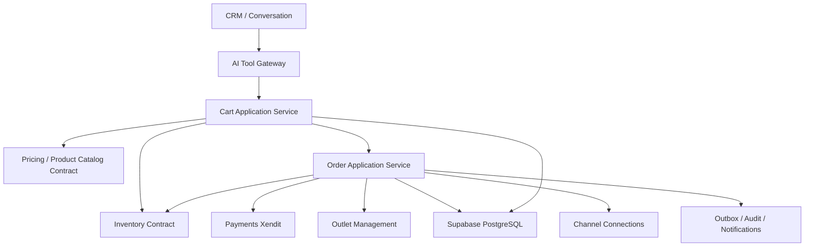
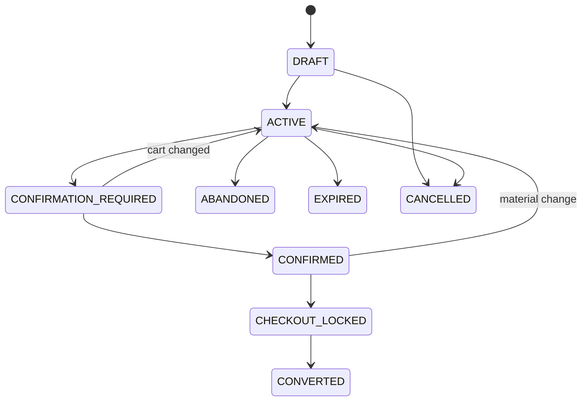
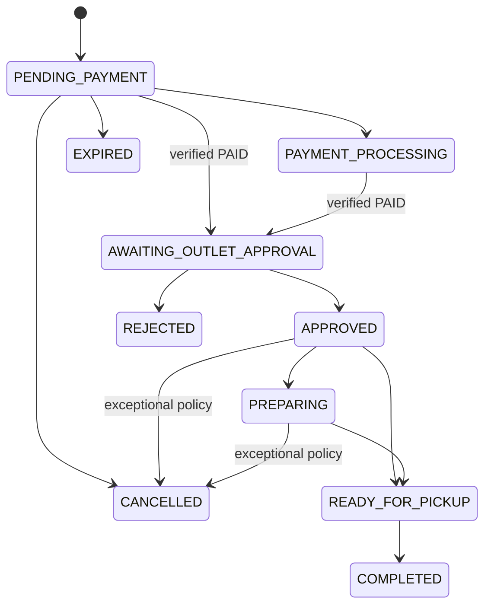
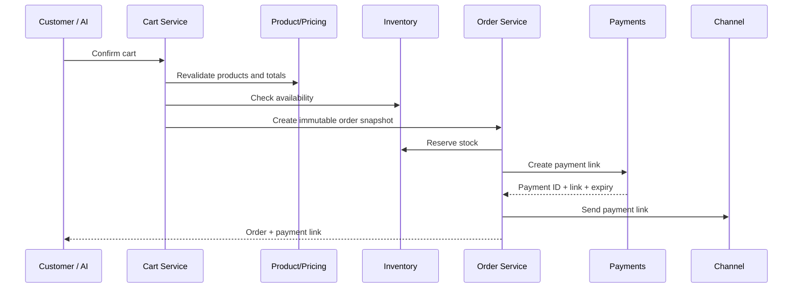
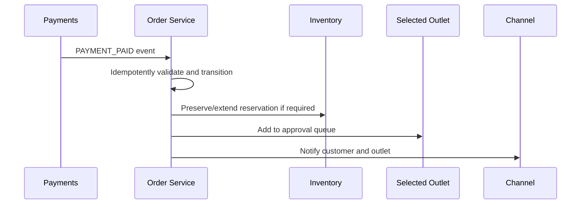
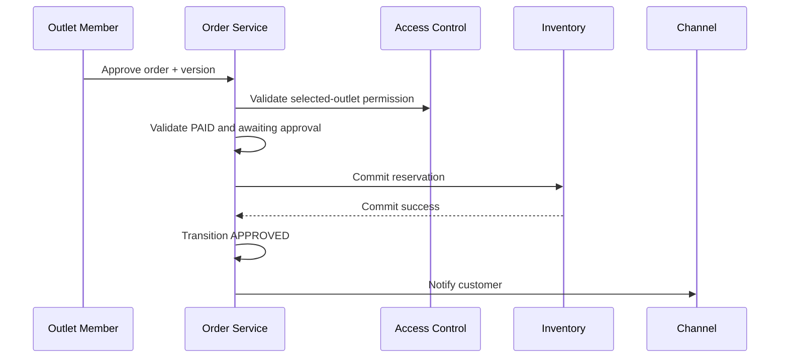

# Design Document: SelaluTeh Cart & Order Lifecycle

## Overview

```text
Conversation / Customer
→ Cart
→ Outlet selection
→ Product and pricing validation
→ Customer confirmation
→ Inventory reservation
→ Order snapshot
→ Xendit payment
→ Outlet approval
→ Pickup fulfillment
```

# 1. Design Goals

- one-cart-one-outlet;
- backend-authoritative pricing;
- immutable order snapshots;
- payment and approval separation;
- selected-outlet-only visibility;
- idempotent checkout;
- inventory-safe reservations;
- pickup-only alpha;
- AI-assisted but server-controlled workflow;
- full product design with a fastest safe alpha slice.

# 2. Non-Goals

```text
product catalog ownership
payment provider execution
stock ledger ownership
delivery and courier logistics
full refund execution
provider message transport
generic CRM ownership
generic audit storage
```

# 3. High-Level Architecture



# 4. Core Domain Types

## Cart

```ts
type Cart = {
  id: string;
  workspaceId: string;
  contactId: string;
  conversationId?: string;
  channelConnectionId?: string;
  outletId?: string;
  status:
    | "DRAFT"
    | "ACTIVE"
    | "CONFIRMATION_REQUIRED"
    | "CONFIRMED"
    | "CHECKOUT_LOCKED"
    | "CONVERTED"
    | "ABANDONED"
    | "EXPIRED"
    | "CANCELLED";
  currency: "IDR";
  pricingVersion?: string;
  confirmedAt?: string;
  convertedOrderId?: string;
  version: number;
  createdAt: string;
  updatedAt: string;
};
```

## Cart Item

```ts
type CartItem = {
  id: string;
  workspaceId: string;
  cartId: string;
  productId: string;
  variantId?: string;
  quantity: number;
  selectedModifiers: Array<{
    groupId: string;
    optionId: string;
    quantity?: number;
  }>;
  unitPriceMinor: number;
  modifierTotalMinor: number;
  lineTotalMinor: number;
  quoteVersion: string;
  version: number;
};
```

## Order

```ts
type Order = {
  id: string;
  workspaceId: string;
  orderNumber: string;
  contactId: string;
  conversationId?: string;
  channelConnectionId?: string;
  outletId: string;
  cartId: string;
  paymentId?: string;

  status:
    | "PENDING_PAYMENT"
    | "PAYMENT_PROCESSING"
    | "AWAITING_OUTLET_APPROVAL"
    | "APPROVED"
    | "PREPARING"
    | "READY_FOR_PICKUP"
    | "COMPLETED"
    | "REJECTED"
    | "CANCELLED"
    | "EXPIRED";

  fulfillmentType: "PICKUP";
  currency: "IDR";
  subtotalMinor: number;
  modifierTotalMinor: number;
  discountTotalMinor: number;
  taxTotalMinor: number;
  feeTotalMinor: number;
  grandTotalMinor: number;

  customerConfirmedAt: string;
  approvedAt?: string;
  readyAt?: string;
  completedAt?: string;

  version: number;
  createdAt: string;
  updatedAt: string;
};
```

# 5. Data Model

## `carts`

```text
id uuid pk
workspace_id uuid not null
contact_id uuid not null
conversation_id uuid nullable
channel_connection_id uuid nullable
outlet_id uuid nullable
status text not null
currency char(3) not null
pricing_version text nullable
confirmation_version text nullable
confirmed_at timestamptz nullable
converted_order_id uuid nullable
expires_at timestamptz nullable
version integer not null
created_at
updated_at
```

## `cart_items`

```text
id uuid pk
workspace_id uuid not null
cart_id uuid not null
product_id uuid not null
variant_id uuid nullable
quantity integer not null
selected_modifiers jsonb not null
unit_price_minor bigint not null
modifier_total_minor bigint not null
discount_total_minor bigint not null
tax_total_minor bigint not null
line_total_minor bigint not null
quote_version text not null
version integer not null
created_at
updated_at
```

## `orders`

```text
id uuid pk
workspace_id uuid not null
order_number text not null
cart_id uuid not null
contact_id uuid not null
conversation_id uuid nullable
channel_connection_id uuid nullable
outlet_id uuid not null
payment_id uuid nullable
fulfillment_type text not null
status text not null
currency char(3) not null

subtotal_minor bigint not null
modifier_total_minor bigint not null
discount_total_minor bigint not null
tax_total_minor bigint not null
fee_total_minor bigint not null
grand_total_minor bigint not null

pickup_contact_name text nullable
pickup_contact_phone text nullable
customer_confirmed_at timestamptz not null
approved_at timestamptz nullable
preparing_at timestamptz nullable
ready_at timestamptz nullable
completed_at timestamptz nullable
rejected_at timestamptz nullable
cancelled_at timestamptz nullable
expired_at timestamptz nullable

version integer not null
created_at
updated_at

unique(workspace_id, order_number)
unique(cart_id)
```

## `order_items`

```text
id uuid pk
workspace_id uuid not null
order_id uuid not null
product_id uuid not null
variant_id uuid nullable
product_name_snapshot text not null
variant_name_snapshot text nullable
selected_modifiers_snapshot jsonb not null
quantity integer not null
unit_price_minor bigint not null
modifier_total_minor bigint not null
discount_total_minor bigint not null
tax_total_minor bigint not null
line_total_minor bigint not null
product_version text nullable
pricing_version text not null
inventory_requirement_snapshot jsonb nullable
created_at
```

## `order_status_history`

```text
id uuid pk
workspace_id uuid not null
order_id uuid not null
from_status text nullable
to_status text not null
actor_type text not null
actor_id text nullable
reason_code text nullable
reason_text text nullable
source_event_id text nullable
created_at
```

## `order_inventory_links`

```text
id uuid pk
workspace_id uuid not null
order_id uuid not null
reservation_group_id text nullable
commit_transaction_id text nullable
release_transaction_id text nullable
status text not null
updated_at
```

## `order_notes`

```text
id uuid pk
workspace_id uuid not null
order_id uuid not null
outlet_id uuid not null
author_id uuid not null
note_text text not null
created_at
edited_at nullable
```

## `order_idempotency_records`

```text
workspace_id uuid not null
idempotency_key text not null
command_type text not null
request_hash text not null
resource_id uuid nullable
response_snapshot jsonb nullable
created_at
expires_at nullable

unique(workspace_id, command_type, idempotency_key)
```

# 6. Cart Lifecycle



# 7. Order Lifecycle



Payment status is a separate state machine owned by Payments.

# 8. Pricing and Confirmation

Pricing flow:

```text
cart items
→ load products/variants/modifiers for selected outlet
→ calculate backend quote
→ return breakdown and quote version
→ customer confirms
```

Material invalidation includes:

```text
price changed
product unavailable
modifier changed
outlet changed
quantity changed
tax/fee changed
inventory unavailable
```

Any material invalidation after confirmation returns the cart to ACTIVE or CONFIRMATION_REQUIRED.

# 9. Checkout Orchestration



Implementation uses a recoverable saga/outbox approach instead of an impossible cross-service distributed transaction.

# 10. Verified Payment Flow



No UI, AI, redirect, or outlet command can produce PAYMENT_PAID.

# 11. Outlet Approval Flow



If inventory commit cannot be confirmed, approval must not be reported as successful.

# 12. Rejection and Compensation

```text
AWAITING_OUTLET_APPROVAL + PAID
→ REJECTED
→ release reservation
→ request refund/compensation workflow
→ notify customer accurately
```

Payment stays PAID until Payments confirms refund.

# 13. Fulfillment Flow

```text
APPROVED
→ PREPARING
→ READY_FOR_PICKUP
→ COMPLETED
```

Optional direct transition:

```text
APPROVED
→ READY_FOR_PICKUP
```

for pre-made items or simplified operations.

# 14. Availability and Inventory

Alpha reservation policy:

```text
reserve at payable order / payment link creation
preserve after payment success
commit at outlet approval
release on payment expiry, rejection, cancellation, or order expiry
```

Inventory references are stored on the order, but stock truth remains in Inventory.

# 15. Order Number Generation

Recommended format:

```text
ST-YYMMDD-XXXX
```

Requirements:

```text
human-readable
workspace-unique
concurrency-safe
not used as authorization secret
never reused
```

# 16. Authorization

Suggested permissions:

```text
orders.read
orders.create
orders.create_on_behalf
orders.approve
orders.reject
orders.start_preparing
orders.mark_ready
orders.complete
orders.cancel
orders.add_note
orders.export
orders.read_all_outlets
```

Service permissions:

```text
payments.order_event
inventory.order_reservation
channel.order_notification
ai.cart_tools
```

# 17. API Design

## Cart

```text
GET    /api/carts/current
POST   /api/carts
PATCH  /api/carts/:cartId/outlet
POST   /api/carts/:cartId/items
PATCH  /api/carts/:cartId/items/:itemId
DELETE /api/carts/:cartId/items/:itemId
POST   /api/carts/:cartId/validate
POST   /api/carts/:cartId/confirm
POST   /api/carts/:cartId/checkout
POST   /api/carts/:cartId/cancel
```

## Orders

```text
GET  /api/orders
GET  /api/orders/:orderId
POST /api/orders/:orderId/approve
POST /api/orders/:orderId/reject
POST /api/orders/:orderId/start-preparing
POST /api/orders/:orderId/mark-ready
POST /api/orders/:orderId/complete
POST /api/orders/:orderId/cancel
POST /api/orders/:orderId/notes
```

## Service events

```text
POST /internal/orders/:orderId/payment-events
POST /internal/orders/:orderId/inventory-events
```

# 18. Error Model

```text
CART_NOT_FOUND
CART_INVALID_STATE
CART_OUTLET_REQUIRED
CART_OUTLET_MISMATCH
CART_EMPTY
CART_ITEM_INVALID
CART_CONFIRMATION_REQUIRED
CART_ALREADY_CONVERTED

ORDER_NOT_FOUND
ORDER_INVALID_TRANSITION
ORDER_ALREADY_EXISTS
ORDER_PAYMENT_NOT_PAID
ORDER_ALREADY_APPROVED
ORDER_OUTLET_REJECTION_REQUIRED
ORDER_PICKUP_ONLY
ORDER_PRICING_CHANGED
ORDER_PRODUCT_UNAVAILABLE
ORDER_INSUFFICIENT_STOCK
ORDER_INVENTORY_COMMIT_FAILED
ORDER_PAYMENT_LINK_FAILED
ORDER_RECONCILIATION_REQUIRED

OUTLET_NOT_ACCEPTING_ORDERS
OUTLET_SCOPE_DENIED
PERMISSION_DENIED
VERSION_CONFLICT
IDEMPOTENCY_CONFLICT
```

# 19. Orders Page Contract

Summary cards:

```text
Total Orders
Pending Payment
Awaiting Approval
Preparing
Ready for Pickup
Completed
Rejected / Cancelled
```

Table:

```text
Order Number
Customer
Outlet
Channel
Amount
Payment Status
Order Status
Created
Last Updated
Actions
```

Filters:

```text
outlet
order status
payment status
channel
date range
approval state
pickup state
exceptions
```

# 20. Order Detail Contract

Sections:

```text
Overview
Items and Totals
Customer and Pickup
Payment
Inventory
Timeline
Internal Notes
Complaint / Support
```

Actions derive from:

```text
current status
payment status
outlet scope
permissions
version
external service health
```

# 21. Cart and Order Popups

Backend supports:

```text
View Cart
Add Item Browse
Edit Item / Modifiers
Select Outlet
Confirm Order Summary
Payment Link State
Approve Order
Reject Order
Cancel Order
Ready for Pickup
Complete Pickup
Version Conflict
Inventory Conflict
Payment Provider Outage
```

# 22. Domain Events

```text
CART_CREATED
CART_UPDATED
CART_CONFIRMED
CART_CONVERTED
ORDER_CREATED
ORDER_PAYMENT_REQUESTED
ORDER_PAYMENT_PROCESSING
ORDER_PAYMENT_CONFIRMED
ORDER_AWAITING_OUTLET_APPROVAL
ORDER_APPROVED
ORDER_REJECTED
ORDER_PREPARING
ORDER_READY_FOR_PICKUP
ORDER_COMPLETED
ORDER_CANCELLED
ORDER_EXPIRED
ORDER_AMENDED
ORDER_EXCEPTION_RAISED
```

# 23. Security Threat Model

## Price Tampering

```text
backend catalog/pricing
ignore client price
quote version
revalidation before order
```

## Fake Payment

```text
Payments event only
verified provider truth
no redirect/UI/manual mark paid
```

## Wrong-Outlet Approval

```text
order outlet ID
member outlet access
service authorization
RLS
```

## Duplicate Checkout

```text
cart unique conversion
idempotency record
request hash
database constraints
```

## Inventory Race

```text
Inventory transactional reservation
order idempotency
recoverable saga
```

# 24. Testing Strategy

## Unit

```text
cart lifecycle
pricing invalidation
one-cart-one-outlet
order lifecycle
transition guards
capability flags
order numbering
snapshot generation
```

## Component

```text
Cart Service
Checkout Orchestrator
Order Service
Approval Service
Fulfillment Service
Order Query Service
```

## Integration

```text
Product Catalog
Inventory
Payments Xendit
Outlet Management
Access Control
Channel Connections
CRM
Complaints
Audit
Notifications
```

## Property

```text
one cart converts to at most one order
unpaid order cannot be approved
payment paid and order approved are independent
duplicate payment event advances once
duplicate approval commits inventory once
other outlet cannot approve
```

## Concurrency

```text
two checkout commands
payment success vs cancellation
approval vs rejection
approval vs inventory release
order edit vs checkout
two completion commands
```

## Resilience

```text
payment link creation failure
inventory reservation failure
inventory commit failure
channel notification failure
outbox consumer failure
external read service failure
```

# 25. Performance Targets

Initial targets:

```text
cart mutation: < 250 ms backend typical
cart validation: < 400 ms excluding external service latency
checkout orchestration: bounded and observable
order list: < 300 ms backend
order detail: < 350 ms backend
approval transition: < 500 ms excluding Inventory latency
```

These are targets to measure, not guarantees.

# 26. Migration Strategy

```text
audit legacy cart/order/status/payment logic
→ define Supabase schema and RLS
→ map current outlet/customer/channel context
→ introduce backend pricing and snapshots
→ integrate inventory reservations
→ integrate Xendit payment events
→ remove manual paid/unsafe approval paths
→ disable Mongo order authority
→ run alpha E2E reconciliation
```

# 27. Rollout Strategy

## Phase 1 — Alpha

```text
cart
outlet selection
backend pricing
confirmation
pickup order
payment link
paid webhook
outlet approval/rejection
inventory reserve/commit/release
basic fulfillment
order list/detail/timeline
```

## Phase 2 — Operations

```text
notes
complaints
advanced cancellation
approval SLA
bulk actions
exception queues
```

## Phase 3 — Advanced Commerce

```text
order amendment
partial item cancellation
advanced compensation
pickup verification
delivery as separate future domain
```

# 28. Fastest Safe Alpha Slice

```text
cart schema and lifecycle
one cart one outlet
product/modifier validation
backend pricing
customer confirmation
order snapshot
order state machine
payment integration
inventory reservation/commit/release
selected-outlet approval
pickup fulfillment
WhatsApp/Telegram notifications
order list/detail/timeline
RLS and authorization
idempotency/concurrency/resilience
alpha E2E
```

# 29. Definition of Done

```text
one-cart-one-outlet proven
backend price authority proven
immutable order snapshot proven
duplicate checkout suppressed
verified payment-only transition proven
selected-outlet visibility/approval proven
unpaid approval denied
inventory effects idempotent
pickup lifecycle proven
payment/order status separation proven
workspace/outlet RLS proven
all release-gate tests pass
implementation status reflects repository reality
specs check passes
```
