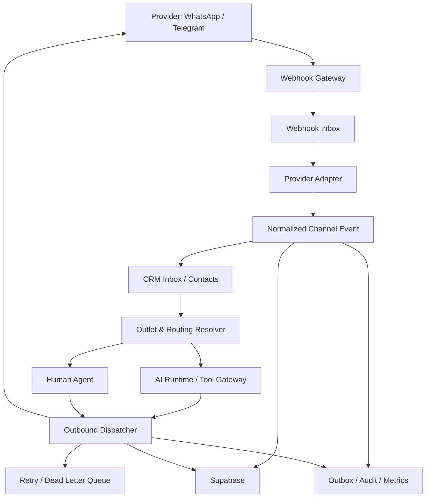
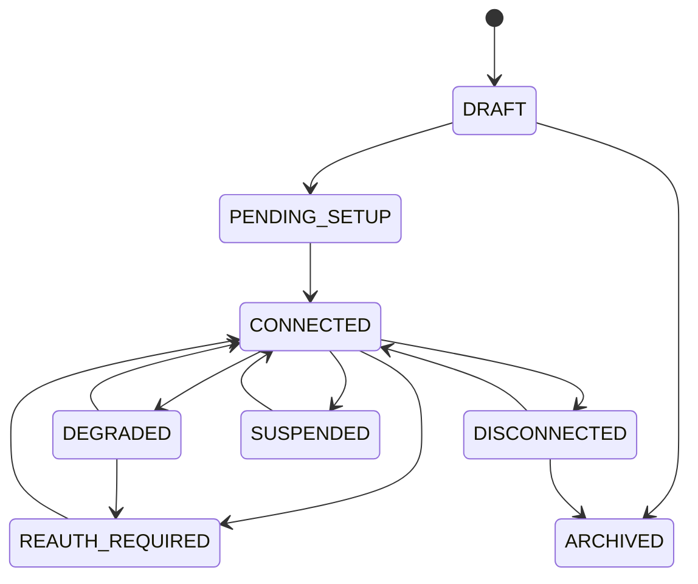
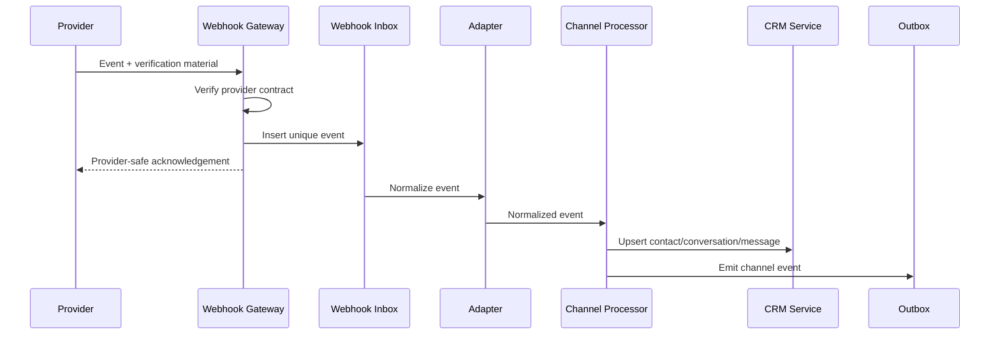

# Design Document: SelaluTeh Channel Connections & Sync

## Overview

```text
Provider Connection at Workspace
→ Webhook / Provider API
→ Channel Adapter
→ Normalized Event
→ CRM Conversation
→ Outlet Routing
→ AI or Human
→ Outbound Dispatcher
→ Provider Delivery Status
```

## 1. Core Design Decisions

```text
WhatsApp and Telegram are P0/MVP.
Connection credentials live at workspace level.
Outlet channel settings are assignments and routing policies.
One workspace default AI agent may serve every outlet.
Outlet/channel agent overrides are optional.
Customer selects outlet for each order by default.
```

Status dimensions:

```text
connection_status
health_status
sync_status
outlet_assignment_status
```

## 2. Non-Goals

This spec does not own:

```text
contact/conversation business model
outlet lifecycle
AI reasoning
product truth
order state machine
payment truth
generic audit storage
generic job engine
```

## 3. Architecture



## 4. Provider-Neutral Interfaces

```ts
interface ChannelAdapter {
  provider: string;
  capabilities(): ChannelCapabilities;
  verifyWebhook(input: RawWebhookInput): VerificationResult;
  normalizeWebhook(input: VerifiedWebhook): NormalizedChannelEvent[];
  sendMessage(input: SendMessageCommand): Promise<SendMessageResult>;
  testConnection(input: TestConnectionCommand): Promise<TestConnectionResult>;
  reconnect?(input: ReconnectCommand): Promise<ReconnectResult>;
  reauthorize?(input: ReauthorizeCommand): Promise<ReauthorizeResult>;
  syncCatalog?(input: CatalogSyncCommand): Promise<SyncResult>;
  syncOrders?(input: OrderSyncCommand): Promise<SyncResult>;
}
```

```ts
type ChannelCapabilities = {
  inboundText: boolean;
  outboundText: boolean;
  media: string[];
  deliveryStatus: boolean;
  readStatus: boolean;
  templates: boolean;
  catalogSync: boolean;
  externalOrderSync: boolean;
  oauth: boolean;
};
```

## 5. Core Data Model

### `channel_connections`

```text
id uuid pk
workspace_id uuid not null
provider text not null
channel_type text not null
display_name text not null
environment text nullable
provider_account_id text nullable
provider_sender_id text nullable
auth_type text not null
secret_reference text not null
connection_status text not null
health_status text not null
sync_status text nullable
capabilities jsonb not null
webhook_config_version text nullable
contract_version text nullable
version integer not null
created_at
updated_at
archived_at
```

### `outlet_channel_assignments`

```text
id uuid pk
workspace_id uuid not null
outlet_id uuid not null
connection_id uuid not null

assignment_status text not null
accepts_chats boolean not null
accepts_orders boolean not null
routing_mode text not null

ai_handling_policy text not null
agent_override_id uuid nullable
human_team_id uuid nullable

outside_hours_policy jsonb nullable
notification_policy jsonb nullable

version integer not null
created_at
updated_at

unique(outlet_id, connection_id)
```

### `channel_webhook_events`

```text
id uuid pk
workspace_id uuid nullable
connection_id uuid nullable
provider text not null
provider_event_key text not null
event_type text not null
payload_hash text not null
sanitized_payload jsonb nullable
verification_status text not null
processing_status text not null
provider_created_at timestamptz nullable
received_at timestamptz not null
processed_at timestamptz nullable
retry_count integer not null
error_code text nullable

unique(provider, connection_id, provider_event_key)
```

### `channel_message_transports`

```text
id uuid pk
workspace_id uuid not null
connection_id uuid not null
conversation_id uuid not null
message_id uuid not null

direction text not null
provider_message_id text nullable
idempotency_key text nullable

transport_status text not null
failure_code text nullable
provider_created_at timestamptz nullable
sent_at timestamptz nullable
delivered_at timestamptz nullable
read_at timestamptz nullable

retry_count integer not null
next_retry_at timestamptz nullable
created_at
updated_at
```

### `channel_identity_mappings`

```text
id uuid pk
workspace_id uuid not null
connection_id uuid not null
contact_id uuid not null
provider_user_id text nullable
provider_chat_id text nullable
normalized_phone text nullable
display_name text nullable
created_at
updated_at
```

### `channel_resource_mappings`

```text
id uuid pk
workspace_id uuid not null
connection_id uuid not null
resource_type text not null
internal_resource_id uuid not null
provider_resource_id text not null
mapping_status text not null
last_synced_internal_version integer nullable
last_synced_at timestamptz nullable
error_code text nullable
created_at
updated_at
```

## 6. Connection and Health State

Connection lifecycle:



Health is calculated independently:

```text
credential validity
webhook recency
verification failure rate
provider API latency
outbound success rate
rate-limit pressure
queue backlog
sync failures
```

## 7. Webhook Flow



Business mutation never happens before webhook verification.

## 8. Normalized Event Contract

```ts
type NormalizedChannelEvent =
  | {
      kind: "MESSAGE_RECEIVED";
      providerEventId: string;
      providerMessageId: string;
      senderIdentity: ChannelIdentity;
      content: NormalizedMessageContent;
      providerCreatedAt: string;
    }
  | {
      kind: "MESSAGE_STATUS_UPDATED";
      providerMessageId: string;
      status: "SENT" | "DELIVERED" | "READ" | "FAILED" | "UNKNOWN";
      providerCreatedAt: string;
    }
  | {
      kind: "CONNECTION_STATUS_CHANGED" | "AUTHORIZATION_CHANGED";
      status: string;
      providerCreatedAt: string;
    };
```

## 9. Inbound Processing

```text
verified event
→ deduplicate
→ resolve workspace connection
→ resolve channel identity
→ resolve/create CRM contact
→ resolve/create conversation
→ persist inbound message
→ resolve outlet/channel routing
→ route to AI or human
```

AI failure does not remove or roll back the persisted inbound message.

## 10. Outbound Processing

```text
authorized reply/business event
→ persist outbound message/transport command
→ enqueue by provider/connection/conversation
→ adapter send
→ save provider message ID
→ process status webhooks
```

Ambiguous failure:

```text
check provider result or idempotency record
→ resend only when safe
```

## 11. Outlet Channel Policy

```ts
type OutletChannelPolicy = {
  outletId: string;
  connectionId: string;
  assignmentStatus: "ENABLED" | "DISABLED" | "PENDING_CONFIGURATION";
  acceptsChats: boolean;
  acceptsOrders: boolean;
  routingMode:
    | "CUSTOMER_SELECTS_OUTLET"
    | "PRESELECTED_OUTLET"
    | "NEAREST_OUTLET_SUGGESTION"
    | "FIXED_OUTLET"
    | "MANUAL_ROUTING";
  aiHandling:
    | "USE_WORKSPACE_DEFAULT"
    | "USE_OUTLET_OVERRIDE"
    | "USE_CHANNEL_OVERRIDE"
    | "AI_DISABLED";
  agentOverrideId?: string;
  humanTeamId?: string;
};
```

Policy resolution:

```text
connection usable?
→ outlet assignment enabled?
→ accepts chat/order?
→ outlet operational?
→ resolve routing
→ resolve AI handling
→ resolve human team
```

## 12. AI Resolution

```text
channel-specific override
→ outlet override
→ workspace default
```

The same default agent may serve all outlets while reading outlet-specific context.

AI cannot:

```text
read credentials
connect/disconnect providers
reauthorize
replay raw webhooks
bypass human takeover
route to disabled outlet
ignore provider template policy
```

## 13. Human Handoff

```text
conversation AI-controlled
→ handoff requested
→ validate team/member/outlet access
→ CRM takeover state
→ AI pauses
→ human replies through same connection
→ optional configured return to AI
```

## 14. Payment and Order Delivery

Payment link flow:

```text
Payments domain creates link
→ notification event
→ Channel dispatcher
→ WhatsApp / Telegram
→ message ID and delivery state
```

Order status flow:

```text
Order event
→ idempotent message template
→ selected customer/channel
→ delivery state
```

Channel domain never changes Payment or Order truth.

## 15. Provider Capability Registry

Example:

| Capability | WhatsApp | Telegram |
|---|---:|---:|
| Inbound text | Yes | Yes |
| Outbound text/link | Yes | Yes |
| Delivery status | Provider-dependent | Limited/provider-dependent |
| Read status | Provider-dependent | Limited |
| Rich media | Yes | Yes |
| Templates/proactive | Yes, provider policy | Not the same model |
| Catalog sync | Optional/provider-specific | No default |
| External order sync | No for chatbot flow | No for chatbot flow |

UI actions derive from this registry.

## 16. Product and Order Sync

Catalog sync:

```text
Product Catalog event/version
→ sync job
→ provider mapper
→ provider API
→ mapping + status
```

External order sync:

```text
provider external order
→ normalized command
→ Order domain validation
→ mapping
```

For WhatsApp/Telegram chatbot orders, canonical backend APIs are used directly; no external-order sync is needed.

## 17. Authorization

Suggested permissions:

```text
channels.read
channels.connect
channels.configure
channels.test
channels.reauthorize
channels.disconnect
channels.assign_outlets
channels.manage_webhooks
channels.replay_webhook
channels.sync_catalog
channels.sync_orders
channels.read_diagnostics
```

Rules:

```text
connection credentials/configuration
→ workspace permission

outlet assignment/settings
→ outlet scope

webhook processor
→ service identity

AI
→ constrained send/read tools only
```

## 18. API Design

### Workspace connections

```text
GET    /api/channel-connections
POST   /api/channel-connections
GET    /api/channel-connections/:connectionId
PATCH  /api/channel-connections/:connectionId
POST   /api/channel-connections/:connectionId/test
POST   /api/channel-connections/:connectionId/reconnect
POST   /api/channel-connections/:connectionId/reauthorize
POST   /api/channel-connections/:connectionId/disconnect
```

### Outlet channel policy

```text
GET   /api/outlets/:outletId/channels
PUT   /api/outlets/:outletId/channels/:connectionId
PATCH /api/outlets/:outletId/channels/:connectionId
```

### Operations

```text
GET  /api/channel-connections/:connectionId/webhooks
POST /api/channel-connections/:connectionId/webhooks/:eventId/replay
GET  /api/channel-connections/:connectionId/activity
POST /api/channel-connections/:connectionId/sync/catalog
POST /api/channel-connections/:connectionId/sync/orders
```

### Provider webhooks

```text
POST /api/webhooks/whatsapp/:connectionKey
POST /api/webhooks/telegram/:connectionKey
```

## 19. Error Model

```text
CHANNEL_CONNECTION_NOT_FOUND
CHANNEL_PROVIDER_UNSUPPORTED
CHANNEL_CAPABILITY_UNSUPPORTED
CHANNEL_CONFIGURATION_INVALID
CHANNEL_SECRET_MISSING
CHANNEL_REAUTH_REQUIRED
CHANNEL_DISCONNECTED
CHANNEL_UNHEALTHY
CHANNEL_RATE_LIMITED
CHANNEL_MESSAGE_REJECTED
CHANNEL_MESSAGE_DUPLICATE
CHANNEL_WEBHOOK_VERIFICATION_FAILED
CHANNEL_WEBHOOK_DUPLICATE
CHANNEL_WEBHOOK_PROCESSING_FAILED
CHANNEL_OUTLET_DISABLED
CHANNEL_OUTLET_NOT_ACCEPTING_CHATS
CHANNEL_OUTLET_NOT_ACCEPTING_ORDERS
CHANNEL_ROUTING_FAILED
CHANNEL_SYNC_FAILED
OUTLET_SCOPE_DENIED
PERMISSION_DENIED
VERSION_CONFLICT
IDEMPOTENCY_CONFLICT
```

## 20. Popup and Page Design Contracts

### Connected Channels tab

```text
provider
connection status
health
enabled for outlet
accept chats
accept orders
routing summary
AI handling summary
safe action
```

### Channel Settings tab

```text
enabled for outlet
accept chats
accept orders
routing mode
AI handling
agent override
human team
outside-hours policy
order/payment notifications
```

### Webhooks tab

```text
endpoint state
verification
last event
recent events
processing state
retry count
latency
sanitized error
replay action
```

### Activity tab

```text
connection changes
outlet assignment changes
settings changes
test/reconnect/reauthorize
webhook failures
health changes
sync events
```

Outlet-level action must say `Disable for Outlet`, not `Disconnect Platform`.

## 21. Security Threat Model

### Forged Webhook

```text
provider verification
connection ownership resolution
no mutation before verify
```

### Replay and Duplicate

```text
unique webhook inbox
message deduplication
idempotent business consumers
```

### Credential Leakage

```text
secret references
server-only adapter
redaction
no AI/frontend exposure
```

### Cross-Tenant Routing

```text
workspace connection scope
outlet assignment validation
repository scope
RLS
```

### Outbound Spam / AI Loop

```text
Tool Gateway
rate limits
message budgets
human takeover
provider policy
```

### SSRF / Unsafe Media

```text
provider URL allowlist/validation
size and timeout limits
safe storage pipeline
```

## 22. Cache and Invalidation

Cache candidates:

```text
connection capabilities
outlet channel policies
agent/team resolution
provider health summary
```

Invalidation events:

```text
connection status/configuration
outlet assignment/settings
agent/team override
credential authorization state
provider contract/capability version
```

Cache is never authority.

## 23. Domain Events

```text
CHANNEL_CONNECTION_CREATED
CHANNEL_CONNECTED
CHANNEL_DISCONNECTED
CHANNEL_REAUTH_REQUIRED
CHANNEL_HEALTH_CHANGED
CHANNEL_WEBHOOK_RECEIVED
CHANNEL_WEBHOOK_FAILED
CHANNEL_MESSAGE_RECEIVED
CHANNEL_MESSAGE_SENT
CHANNEL_MESSAGE_DELIVERED
CHANNEL_MESSAGE_FAILED
CHANNEL_OUTLET_ENABLED
CHANNEL_OUTLET_DISABLED
CHANNEL_SETTINGS_CHANGED
CHANNEL_CATALOG_SYNC_REQUESTED
CHANNEL_CATALOG_SYNC_COMPLETED
CHANNEL_SYNC_FAILED
```

Critical events use outbox/reliable delivery.

## 24. Testing Strategy

### Unit

```text
connection lifecycle
capability registry
routing policy
AI policy resolution
status progression
provider error mapping
idempotency keys
health scoring
```

### Component

```text
WhatsApp adapter
Telegram adapter
Webhook verifier
Webhook inbox/processor
Outbound dispatcher
Routing resolver
Health monitor
Sync orchestrator
```

### Integration

```text
Supabase / RLS
CRM
Access Control
AI Tool Gateway
Orders
Payments
provider test/fakes
```

### Security

```text
forged webhook
replay
cross-workspace/outlet
secret leakage
unauthorized replay/reauthorization
SSRF/media abuse
AI permission expansion
```

### Property

```text
duplicate provider event has one business effect
disabled outlet never accepts order
AI_DISABLED never auto-replies
secrets never appear in API/log payloads
outbound idempotency produces one visible message
```

### Concurrency

```text
duplicate webhook
two outbound sends
settings edits
reconnect/reauthorize race
sync job race
handoff vs AI response
```

### Resilience

```text
provider timeout
queue failure
DB failure
CRM failure
Order/Payment service failure
dead-letter replay
```

## 25. Performance Targets

Initial engineering targets:

```text
webhook intake acknowledgement: provider-safe, target < 2 seconds
inbound message durable persistence: target < 5 seconds
outbound queue dispatch: target < 5 seconds under normal load
channel list/detail: target < 300 ms backend
outlet channel settings: target < 300 ms backend
```

These are targets to measure, not guarantees.

## 26. Migration Strategy

```text
audit legacy Telegram/Meta/webhook code
→ define adapter interfaces
→ move secrets to secret references
→ create Supabase connection/assignment/webhook/transport tables
→ migrate or recreate active connections
→ explicitly assign connections to outlets
→ verify inbound/outbound flows
→ disable legacy Mongo authority
→ remove direct provider logic from business services
```

## 27. Rollout Strategy

### Phase 1 — Alpha

```text
WhatsApp
Telegram
verified webhooks
inbound/outbound text/link
outlet assignment
routing
AI/human
payment and order messages
health/test diagnostics
```

### Phase 2 — Operations

```text
Webhooks tab
Activity tab
advanced health
dead-letter replay
reauthorization
rich media
```

### Phase 3 — Sync and Expansion

```text
catalog sync
Website Chat
Instagram / Facebook
external order connectors
marketplace connectors
```

## 28. Fastest Safe Alpha Slice

```text
connection schema
secret references
WhatsApp/Telegram adapters
verified durable webhooks
message deduplication
CRM identity/conversation integration
outlet channel assignments
accept chats/orders
customer-selected outlet
workspace default AI
human handoff
outbound payment/order notifications
basic health/test
audit/metrics
critical security/concurrency/resilience tests
```

## 29. Definition of Done

```text
workspace and outlet isolation pass
credentials remain server-only
WhatsApp/Telegram adapter contracts are pinned
verified webhook intake works
duplicates have one business effect
inbound messages are durable
outbound retries are idempotent
routing respects outlet channel policy
AI/human handoff works
payment/order delivery is idempotent
status dimensions are separate
audit/metrics/runbooks exist
all release-gate tests pass
implementation status is honest
specs check passes
```
