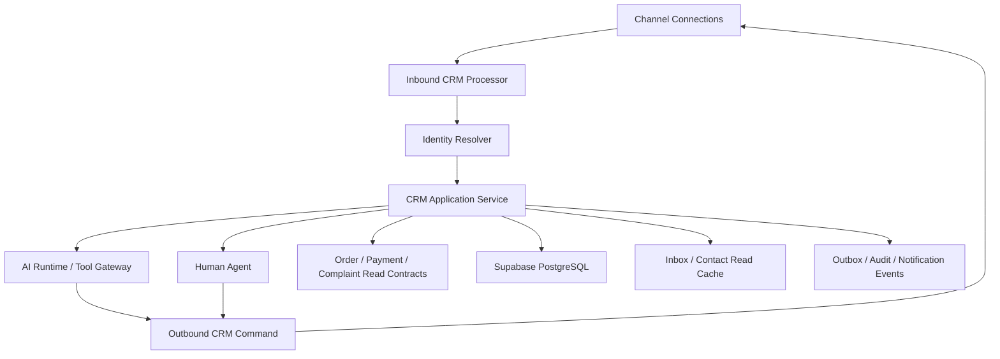
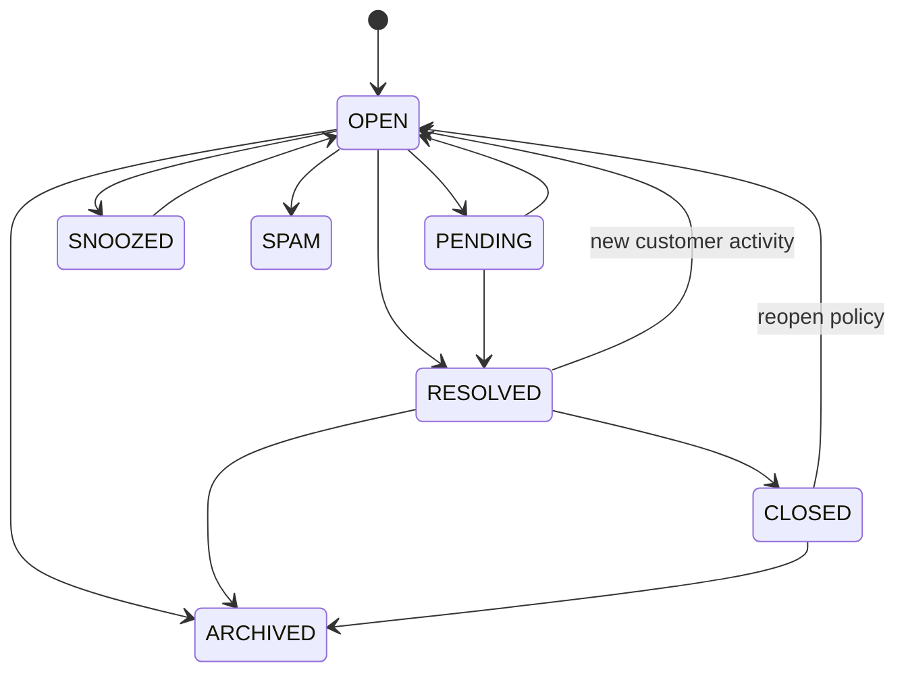
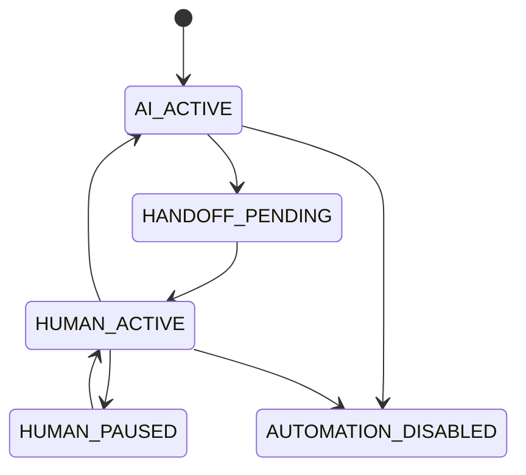
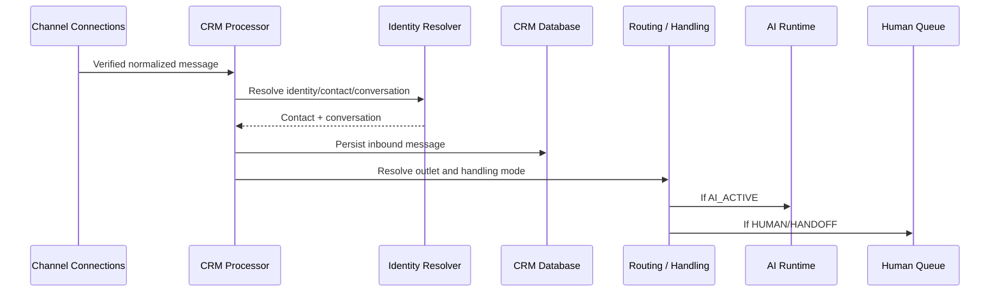

# Design Document: SelaluTeh CRM Inbox & Contacts

## Overview

```text
Verified channel message
→ Contact identity resolution
→ Contact
→ Conversation
→ Message
→ Outlet visibility
→ AI / Human handling
→ Outbound transport
```

CRM is the durable business record. Channel Connections owns transport.

# 1. Design Goals

- durable inbound messages;
- deterministic contact resolution;
- multi-channel contact identity;
- multi-outlet visibility and routing;
- conflict-free AI/human takeover;
- safe order/payment context;
- fast inbox and contact search;
- privacy, RLS, and audit by default;
- full product design with a small safe alpha slice.

# 2. Non-Goals

```text
provider credential storage
webhook verification implementation
outbound provider API calls
order/payment state ownership
generic notification delivery
generic audit storage
AI model orchestration
media binary storage
```

# 3. High-Level Architecture



# 4. Core Domain Model

## 4.1 Contact

```ts
type Contact = {
  id: string;
  workspaceId: string;
  displayName: string;
  normalizedName?: string;
  firstName?: string;
  lastName?: string;
  normalizedPhone?: string;
  normalizedEmail?: string;
  language?: string;
  timezone?: string;
  status:
    | "ACTIVE"
    | "INACTIVE"
    | "BLOCKED"
    | "MERGED"
    | "ANONYMIZED"
    | "ARCHIVED";
  mergedIntoContactId?: string;
  source?: string;
  version: number;
  createdAt: string;
  updatedAt: string;
};
```

## 4.2 Contact Channel Identity

```ts
type ContactChannelIdentity = {
  id: string;
  workspaceId: string;
  contactId: string;
  connectionId: string;
  channelType: string;
  providerUserId?: string;
  providerChatId?: string;
  normalizedPhone?: string;
  displayName?: string;
  status: "ACTIVE" | "INACTIVE" | "ARCHIVED";
  firstSeenAt: string;
  lastSeenAt: string;
};
```

## 4.3 Conversation

```ts
type Conversation = {
  id: string;
  workspaceId: string;
  contactId: string;
  connectionId: string;
  channelIdentityId: string;
  outletId?: string;

  status:
    | "OPEN"
    | "PENDING"
    | "SNOOZED"
    | "RESOLVED"
    | "CLOSED"
    | "SPAM"
    | "ARCHIVED";

  handlingMode:
    | "AI_ACTIVE"
    | "HUMAN_ACTIVE"
    | "HANDOFF_PENDING"
    | "HUMAN_PAUSED"
    | "AUTOMATION_DISABLED";

  assignedTeamId?: string;
  assignedMemberId?: string;
  priority: "LOW" | "NORMAL" | "HIGH" | "URGENT";

  unreadCount: number;
  lastMessageAt?: string;
  firstResponseDueAt?: string;
  nextResponseDueAt?: string;
  resolutionDueAt?: string;
  snoozedUntil?: string;

  version: number;
  createdAt: string;
  updatedAt: string;
};
```

## 4.4 Message

```ts
type Message = {
  id: string;
  workspaceId: string;
  conversationId: string;

  direction: "INBOUND" | "OUTBOUND" | "INTERNAL";
  actorType:
    | "CUSTOMER"
    | "HUMAN_MEMBER"
    | "AI_AGENT"
    | "SYSTEM"
    | "PROVIDER"
    | "AUTOMATION";

  actorId?: string;
  contentType:
    | "TEXT"
    | "IMAGE"
    | "DOCUMENT"
    | "AUDIO"
    | "VIDEO"
    | "LOCATION"
    | "INTERACTION"
    | "SYSTEM_EVENT"
    | "UNSUPPORTED";

  text?: string;
  structuredContent?: Record<string, unknown>;
  providerMessageId?: string;
  transportId?: string;
  transportStatus?: string;

  providerCreatedAt?: string;
  receivedAt: string;
  createdAt: string;
};
```

# 5. Data Model

## `contacts`

```text
id uuid pk
workspace_id uuid not null
display_name text not null
normalized_name text
first_name text
last_name text
normalized_phone text
normalized_email text
language text
timezone text
status text not null
merged_into_contact_id uuid
source text
version integer not null
created_by uuid
updated_by uuid
created_at
updated_at
archived_at
```

## `contact_channel_identities`

```text
id uuid pk
workspace_id uuid not null
contact_id uuid not null
connection_id uuid not null
channel_type text not null
provider_user_id text
provider_chat_id text
normalized_phone text
display_name text
status text not null
first_seen_at
last_seen_at
created_at
updated_at
```

## `contact_tags`

```text
id uuid pk
workspace_id uuid not null
name text not null
normalized_name text not null
color_token text nullable
status text not null
created_at
updated_at
```

## `contact_tag_assignments`

```text
workspace_id uuid not null
contact_id uuid not null
tag_id uuid not null
created_by uuid
created_at
unique(contact_id, tag_id)
```

## `contact_custom_field_definitions`

```text
id uuid pk
workspace_id uuid not null
name text not null
field_key text not null
field_type text not null
validation jsonb
visibility_policy jsonb
status text not null
version integer not null
created_at
updated_at
```

## `contact_custom_field_values`

```text
workspace_id uuid not null
contact_id uuid not null
field_definition_id uuid not null
value_json jsonb
version integer not null
updated_at
unique(contact_id, field_definition_id)
```

## `conversations`

```text
id uuid pk
workspace_id uuid not null
contact_id uuid not null
connection_id uuid not null
channel_identity_id uuid not null
outlet_id uuid nullable

status text not null
handling_mode text not null
assigned_team_id uuid nullable
assigned_member_id uuid nullable
priority text not null

unread_count integer not null
last_message_at timestamptz
first_response_due_at timestamptz
next_response_due_at timestamptz
resolution_due_at timestamptz
snoozed_until timestamptz

version integer not null
created_at
updated_at
resolved_at
closed_at
archived_at
```

## `messages`

```text
id uuid pk
workspace_id uuid not null
conversation_id uuid not null
direction text not null
actor_type text not null
actor_id text nullable
content_type text not null
text_content text nullable
structured_content jsonb nullable
provider_message_id text nullable
transport_id uuid nullable
provider_created_at timestamptz nullable
received_at timestamptz not null
created_at timestamptz not null
edited_at timestamptz nullable
```

## `conversation_assignments_history`

```text
id uuid pk
workspace_id uuid not null
conversation_id uuid not null
from_team_id uuid nullable
to_team_id uuid nullable
from_member_id uuid nullable
to_member_id uuid nullable
reason text nullable
actor_type text not null
actor_id text nullable
created_at
```

## `conversation_handoffs`

```text
id uuid pk
workspace_id uuid not null
conversation_id uuid not null
trigger_type text not null
reason_code text not null
requested_team_id uuid nullable
requested_member_id uuid nullable
status text not null
requested_at
accepted_at
completed_at
version integer not null
```

## `conversation_user_states`

```text
workspace_id uuid not null
conversation_id uuid not null
user_id uuid not null
last_read_message_id uuid nullable
last_read_at timestamptz nullable
is_following boolean not null
updated_at
unique(conversation_id, user_id)
```

## `conversation_summaries`

```text
id uuid pk
workspace_id uuid not null
conversation_id uuid not null
summary_type text not null
summary_text text not null
facts_json jsonb nullable
unresolved_json jsonb nullable
source_message_until_id uuid nullable
generated_by_model text nullable
generated_at timestamptz
expires_at timestamptz nullable
```

# 6. Contact Resolution

Resolution order:

```text
exact provider identity within connection
→ exact normalized phone/email within workspace when policy permits
→ existing contact mapping
→ create new contact
```

Never resolve solely by display name.

Potential duplicate flow:

```text
candidate scoring
→ review queue
→ authorized merge
```

# 7. Conversation Resolution

```text
contact + connection + channel identity
→ find eligible open conversation
→ otherwise create conversation
```

Eligibility may consider:

```text
status
provider thread/chat identity
last activity window
outlet context
explicit channel thread semantics
```

# 8. Conversation State Machines

Lifecycle:



Handling mode:



The two state machines are independent.

# 9. Inbound Message Flow



Persistence occurs before downstream AI/human processing whenever feasible.

# 10. Outbound Message Flow

```text
human or AI composes response
→ CRM validates conversation/handling/authorization
→ persist outbound message intent
→ Channel Connections sends
→ provider transport status updates CRM read model
```

CRM never sends INTERNAL notes to Channel Connections.

# 11. Inbox Read Model

A row should expose:

```text
conversation ID
contact name/avatar
channel
outlet
last message preview
last message time
unread count
assignment
team
handling mode
lifecycle status
priority
SLA state
order/payment indicators
handoff state
```

Indexes should support:

```text
workspace + outlet + status + last_message_at
workspace + assigned_member + status
workspace + handling_mode + status
workspace + unread + last_message_at
```

# 12. Assignment and Handoff

Assignment validation:

```text
member active?
→ workspace membership?
→ outlet scope?
→ permission?
→ team eligibility?
```

Handoff:

```text
AI_ACTIVE
→ HANDOFF_PENDING
→ assignment/fallback queue
→ HUMAN_ACTIVE
```

AI reply checks handling mode immediately before sending to avoid race conditions.

# 13. Smart Handoff

Trigger types:

```text
CUSTOMER_REQUEST
COMPLAINT
PAYMENT_ISSUE
REPEATED_FAILURE
LOW_CONFIDENCE
SAFETY_OR_POLICY
UNSUPPORTED_REQUEST
HIGH_PRIORITY_CUSTOMER
```

Smart handoff recommends or requests routing; it does not fabricate successful human acceptance.

# 14. AI Context and Memory

Context builder:

```text
workspace policy
outlet context
contact safe profile
current cart/order/payment summary
recent relevant messages
bounded conversation summary
published internal knowledge
```

Retention decision:

```text
AI working memory: 3 months
CRM operational records: retained according to data policy
```

Expired AI memory does not delete CRM message history.

# 15. Internal Notes and Collaboration

INTERNAL message rules:

```text
never transported externally
permission-scoped
outlet-scoped
audited
may contain mentions
AI access only when explicitly permitted
```

# 16. Linked Business Context

Conversation side panel consumes:

```text
current cart/order
payment status and payment link state
pickup outlet
complaint/ticket
recent orders
customer lifetime summary
```

CRM displays and links; authoritative mutations go through domain APIs.

# 17. Authorization

Suggested permissions:

```text
crm.contacts.read
crm.contacts.create
crm.contacts.update
crm.contacts.merge
crm.contacts.block
crm.contacts.import
crm.contacts.export

crm.conversations.read
crm.conversations.reply
crm.conversations.assign
crm.conversations.resolve
crm.conversations.archive
crm.conversations.manage_priority
crm.conversations.manage_handoff

crm.notes.create
crm.notes.read
crm.ai_assist.use
crm.activity.read
```

Repository context:

```ts
type CrmRepositoryContext = {
  workspaceId: string;
  allowedOutletIds?: string[];
  userId?: string;
};
```

# 18. API Design

## Contacts

```text
GET    /api/contacts
POST   /api/contacts
GET    /api/contacts/:contactId
PATCH  /api/contacts/:contactId
POST   /api/contacts/:contactId/merge
POST   /api/contacts/:contactId/block
POST   /api/contacts/:contactId/unblock
POST   /api/contacts/:contactId/tags
DELETE /api/contacts/:contactId/tags/:tagId
```

## Conversations

```text
GET    /api/conversations
GET    /api/conversations/:conversationId
PATCH  /api/conversations/:conversationId
POST   /api/conversations/:conversationId/assign
POST   /api/conversations/:conversationId/handoff
POST   /api/conversations/:conversationId/return-to-ai
POST   /api/conversations/:conversationId/snooze
POST   /api/conversations/:conversationId/resolve
POST   /api/conversations/:conversationId/reopen
POST   /api/conversations/:conversationId/archive
POST   /api/conversations/:conversationId/read
POST   /api/conversations/:conversationId/unread
```

## Messages and notes

```text
GET  /api/conversations/:conversationId/messages
POST /api/conversations/:conversationId/messages
POST /api/conversations/:conversationId/notes
POST /api/conversations/:conversationId/ai-suggestions
POST /api/conversations/:conversationId/summary
```

# 19. Error Model

```text
CONTACT_NOT_FOUND
CONTACT_DUPLICATE_IDENTITY
CONTACT_MERGE_CONFLICT
CONTACT_BLOCKED
CONTACT_ALREADY_MERGED

CONVERSATION_NOT_FOUND
CONVERSATION_ASSIGNMENT_INVALID
CONVERSATION_HANDOFF_CONFLICT
CONVERSATION_HANDLING_MODE_CONFLICT
CONVERSATION_INVALID_TRANSITION
CONVERSATION_SNOOZE_INVALID
CONVERSATION_OUTLET_SCOPE_DENIED

MESSAGE_NOT_FOUND
MESSAGE_DUPLICATE
MESSAGE_INTERNAL_ONLY
MESSAGE_SEND_NOT_ALLOWED
MESSAGE_TRANSPORT_UNAVAILABLE

PERMISSION_DENIED
OUTLET_SCOPE_DENIED
VERSION_CONFLICT
IDEMPOTENCY_CONFLICT
```

# 20. Chats Page Contract

Three-column desktop layout:

```text
Conversation list
→ active conversation
→ compact right context sidebar
```

The right sidebar may include:

```text
customer
outlet
AI/human state
assignment
current order
payment
recent orders
notes/tags
```

The sidebar should be hideable/minimizable and must not cover important conversation metadata.

# 21. Contacts Page Contract

```text
summary cards
search
status/channel/outlet/tag filters
contact table/cards
add contact
import/export
advanced filters
contact detail
merge/block/archive
activity
orders/conversations links
```

# 22. Cache and Search

Cache candidates:

```text
conversation list rows
unread counts
contact summary
conversation context panel
```

Invalidation:

```text
new message
status/handling change
assignment
outlet change
contact profile/tag update
order/payment/complaint event
```

Cache is never authorization authority.

# 23. Events and Notifications

CRM events:

```text
CONTACT_CREATED
CONTACT_UPDATED
CONTACT_MERGED
CONTACT_BLOCKED
CONVERSATION_CREATED
CONVERSATION_ASSIGNED
CONVERSATION_STATUS_CHANGED
CONVERSATION_HANDLING_CHANGED
HANDOFF_REQUESTED
HANDOFF_ACCEPTED
MESSAGE_RECEIVED
MESSAGE_CREATED
INTERNAL_NOTE_CREATED
CONVERSATION_SNOOZED
CONVERSATION_REOPENED
```

Notification consumers may use:

```text
new inbound
assignment
mention
handoff pending
SLA breach
conversation reopened
```

# 24. Security Threat Model

## Cross-Workspace or Outlet Access

```text
repository scope
service authorization
RLS
safe not-found errors
```

## Internal Note Leakage

```text
INTERNAL direction
separate transport command path
response serializers
security tests
```

## AI Reply During Human Takeover

```text
handling-mode check before generation
handling-mode check before send
conversation version
idempotent send
```

## Duplicate Message or Order Action

```text
provider ID uniqueness
message idempotency
business-command idempotency
```

## PII Leakage

```text
field permissions
redacted exports/logs
bounded AI context
no secrets/raw webhooks
```

# 25. Testing Strategy

## Unit

```text
identity normalization
contact matching
merge rules
conversation lifecycle
handling mode
assignment eligibility
unread calculations
message ordering
handoff triggers
memory retention
```

## Component

```text
Contact Service
Conversation Service
Message Service
Inbox Query Service
Assignment Service
Handoff Service
AI Context Builder
Contact Merge Service
```

## Integration

```text
Supabase / RLS
Channel Connections
Access Control
AI Tool Gateway
Orders
Payments
Complaints
Audit
Notifications
```

## Security

```text
cross-workspace/outlet
internal note leakage
PII/export leakage
AI scope bypass
forged actor context
blocked contact messaging
unauthorized merge/assignment
```

## Property

```text
duplicate provider message yields one CRM message
INTERNAL message never becomes outbound transport
HUMAN_ACTIVE prevents autonomous AI reply
merged contact references remain canonical
unread count never becomes negative
```

## Concurrency

```text
two assignments
handoff vs AI send
resolve vs inbound message
merge vs new message
read/unread updates
duplicate inbound workers
```

## Resilience

```text
Channel Connections unavailable
AI unavailable
Order/Payment service unavailable
notification failure
audit failure
cache failure
summary generation failure
```

# 26. Performance Targets

Initial targets:

```text
conversation list: < 300 ms backend
contact list: < 300 ms backend
conversation detail first page: < 350 ms backend
message pagination: < 250 ms backend
inbound durable persistence: < 5 seconds target
unread count update: < 5 seconds target
```

Targets are measured, not guaranteed.

# 27. Migration Strategy

```text
audit legacy contacts/chats/messages/takeover
→ define fresh Supabase CRM schema
→ migrate retained contact identities and conversations
→ map workspace/outlet/channel connection IDs
→ verify message order and deduplication
→ integrate AI/human handling mode
→ integrate order/payment context
→ disable Mongo CRM authority
```

# 28. Rollout Strategy

## Phase 1 — Alpha

```text
contacts
channel identities
conversations/messages
inbox views
unread
outlet visibility
assignment
AI/human handling
handoff
notes
order/payment context
```

## Phase 2 — Operations

```text
advanced filters
tags
contact merge
snooze
SLA
mentions
activity
import/export
```

## Phase 3 — Intelligence

```text
AI suggestions
summaries
smart handoff tuning
analytics contracts
advanced segmentation
```

# 29. Fastest Safe Alpha Slice

```text
workspace-scoped Contact
WhatsApp/Telegram identities
Conversation
Message
durable inbound integration
outbound reply contract
All/Mine/Unassigned/AI/Human/Handoff inboxes
unread/read
outlet context and visibility
member/team assignment
AI_ACTIVE/HANDOFF_PENDING/HUMAN_ACTIVE
manual handoff
basic smart handoff
internal notes
order/payment sidebar context
three-month AI memory boundary
RLS/security/concurrency/resilience tests
```

# 30. Definition of Done

```text
workspace and outlet isolation pass
contacts and channel identities resolve deterministically
inbound message durability proven
message deduplication proven
outbound idempotency proven
AI/human handling conflict prevention proven
handoff and assignment permissions proven
internal-note isolation proven
order/payment boundary proven
three-month AI memory policy enforced
audit/events/notifications idempotent
all release-gate tests pass
implementation status reflects repository reality
specs check passes
```
