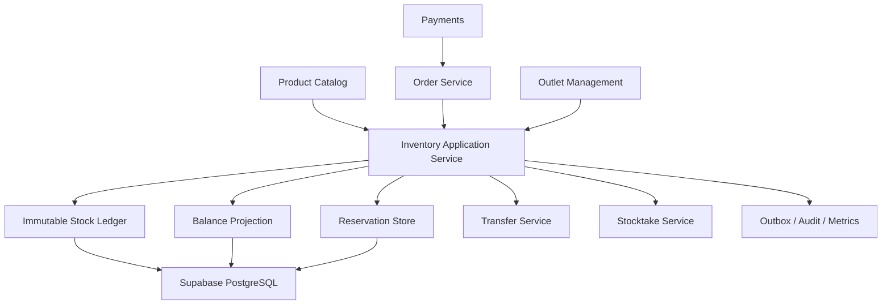
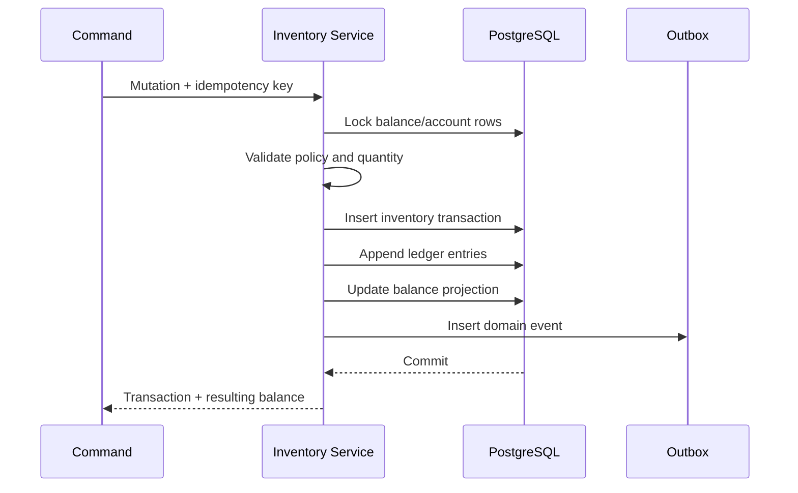
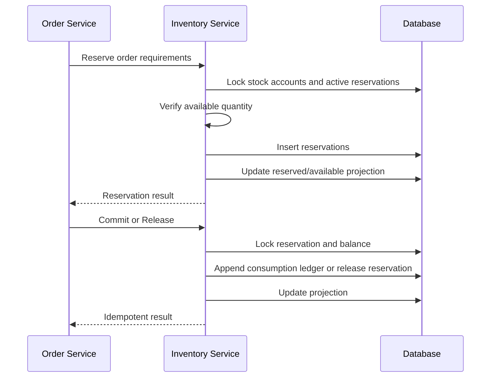

# Design Document: SelaluTeh Inventory & Stock Ledger

## Overview

```text
Product / Ingredient Definition
→ Outlet Stock Account
→ Inventory Transaction
→ Immutable Ledger Entry
→ Balance Projection
→ Reservation / Availability
→ Order Consumption or Release
```

The ledger is authoritative. Balance tables are fast projections.

# 1. Goals

- no silent stock overwrite;
- no oversell when negative stock is disabled;
- multi-outlet isolation;
- direct product stock and recipe-based stock;
- idempotent Order and Payment integration;
- traceable receipts, adjustments, waste, transfers, and stocktakes;
- fast operational reads;
- repairable projections;
- full product scope with an explicit alpha slice.

# 2. Non-Goals

```text
product catalog ownership
order lifecycle ownership
payment truth
full procurement suite
accounts payable
financial general ledger
supplier contracting
warehouse robotics
unrestricted AI stock mutation
```

# 3. High-Level Architecture



# 4. Core Domain Types

## Inventory Item

```ts
type InventoryItem = {
  id: string;
  workspaceId: string;
  code: string;
  name: string;
  type:
    | "FINISHED_GOOD"
    | "PRODUCT_VARIANT"
    | "INGREDIENT"
    | "PACKAGING"
    | "ADD_ON"
    | "SUPPLY"
    | "OTHER";
  baseUnitId: string;
  trackingMode: "NONE" | "DIRECT" | "RECIPE";
  batchTracking: boolean;
  expiryTracking: boolean;
  status: "DRAFT" | "ACTIVE" | "INACTIVE" | "ARCHIVED";
  version: number;
};
```

## Stock Account

```ts
type StockAccount = {
  id: string;
  workspaceId: string;
  outletId: string;
  inventoryItemId: string;
  status: "ACTIVE" | "INACTIVE" | "ARCHIVED";
  allowNegativeStock: boolean;
  lowStockThreshold?: string;
  reorderPoint?: string;
  targetLevel?: string;
  version: number;
};
```

## Balance Projection

```ts
type InventoryBalance = {
  workspaceId: string;
  stockAccountId: string;
  onHand: string;
  reserved: string;
  available: string;
  inTransit: string;
  lastLedgerSequence: number;
  version: number;
  recalculatedAt?: string;
};
```

## Reservation

```ts
type InventoryReservation = {
  id: string;
  workspaceId: string;
  outletId: string;
  orderId: string;
  orderItemId?: string;
  stockAccountId: string;
  quantity: string;
  unitId: string;
  status: "ACTIVE" | "COMMITTED" | "RELEASED" | "EXPIRED" | "CANCELLED";
  expiresAt: string;
  idempotencyKey: string;
  requirementSnapshot: Record<string, unknown>;
  version: number;
};
```

# 5. Data Model

## `inventory_items`

```text
id uuid pk
workspace_id uuid not null
code text not null
name text not null
normalized_name text not null
item_type text not null
base_unit_id uuid not null
tracking_mode text not null
batch_tracking boolean not null
expiry_tracking boolean not null
status text not null
version integer not null
created_at
updated_at
archived_at

unique(workspace_id, code)
```

## `inventory_units`

```text
id uuid pk
workspace_id uuid nullable
code text not null
name text not null
category text not null
decimal_scale integer not null
is_system boolean not null
status text not null
```

## `inventory_unit_conversions`

```text
id uuid pk
workspace_id uuid not null
inventory_item_id uuid nullable
from_unit_id uuid not null
to_unit_id uuid not null
factor numeric not null
rounding_mode text not null
version integer not null
created_at
updated_at
```

## `product_inventory_mappings`

```text
id uuid pk
workspace_id uuid not null
product_id uuid not null
variant_id uuid nullable
inventory_item_id uuid nullable
recipe_version_id uuid nullable
tracking_mode text not null
quantity_per_sale numeric not null
status text not null
version integer not null
created_at
updated_at
```

## `inventory_recipes`

```text
id uuid pk
workspace_id uuid not null
product_id uuid not null
variant_id uuid nullable
version_number integer not null
status text not null
effective_from timestamptz
created_at
superseded_at
```

## `inventory_recipe_components`

```text
id uuid pk
workspace_id uuid not null
recipe_id uuid not null
inventory_item_id uuid not null
quantity numeric not null
unit_id uuid not null
component_role text nullable
modifier_condition jsonb nullable
```

## `stock_accounts`

```text
id uuid pk
workspace_id uuid not null
outlet_id uuid not null
inventory_item_id uuid not null
status text not null
allow_negative_stock boolean not null
low_stock_threshold numeric nullable
reorder_point numeric nullable
target_level numeric nullable
safety_stock numeric nullable
version integer not null
created_at
updated_at
archived_at

unique(outlet_id, inventory_item_id)
```

## `inventory_transactions`

```text
id uuid pk
workspace_id uuid not null
transaction_type text not null
status text not null
source_type text not null
source_id text nullable
idempotency_key text not null
reason_code text nullable
notes text nullable
actor_type text not null
actor_id text nullable
correlation_id text nullable
effective_at timestamptz not null
posted_at timestamptz nullable
reversal_of_transaction_id uuid nullable
created_at

unique(workspace_id, idempotency_key)
```

## `inventory_ledger_entries`

```text
id uuid pk
workspace_id uuid not null
transaction_id uuid not null
stock_account_id uuid not null
outlet_id uuid not null
inventory_item_id uuid not null
movement_type text not null
quantity_delta numeric not null
unit_id uuid not null
ledger_sequence bigint not null
balance_after_on_hand numeric nullable
created_at

unique(stock_account_id, ledger_sequence)
```

Ledger rows are append-only through application permissions.

## `inventory_balances`

```text
workspace_id uuid not null
stock_account_id uuid pk
on_hand numeric not null
reserved numeric not null
available numeric not null
in_transit numeric not null
last_ledger_sequence bigint not null
version integer not null
recalculated_at timestamptz nullable
updated_at
```

## `inventory_reservations`

```text
id uuid pk
workspace_id uuid not null
outlet_id uuid not null
order_id uuid not null
order_item_id uuid nullable
stock_account_id uuid not null
quantity numeric not null
unit_id uuid not null
status text not null
expires_at timestamptz not null
idempotency_key text not null
requirement_snapshot jsonb not null
version integer not null
created_at
updated_at
committed_at nullable
released_at nullable

unique(workspace_id, idempotency_key)
```

## `inventory_transfers`

```text
id uuid pk
workspace_id uuid not null
source_outlet_id uuid not null
destination_outlet_id uuid not null
status text not null
requested_by uuid not null
approved_by uuid nullable
requested_at
approved_at
dispatched_at
closed_at
version integer not null
```

## `inventory_transfer_items`

```text
id uuid pk
workspace_id uuid not null
transfer_id uuid not null
inventory_item_id uuid not null
source_stock_account_id uuid not null
destination_stock_account_id uuid not null
requested_quantity numeric not null
dispatched_quantity numeric not null
received_quantity numeric not null
unit_id uuid not null
variance_reason text nullable
```

## `inventory_stocktakes`

```text
id uuid pk
workspace_id uuid not null
outlet_id uuid not null
status text not null
snapshot_at timestamptz not null
blind_count boolean not null
scope_json jsonb not null
created_by uuid not null
posted_by uuid nullable
version integer not null
created_at
posted_at
```

## `inventory_stocktake_lines`

```text
id uuid pk
workspace_id uuid not null
stocktake_id uuid not null
stock_account_id uuid not null
expected_quantity numeric not null
counted_quantity numeric nullable
variance_quantity numeric nullable
counted_by uuid nullable
counted_at timestamptz nullable
```

# 6. Ledger Invariants

```text
posted ledger entries are immutable
correction = new compensating transaction
every mutation has idempotency key
quantity is always in item base unit
ledger sequence is monotonic per stock account
projection sequence cannot exceed ledger sequence
```

Core equations:

```text
on_hand =
  sum(posted quantity_delta affecting physical stock)

reserved =
  sum(active reservation quantity)

available =
  on_hand - reserved
```

For transfers:

```text
source dispatch:
on_hand decreases
in_transit increases

destination receipt:
in_transit decreases
destination on_hand increases
```

# 7. Transaction Posting



No external notification or analytics call is required inside the ledger transaction.

# 8. Reservation Flow



Alpha policy:

```text
reserve when confirmed order enters payment link generation
preserve after payment success
commit at outlet approval
release on expiry, rejection, or cancellation
```

# 9. Recipe Requirements

For each order item:

```text
product + variant + modifiers
→ resolve recipe version
→ expand component quantities
→ convert to base units
→ store requirement snapshot
→ reserve component stock
```

Historical requirement snapshots are not recalculated after recipe changes.

# 10. Availability Contract

Input:

```ts
type AvailabilityRequest = {
  workspaceId: string;
  outletId: string;
  productId: string;
  variantId?: string;
  selections?: Record<string, string[]>;
  quantity: number;
};
```

Output:

```ts
type AvailabilityResult = {
  available: boolean;
  maxSellableQuantity?: number;
  reasonCode:
    | "AVAILABLE"
    | "OUT_OF_STOCK"
    | "INSUFFICIENT_COMPONENT"
    | "INVENTORY_NOT_CONFIGURED"
    | "STOCK_ACCOUNT_INACTIVE"
    | "OUTLET_NOT_ACCEPTING_ORDERS"
    | "PRODUCT_NOT_ORDERABLE";
  requirements: Array<{
    inventoryItemId: string;
    required: string;
    available: string;
  }>;
};
```

Customer-facing tools may omit sensitive exact quantities.

# 11. Transfer Design

```text
REQUESTED
→ APPROVED
→ DISPATCHED
→ PARTIALLY_RECEIVED / RECEIVED
→ CLOSED
```

Dispatch and receipt are separate immutable inventory transactions.

Transfer invariants:

```text
received <= dispatched
resolved quantity = received + returned + written off
closure only when all dispatched quantity is resolved
```

# 12. Stocktake Design

Snapshot policy options:

```text
hard cutoff
movement-aware snapshot
temporary movement freeze
```

Alpha may use a movement-aware snapshot with warnings.

Posting:

```text
counted - expected
→ STOCKTAKE_VARIANCE transaction
→ ledger entries
→ projection update
```

# 13. Batch and Expiry

Optional batch records:

```text
batch ID
stock account
lot code
received quantity
remaining quantity
manufactured date
expiry date
status
```

FEFO selection may be used for ingredient consumption.

# 14. Authorization

Suggested permissions:

```text
inventory.read
inventory.read_cost
inventory.configure
inventory.receive
inventory.adjust
inventory.record_waste
inventory.reserve_service
inventory.release_service
inventory.commit_service
inventory.transfer_request
inventory.transfer_approve
inventory.transfer_dispatch
inventory.transfer_receive
inventory.stocktake_create
inventory.stocktake_count
inventory.stocktake_post
inventory.override_negative
inventory.reconcile
inventory.export
```

AI has read-only tool permission and no mutation permission.

# 15. API Design

## Items and accounts

```text
GET    /api/inventory/items
POST   /api/inventory/items
GET    /api/inventory/items/:itemId
PATCH  /api/inventory/items/:itemId

GET    /api/outlets/:outletId/inventory
POST   /api/outlets/:outletId/inventory/accounts
PATCH  /api/inventory/accounts/:accountId
```

## Transactions

```text
POST /api/inventory/receipts
POST /api/inventory/adjustments
POST /api/inventory/waste
POST /api/inventory/returns
POST /api/inventory/transactions/:transactionId/reverse
GET  /api/inventory/ledger
```

## Reservations

```text
POST /api/inventory/reservations
POST /api/inventory/reservations/replace
POST /api/inventory/reservations/:reservationId/release
POST /api/inventory/reservations/:reservationId/commit
GET  /api/inventory/reservations
```

## Transfers and stocktakes

```text
GET  /api/inventory/transfers
POST /api/inventory/transfers
POST /api/inventory/transfers/:id/approve
POST /api/inventory/transfers/:id/dispatch
POST /api/inventory/transfers/:id/receive

GET  /api/inventory/stocktakes
POST /api/inventory/stocktakes
POST /api/inventory/stocktakes/:id/counts
POST /api/inventory/stocktakes/:id/post
```

## Availability and reconciliation

```text
POST /api/inventory/availability/check
POST /api/inventory/reconciliation/check
POST /api/inventory/reconciliation/rebuild
```

# 16. Error Model

```text
INVENTORY_ITEM_NOT_FOUND
INVENTORY_ACCOUNT_NOT_FOUND
INVENTORY_ACCOUNT_INACTIVE
INVENTORY_MAPPING_MISSING
INVENTORY_UNIT_INCOMPATIBLE
INVENTORY_INSUFFICIENT_STOCK
INVENTORY_NEGATIVE_STOCK_DENIED
INVENTORY_RESERVATION_CONFLICT
INVENTORY_RESERVATION_EXPIRED
INVENTORY_ALREADY_COMMITTED
INVENTORY_TRANSFER_INVALID_STATE
INVENTORY_TRANSFER_QUANTITY_INVALID
INVENTORY_STOCKTAKE_INVALID_STATE
INVENTORY_LEDGER_INTEGRITY_ERROR
INVENTORY_PROJECTION_STALE
INVENTORY_RECONCILIATION_REQUIRED
OUTLET_SCOPE_DENIED
PERMISSION_DENIED
VERSION_CONFLICT
IDEMPOTENCY_CONFLICT
```

# 17. Admin UI Contracts

Inventory overview:

```text
summary cards
outlet selector
search/filter
item table
on hand
reserved
available
in transit
low/out of stock
last movement
actions
```

Item detail tabs:

```text
Overview
Outlet Balances
Ledger
Reservations
Recipes / Product Mappings
Batches
Activity
```

Operational dialogs:

```text
Receive Stock
Adjust Stock
Record Waste
Create Transfer
Dispatch Transfer
Receive Transfer
Create Stocktake
Post Stocktake
Reverse Transaction
Rebuild Projection
```

No Edit Ledger Entry action exists.

# 18. Events

```text
INVENTORY_ITEM_CREATED
STOCK_ACCOUNT_CREATED
STOCK_RECEIVED
STOCK_ADJUSTED
STOCK_WASTE_RECORDED
INVENTORY_RESERVED
INVENTORY_RESERVATION_RELEASED
INVENTORY_CONSUMED
LOW_STOCK_ENTERED
LOW_STOCK_CLEARED
TRANSFER_REQUESTED
TRANSFER_DISPATCHED
TRANSFER_RECEIVED
STOCKTAKE_POSTED
INVENTORY_PROJECTION_REBUILT
INVENTORY_INTEGRITY_CONFLICT
```

# 19. Security Threat Model

## Balance Tampering

```text
no direct balance endpoint
ledger-backed service
append-only permissions
database constraints
audit
```

## Oversell Race

```text
row/advisory locks
transactional available check
versioned balances
idempotent reservation
```

## Duplicate Order Events

```text
source idempotency key
reservation/commit/release state machine
unique constraints
```

## Cross-Outlet Access

```text
workspace + outlet repository scope
RLS
safe not-found errors
```

## AI Mutation

```text
read-only tools
Tool Gateway allowlist
no adjustment/receipt/transfer/stocktake tools
```

# 20. Reconciliation

Rebuild algorithm:

```text
sum posted physical ledger deltas
+ calculate active reservations
+ calculate unresolved in-transit
→ expected projection
→ compare stored projection
→ report or rebuild
```

Ledger entries are never changed during repair.

# 21. Testing Strategy

## Unit

```text
unit conversion
tracking mode
ledger movement rules
balance equations
reservation lifecycle
availability reasons
transfer lifecycle
stocktake variance
negative-stock policy
```

## Component

```text
Inventory Transaction Service
Reservation Service
Availability Service
Transfer Service
Stocktake Service
Reconciliation Service
Recipe Requirement Resolver
```

## Integration

```text
Supabase / RLS
Product Catalog
Order
Payments
Outlet Management
Access Control
Audit
Notifications
```

## Property

```text
posted ledger is immutable
on_hand equals posted physical deltas
available equals on_hand minus active reserved
duplicate command has one effect
no oversell under negative-stock-disabled policy
reversal restores net quantity
```

## Concurrency

```text
two reservations
commit vs release
receipt vs stocktake
transfer receive vs cancel
adjustment vs reservation
projection rebuild vs posting
```

## Resilience

```text
DB failure before commit
outbox failure
Order event retry
Payment event retry
scheduler duplicate
cache failure
reconciliation crash/restart
```

# 22. Performance Targets

Initial targets:

```text
availability check: < 150 ms backend typical
reservation command: < 300 ms backend typical
inventory list: < 300 ms backend
ledger first page: < 350 ms backend
projection rebuild: bounded by outlet/item batch
```

These are engineering targets, not guarantees.

# 23. Migration Strategy

```text
audit existing stock fields and flows
→ define inventory items and units
→ map products/variants
→ create outlet stock accounts
→ generate migration/opening-balance transactions
→ validate negative and missing values
→ enable reservations
→ cut Order integration
→ disable legacy stock authority
→ run reconciliation
```

# 24. Rollout Strategy

## Phase 1 — Alpha

```text
direct product/variant stock
ledger
balances
receipts
adjustments
reservations
release/commit
availability
low stock
overview/detail
```

## Phase 2 — Operational Inventory

```text
waste
returns
transfers
stocktakes
batch/expiry
reconciliation UI
```

## Phase 3 — Recipe and Intelligence

```text
ingredients
recipe versions
modifier consumption
cost valuation
reorder suggestions
procurement integration
```

# 25. Fastest Safe Alpha Slice

```text
inventory items and units
product direct mappings
outlet stock accounts
append-only ledger
balance projection
opening balance
receipt
adjustment
reservation
expiry/release
commit at outlet approval
availability reason codes
low stock
overview/item/ledger views
RLS and authorization
idempotency/concurrency
reconciliation
Order/Payment E2E
```

# 26. Definition of Done

```text
ledger immutability proven
balance equations proven
no oversell proven
duplicate command one effect proven
reservation/payment/order flow proven
product availability integration proven
workspace/outlet isolation proven
AI mutation denied
projection rebuild proven
audit/events/metrics/runbooks exist
all release-gate tests pass
implementation status reflects repository reality
specs check passes
```
