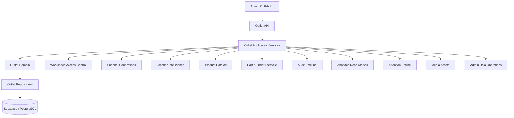
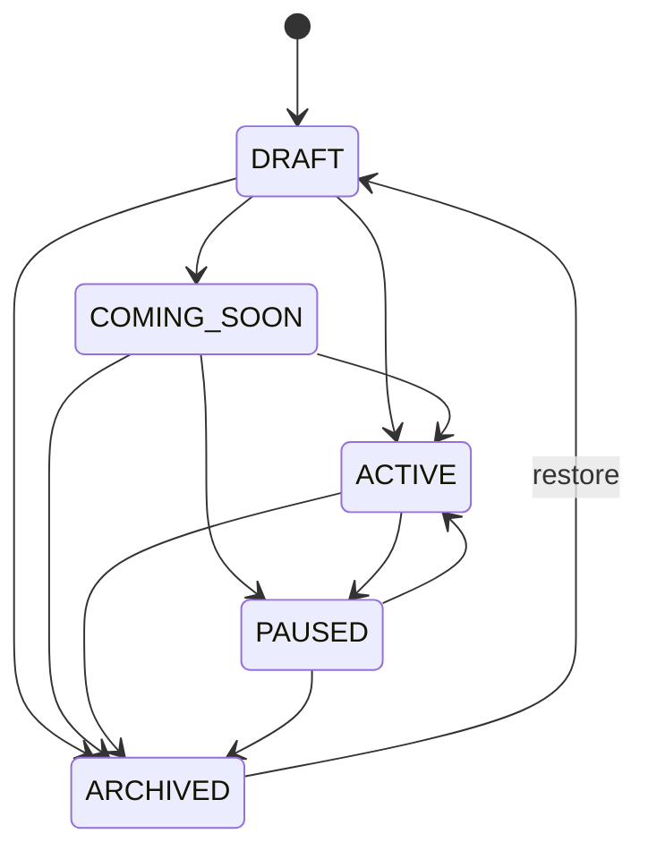

# Design Document: SelaluTeh Outlet Management and Operations

## 1. Overview

Dokumen ini mendesain domain outlet lengkap untuk SelaluTeh Marketplace. Outlet bukan sekadar alamat cabang; outlet adalah unit operasional yang mempunyai lifecycle, kemampuan layanan, jam operasional, penerimaan order, hubungan channel, manager/team, location reference, health summary, dan event integration.

Target arsitektur:

```text
Platform
→ Workspace / Business Account / Franchise Owner
→ Many Outlets
→ Each outlet has operational policies and scoped data
```

## 2. Design Goals

1. Aman untuk multi-workspace dan multi-outlet.
2. Status outlet tidak ambigu.
3. Order acceptance dapat dijelaskan melalui reason codes.
4. Outlet dapat menggunakan channel workspace yang sama.
5. Satu default AI agent dapat melayani banyak outlet dengan optional override.
6. Jam operasional dan special closure konsisten terhadap timezone.
7. Perubahan aman terhadap concurrency dan dapat diaudit.
8. UI Outlets beserta seluruh popup/state mendapat backend contract yang jelas.
9. Domain lain diintegrasikan melalui contract, bukan diduplikasi.
10. Siap berkembang dari alpha ke production franchise tanpa rewrite besar.

## 3. Non-Goals

Spec ini tidak mendesain:

```text
provider OAuth credentials
Telegram/WhatsApp webhook implementation
geocoding dan nearest-outlet algorithm
product catalog internals
inventory ledger
cart/order lifecycle internals
payment gateway
immutable audit storage internals
analytics aggregation internals
media upload/storage internals
generic export job engine
```

## 4. Authority Map



## 5. Architectural Layers

```text
Route / Controller
→ Request schema and authorization context
→ Application use case
→ Domain policy / state machine
→ Repository and external contracts
→ Events / audit / cache invalidation
```

Routes remain thin. Business rules must not live in React, routes, or provider adapters.

## 6. Module Structure

Recommended structure:

```text
server/src/modules/outlets/
├── domain/
│   ├── outlet.entity.js
│   ├── outlet-status.js
│   ├── outlet-health.js
│   ├── outlet-errors.js
│   ├── outlet-events.js
│   ├── operating-hours.js
│   ├── special-hours.js
│   ├── open-state.js
│   ├── order-acceptance-policy.js
│   ├── outlet-capabilities.js
│   └── outlet-channel-policy.js
├── application/
│   ├── create-outlet.use-case.js
│   ├── update-outlet.use-case.js
│   ├── change-outlet-status.use-case.js
│   ├── duplicate-outlet.use-case.js
│   ├── archive-outlet.use-case.js
│   ├── restore-outlet.use-case.js
│   ├── update-operating-hours.use-case.js
│   ├── update-special-hours.use-case.js
│   ├── update-service-settings.use-case.js
│   ├── assign-outlet-manager.use-case.js
│   ├── update-channel-policy.use-case.js
│   ├── evaluate-order-acceptance.use-case.js
│   ├── list-outlets.query.js
│   └── get-outlet-detail.query.js
├── infrastructure/
│   ├── outlet.repository.js
│   ├── operating-hours.repository.js
│   ├── special-hours.repository.js
│   ├── outlet-channel-policy.repository.js
│   ├── outlet-cache.js
│   └── outlet-event-publisher.js
├── contracts/
│   ├── access-control.contract.js
│   ├── location.contract.js
│   ├── channel-connection.contract.js
│   ├── analytics.contract.js
│   ├── audit.contract.js
│   ├── media.contract.js
│   └── admin-jobs.contract.js
├── api/
│   ├── outlet.routes.js
│   ├── outlet.controllers.js
│   ├── outlet.schemas.js
│   └── outlet.presenters.js
└── index.js
```

If the current backend is still layer-based rather than module-based, preserve existing conventions while keeping the same responsibility boundaries.

## 7. Status Model

### 7.1 Operational Status

```text
DRAFT
COMING_SOON
ACTIVE
PAUSED
ARCHIVED
```



Rules:

- `DRAFT`: setup belum lengkap; tidak menerima order.
- `COMING_SOON`: dapat ditampilkan ke publik sesuai policy; tidak menerima order.
- `ACTIVE`: dapat menerima order jika seluruh acceptance rule terpenuhi.
- `PAUSED`: tidak menerima order baru; order berjalan tetap dapat diproses.
- `ARCHIVED`: tidak muncul di operasi normal; histori tetap tersedia.

### 7.2 Health Status

```text
HEALTHY
NEEDS_ATTENTION
DEGRADED
OFFLINE
UNKNOWN
```

Health is derived, not manually used as lifecycle replacement.

### 7.3 Computed Open State

```text
OPEN
CLOSED
OPENING_SOON
CLOSING_SOON
UNKNOWN
```

### 7.4 Order Acceptance Result

```ts
type OrderAcceptanceResult = {
  allowed: boolean;
  reasonCode:
    | 'OUTLET_NOT_ACTIVE'
    | 'OUTLET_PAUSED'
    | 'OUTLET_ARCHIVED'
    | 'ORDERS_DISABLED'
    | 'PICKUP_DISABLED'
    | 'OUTSIDE_OPERATING_HOURS'
    | 'SPECIAL_CLOSURE'
    | 'CHANNEL_DISABLED_FOR_OUTLET'
    | 'BLOCKING_HEALTH_ISSUE'
    | 'LOCATION_NOT_READY'
    | 'ALLOWED';
  evaluatedAt: string;
  nextEligibleAt?: string;
  policyVersion: string;
};
```

## 8. Core Data Model

### 8.1 `outlets`

```text
id uuid primary key
workspace_id uuid not null
name text not null
code text not null
slug text nullable
description text nullable
phone text nullable
email text nullable
timezone text not null
region_id uuid nullable
city text nullable
address_summary text nullable
operational_status text not null
health_status text not null default UNKNOWN
accepts_orders boolean not null default false
pickup_enabled boolean not null default true
primary_manager_user_id uuid nullable
primary_media_asset_id uuid nullable
canonical_location_id uuid nullable
default_agent_override_id uuid nullable
metadata jsonb not null default {}
version bigint not null default 1
archived_at timestamptz nullable
created_at timestamptz not null
updated_at timestamptz not null
```

Constraints:

```text
unique(workspace_id, code)
unique(workspace_id, slug) where slug is not null
valid timezone
archived_at required when status ARCHIVED
```

### 8.2 `outlet_service_settings`

```text
outlet_id uuid primary key
workspace_id uuid not null
pickup_enabled boolean
delivery_enabled boolean default false
dine_in_enabled boolean default false
group_order_enabled boolean default false
preorder_enabled boolean default false
default_prep_minutes integer
capacity_state text
order_acceptance_policy jsonb
version bigint
updated_at timestamptz
```

### 8.3 `outlet_operating_hours`

```text
id uuid
workspace_id uuid
outlet_id uuid
day_of_week smallint
opens_at time
closes_at time
sequence smallint
is_closed boolean
created_at
updated_at
```

Multiple intervals per day are allowed.

### 8.4 `outlet_special_hours`

```text
id uuid
workspace_id uuid
outlet_id uuid
date date
is_closed boolean
opens_at time nullable
closes_at time nullable
reason text nullable
customer_note text nullable
version bigint
created_at
updated_at
```

### 8.5 `outlet_channel_policies`

This table stores assignment/policy only. Credential and provider connection state remain external.

```text
id uuid
workspace_id uuid
outlet_id uuid
platform_connection_id uuid
enabled_for_outlet boolean
accepts_chats boolean
accepts_orders boolean
routing_enabled boolean
agent_override_id uuid nullable
human_team_id uuid nullable
outside_hours_mode text
version bigint
created_at
updated_at
```

### 8.6 `outlet_tags`

```text
workspace_id
outlet_id
tag_id
created_at
created_by
```

### 8.7 `outlet_domain_outbox`

Recommended when events must be reliably published.

```text
event_id
workspace_id
outlet_id
event_type
payload
schema_version
status
attempt_count
occurred_at
published_at
```

## 9. External References

Outlet record stores references, not duplicated ownership:

```text
primary_manager_user_id
primary_media_asset_id
canonical_location_id
default_agent_override_id
```

Every reference must be validated against workspace ownership and external domain status.

## 10. Create Outlet Flow

```text
Authorize outlet.create
→ validate workspace
→ normalize name/code/slug
→ validate timezone and region
→ create DRAFT/COMING_SOON outlet
→ initialize service settings and schedule template
→ emit OutletCreated
→ audit
→ invalidate workspace outlet list cache
→ return setup checklist
```

Setup checklist example:

```ts
type OutletSetupChecklist = {
  profileComplete: boolean;
  managerAssigned: boolean;
  locationVerified: boolean;
  operatingHoursConfigured: boolean;
  atLeastOneChannelEnabled: boolean;
  pickupConfigured: boolean;
  productAvailabilityConfigured: boolean;
  eligibleForActivation: boolean;
  missing: string[];
};
```

## 11. Activation Policy

Activation may require configurable prerequisites:

```text
profile complete
valid timezone
operating hours configured
pickup settings configured
canonical location verified
manager assigned (optional policy)
at least one supported channel (optional policy)
products assigned (optional policy)
```

Activation returns explicit missing prerequisites rather than silently failing.

## 12. Update and Concurrency

All important updates carry:

```text
expectedVersion
idempotencyKey where relevant
reason for sensitive actions
```

Database update pattern:

```sql
UPDATE outlets
SET ..., version = version + 1, updated_at = now()
WHERE id = :id
  AND workspace_id = :workspaceId
  AND version = :expectedVersion;
```

No rows updated means version conflict or missing access.

## 13. Pause, Resume, Archive, Restore

### Pause

- set operational status PAUSED;
- set accepts_orders false;
- invalidate acceptance cache;
- emit event;
- do not cancel existing orders.

### Resume

- evaluate activation prerequisites;
- set ACTIVE only when valid;
- restore accepts_orders according to explicit command/policy.

### Archive

- require reason and confirmation;
- block new orders;
- preserve historical references;
- disable outlet-channel policies;
- keep canonical location/history;
- optionally schedule cleanup of non-historical drafts through external domains.

### Restore

- restore to DRAFT by default;
- require revalidation before ACTIVE.

## 14. Duplicate Outlet Design

Duplicate uses preview and allowlist:

```text
copy profile basics
copy service capability template
copy regular hours
copy selected tags
optionally request Product Catalog assignment copy
```

Never copy:

```text
orders
payments
contacts
messages
credentials
webhook state
alerts
analytics
activity history
customer data
```

## 15. Operating Hours Design

### Weekly schedule validation

- day 0–6;
- ordered non-overlapping intervals;
- explicit closed days;
- timezone required;
- overnight interval policy documented.

### Special hour precedence

```text
special closure/opening
→ regular weekly schedule
→ unknown if no schedule
```

### Open state cache

Cache TTL must not exceed `next_transition_at`.

## 16. Channel Assignment Design

The popup “Connected Channels” on Outlets means:

```text
Is this existing workspace connection enabled for this outlet?
Can it receive chats?
Can it receive orders?
Which routing/agent policy applies?
```

It does not mean each outlet must own separate credentials.

Resolution:

```text
workspace connection is CONNECTED
AND outlet channel policy enabled
AND accepts_orders true for commerce
AND outlet order acceptance allowed
```

Credential actions such as OAuth, reconnect, reauthorize, or disconnect provider belong to Connected Platforms/Channel Connections.

## 17. AI Agent Resolution

```text
channel policy agent override
→ outlet default override
→ workspace default agent
```

Every resolved agent must pass AI Scope Security and Tool Gateway. Outlet configuration cannot broaden immutable platform scope.

## 18. Location Integration

Admin flow:

```text
Outlets UI → Location Intelligence resolve Maps URL
→ preview → confirm canonical location
→ outlet stores canonical_location_id/reference
```

Customer nearest-outlet flow is outside this service.

## 19. Manager and Access Integration

Outlet service asks Workspace Access Control to:

- validate manager membership;
- validate assign permission;
- resolve manager summary;
- revoke/mark invalid references when membership becomes inactive.

Assignment does not bypass access policies.

## 20. Health Aggregation

Recommended health input categories:

```text
CHANNEL_CONNECTION
WEBHOOK_DELIVERY
ORDER_ACCEPTANCE
LOCATION_VERIFICATION
OPERATING_HOURS
PAYMENT_ROUTING
PRINTER_OR_DEVICE_FUTURE
INVENTORY_FUTURE
```

Health aggregation returns:

```ts
type OutletHealthSummary = {
  status: 'HEALTHY'|'NEEDS_ATTENTION'|'DEGRADED'|'OFFLINE'|'UNKNOWN';
  highestSeverity?: 'info'|'warning'|'critical';
  activeIssueCount: number;
  reasons: Array<{ code: string; severity: string; source: string }>;
  evaluatedAt: string;
};
```

## 21. List Query Design

Example:

```http
GET /api/outlets?search=samarinda&status=ACTIVE&health=HEALTHY&region_id=...&channel=whatsapp&open_state=OPEN&sort=-updated_at&limit=24&cursor=...
```

Response:

```json
{
  "data": [],
  "meta": {
    "nextCursor": null,
    "total": 0,
    "hasEverCreatedOutlet": true,
    "appliedFilters": {},
    "lastUpdatedAt": "2026-06-22T00:00:00Z"
  }
}
```

`hasEverCreatedOutlet=false` supports “No outlets yet”; true with zero result supports “No results match filters”.

## 22. Detail Read Model

The selected outlet drawer may consume a composed read model:

```ts
type OutletDetailView = {
  outlet: OutletProfile;
  lifecycle: OutletLifecycleSummary;
  health: OutletHealthSummary;
  openState: OpenStateSummary;
  setup: OutletSetupChecklist;
  manager?: ManagerSummary;
  channels: OutletChannelSummary[];
  location?: OutletLocationSummary;
  metrics?: { available: boolean; lastUpdatedAt?: string; data?: object };
  recentActivity?: { available: boolean; items?: object[] };
  permissions: string[];
  disabledActions: Record<string,string>;
  version: number;
};
```

## 23. API Design

### Core

```text
GET    /api/outlets
POST   /api/outlets
GET    /api/outlets/:outletId
PATCH  /api/outlets/:outletId
POST   /api/outlets/:outletId/status
POST   /api/outlets/:outletId/duplicate
POST   /api/outlets/:outletId/archive
POST   /api/outlets/:outletId/restore
```

### Operations

```text
GET    /api/outlets/:outletId/setup-checklist
GET    /api/outlets/:outletId/order-acceptance
PATCH  /api/outlets/:outletId/service-settings
GET    /api/outlets/:outletId/operating-hours
PUT    /api/outlets/:outletId/operating-hours
GET    /api/outlets/:outletId/special-hours
POST   /api/outlets/:outletId/special-hours
PATCH  /api/outlets/:outletId/special-hours/:id
DELETE /api/outlets/:outletId/special-hours/:id
```

### Assignment and policy

```text
PUT /api/outlets/:outletId/manager
GET /api/outlets/:outletId/channels
PUT /api/outlets/:outletId/channels/:connectionId
PUT /api/outlets/:outletId/ai-policy
PUT /api/outlets/:outletId/tags
```

### Composed reads

```text
GET /api/outlets/:outletId/summary
GET /api/outlets/:outletId/activity
GET /api/outlets/:outletId/health
GET /api/outlets/:outletId/metrics
```

Activity/metrics endpoints may proxy or compose external read contracts rather than own storage.

## 24. Error Codes

```text
OUTLET_NOT_FOUND
OUTLET_ACCESS_DENIED
OUTLET_CODE_CONFLICT
OUTLET_SLUG_CONFLICT
OUTLET_INVALID_STATUS
OUTLET_INVALID_STATUS_TRANSITION
OUTLET_ACTIVATION_REQUIREMENTS_NOT_MET
OUTLET_VERSION_CONFLICT
OUTLET_ARCHIVE_BLOCKED
OUTLET_ALREADY_ARCHIVED
OUTLET_LOCATION_NOT_VERIFIED
OUTLET_TIMEZONE_INVALID
OUTLET_HOURS_INVALID
OUTLET_SPECIAL_HOURS_CONFLICT
OUTLET_CHANNEL_CONNECTION_NOT_FOUND
OUTLET_CHANNEL_DISABLED
OUTLET_MANAGER_INVALID
OUTLET_ORDERS_DISABLED
OUTLET_OUTSIDE_OPERATING_HOURS
OUTLET_BULK_PARTIAL_FAILURE
OUTLET_IDEMPOTENCY_CONFLICT
```

## 25. UI/UX State Mapping

| UI element/state | Backend contract |
|---|---|
| Add Outlet drawer | create + setup checklist |
| Edit Outlet drawer | detail + PATCH with version |
| Export modal | Admin Data Operations using outlet export schema |
| More Filters | list query/filter metadata |
| Bulk selection bar | domain bulk action contract + generic job engine |
| Three-dot action menu | permissions + disabled action reasons |
| Pause/archive confirm | lifecycle commands with reason/version/idempotency |
| Connected Channels | outlet channel policies + external connection health |
| Channel Settings | accepts chat/order, routing, agent/team override |
| Webhooks tab | external Channel Connections read model |
| Activity tab | external Audit Timeline read model |
| Operating Hours modal | regular/special hours APIs |
| Needs Attention card | health and active alerts |
| KPI and 7-day chart | Analytics read model |
| Empty state | hasEverCreatedOutlet=false |
| No-results state | total=0 with active filters |
| Loading skeleton | normal request state; no special backend domain |
| Conflict dialog | OUTLET_VERSION_CONFLICT with latest version metadata |

## 26. Bulk Operations

Domain supports action validation; generic job engine supports execution tracking.

Supported future actions:

```text
ACTIVATE
PAUSE
ARCHIVE
ASSIGN_MANAGER
ADD_TAGS
REMOVE_TAGS
ENABLE_CHANNEL_POLICY
DISABLE_CHANNEL_POLICY
APPLY_HOURS_TEMPLATE
```

Each item returns success/failure. Large batches run asynchronously.

## 27. Audit Events

```text
OUTLET_CREATED
OUTLET_PROFILE_UPDATED
OUTLET_STATUS_CHANGED
OUTLET_ARCHIVED
OUTLET_RESTORED
OUTLET_DUPLICATED
OUTLET_MANAGER_ASSIGNED
OUTLET_MANAGER_REMOVED
OUTLET_SERVICE_SETTINGS_UPDATED
OUTLET_OPERATING_HOURS_UPDATED
OUTLET_SPECIAL_HOURS_UPDATED
OUTLET_CHANNEL_POLICY_UPDATED
OUTLET_AI_POLICY_UPDATED
OUTLET_TAGS_UPDATED
```

## 28. Domain Events

Recommended schema:

```ts
type OutletDomainEvent = {
  eventId: string;
  eventType: string;
  schemaVersion: number;
  workspaceId: string;
  outletId: string;
  outletVersion: number;
  actor: { type: string; id?: string };
  correlationId: string;
  occurredAt: string;
  payload: object;
};
```

## 29. Cache Strategy

Cache candidates:

- workspace outlet list summaries;
- outlet detail summary;
- computed open state;
- setup checklist;
- order acceptance result;
- channel policy summary.

Never treat cache as source of truth. Status and order acceptance mutations invalidate synchronously or through reliable events.

## 30. Security Design

- derive workspace from verified auth context;
- permission checks before repository mutation;
- workspace scope on every query;
- version checks;
- input schema validation;
- rate limit sensitive mutations;
- no provider credentials in outlet records;
- redacted audit and logs;
- no hard delete through normal APIs;
- no frontend authority over status eligibility.

## 31. Testing Strategy

### Unit

- state transitions;
- schedule validation;
- open-state calculation;
- order acceptance;
- setup checklist;
- health aggregation;
- normalization.

### Component

- create/update/status/archive/restore;
- hours/special hours;
- channel policy;
- manager assignment;
- composed detail.

### Integration/API

- Supabase repositories;
- workspace scoping;
- optimistic concurrency;
- idempotency;
- event/outbox;
- external contracts.

### Security

- cross-workspace IDs;
- outlet-scoped manager access;
- permission escalation;
- hidden credential exposure;
- bulk mixed-workspace input.

### Property

- archived outlet never accepts new orders;
- paused outlet never accepts new orders;
- returned list is authorization subset;
- version increases monotonically;
- schedule intervals never overlap after validation;
- duplicate idempotency key does not duplicate side effects.

### Concurrency

- simultaneous profile updates;
- pause vs order acceptance;
- hours update vs order creation;
- archive vs channel policy update;
- duplicate bulk job retry.

### Resilience

- audit unavailable;
- analytics unavailable;
- cache unavailable;
- external channel/location contract unavailable;
- outbox publish retry.

## 32. Legacy Migration

Current general backend outlet fields are mapped into canonical model:

```text
active → ACTIVE
inactive → PAUSED or ARCHIVED according to explicit migration policy
temporarily_closed → PAUSED
```

Migration rules:

- fresh Supabase remains approved default;
- seed outlet data intentionally;
- do not import irrelevant Mongo test data;
- maintain temporary API field adapters if frontend still consumes legacy names;
- remove adapter only after frontend and tests migrate.

## 33. Rollout Plan

1. Domain contracts and migrations.
2. Repository and authorization integration.
3. Create/list/detail/update.
4. Lifecycle and order acceptance.
5. Operating/special hours.
6. Manager, channel, AI, location, media integrations.
7. Health, alerts, analytics, activity composition.
8. Bulk/import/export integrations.
9. Production hardening and migration cleanup.

## 34. Definition of Done

The domain is complete when:

```text
all requirements are implemented or explicitly deferred
workspace isolation passes
lifecycle transitions pass
order acceptance is authoritative
hours and special hours pass fixed-clock tests
channel disabling does not disconnect provider
manager assignment uses Access Control
location uses Location Intelligence
selected UI states have backend contracts
optimistic concurrency passes
idempotency passes
audit events are emitted
cache invalidation passes
security, property, concurrency, resilience, and performance tests pass
legacy adapters have removal plan
operations runbook and rollback are documented
spec check passes
```
