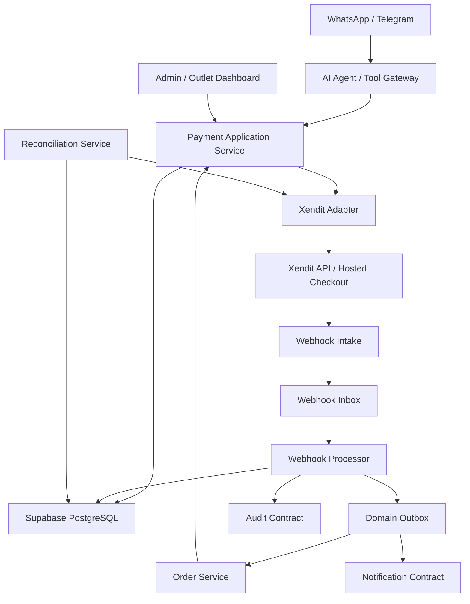
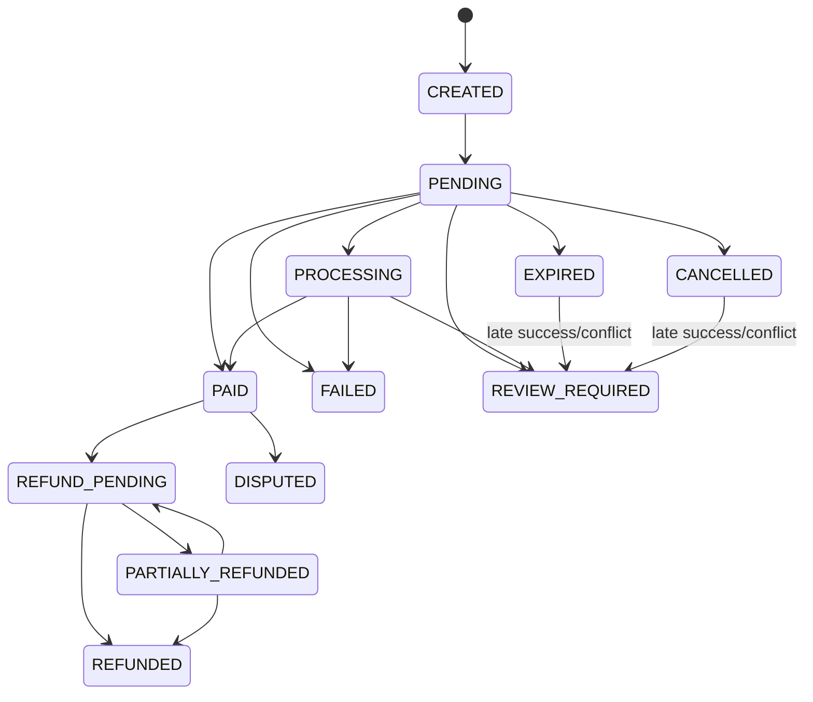
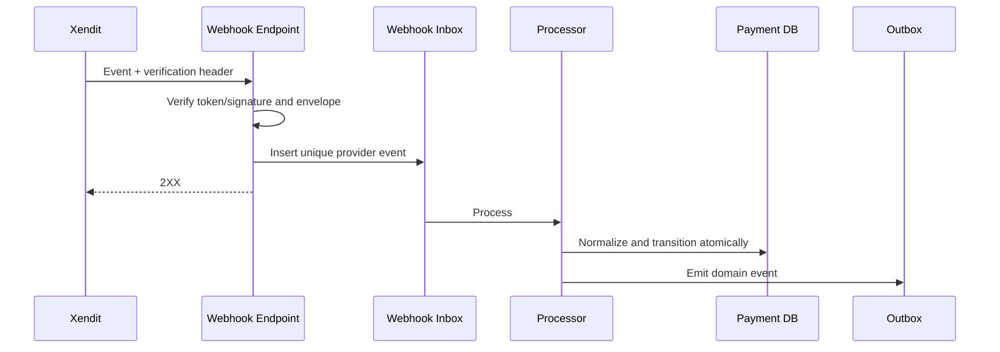

# Design Document: SelaluTeh Payments — Xendit

## Overview

Payments — Xendit adalah domain pembayaran untuk SelaluTeh Marketplace.

```text
Order
→ Payment Aggregate
→ Xendit Payment Session
→ payment_link_url
→ Customer Payment
→ Verified Webhook
→ Payment State Machine
→ Order Transition
→ Outlet Approval
```

Payment state dan order state tidak digabungkan.

---

# 1. Current Provider Baseline

Baseline provider yang diverifikasi pada **22 Juni 2026**:

```text
Preferred:
POST /sessions
session_type = PAY
mode = PAYMENT_LINK
capture_method = AUTOMATIC
allow_save_payment_method = DISABLED

Session output:
payment_session_id
payment_link_url
expires_at
status

Relevant asynchronous events:
payment_session.completed
payment_session.expired
payment.capture
payment.failed

Status lookup:
GET /sessions/{session_id}
GET /v3/payments/{payment_id}

Primary payment webhook verification:
x-callback-token
```

Xendit Payment Session dipilih untuk hosted checkout. Legacy Payment Link `/v2/invoices` menjadi compatibility adapter saja.

Provider documentation SHALL be revalidated before coding and LIVE release.

---

# 2. Design Goals

## 2.1 Financial Correctness

- verified provider truth only;
- amount/currency/reference/environment must match;
- no duplicate collection state;
- no duplicate Order transition;
- no duplicate success notification;
- refund cannot exceed paid amount;
- out-of-order events are safe.

## 2.2 Alpha Simplicity

```text
one-time payment
hosted Xendit checkout
Test Mode
IDR
automatic capture
no saved payment method
no COD
no manual transfer
```

## 2.3 Production Extensibility

The design supports:

```text
Live Mode
multiple attempts
refunds
partial refunds
review queue
provider reconciliation
future Xendit contract versions
future multi-workspace merchant accounts
```

without changing core payment identity.

---

# 3. Non-Goals

Spec ini tidak mendesain:

```text
order total calculation
product pricing
outlet approval
delivery fulfillment
Xendit payouts
settlement accounting ledger
split payments/subaccounts
subscriptions
saved payment methods
manual capture
COD
manual transfer confirmation
other providers
```

---

# 4. High-Level Architecture



---

# 5. Core Domain Model

## 5.1 Payment Aggregate

```ts
type Payment = {
  id: string;
  workspaceId: string;
  orderId: string;
  outletId: string;
  customerId?: string;

  provider: "XENDIT";
  providerMode: "PAYMENT_SESSION" | "LEGACY_INVOICE";
  environment: "TEST" | "LIVE";
  referenceId: string;

  amountMinor: number;
  currency: "IDR";

  status:
    | "CREATED"
    | "PENDING"
    | "PROCESSING"
    | "PAID"
    | "FAILED"
    | "EXPIRED"
    | "CANCELLED"
    | "REVIEW_REQUIRED"
    | "REFUND_PENDING"
    | "PARTIALLY_REFUNDED"
    | "REFUNDED"
    | "DISPUTED";

  paidAmountMinor: number;
  refundedAmountMinor: number;

  currentSessionId?: string;
  expiresAt?: string;
  paidAt?: string;
  lastReconciledAt?: string;
  reviewReasonCode?: string;

  version: number;
  createdAt: string;
  updatedAt: string;
};
```

## 5.2 Payment Session

```ts
type PaymentSession = {
  id: string;
  workspaceId: string;
  paymentId: string;
  generation: number;

  providerSessionId: string;
  providerReferenceId: string;
  paymentLinkUrl: string;

  status:
    | "ACTIVE"
    | "COMPLETED"
    | "EXPIRED"
    | "CANCELLED"
    | "FAILED"
    | "SUPERSEDED";

  expiresAt: string;
  providerApiVersion?: string;
  supersededBySessionId?: string;

  createdAt: string;
  updatedAt: string;
};
```

## 5.3 Payment Attempt

```ts
type PaymentAttempt = {
  id: string;
  workspaceId: string;
  paymentId: string;
  sessionId: string;

  providerPaymentRequestId?: string;
  providerPaymentId?: string;
  providerCaptureId?: string;
  channelCode?: string;

  amountMinor: number;
  currency: string;

  status:
    | "PENDING"
    | "PROCESSING"
    | "SUCCEEDED"
    | "FAILED"
    | "CANCELLED"
    | "UNKNOWN";

  failureCode?: string;
  providerCreatedAt?: string;
  providerUpdatedAt?: string;

  createdAt: string;
  updatedAt: string;
};
```

## 5.4 Webhook Event

```ts
type PaymentWebhookEvent = {
  id: string;
  workspaceId?: string;
  environment: "TEST" | "LIVE";
  provider: "XENDIT";

  routeType:
    | "PAYMENT_SESSION"
    | "PAYMENT"
    | "REFUND"
    | "LEGACY_INVOICE";

  providerEventKey: string;
  eventType: string;
  payloadHash: string;

  verificationStatus: "VERIFIED" | "REJECTED";
  processingStatus:
    | "RECEIVED"
    | "PROCESSING"
    | "PROCESSED"
    | "FAILED"
    | "IGNORED";

  providerCreatedAt?: string;
  receivedAt: string;
  processedAt?: string;
  retryCount: number;
  errorCode?: string;
};
```

## 5.5 Refund

```ts
type PaymentRefund = {
  id: string;
  workspaceId: string;
  paymentId: string;

  providerRefundId?: string;
  providerReferenceId: string;

  amountMinor: number;
  currency: "IDR";
  reason: string;

  status:
    | "REQUESTED"
    | "PROCESSING"
    | "SUCCEEDED"
    | "FAILED"
    | "CANCELLED";

  requestedBy: string;
  requestedAt: string;
  completedAt?: string;
  version: number;
};
```

---

# 6. Data Model

## 6.1 `payment_provider_connections`

```text
id uuid pk
workspace_id uuid not null
provider text = XENDIT
environment text
status text
secret_key_reference text
webhook_secret_reference text
provider_business_id text nullable
adapter_mode text
api_contract_version text
configured_at timestamptz
last_health_check_at timestamptz
version integer
created_at
updated_at
```

No raw secret.

## 6.2 `payments`

```text
id uuid pk
workspace_id uuid not null
order_id uuid not null
outlet_id uuid not null
customer_id uuid nullable

provider text not null
provider_mode text not null
environment text not null
reference_id text not null

amount_minor bigint not null
currency char(3) not null
status text not null

paid_amount_minor bigint not null default 0
refunded_amount_minor bigint not null default 0

current_session_id uuid nullable
expires_at timestamptz nullable
paid_at timestamptz nullable
last_reconciled_at timestamptz nullable
review_reason_code text nullable

version integer not null
created_at
updated_at

unique(workspace_id, environment, provider, reference_id)
```

## 6.3 `payment_sessions`

```text
id uuid pk
workspace_id uuid not null
payment_id uuid not null
generation integer not null

provider_session_id text not null
provider_reference_id text not null
payment_link_url text not null

status text not null
expires_at timestamptz not null
provider_api_version text nullable
superseded_by_session_id uuid nullable

created_at
updated_at

unique(payment_id, generation)
```

Provider session ID uniqueness must include provider/environment semantics.

## 6.4 `payment_attempts`

```text
id uuid pk
workspace_id uuid not null
payment_id uuid not null
session_id uuid not null

provider_payment_request_id text nullable
provider_payment_id text nullable
provider_capture_id text nullable
channel_code text nullable

amount_minor bigint not null
currency char(3) not null
status text not null
failure_code text nullable

provider_created_at timestamptz nullable
provider_updated_at timestamptz nullable
created_at
updated_at
```

## 6.5 `payment_webhook_events`

```text
id uuid pk
workspace_id uuid nullable
environment text not null
provider text not null
route_type text not null

provider_event_key text not null
event_type text not null
payload_hash text not null
sanitized_payload jsonb nullable

verification_status text not null
processing_status text not null

provider_created_at timestamptz nullable
received_at timestamptz not null
processed_at timestamptz nullable
retry_count integer not null
error_code text nullable

unique(provider, environment, route_type, provider_event_key)
```

## 6.6 `payment_refunds`

```text
id uuid pk
workspace_id uuid not null
payment_id uuid not null

provider_refund_id text nullable
provider_reference_id text not null

amount_minor bigint not null
currency char(3) not null
reason text not null
status text not null

requested_by uuid not null
requested_at timestamptz not null
completed_at timestamptz nullable

version integer not null
created_at
updated_at
```

## 6.7 `payment_reconciliation_runs`

```text
id uuid pk
workspace_id uuid not null
payment_id uuid not null

trigger text
requested_by_actor_type text
requested_by_actor_id text nullable

provider_status text nullable
local_before_status text
local_after_status text
result text
reason text nullable

created_at
completed_at
```

---

# 7. Payment State Machine



Rules:

```text
PAID cannot come from UI, AI, outlet, or redirect.

Unknown/mismatch:
→ REVIEW_REQUIRED

Refund failure:
→ original paid truth remains
```

---

# 8. Order and Payment State Separation

```text
Payment:
PENDING → PAID

Order:
PENDING_PAYMENT
→ AWAITING_OUTLET_APPROVAL
→ APPROVED
→ PREPARING
→ READY
→ COMPLETED
```

Order rejection after payment SHALL follow refund/business policy and SHALL not change the payment to unpaid.

---

# 9. Provider Adapter

```ts
interface PaymentProviderAdapter {
  createHostedPaymentSession(
    input: CreatePaymentInput
  ): Promise<CreatePaymentResult>;

  getSession(
    providerSessionId: string
  ): Promise<ProviderSession>;

  getPayment(
    providerPaymentId: string
  ): Promise<ProviderPayment>;

  cancelPendingPayment(
    input: CancelPaymentInput
  ): Promise<CancelPaymentResult>;

  createRefund(
    input: CreateRefundInput
  ): Promise<CreateRefundResult>;

  verifyWebhook(
    input: RawWebhookInput
  ): Promise<VerifiedWebhook>;

  normalizeWebhook(
    input: VerifiedWebhook
  ): Promise<NormalizedProviderEvent>;
}
```

Implementations:

```text
XenditPaymentSessionAdapter
XenditLegacyInvoiceAdapter (compatibility only)
```

The application layer SHALL not depend directly on raw Xendit response fields.

---

# 10. Create Payment Flow

```mermaid
sequenceDiagram
    participant C as Customer / AI
    participant O as Order Service
    participant P as Payment Service
    participant DB as Database
    participant X as Xendit
    participant M as Messaging

    C->>O: Confirm order
    O->>P: Create payment for order
    P->>P: Validate access, order, amount
    P->>DB: Create payment CREATED
    P->>X: POST /sessions
    X-->>P: payment_session_id + payment_link_url
    P->>DB: Store session; payment PENDING
    P->>M: Send link
    M-->>P: Delivery result
    P-->>C: Payment link
```

Ambiguous provider timeout:

```text
do not blindly create another session
→ reconcile by provider reference/session when possible
→ only then retry
```

---

# 11. Payment Session Request Mapping

Conceptual payload:

```json
{
  "reference_id": "st_pay_unique_reference",
  "session_type": "PAY",
  "mode": "PAYMENT_LINK",
  "amount": 45000,
  "currency": "IDR",
  "country": "ID",
  "capture_method": "AUTOMATIC",
  "allow_save_payment_method": "DISABLED",
  "customer": {
    "reference_id": "customer-safe-reference",
    "type": "INDIVIDUAL",
    "email": "optional",
    "mobile_number": "optional",
    "individual_detail": {
      "given_names": "Customer"
    }
  },
  "description": "Payment for order ST-2026-000123",
  "success_return_url": "https://app.example.com/payment/return",
  "cancel_return_url": "https://app.example.com/payment/cancel",
  "metadata": {
    "order_reference": "ST-2026-000123"
  }
}
```

Exact fields SHALL follow the pinned provider contract when implemented.

---

# 12. Webhook Intake Architecture



Durable intake acknowledges after verification and unique persistence.

---

# 13. Webhook Verification

Primary Payments API strategy:

```text
read x-callback-token
→ compare with environment-specific secret
→ validate business/environment
→ calculate deduplication key
→ persist verified event
```

Verifier interface remains provider-version specific:

```ts
interface WebhookVerifier {
  verify(
    headers: Record<string, string>,
    rawBody: Buffer
  ): VerificationResult;
}
```

No secret or full verification header is logged.

---

# 14. Webhook Normalization

```ts
type NormalizedPaymentEvent =
  | {
      kind: "PAYMENT_SUCCEEDED";
      providerSessionId?: string;
      providerPaymentRequestId?: string;
      providerPaymentId?: string;
      providerCaptureId?: string;
      referenceId?: string;
      amountMinor: number;
      currency: string;
      channelCode?: string;
      occurredAt: string;
    }
  | {
      kind:
        | "PAYMENT_FAILED"
        | "SESSION_EXPIRED"
        | "SESSION_COMPLETED"
        | "REFUND_SUCCEEDED"
        | "REFUND_FAILED";
      occurredAt: string;
    };
```

`SESSION_COMPLETED` SHALL trigger lookup/reconciliation when it lacks enough evidence to safely satisfy the PAID invariant.

---

# 15. Success Transition Transaction

Within one database transaction:

```text
lock payment row
→ reject duplicate terminal transition
→ verify amount/currency/reference/environment
→ upsert attempt
→ update session
→ set payment PAID
→ set paid_at
→ insert payment history
→ insert outbox PAYMENT_PAID
→ commit
```

After commit:

```text
Order consumer
→ AWAITING_OUTLET_APPROVAL

Notification consumer
→ customer/outlet message
```

Consumer failure is retried from outbox; payment truth stays PAID.

---

# 16. Reconciliation Design

Triggers:

```text
scheduled stale-payment job
stale customer status check
operations request
webhook conflict
provider-timeout recovery
PAID event with failed Order transition
```

Flow:

```text
load payment/session
→ fetch provider session/payment
→ normalize truth
→ compare identifiers/amount/currency/environment
→ apply safe transition or REVIEW_REQUIRED
→ audit
```

Reconciliation is never manual Mark as Paid.

---

# 17. Idempotency Design

## 17.1 Command keys

```text
create-payment:<workspace>:<order>:<order-payment-version>
regenerate-link:<payment>:<generation>
refund:<payment>:<business-refund-reference>
```

## 17.2 Webhook keys

Preferred:

```text
provider webhook-id
```

Fallback:

```text
provider
+ environment
+ event_type
+ provider_object_id
+ status
+ payload_hash
```

## 17.3 Business-effect keys

```text
PAYMENT_PAID outbox unique by payment + paid version
Order transition unique by payment event ID
Success notification unique by event + destination + template
```

---

# 18. Resend and Regeneration

```text
Resend:
current session ACTIVE and not expired
→ send same link

Regenerate:
expired/cancelled/invalid
→ revalidate order
→ create new generation
→ supersede old session
→ send new link
```

Payment-row lock prevents two current sessions.

---

# 19. Refund Design

Eligibility:

```text
payment PAID or PARTIALLY_REFUNDED
remaining refundable > 0
provider channel supports refund
business approval exists
actor authorized
```

Calculations:

```text
paid_amount_minor = immutable collected amount
refunded_amount_minor = sum successful refunds
remaining_refundable =
  paid_amount_minor - refunded_amount_minor
```

Refund SHALL go back to the original payment method.

---

# 20. Authorization Design

Suggested permissions:

```text
payments.read
payments.create_link
payments.resend_link
payments.regenerate_link
payments.reconcile
payments.cancel
payments.refund_request
payments.refund_execute
payments.read_webhook_diagnostics
payments.manage_connection
payments.export
```

Typical roles:

```text
Owner/Admin
→ broad access within outlet scope

Outlet Manager
→ read assigned-outlet payments
→ optional resend
→ never mark paid

Outlet Staff
→ safe read-only or no payment access

Finance
→ read/reconcile/refund through explicit grants

AI execution identity
→ create/resend/status only
```

---

# 21. AI Tool Contracts

## 21.1 `create_payment_link`

Input:

```json
{
  "order_id": "uuid"
}
```

No amount field.

Output:

```json
{
  "payment_id": "uuid",
  "order_id": "uuid",
  "status": "PENDING",
  "amount_minor": 45000,
  "currency": "IDR",
  "payment_link_url": "provider-hosted-url",
  "expires_at": "2026-06-22T12:30:00Z"
}
```

## 21.2 `resend_payment_link`

Returns the valid link/delivery result or performs server-controlled regeneration.

## 21.3 `get_payment_status`

Returns:

```text
payment status
order status
safe next action
```

No raw provider payload.

---

# 22. Admin Payments Page

## 22.1 Summary cards

```text
Collected
Pending
Expired / Failed
Review Required
Refunded
```

TEST and LIVE remain separated.

## 22.2 Table

```text
Payment
Order
Customer
Outlet
Amount
Payment Status
Order Status
Channel
Created
Updated
Actions
```

## 22.3 Detail tabs

```text
Overview
Attempts
Webhook & Timeline
Refunds
Activity
```

## 22.4 Actions

```text
Copy / Send Link
Regenerate Link
Reconcile with Xendit
Cancel Pending Payment
Request / Process Refund
Open Order
```

There is no `Mark as Paid`.

---

# 23. Workspace Payment Connection Settings

```text
Environment
Connection status
Adapter mode
Business ID safe display
Webhook setup status
Last successful webhook
Last health check
Allowed channels
Default expiry
Return URLs
Secret rotation state
Contract version
```

Outlet-level Connected Channels SHALL not contain Xendit credentials.

---

# 24. API Design

## Customer/order payment

```text
POST /api/orders/:orderId/payment
GET  /api/orders/:orderId/payment
```

## Payment operations

```text
GET  /api/payments
GET  /api/payments/:paymentId
POST /api/payments/:paymentId/resend-link
POST /api/payments/:paymentId/regenerate-link
POST /api/payments/:paymentId/reconcile
POST /api/payments/:paymentId/cancel
```

## Refund

```text
POST /api/payments/:paymentId/refunds
GET  /api/payments/:paymentId/refunds
```

## Webhooks

```text
POST /api/webhooks/xendit/payment-session
POST /api/webhooks/xendit/payment
POST /api/webhooks/xendit/refund
```

---

# 25. Error Model

```text
PAYMENT_NOT_FOUND
ORDER_NOT_PAYABLE
PAYMENT_ALREADY_PAID
PAYMENT_ALREADY_ACTIVE
PAYMENT_CONFIGURATION_MISSING
PAYMENT_PROVIDER_UNAVAILABLE
PAYMENT_PROVIDER_TIMEOUT
PAYMENT_PROVIDER_RESPONSE_INVALID
PAYMENT_LINK_UNAVAILABLE
PAYMENT_LINK_EXPIRED
PAYMENT_AMOUNT_MISMATCH
PAYMENT_CURRENCY_MISMATCH
PAYMENT_REFERENCE_MISMATCH
PAYMENT_ENVIRONMENT_MISMATCH
PAYMENT_REVIEW_REQUIRED
WEBHOOK_VERIFICATION_FAILED
WEBHOOK_SCHEMA_INVALID
WEBHOOK_DUPLICATE
WEBHOOK_PROCESSING_FAILED
REFUND_NOT_SUPPORTED
REFUND_AMOUNT_INVALID
REFUND_EXCEEDS_AVAILABLE
REFUND_ALREADY_PROCESSING
OUTLET_SCOPE_DENIED
PERMISSION_DENIED
VERSION_CONFLICT
IDEMPOTENCY_CONFLICT
```

Raw provider errors map to safe internal errors.

---

# 26. RLS and Repository Scope

```ts
type PaymentRepositoryContext = {
  workspaceId: string;
  allowedOutletIds?: string[];
  environment: "TEST" | "LIVE";
};
```

Rules:

```text
workspace predicate always
outlet predicate for outlet-scoped readers
environment predicate for summaries
unscoped access only for reviewed platform jobs
```

Supabase RLS is defense-in-depth. Backend authorization remains mandatory.

---

# 27. Security Threat Model

## Forged Webhook

```text
callback-token/provider verification
business/environment validation
schema validation
no mutation before verification
```

## Replay

```text
unique webhook inbox
transition idempotency
unique outbox effects
```

## Amount Tampering

```text
Order amount
ignore client/AI amount
provider match
```

## Redirect Spoofing

```text
redirect not authoritative
backend status fetch
HTTPS return allowlist
```

## Cross-Outlet Leakage

```text
outlet_id
Access Control
repository scope
RLS
```

## Secret Leakage

```text
secret references
redaction
server-only
no AI/frontend
```

---

# 28. Observability

Safe tracing identifiers:

```text
order_id
payment_id
session_id
provider_reference_id
webhook_event_id
outbox_event_id
correlation_id
```

Never use customer phone/email as metric labels.

Alerts:

```text
webhook verification spike
webhook backlog
provider create failures
PAID without Order transition
REVIEW_REQUIRED spike
refund failures
TEST/LIVE mismatch
```

---

# 29. Testing Strategy

## Unit

```text
state machine
provider mapping
amount validation
idempotency
event ordering
refund balance
safe errors
```

## Component

```text
Payment Service
Session Service
Webhook Verifier
Webhook Processor
Reconciliation Service
Refund Service
Link Delivery Orchestrator
```

## Integration

```text
Supabase
RLS
Xendit Test adapter
Order contract
Access Control
Tool Gateway
WhatsApp / Telegram
Outbox
```

## Security

```text
forged callback token
replay
cross-workspace
cross-outlet
amount tampering
return URL spoof
secret leakage
AI mark-paid attempt
```

## Property

```text
only verified provider truth can produce PAID
refund total never exceeds paid
one current session per Order
duplicate event produces one effect
PAID never downgraded by stale event
```

## Concurrency

```text
double create
double regenerate
webhook vs reconciliation
webhook vs expiry
cancellation vs late success
two refunds
```

## Resilience

```text
Xendit timeout
DB failure
queue failure
outbox consumer failure
notification failure
Order service failure
```

---

# 30. Performance Targets

Initial engineering targets:

```text
create-payment internal work:
< 300 ms excluding provider latency

webhook intake acknowledgement:
< 2 seconds target

webhook durable processing:
< 30 seconds under normal load

payment list:
< 300 ms backend typical page

payment detail:
< 200 ms backend when cached
```

These are targets to measure, not guarantees.

---

# 31. Migration Strategy

```text
audit current payment code
→ remove Midtrans active path
→ choose Xendit Payment Session adapter
→ create fresh Supabase payment tables
→ configure Test Mode secrets
→ configure and test webhooks
→ run end-to-end alpha
→ disable Mongo payment authority
→ retain legacy invoice history with provider mode
```

Old checkboxes are not proof of implementation.

---

# 32. Rollout Strategy

## Phase 1 — Alpha Test Mode

```text
create session/link
send through WhatsApp/Telegram
verified webhook
PAID
Order awaits outlet approval
outlet-scoped visibility
```

## Phase 2 — Operations

```text
Payments page
reconciliation
webhook diagnostics
review queue
expiry/regeneration
```

## Phase 3 — Refunds

```text
eligibility
approval
full/partial refund
refund webhook
```

## Phase 4 — Live Readiness

```text
live secrets
live webhooks
security review
runbooks
monitoring
controlled launch
```

---

# 33. Fastest Safe Alpha Slice

Implement first:

```text
Xendit Test connection
payments/payment_sessions/webhook inbox
Payment Session adapter
create/send link
resend/regenerate
payment lifecycle
verified webhook
amount/reference/environment matching
idempotency
PAYMENT_PAID outbox
Order transition
WhatsApp/Telegram notification
outlet-scoped reads
critical security/concurrency/resilience tests
```

Defer:

```text
legacy adapter unless required
refunds
advanced reconciliation UI
disputes
live mode
advanced analytics
```

---

# 34. Definition of Done

```text
Xendit only
TEST/LIVE isolated
secrets server-only
Payment Session contract pinned
amount comes from Order
link flow works
webhook verified
duplicates/out-of-order safe
PAID invariant proven
Order transition idempotent
outlet isolation passes
AI cannot change payment truth
reconciliation works
refund limits safe when enabled
audit/metrics/runbooks exist
all release-gate tests pass
implementation status honest
specs check passes
```
