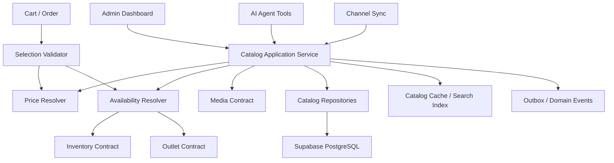
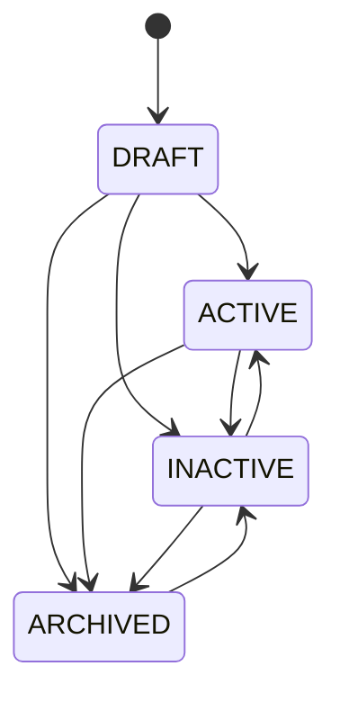
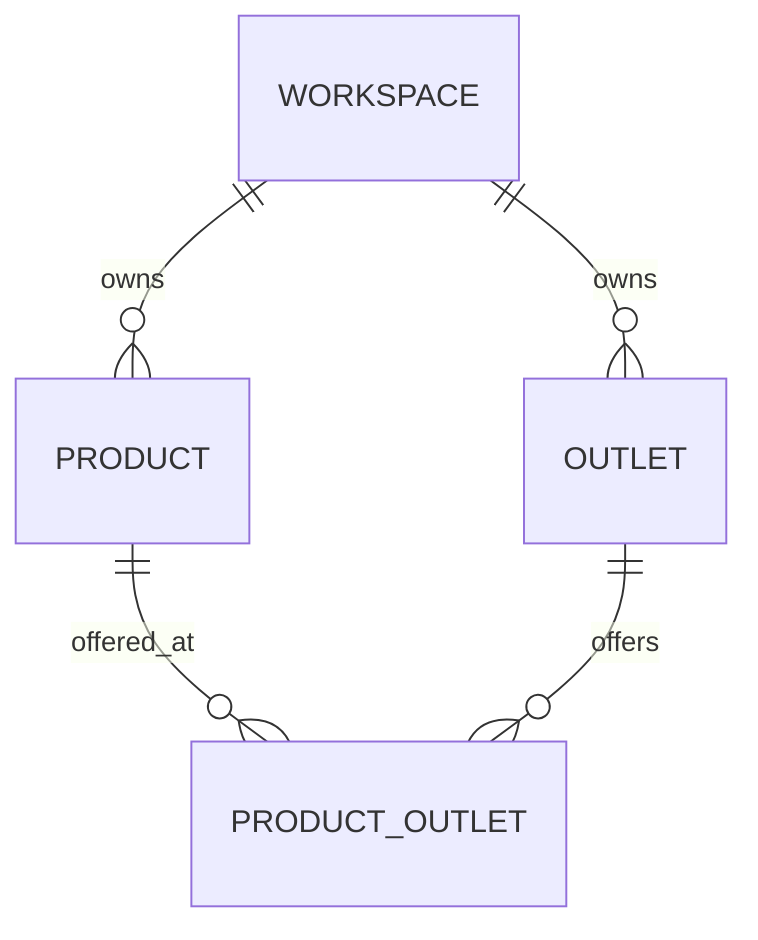

# Design Document: SelaluTeh Product Catalog

## Overview

Product Catalog adalah sumber data kanonis untuk seluruh produk SelaluTeh.

Arsitektur utamanya:

```text
Workspace Catalog
→ Product Definition
→ Variants / Modifiers / Bundles
→ Outlet Assignment
→ Effective Price
→ Effective Availability
→ AI / Admin / Channel / Cart / Order
```

---

# 1. Design Goals

## 1.1 Correctness

- harga selalu dihitung backend;
- produk hanya dapat dipesan dari outlet yang menawarkan;
- status global dan outlet diterapkan konsisten;
- variant/modifier tervalidasi;
- order menyimpan snapshot;
- inventory tetap domain terpisah;
- AI tidak mengarang katalog.

## 1.2 Multi-Outlet Flexibility

```text
One product
→ many outlets
→ optional outlet price override
→ optional outlet availability override
```

## 1.3 Full Product Readiness

Desain harus mendukung:

```text
categories
standard products
variants
modifier groups
bundles
tags
media
scheduled availability
channel publishing
import/export
analytics links
```

tanpa mengorbankan alpha slice sederhana.

---

# 2. Non-Goals

Spec ini tidak mendesain:

```text
stock ledger
stock reservation
payment calculation authority
order state machine
media binary storage
external OAuth/provider sync internals
generic async job framework
analytics aggregation engine
```

---

# 3. High-Level Architecture



---

# 4. Core Domain Model

## 4.1 Product

```ts
type Product = {
  id: string;
  workspaceId: string;
  name: string;
  slug: string;
  sku: string;
  productCode?: string;
  type: "STANDARD" | "VARIANT_PARENT" | "BUNDLE" | "ADD_ON_ONLY";
  status: "DRAFT" | "ACTIVE" | "INACTIVE" | "ARCHIVED";
  shortDescription?: string;
  description?: string;
  basePriceMinor: number;
  currency: "IDR";
  categoryId?: string;
  primaryMediaId?: string;
  isFeatured: boolean;
  sortOrder: number;
  version: number;
};
```

## 4.2 Product Outlet

```ts
type ProductOutlet = {
  id: string;
  workspaceId: string;
  productId: string;
  outletId: string;
  enabled: boolean;
  customerVisible: boolean;
  orderable: boolean;
  temporaryUnavailable: boolean;
  inventoryControlled: boolean;
  priceOverrideMinor?: number;
  unavailableReasonCode?: string;
  customerMessage?: string;
  version: number;
};
```

## 4.3 Variant

```ts
type ProductVariant = {
  id: string;
  workspaceId: string;
  productId: string;
  sku: string;
  name: string;
  optionValues: Record<string, string>;
  status: "ACTIVE" | "INACTIVE" | "ARCHIVED";
  explicitPriceMinor?: number;
  priceAdjustmentMinor?: number;
  mediaId?: string;
  sortOrder: number;
  version: number;
};
```

## 4.4 Modifier Group

```ts
type ModifierGroup = {
  id: string;
  workspaceId: string;
  name: string;
  required: boolean;
  minSelections: number;
  maxSelections: number;
  repeatable: boolean;
  status: "ACTIVE" | "INACTIVE" | "ARCHIVED";
  version: number;
};
```

## 4.5 Modifier Option

```ts
type ModifierOption = {
  id: string;
  workspaceId: string;
  groupId: string;
  name: string;
  priceAdjustmentMinor: number;
  status: "ACTIVE" | "INACTIVE" | "ARCHIVED";
  sortOrder: number;
};
```

---

# 5. Lifecycle State Machine



Rules:

```text
DRAFT
→ admin-only

ACTIVE
→ eligible for outlet catalog

INACTIVE
→ preserved but not orderable

ARCHIVED
→ hidden from normal admin/customer views
```

Activation validation:

```text
required identity fields
valid SKU
valid price
valid product type configuration
at least one sellable variant if VARIANT_PARENT
valid bundle components if BUNDLE
```

---

# 6. Category Design

```text
category
├── parent_category_id nullable
├── status
├── sort_order
└── products
```

Cycle detection:

```text
new parent
→ walk ancestors
→ reject if current category encountered
```

Customer outlet catalog only shows categories with at least one visible product.

---

# 7. Price Resolution

## 7.1 Resolution Inputs

```ts
type PriceResolutionInput = {
  workspaceId: string;
  outletId: string;
  productId: string;
  variantId?: string;
  modifierSelections: Array<{
    optionId: string;
    quantity: number;
  }>;
  at: string;
};
```

## 7.2 Precedence

```text
variant outlet override (future extension)
→ product outlet price override
→ variant explicit price
→ product base price + variant adjustment
```

Modifier prices are added afterward.

## 7.3 Output

```ts
type EffectivePrice = {
  productBaseMinor: number;
  variantAdjustmentMinor: number;
  outletAdjustmentMinor: number;
  modifiersMinor: number;
  unitTotalMinor: number;
  currency: string;
  catalogVersion: number;
};
```

All values use integer minor units.

---

# 8. Availability Resolution

Availability is not one boolean.

```text
global product status
AND outlet assignment enabled
AND customer visibility
AND orderable flag
AND outlet operational status
AND outlet accepts orders
AND schedule window
AND manual unavailable override
AND inventory availability when controlled
```

Output:

```ts
type EffectiveAvailability = {
  visible: boolean;
  orderable: boolean;
  reasonCode:
    | "AVAILABLE"
    | "PRODUCT_INACTIVE"
    | "PRODUCT_ARCHIVED"
    | "NOT_ASSIGNED_TO_OUTLET"
    | "HIDDEN_AT_OUTLET"
    | "OUTLET_NOT_ACCEPTING_ORDERS"
    | "OUTSIDE_PRODUCT_SCHEDULE"
    | "TEMPORARILY_UNAVAILABLE"
    | "OUT_OF_STOCK"
    | "INVENTORY_UNAVAILABLE";
  customerMessage?: string;
  evaluatedAt: string;
};
```

Unknown states fail closed.

---

# 9. Variant Design

Example:

```text
Spanish Latte
├── Regular Iced
├── Large Iced
├── Regular Hot
└── Large Hot
```

Option dimensions MAY be modeled with:

```text
variant_dimensions
variant_dimension_values
product_variant_values
```

or normalized JSON if query requirements remain simple. The chosen implementation must enforce unique combinations.

---

# 10. Modifier Design

Reusable groups:

```text
Sugar Level
├── Normal
├── Less Sugar
└── No Sugar

Extra
├── Extra Shot +5000
├── Oat Milk +7000
└── Cream +3000
```

Product link:

```text
product_modifier_groups
├── product_id
├── modifier_group_id
├── required override optional
├── min/max override optional
└── sort_order
```

Validation sequence:

```text
group exists and ACTIVE
→ linked to product
→ option belongs to group
→ variant compatibility
→ min/max/repeat rules
→ calculate price
```

---

# 11. Bundle Design

```text
Bundle Product
→ Bundle Groups
→ Allowed Component Products / Variants
```

Example:

```text
Coffee Duo
├── Choose 2 drinks
└── Optional 1 snack
```

Bundle validation must be deterministic and snapshot components in order.

---

# 12. Outlet Assignment Design



Assignment is independent from global product lifecycle.

Examples:

```text
Product ACTIVE
Samarinda assignment enabled
Tenggarong assignment disabled
Bontang no assignment
```

Only Samarinda is orderable, subject to outlet/inventory state.

---

# 13. Outlet Catalog Query

Input:

```text
workspace
outlet
timestamp
locale
include_unavailable
category
search
```

Query stages:

```text
verify access/outlet
→ active categories
→ active products
→ outlet assignments
→ variant/modifier definitions
→ effective price
→ availability
→ media references
→ stable ordering
```

AI compact response should avoid returning unnecessary internal structures.

---

# 14. Selection Validation Service

```ts
type CatalogSelection = {
  outletId: string;
  productId: string;
  variantId?: string;
  modifiers: Array<{
    groupId: string;
    optionId: string;
    quantity: number;
  }>;
  quantity: number;
};

type ValidatedSelection = {
  valid: true;
  normalizedSelection: CatalogSelection;
  price: EffectivePrice;
  availability: EffectiveAvailability;
  snapshotDraft: Record<string, unknown>;
};
```

Invalid selection returns stable errors, never partial guessed output.

---

# 15. Order Snapshot Design

```ts
type ProductOrderSnapshot = {
  productId: string;
  productName: string;
  sku: string;
  variant?: {
    id: string;
    name: string;
    sku: string;
  };
  modifiers: Array<{
    groupName: string;
    optionName: string;
    quantity: number;
    unitPriceMinor: number;
  }>;
  baseUnitPriceMinor: number;
  finalUnitPriceMinor: number;
  currency: string;
  catalogVersion: number;
};
```

Snapshot is created from validated authoritative selection.

---

# 16. Inventory Integration

Catalog stores:

```text
inventory_controlled
inventory_item_reference optional
```

Inventory returns:

```text
AVAILABLE
LOW_STOCK
OUT_OF_STOCK
UNKNOWN
```

Catalog converts Inventory signal into customer-safe availability.

Catalog never performs:

```text
stock decrement
stock reservation
waste
transfer
adjustment
```

---

# 17. Channel Publishing Design

Canonical catalog remains provider-neutral.

Channel mapping:

```text
channel_product_mappings
├── workspace_id
├── channel_connection_id
├── product_id
├── provider_product_id
├── publish_status
├── last_synced_version
├── last_synced_at
└── error_code
```

This table belongs to Channel Connections domain but references Product Catalog IDs.

Catalog publishes events; adapter decides provider-specific payload.

---

# 18. AI Tool Design

## Tool: `list_products_by_outlet`

Input:

```json
{
  "outlet_id": "uuid",
  "category_id": "uuid optional",
  "include_unavailable": false
}
```

Output:

```json
{
  "items": [
    {
      "product_id": "uuid",
      "name": "Spanish Latte",
      "price_minor": 22000,
      "currency": "IDR",
      "orderable": true,
      "variants_required": false
    }
  ]
}
```

## Tool: `get_product_options`

Returns only currently valid variants/modifier groups.

## Tool: `check_product_availability`

Uses authoritative resolver at current timestamp.

Tool Gateway provides workspace/outlet context; prompt cannot override it.

---

# 19. Authorization Design

Suggested permissions:

```text
products.read
products.create
products.update
products.activate
products.archive
products.manage_price
products.assign_outlets
products.manage_availability
products.manage_variants
products.manage_modifiers
products.import
products.export
```

Examples:

```text
Owner/Admin
→ workspace catalog management

Outlet Manager
→ assigned outlet price/availability if granted

Outlet Staff
→ read and maybe temporary availability only

AI Agent
→ customer-safe read tools only
```

---

# 20. Data Model

## `products`

```text
id uuid pk
workspace_id uuid not null
name text not null
slug text not null
sku text not null
product_code text
type product_type not null
status product_status not null
short_description text
description text
base_price_minor bigint not null
currency char(3) not null
category_id uuid
primary_media_id uuid
is_featured boolean
sort_order integer
version integer
created_by uuid
updated_by uuid
created_at timestamptz
updated_at timestamptz
archived_at timestamptz
```

## `product_outlets`

```text
id uuid pk
workspace_id uuid not null
product_id uuid not null
outlet_id uuid not null
enabled boolean
customer_visible boolean
orderable boolean
temporary_unavailable boolean
inventory_controlled boolean
price_override_minor bigint
unavailable_reason_code text
customer_message text
version integer
created_at timestamptz
updated_at timestamptz
unique(product_id, outlet_id)
```

## `product_categories`

```text
id uuid pk
workspace_id uuid not null
parent_id uuid
name text
slug text
status text
sort_order integer
version integer
timestamps
```

## `product_variants`

```text
id uuid pk
workspace_id uuid not null
product_id uuid not null
sku text not null
name text not null
option_values jsonb
status text
explicit_price_minor bigint
price_adjustment_minor bigint
media_id uuid
sort_order integer
version integer
timestamps
```

## `modifier_groups`

```text
id uuid pk
workspace_id uuid not null
name text
required boolean
min_selections integer
max_selections integer
repeatable boolean
status text
version integer
timestamps
```

## `modifier_options`

```text
id uuid pk
workspace_id uuid not null
group_id uuid not null
name text
price_adjustment_minor bigint
status text
sort_order integer
version integer
timestamps
```

## `product_modifier_groups`

```text
workspace_id
product_id
modifier_group_id
required_override nullable
min_override nullable
max_override nullable
sort_order
```

---

# 21. Index Strategy

Core indexes:

```text
products(workspace_id, status)
products(workspace_id, sku)
products(workspace_id, slug)
products(workspace_id, category_id, status)
product_outlets(workspace_id, outlet_id, enabled)
product_outlets(workspace_id, product_id)
product_variants(workspace_id, product_id, status)
modifier_options(workspace_id, group_id, status)
```

Search:

```text
PostgreSQL tsvector / trigram indexes
```

Exact strategy depends on measured query patterns.

---

# 22. API Design

## Products

```text
GET    /api/products
POST   /api/products
GET    /api/products/:id
PATCH  /api/products/:id
POST   /api/products/:id/activate
POST   /api/products/:id/deactivate
POST   /api/products/:id/archive
POST   /api/products/:id/restore
POST   /api/products/:id/duplicate
```

## Outlet assignment

```text
GET    /api/products/:id/outlets
PUT    /api/products/:id/outlets
PATCH  /api/products/:id/outlets/:outletId
DELETE /api/products/:id/outlets/:outletId
```

## Variants/modifiers

```text
POST   /api/products/:id/variants
PATCH  /api/products/:id/variants/:variantId
POST   /api/modifier-groups
PATCH  /api/modifier-groups/:groupId
PUT    /api/products/:id/modifier-groups
```

## Customer/AI catalog

```text
GET  /api/outlets/:outletId/catalog
POST /api/catalog/validate-selection
```

---

# 23. Error Model

```text
PRODUCT_NOT_FOUND
PRODUCT_NOT_ACTIVE
PRODUCT_ARCHIVED
PRODUCT_TYPE_INVALID
SKU_ALREADY_EXISTS
CATEGORY_NOT_FOUND
CATEGORY_CYCLE
OUTLET_NOT_FOUND
OUTLET_ASSIGNMENT_REQUIRED
OUTLET_SCOPE_DENIED
PRODUCT_NOT_VISIBLE
PRODUCT_NOT_AVAILABLE
VARIANT_REQUIRED
VARIANT_NOT_FOUND
VARIANT_NOT_AVAILABLE
MODIFIER_GROUP_REQUIRED
MODIFIER_SELECTION_INVALID
BUNDLE_SELECTION_INVALID
PRICE_CHANGED
INVENTORY_UNAVAILABLE
VERSION_CONFLICT
IDEMPOTENCY_CONFLICT
CROSS_WORKSPACE_ACCESS_DENIED
```

---

# 24. Cache and Search

Cache examples:

```text
catalog:product:<workspace>:<product>:<version>
catalog:outlet:<workspace>:<outlet>:<catalogVersion>:<timeBucket>
catalog:categories:<workspace>:<version>
```

Invalidation:

```text
product change
category change
outlet assignment
price override
availability
inventory event
outlet status/order acceptance
```

Search index update should use reliable event/outbox path.

---

# 25. Audit Events

```text
PRODUCT_CREATED
PRODUCT_UPDATED
PRODUCT_PRICE_CHANGED
PRODUCT_STATUS_CHANGED
PRODUCT_ARCHIVED
PRODUCT_RESTORED
PRODUCT_OUTLET_ASSIGNED
PRODUCT_OUTLET_UNASSIGNED
PRODUCT_OUTLET_OVERRIDE_CHANGED
PRODUCT_VARIANT_CHANGED
PRODUCT_MODIFIER_CHANGED
CATEGORY_CHANGED
```

Price events should include before/after minor-unit values, not secrets.

---

# 26. UI Support

## Products Page

```text
summary cards
search
status/category/outlet filters
sort
view toggle
bulk selection
add product
export/import
```

## Product Detail

```text
overview
pricing
outlets
variants
modifiers
media
availability
publishing
activity
analytics links
```

## Forms/Modals

```text
Add Product
Edit Product
Duplicate Product
Archive Confirmation
Assign Outlets
Set Outlet Price
Set Availability
Variant Builder
Modifier Builder
Bulk Actions
Import
Export
```

Inherited values should be visually distinct from overrides.

---

# 27. Security Threat Model

## Price Tampering

Mitigation:

```text
server resolver
ignore client price
checkout revalidation
snapshot
```

## Cross-Workspace Product ID

Mitigation:

```text
workspace-scoped repository
authorization
RLS
safe errors
```

## Cross-Outlet Override

Mitigation:

```text
outlet scope
assignment validation
service guard
```

## AI Hallucinated Options

Mitigation:

```text
structured tools
selection validation
no prompt-only catalog
```

## Stale Cache

Mitigation:

```text
versioned cache
checkout revalidation
event invalidation
```

---

# 28. Testing Strategy

## Unit

```text
lifecycle
SKU normalization
price resolver
availability resolver
variant combination
modifier selection
bundle validation
category cycle
```

## Component

```text
Product Service
Outlet Assignment Service
Catalog Query Service
Selection Validation Service
Cache Invalidation
Event Publisher
```

## Integration

```text
API
Supabase repositories
RLS
Inventory adapter
Outlet adapter
Order snapshot contract
Tool Gateway
Channel event contract
```

## Security

```text
cross-workspace
cross-outlet
price tampering
unauthorized archive
internal note leakage
AI tool scope
```

## Property

```text
effective price never negative
inactive/archived never orderable
unassigned outlet never orderable
selected modifiers always satisfy constraints
order snapshot total equals validated price
```

## Concurrency

```text
price edit vs checkout
archive vs cart add
duplicate create
assignment update race
availability vs inventory signal
```

## Resilience

```text
cache down
inventory down
search index down
media unavailable
outbox retry
channel sync failure
```

---

# 29. Performance Targets

Initial engineering targets:

```text
product list typical page: < 300 ms backend
product detail: < 300 ms backend
outlet catalog cached: < 100 ms
outlet catalog uncached: < 500 ms
selection validation: < 200 ms excluding remote inventory latency
```

Targets must be measured before treated as guarantees.

---

# 30. Migration Strategy

Because legacy data is not important:

```text
create fresh Supabase catalog
→ seed categories
→ seed products
→ assign products to outlets
→ validate prices/availability
→ connect AI tools
→ connect order validation
→ disable legacy Mongo authority
```

Optional retained data:

```text
product names
descriptions
prices
images
category labels
```

---

# 31. Rollout Strategy

## Phase 1 — Alpha Foundation

```text
categories
standard products
base price
outlet assignment
outlet override
manual availability
outlet catalog
AI tools
order snapshot
```

## Phase 2 — Rich Menu

```text
variants
modifier groups
media gallery
tags
```

## Phase 3 — Advanced Commerce

```text
bundles
scheduled availability
inventory mapping
tax/preparation metadata
```

## Phase 4 — Operations

```text
bulk actions
import/export
channel publishing
activity and analytics integration
```

---

# 32. Fastest Safe Alpha Slice

Implement first:

```text
workspace-scoped product
category
STANDARD type
DRAFT/ACTIVE/INACTIVE/ARCHIVED
SKU
base price
outlet assignment
outlet override
manual availability
product list/detail
outlet catalog
AI read tools
selection validation
order snapshot
authorization
events/audit
critical tests
```

Defer:

```text
variants
modifiers
bundles
scheduled availability
advanced media
allergen/tax/prep metadata
import/export
channel publishing
```

---

# 33. Definition of Done

The spec is complete only when:

```text
workspace isolation passes
outlet assignment rules pass
price resolver authoritative
availability resolver deterministic
variants/modifiers/bundles validated
order snapshot immutable
AI tools current and structured
inventory boundary respected
cache/search invalidation works
events/audit emitted
security/property/concurrency/resilience/performance tests pass
Supabase source of truth verified
implementation status honest
specs check passes
```
