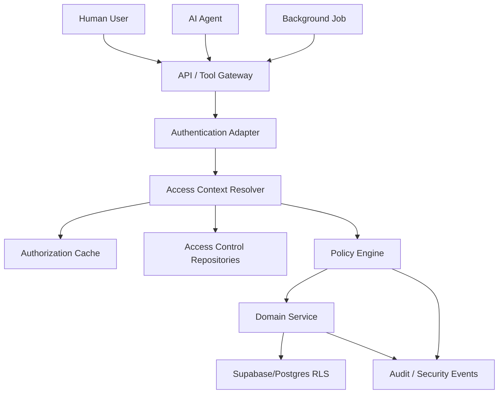
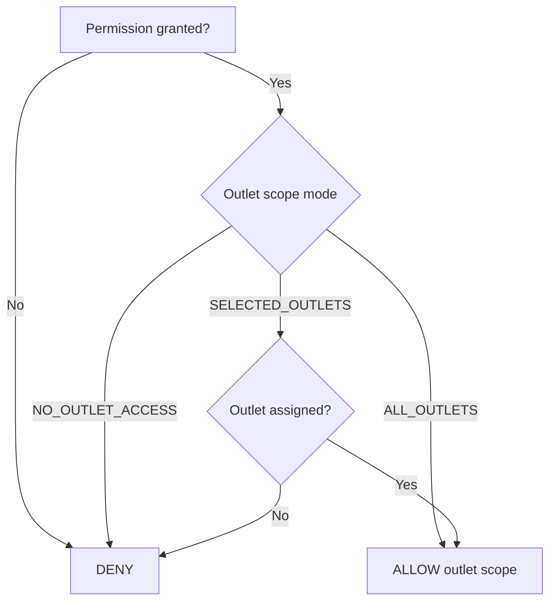
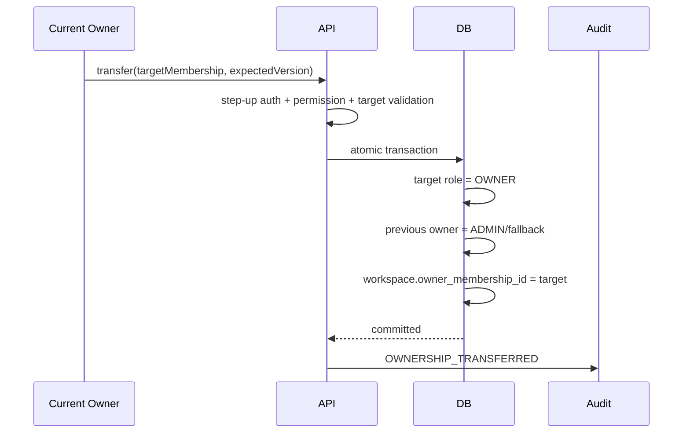

# Design Document: SelaluTeh Workspace Access Control

## Overview

Workspace Access Control adalah authorization layer untuk seluruh backend SelaluTeh.

Tujuannya:

```text
verified identity
→ active membership
→ workspace context
→ role permissions
→ outlet scope
→ resource/action policy
→ allow or deny
```

Authentication tetap berada pada backend auth yang sudah ada. Untuk MVP, custom backend auth tetap dipertahankan; spec ini tidak memaksa migrasi ke Supabase Auth.

---

# 1. Design Goals

## 1.1 Correctness

- tidak ada cross-workspace access;
- tidak ada cross-outlet access;
- tidak ada privilege escalation;
- owner invariant selalu terjaga;
- role/outlet changes berlaku cepat;
- AI dan background jobs menggunakan explicit identity;
- list/count/export memakai scope yang sama;
- frontend bukan security boundary.

## 1.2 Extensibility

Desain harus mendukung:

```text
single workspace, many outlets
→ multi-workspace franchise platform
→ custom roles
→ teams
→ service identities
→ platform support access
```

tanpa mengganti schema utama.

## 1.3 Operational Safety

- deny-by-default;
- audit critical changes;
- idempotent commands;
- optimistic concurrency;
- cache invalidation;
- safe recovery;
- RLS defense-in-depth.

---

# 2. Non-Goals

Spec ini tidak mendesain:

```text
password hashing
OTP generation
JWT signing
login UI
Supabase Auth migration
outlet lifecycle
order state machine
channel OAuth
payment authorization
AI prompt scope classification
generic audit storage engine
```

---

# 3. High-Level Architecture



---

# 4. Core Concepts

## 4.1 Identity

Identity types:

```text
HUMAN_USER
SERVICE_IDENTITY
AI_EXECUTION_IDENTITY
PLATFORM_ADMIN
```

Identity proves who is acting. It does not itself grant workspace access.

## 4.2 Workspace Membership

Membership binds a human user to a workspace.

```ts
type WorkspaceMembership = {
  id: string;
  workspaceId: string;
  userId: string;
  status: "INVITED" | "ACTIVE" | "SUSPENDED" | "REMOVED" | "EXPIRED";
  outletScopeMode: "ALL_OUTLETS" | "SELECTED_OUTLETS" | "NO_OUTLET_ACCESS";
  primaryRoleId?: string;
  version: number;
  createdAt: string;
  updatedAt: string;
};
```

## 4.3 Role

Role is a reusable permission bundle.

```ts
type Role = {
  id: string;
  workspaceId?: string; // null for system role
  key: string;
  name: string;
  type: "SYSTEM" | "CUSTOM";
  status: "ACTIVE" | "ARCHIVED";
  permissions: string[];
  version: number;
};
```

## 4.4 Permission

Permission is a stable machine action:

```text
orders.read
orders.approve
members.invite
outlets.pause
```

## 4.5 Outlet Scope

Role says **what** a member may do.

Outlet scope says **where** they may do it.

```text
Permission:
orders.approve

Outlet scope:
Samarinda Central only
```

Both must pass.

---

# 5. Authorization Decision Model

```ts
type AuthorizationRequest = {
  identity: {
    type: "HUMAN_USER" | "SERVICE_IDENTITY" | "AI_EXECUTION_IDENTITY" | "PLATFORM_ADMIN";
    id: string;
  };
  workspaceId: string;
  action: string;
  resourceType: string;
  resourceId?: string;
  outletId?: string;
  context?: Record<string, unknown>;
};

type AuthorizationDecision = {
  allowed: boolean;
  reasonCode:
    | "ALLOWED"
    | "AUTHENTICATION_REQUIRED"
    | "MEMBERSHIP_REQUIRED"
    | "MEMBERSHIP_INACTIVE"
    | "PERMISSION_MISSING"
    | "OUTLET_SCOPE_DENIED"
    | "WORKSPACE_MISMATCH"
    | "OWNER_PROTECTED"
    | "PLATFORM_POLICY_DENIED"
    | "UNKNOWN_PERMISSION";
  policyVersion: string;
  membershipVersion?: number;
  decisionId: string;
};
```

Evaluation:

```text
1. validate identity
2. validate workspace status
3. resolve membership/service policy
4. validate membership ACTIVE
5. resolve role permission set
6. apply platform-reserved deny
7. validate requested action
8. validate resource workspace
9. validate outlet scope
10. apply resource-specific policy
11. ALLOW or DENY
```

Default is DENY.

---

# 6. Data Model

## 6.1 `workspaces`

```text
id
name
slug
legal_name
status
timezone
locale
owner_membership_id
plan_id
version
created_at
updated_at
archived_at
```

## 6.2 `workspace_memberships`

```text
id
workspace_id
user_id
status
outlet_scope_mode
primary_role_id
title
version
invited_at
activated_at
suspended_at
removed_at
created_at
updated_at
```

Constraints:

```text
unique active membership per workspace/user
workspace_id not null
user_id not null
owner membership must be ACTIVE
```

## 6.3 `roles`

```text
id
workspace_id nullable
key
name
description
type
status
version
created_by
created_at
updated_at
archived_at
```

System roles use `workspace_id = null`.

## 6.4 `permissions`

```text
id
key
domain
resource
action
description
risk_level
delegable
status
version
```

## 6.5 `role_permissions`

```text
role_id
permission_id
created_at
```

## 6.6 `membership_roles`

Optional full-product table for multiple roles:

```text
workspace_id
membership_id
role_id
created_by
created_at
```

MVP may use `primary_role_id` while preparing migration to this table.

## 6.7 `membership_outlets`

```text
workspace_id
membership_id
outlet_id
assignment_type
created_by
created_at
```

## 6.8 `teams`

```text
id
workspace_id
name
description
type
status
version
created_at
updated_at
archived_at
```

## 6.9 `team_memberships`

```text
workspace_id
team_id
membership_id
created_by
created_at
```

## 6.10 `team_outlets`

```text
workspace_id
team_id
outlet_id
created_by
created_at
```

## 6.11 `workspace_invitations`

```text
id
workspace_id
email_normalized
token_hash
intended_role_id
outlet_scope_mode
expires_at
status
delivery_status
invited_by
accepted_by_user_id
accepted_at
revoked_at
version
created_at
updated_at
```

## 6.12 `access_requests`

```text
id
workspace_id
requester_membership_id
request_type
requested_role_id
requested_outlet_ids
justification
status
reviewed_by
review_reason
expires_at
version
created_at
updated_at
```

## 6.13 `service_identities`

```text
id
workspace_id nullable
name
type
status
permission_policy
secret_reference
expires_at
version
created_at
updated_at
```

No raw secret is stored in normal business tables.

---

# 7. System Role Baseline

## 7.1 Owner

```text
workspace settings
members and roles
all outlets
products
orders
payments read/manage according to payment policy
agents
channels
analytics
audit
exports
ownership transfer
```

Owner cannot bypass platform-reserved security rules.

## 7.2 Admin

Broad workspace management but:

```text
cannot become owner through generic role edit
cannot transfer ownership unless explicit policy allows
cannot access platform secrets
```

## 7.3 Outlet Manager

Typical grants:

```text
outlets.read/update for assigned outlets
products.read/manage assignment for assigned outlets
inventory.read/adjust for assigned outlets
orders.read/approve/update_status for assigned outlets
chats.read/reply for assigned outlets
analytics.read for assigned outlets
```

## 7.4 Outlet Staff

Narrower operations:

```text
orders.read
orders.update_status
products.read
inventory.read
chats.read/reply if assigned
```

## 7.5 Customer Support

```text
contacts.read
chats.read/reply/assign/takeover
orders.read
payments.read
complaints.read/assign/resolve
```

No payment mutation or membership management.

## 7.6 Finance Viewer

```text
payments.read
analytics.read
exports.create for finance data if permitted
```

Read-only.

## 7.7 Analyst

```text
analytics.read
reports read
selected exports
```

No operational mutations.

---

# 8. Permission Registry Design

Permission format:

```text
<domain>.<resource-or-feature>.<action>
```

Examples:

```text
workspace.settings.read
workspace.settings.update
workspace.members.invite
workspace.members.suspend
outlets.profile.read
outlets.profile.update
orders.order.read
orders.order.approve
payments.payment.read
chats.conversation.reply
```

Implementation should normalize around one canonical convention. A registry file may be code-generated into:

```text
backend constants
API documentation
role editor UI metadata
test fixtures
```

Unknown keys fail closed.

---

# 9. Outlet Scope Resolution



Rules:

```text
workspace-only action
→ outlet scope not required

outlet-owned resource
→ outlet scope required

resource with outlet_id
→ derive outlet from stored resource, not request claim

new resource creation
→ validate target outlet assignment
```

---

# 10. Request Context

```ts
type AccessContext = {
  actor: {
    type: string;
    id: string;
    realActorId?: string; // impersonation
  };
  workspaceId: string;
  membershipId?: string;
  membershipStatus?: string;
  roleIds: string[];
  permissions: Set<string>;
  outletScopeMode?: string;
  outletIds?: Set<string>;
  policyVersion: string;
  correlationId: string;
};
```

Workspace selection:

```text
user logs in
→ available memberships loaded
→ user selects/current workspace
→ backend verifies membership
→ workspace context embedded in session/request
```

Client-supplied workspace headers may select among verified memberships but never create authority.

---

# 11. Middleware and Service Guards

HTTP:

```ts
router.post(
  "/workspaces/:workspaceId/members",
  authenticate(),
  resolveWorkspaceContext(),
  requirePermission("members.invite"),
  controller.inviteMember
);
```

Service:

```ts
await authorization.assert({
  context,
  action: "orders.approve",
  resource: order
});
```

Why both:

```text
route guard
→ broad endpoint protection

service guard
→ protects internal calls, jobs, tools, and alternate transports
```

---

# 12. Invitation Design

## 12.1 Flow

```text
admin chooses role/outlets
→ backend validates delegability
→ create invitation token hash
→ send invitation
→ user authenticates/verifies identity
→ accept token
→ membership becomes ACTIVE
→ cache invalidated
→ audit emitted
```

## 12.2 Token Security

- random high-entropy token;
- store hash only;
- single use;
- expiry;
- revoke;
- rate limit;
- identity match;
- no raw token in logs.

## 12.3 Duplicate Invitations

Policy:

```text
same workspace + same normalized email + PENDING
→ return existing invitation or replace through explicit resend
```

No duplicate ACTIVE membership.

---

# 13. Owner Transfer Design



Concurrency:

```text
workspace version lock
membership version checks
one transaction
idempotency key
```

---

# 14. Custom Role Design

Role editor:

```text
name
description
permission groups
outlet scope defaults optional
risk warnings
effective permission preview
```

Validation:

```text
requested permissions
⊆ actor delegable permissions
⊆ workspace-allowed permissions
⊆ platform maximum
```

System roles are read-only templates. Custom roles are workspace-owned.

---

# 15. Team Design

Teams group members operationally.

Teams do not automatically grant permissions unless a future team-policy extension explicitly adds it.

Use cases:

```text
Samarinda Support Team
Payment Support
Outlet Managers
Finance
```

Owning domains may reference team IDs for assignment.

---

# 16. Supabase and RLS Design

## 16.1 Target

```text
Supabase PostgreSQL
custom backend auth retained
backend authorization service
RLS defense-in-depth
```

## 16.2 RLS Strategy

Because backend may use service role, two modes are distinguished:

### Backend service path

```text
service role
→ backend authorization mandatory
→ repositories require workspace context
→ RLS may use restricted database role/functions where practical
```

### Future direct client path

```text
authenticated user claims/context
→ strict RLS
→ no service role in browser
```

## 16.3 Example Policy Concept

```sql
workspace_id = current_setting('app.workspace_id')::uuid
```

or approved JWT claim approach if Supabase Auth is adopted later.

The final implementation must match actual connection strategy; do not fake RLS guarantees.

---

# 17. Authorization Cache

Cache value:

```ts
type CachedEffectiveAccess = {
  membershipId: string;
  workspaceId: string;
  membershipVersion: number;
  roleVersions: Record<string, number>;
  policyVersion: string;
  permissions: string[];
  outletScopeMode: string;
  outletIds: string[];
  expiresAt: string;
};
```

Key:

```text
access:<workspaceId>:<identityId>:<membershipVersion>:<policyVersion>
```

Invalidation events:

```text
MEMBERSHIP_STATUS_CHANGED
ROLE_ASSIGNMENT_CHANGED
ROLE_POLICY_CHANGED
OUTLET_ACCESS_CHANGED
WORKSPACE_STATUS_CHANGED
PLATFORM_POLICY_CHANGED
OWNER_TRANSFERRED
```

Suspension/removal should additionally revoke active sessions where supported.

---

# 18. Service Identity Design

Service identities support:

```text
webhook processor
scheduled job
analytics builder
notification worker
migration script
AI tool executor
```

Each identity has:

```text
explicit allowed actions
workspace scope
expiry/revocation
secret reference
audit attribution
```

AI execution identity remains narrower than generic backend service role.

---

# 19. AI Agent Authorization

Customer-facing AI flow:

```text
customer identity/context
→ AI scope security
→ tool request
→ Tool Gateway
→ Access Control with workspace/outlet/tool policy
→ domain service
```

AI cannot:

```text
invite members
change roles
transfer ownership
change outlet access
impersonate admin
read secrets
mark payments paid
cross workspace
```

Agent prompt is never policy authority.

---

# 20. Platform Support and Break-Glass

Normal support:

```text
read minimized diagnostic data
explicit support permission
audited purpose
```

Break-glass:

```text
security approval
reason
target workspace
time limit
persistent banner
real actor attribution
automatic expiry
alert
```

Prefer diagnostic tooling over impersonation.

---

# 21. API Design

## Workspace

```text
GET   /api/workspaces
POST  /api/workspaces
GET   /api/workspaces/:workspaceId
PATCH /api/workspaces/:workspaceId
```

## Members

```text
GET    /api/workspaces/:workspaceId/members
GET    /api/workspaces/:workspaceId/members/:membershipId
PATCH  /api/workspaces/:workspaceId/members/:membershipId
POST   /api/workspaces/:workspaceId/members/:membershipId/suspend
POST   /api/workspaces/:workspaceId/members/:membershipId/restore
DELETE /api/workspaces/:workspaceId/members/:membershipId
PUT    /api/workspaces/:workspaceId/members/:membershipId/outlets
```

## Invitations

```text
POST   /api/workspaces/:workspaceId/invitations
GET    /api/workspaces/:workspaceId/invitations
POST   /api/workspaces/:workspaceId/invitations/:id/resend
DELETE /api/workspaces/:workspaceId/invitations/:id
POST   /api/invitations/:token/accept
```

## Roles

```text
GET    /api/workspaces/:workspaceId/roles
POST   /api/workspaces/:workspaceId/roles
PATCH  /api/workspaces/:workspaceId/roles/:roleId
DELETE /api/workspaces/:workspaceId/roles/:roleId
GET    /api/permissions
```

## Teams

```text
GET    /api/workspaces/:workspaceId/teams
POST   /api/workspaces/:workspaceId/teams
PATCH  /api/workspaces/:workspaceId/teams/:teamId
PUT    /api/workspaces/:workspaceId/teams/:teamId/members
PUT    /api/workspaces/:workspaceId/teams/:teamId/outlets
```

## Owner

```text
POST /api/workspaces/:workspaceId/owner-transfer
```

## Current Access

```text
GET /api/workspaces/:workspaceId/permissions/me
GET /api/workspaces/:workspaceId/access-context
```

---

# 22. Error Model

```text
AUTHENTICATION_REQUIRED
WORKSPACE_NOT_FOUND
WORKSPACE_MEMBERSHIP_REQUIRED
MEMBERSHIP_INACTIVE
MEMBERSHIP_SUSPENDED
PERMISSION_DENIED
OUTLET_SCOPE_DENIED
CROSS_WORKSPACE_ACCESS_DENIED
ROLE_NOT_FOUND
ROLE_ARCHIVED
ROLE_ESCALATION_DENIED
ROLE_IN_USE
INVITATION_INVALID
INVITATION_EXPIRED
INVITATION_REVOKED
INVITATION_ALREADY_USED
OWNER_PROTECTED
LAST_OWNER_REQUIRED
OWNER_TRANSFER_TARGET_INVALID
TEAM_NOT_FOUND
VERSION_CONFLICT
IDEMPOTENCY_CONFLICT
RATE_LIMITED
```

Unauthorized resource responses should not reveal whether an ID exists in another workspace.

---

# 23. UI State Support

## Members Page

Columns:

```text
member
role
outlet access
teams
status
last active
actions
```

## Invite Member Modal

```text
email
role
outlet scope
selected outlets
team optional
expiry
send invitation
```

## Edit Member Drawer

```text
role
outlet scope
selected outlets
teams
status
danger zone
```

## Role Editor

```text
permission categories
search
risk labels
select all within category
effective access preview
members using role
```

## Owner Transfer Modal

```text
target member
warning
step-up verification
confirmation phrase
```

## State Variants

```text
empty members
no search results
pending invitation
expired invitation
permission denied
owner-protected action
version conflict
partial bulk failure
loading/skeleton
```

---

# 24. Audit Events

Critical mutations use outbox/reliable emission.

Audit payload example:

```ts
type AccessAuditEvent = {
  eventType: string;
  workspaceId: string;
  actorType: string;
  actorId: string;
  targetType: string;
  targetId: string;
  before?: Record<string, unknown>;
  after?: Record<string, unknown>;
  reason?: string;
  correlationId: string;
  createdAt: string;
};
```

Redact:

```text
invitation token
session token
password/OTP
service secret
provider key
```

---

# 25. Security Threat Model

## IDOR / Cross-Tenant Access

Mitigation:

```text
verified workspace context
repository scope
resource workspace verification
RLS
security tests
```

## Privilege Escalation

Mitigation:

```text
delegability check
platform maximum
owner-only flow
custom role validation
deny-by-default
```

## Invitation Token Theft

Mitigation:

```text
hash
expiry
single-use
identity match
rate limit
no logs
```

## Stale Access After Removal

Mitigation:

```text
cache invalidation
session revoke
short TTL
membership version
```

## AI Permission Expansion

Mitigation:

```text
Tool Gateway
execution identity
immutable platform policy
no prompt authority
```

## Support Abuse

Mitigation:

```text
time-bound access
purpose
audit
banner
alerts
```

---

# 26. Testing Strategy

## Unit

```text
permission registry
role permission union
outlet scope
owner guard
membership transitions
invitation expiry
delegability
error mapping
cache keys
```

## Component

```text
Policy Engine
Invitation Service
Membership Service
Role Service
Owner Transfer Service
Outlet Assignment Service
Authorization Cache
Service Identity Resolver
```

## Integration

```text
API routes
Supabase repositories
RLS policies
Tool Gateway
Outlet Management
Order lifecycle
CRM
```

## Security

```text
cross-workspace IDOR
cross-outlet access
role escalation
owner removal
token replay
invitation identity mismatch
service identity misuse
AI tool misuse
break-glass expiry
field redaction
```

## Property

```text
effective permissions never exceed platform maximum
owner count remains exactly one
selected outlet result subset of assigned outlets
suspended membership always denied
unknown permission always denied
```

## Concurrency

```text
two owner transfers
duplicate invite acceptance
simultaneous member updates
remove vs approve order
role update vs authorization cache read
```

## Resilience

```text
cache down
database transient failure
audit event failure
notification failure
session revoke failure
RLS misconfiguration detection
```

---

# 27. Performance Targets

Initial targets to validate:

```text
cached authorization decision: < 10 ms
uncached effective-access resolution: < 100 ms
member list typical page: < 300 ms backend
role permission matrix: < 200 ms cached
outlet assignment update: < 500 ms typical
```

These are engineering targets, not guaranteed claims until measured.

---

# 28. Migration Design

Because Mongo data is not important:

```text
fresh Supabase access-control data
→ bootstrap initial workspace
→ bootstrap owner
→ bootstrap system roles/permissions
→ assign initial owner/admin/outlet members
→ validate isolation
→ disable legacy implicit admin paths
```

Migration checks:

```text
no user without membership reaches business APIs
no outlet staff gets all-outlet access accidentally
owner invariant valid
system roles version recorded
legacy middleware no longer authoritative
```

---

# 29. Rollout Strategy

## Phase 1 — Foundation

```text
permission registry
system roles
workspace
membership
policy engine
middleware
repository scope
```

## Phase 2 — Outlet Access

```text
outlet scope mode
membership_outlets
order/outlet integration
```

## Phase 3 — Invitations and Member Admin

```text
invite
accept
suspend
remove
role update
```

## Phase 4 — Advanced Organization

```text
custom roles
teams
access requests
field-level policies
```

## Phase 5 — Platform Operations

```text
service identities
support access
break-glass
advanced observability
```

---

# 30. Fastest Safe Alpha Slice

For alpha:

```text
one workspace
system roles only
one role per membership
owner/admin/outlet manager/outlet staff
ALL_OUTLETS or SELECTED_OUTLETS
membership_outlets
authorization middleware/service guard
Supabase repository and RLS tests
orders scoped by assigned outlet
outlet approval restricted to assigned outlet
member suspension/removal
audit of access changes
```

Defer:

```text
custom roles
multiple roles
teams
access requests
impersonation
break-glass
advanced field-level redaction
```

---

# 31. Definition of Done

Implementation is complete only when:

```text
workspace context is verified
membership status enforced
role permissions enforced
outlet scope enforced
owner invariant protected
cross-workspace access denied
cross-outlet access denied
invitation token safe
suspension revokes access
cache invalidation works
RLS tests pass
AI tools cannot expand access
service identities are explicit
critical mutations audited
unit/component/integration/security/property/concurrency/resilience tests pass
implementation status reflects repository reality
specs check passes
```

---

# 32. Final Architecture Summary

```text
Identity
→ Workspace Membership
→ Role Permissions
→ Outlet Scope
→ Resource Policy
→ Domain Action
```

This domain is the shared authorization foundation for every SelaluTeh backend module. It must remain centralized, testable, deny-by-default, and independent from UI assumptions.
