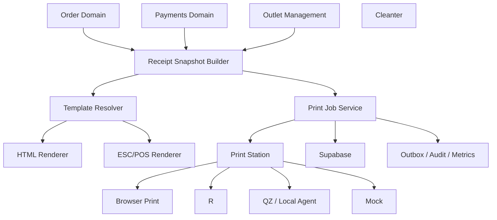
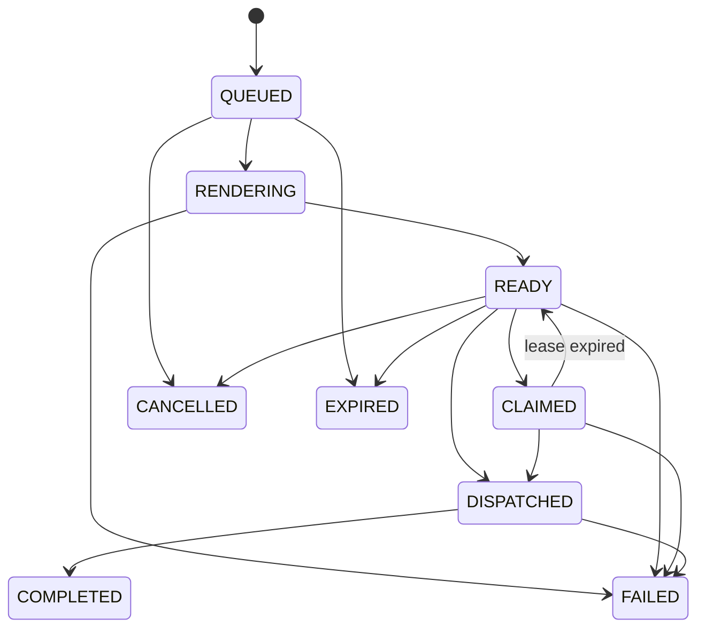

# Design Document: SelaluTeh Thermal Print

## 1. Architecture



## 2. Core Decisions

```text
Desktop Linux/Windows alpha = Browser Print
Android alpha               = Cleanter
Development                 = Mock + Preview
Desktop direct later        = QZ Tray / Local Agent
Web Bluetooth               = experimental only
Default final proof         = CUSTOMER_RECEIPT
Default recommended trigger = ORDER_COMPLETED
```

## 3. Canonical Snapshot

```ts
type ReceiptSnapshot = {
  schemaVersion: number;
  documentType:
    | "ORDER_INVOICE"
    | "CUSTOMER_RECEIPT"
    | "KITCHEN_TICKET"
    | "REFUND_RECEIPT"
    | "TEST_PAGE";
  mode: "TEST" | "LIVE";
  workspaceId: string;
  outletId: string;
  orderId?: string;
  orderNumber?: string;
  queueNumber?: string;

  outlet: {
    name: string;
    addressLines: string[];
    phoneMasked?: string;
  };

  order?: {
    status: string;
    fulfillmentType: "PICKUP";
    channel?: string;
    createdAt: string;
    completedAt?: string;
    pickupContactName?: string;
  };

  items: Array<{
    name: string;
    variant?: string;
    modifiers: Array<{ name: string; priceMinor?: number }>;
    quantity: number;
    unitPriceMinor: number;
    lineTotalMinor: number;
  }>;

  totals: {
    subtotalMinor: number;
    modifierTotalMinor: number;
    discountTotalMinor: number;
    taxTotalMinor: number;
    feeTotalMinor: number;
    grandTotalMinor: number;
  };

  payment?: {
    status: string;
    method?: string;
    referenceMasked?: string;
    paidAt?: string;
    refundedAt?: string;
  };

  print: {
    generatedAt: string;
    templateVersion: string;
    sourceVersion: string;
    isReprint: boolean;
    originalJobId?: string;
  };

  footerLines: string[];
};
```

Rules:

```text
item identity/prices → order snapshots
payment state        → Payments read model
outlet data          → approved outlet snapshot/profile
current catalog      → never used for historical receipt
```

## 4. Printer Transport Contract

```ts
interface PrinterTransport {
  type:
    | "MOCK"
    | "BROWSER_PRINT"
    | "CLEANTER"
    | "QZ_TRAY"
    | "LOCAL_AGENT"

  isSupported(): Promise<boolean>;
  getCapabilities(): Promise<TransportCapabilities>;

  print(input: {
    jobId: string;
    stationId: string;
    copies: number;
    html?: string;
    escpos?: Uint8Array;
  }): Promise<{
    dispatched: boolean;
    completed: boolean;
    evidence:
      | "NONE"
      | "USER_CONFIRMED"
      | "TRANSPORT_ACK"
      | "DEVICE_STATUS"
      | "ADMIN_OVERRIDE";
    transportReference?: string;
    errorCode?: string;
    safeMessage?: string;
  }>;
}
```

## 5. Data Model

### `printer_profiles`

```text
id uuid pk
workspace_id uuid not null
outlet_id uuid not null
name text not null
purpose text not null
paper_width_mm integer not null
characters_per_line integer not null
encoding text not null
capabilities jsonb not null
status text not null
version integer not null
created_at
updated_at
archived_at
```

### `receipt_templates`

```text
id uuid pk
workspace_id uuid not null
outlet_id uuid nullable
document_type text not null
paper_width_mm integer not null
version_number integer not null
status text not null
structured_template jsonb not null
effective_from timestamptz nullable
published_at timestamptz nullable
created_at
updated_at
```

### `print_stations`

```text
id uuid pk
workspace_id uuid not null
outlet_id uuid not null
name text not null
platform text not null
transport_type text not null
device_identifier text not null
status text not null
health_status text not null
is_default boolean not null
last_seen_at timestamptz nullable
version integer not null
created_at
updated_at
```

### `print_station_printers`

```text
id uuid pk
workspace_id uuid not null
outlet_id uuid not null
station_id uuid not null
printer_profile_id uuid not null
local_printer_identifier text nullable
local_printer_name text nullable
is_default_for_purpose boolean not null
status text not null
version integer not null
created_at
updated_at
```

### `print_jobs`

```text
id uuid pk
workspace_id uuid not null
outlet_id uuid not null
order_id uuid nullable
source_type text not null
source_id text nullable
document_type text not null
receipt_snapshot jsonb not null
snapshot_hash text not null
template_id uuid not null
template_version integer not null
printer_profile_id uuid not null
requested_station_id uuid nullable
copies integer not null
status text not null
completion_evidence text not null
idempotency_key text not null
request_hash text not null
requested_by_type text not null
requested_by_id text nullable
requested_at timestamptz not null
rendered_at timestamptz nullable
claimed_at timestamptz nullable
dispatched_at timestamptz nullable
completed_at timestamptz nullable
failed_at timestamptz nullable
expires_at timestamptz nullable
claimed_by_station_id uuid nullable
lease_expires_at timestamptz nullable
version integer not null

unique(workspace_id, idempotency_key)
```

### `print_attempts`

```text
id uuid pk
workspace_id uuid not null
outlet_id uuid not null
print_job_id uuid not null
station_id uuid not null
transport_type text not null
renderer_type text not null
renderer_version text not null
payload_hash text not null
payload_size_bytes integer not null
status text not null
completion_evidence text not null
transport_reference text nullable
error_code text nullable
safe_error_message text nullable
started_at timestamptz not null
finished_at timestamptz nullable
created_at
```

## 6. Job State Machine



Honest semantics:

```text
window.print() invoked → DISPATCHED
Cleanter HTTP 2xx      → DISPATCHED
user confirms paper    → COMPLETED / USER_CONFIRMED
bridge acknowledges    → COMPLETED / TRANSPORT_ACK
```

## 7. HTML / Browser Print

```text
Orders sidebar
→ Preview
→ canonical snapshot
→ HTML renderer
→ dedicated print route
→ user clicks Print
→ window.print()
→ DISPATCHED
→ optional success confirmation
```

Baseline CSS:

```css
@page { margin: 0; }
.receipt[data-paper="58"] { width: 48mm; }
.receipt[data-paper="80"] { width: 72mm; }

@media print {
  body { margin: 0; }
  .non-printable { display: none !important; }
}
```

## 8. Android Cleanter

```text
snapshot
→ ESC/POS renderer
→ bytes/base64
→ POST http://localhost:9100/print
→ Cleanter local HTTP bridge
→ Bluetooth Classic thermal printer
→ paired Inforce printer
```

Rules:

```text
user gesture
no auth token
bounded payload
Preview fallback
DISPATCHED until confirmation
```

## 9. ESC/POS Baseline

```text
initialize
left/center/right
bold
item columns
line wrapping
feed
optional cut
optional logo
optional QR
encoding fallback
```

Character width is profile driven; never globally hardcoded.

## 10. Eligibility

```text
ORDER_INVOICE:
- order exists
- outlet access
- payment state shown clearly

CUSTOMER_RECEIPT:
- verified PAID
- outlet access
- TEST marker when applicable

KITCHEN_TICKET:
- APPROVED or later
- selected outlet only

REFUND_RECEIPT:
- verified refund state

TEST_PAGE:
- no order required
```

## 11. Orders Sidebar

```text
Receipt Printing
- eligibility
- selected station
- platform
- transport
- printer profile
- paper width
- last job
- evidence
- last error

Actions:
[ Preview ] [ Print Receipt ]
Reprint
Test Printer
Print History
Printer Settings
```

## 12. API

```text
GET/POST/PATCH /api/printing/printer-profiles
GET/POST       /api/printing/templates
POST           /api/printing/templates/:id/publish

POST           /api/printing/stations/register
GET/PATCH      /api/printing/stations/:id
POST           /api/printing/stations/:id/heartbeat
POST/PATCH     /api/printing/stations/:id/printers

POST           /api/orders/:orderId/print-jobs
GET            /api/print-jobs
GET            /api/print-jobs/:id
POST           /api/print-jobs/:id/render
POST           /api/print-jobs/:id/claim
POST           /api/print-jobs/:id/dispatch
POST           /api/print-jobs/:id/complete
POST           /api/print-jobs/:id/fail
POST           /api/print-jobs/:id/cancel
POST           /api/print-jobs/:id/retry
POST           /api/print-jobs/:id/reprint

POST           /api/printing/stations/:id/test-jobs
```

## 13. Error Model

```text
PRINT_NOT_ELIGIBLE
PAYMENT_NOT_PAID
ORDER_NOT_PRINTABLE
PRINTER_NOT_CONFIGURED
PRINTER_PROFILE_INACTIVE
STATION_NOT_REGISTERED
STATION_OFFLINE
TRANSPORT_UNSUPPORTED
BRIDGE_UNAVAILABLE
CLEANTER_UNAVAILABLE
CLEANTER_CORS_BLOCKED
CLEANTER_LOCAL_NETWORK_PERMISSION_DENIED
CLEANTER_TIMEOUT
CLEANTER_PRINT_REJECTED
WEB_BLUETOOTH_UNSUPPORTED
PAYLOAD_TOO_LARGE
PAPER_WIDTH_UNSUPPORTED
ENCODING_UNSUPPORTED
RENDER_FAILED
PRINT_TIMEOUT
PRINT_DISPATCH_FAILED
PRINT_ALREADY_CLAIMED
PRINT_JOB_EXPIRED
OUTLET_SCOPE_DENIED
PERMISSION_DENIED
VERSION_CONFLICT
IDEMPOTENCY_CONFLICT
```

## 14. Security

```text
fake paid receipt
→ verified Payments state only

cross-outlet print
→ authorization + RLS

Cleanter local payload leakage
→ receipt output only, no token

arbitrary template execution
→ structured template schema

duplicate prints
→ idempotency + explicit reprint + attempts
```

## 15. Testing

```text
Unit:
snapshot, eligibility, money, wrapping, lifecycle, idempotency

Component:
SnapshotBuilder, TemplateResolver, HTML, ESC/POS, Job, Station, TransportResolver

Integration:
Orders, Payments, Outlet, Access Control, Supabase/RLS, Audit, Media

Property:
deterministic render
verified payment only
one key one job
explicit reprint separate job
dispatch != physical completion

Concurrency:
double click
two station claims
retry vs cancel
complete vs fail
lease expiry

Visual:
58 mm, 80 mm, long items, modifiers, large totals, test/reprint

Binary:
ESC/POS init, alignment, bold, rows, feed, cut, encoding

Manual:
Linux Chrome
Windows Chrome/Edge
Android Chrome + Cleanter + Inforce
```

## 16. Rollout

### Phase 1

```text
snapshot
templates
HTML/ESC-POS
Mock
Browser Print
Cleanter
manual jobs
reprint
test page
history
Orders sidebar
```

### Phase 2

```text
QZ Tray / Local Agent
desktop direct print
printer discovery
logo/QR
diagnostics
```

### Phase 3

```text
auto-print
claims/leases
kitchen ticket
multiple printers
offline queue
advanced health
```

## 17. Definition of Done

```text
Linux Browser Print validated
Windows Browser Print validated
Android Cleanter + Inforce physically validated
Mock validated
immutable snapshot and verified payment rules proven
honest completion evidence proven
reprint/idempotency proven
workspace/outlet isolation proven
printing failure never blocks order
all release gates pass
```
