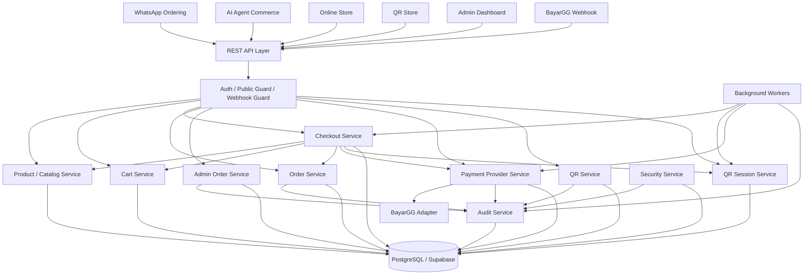

# Design Document: SELKOP Phase 4 Existing Backend Audit & Implementation Adaptation

## Overview

Dokumen ini mendefinisikan desain teknis untuk **Phase 4 — Existing Backend Audit & Implementation Adaptation**.

Phase 4 bukan greenfield implementation.

Sistem existing sudah memiliki fondasi:

```text
AI WhatsApp Marketplace
Chatbot CRM
Marketplace
Product catalog
Cart / order flow
Payment flow
Admin dashboard
Kitchen / fulfillment flow
AI assisted ordering
````

Karena itu, implementasi SELKOP Online Store dan QR Store harus dilakukan dengan pendekatan:

```text
audit first
→ map existing capability
→ decide reuse / extend / refactor / rebuild
→ implement minimal safe change
→ run regression test
→ update docs
```

Dokumen ini menjadi panduan utama untuk mengadaptasi backend existing agar mendukung:

```text
Online Store
QR Store
Universal QR
Outlet QR
Location / Table QR
Public no-login checkout
BayarGG payment provider
Payment webhook
Admin order lifecycle
Audit log
Security event
Background worker
Alpha readiness
```

tanpa merusak flow existing:

```text
WhatsApp ordering
AI assisted commerce
Existing marketplace flow
Existing product catalog
Existing order management
Existing payment integration
Existing admin dashboard
Existing kitchen board
```

Prinsip utama:

```text
Existing backend is the baseline.

New Online Store and QR Store are additional commerce channels.

Canonical backend services remain the source of truth.

Frontend, AI, QR, and WhatsApp only send intent.

Backend validates, calculates, mutates, and audits.
```

Backend tetap menjadi sumber kebenaran untuk:

```text
harga
stok
ketersediaan produk
cart
checkout
order
payment
fulfillment
permission
audit
```

Frontend, AI, dan public customer client bukan sumber kebenaran untuk:

```text
price
total
discount
payment paid
fulfillment status
order completed
provider webhook validity
admin permission
```

---

# 1. Product Decisions

Keputusan berikut dianggap final untuk Phase 4 implementation adaptation.

## 1.1 Implementation Mode

Phase 4 menggunakan pendekatan:

```text
Brownfield adaptation
```

Bukan:

```text
Greenfield rewrite
```

Artinya:

```text
jangan membangun ulang fitur yang sudah ada
jangan membuat duplicate business logic
jangan bypass service existing
jangan merusak WhatsApp marketplace flow
```

## 1.2 Existing Channel Preservation

Channel existing wajib tetap berjalan.

```text
WhatsApp ordering
AI assisted order
Marketplace catalog
Admin dashboard
Kitchen / fulfillment board
```

Channel baru yang ditambahkan:

```text
online_store
qr_store
```

Target `order_channel`:

```text
whatsapp
telegram
online_store
qr_store
```

Jika existing system belum memiliki `telegram`, field tetap boleh disiapkan tetapi tidak wajib diaktifkan.

## 1.3 SELKOP Online Store MVP

Online Store MVP harus mendukung:

```text
public storefront
outlet selection
menu browsing
modifier selection
cart validation
checkout
payment creation
payment status polling
public order tracking
admin fulfillment processing
```

## 1.4 SELKOP QR Store MVP

QR Store MVP harus mendukung tiga scope:

```text
universal
outlet
location
```

Universal QR:

```text
customer memilih outlet
```

Outlet QR:

```text
outlet terkunci dari QR
```

Location QR:

```text
outlet dan table/location terkunci dari QR
```

## 1.5 Payment Provider

Provider aktif untuk SELKOP alpha:

```text
BayarGG
```

Tetapi arsitektur harus tetap provider-agnostic.

Tidak boleh hardcode field seperti:

```text
bayargg_invoice_id
xendit_invoice_id
midtrans_token
```

Gunakan field netral:

```text
provider_code
provider_payment_id
provider_reference
provider_checkout_url
provider_raw_status
provider_metadata_json
```

## 1.6 Payment Authority

Payment hanya boleh berubah menjadi `paid` melalui:

```text
verified provider webhook
valid server-to-server reconciliation
```

Tidak boleh:

```text
frontend mark paid
AI mark paid
admin bebas mark paid untuk alpha
timer frontend mark paid
localStorage mark paid
```

## 1.7 Order Lifecycle

Order lifecycle harus menggunakan status terpisah:

```text
payment_status
fulfillment_status
public_order_status
```

Aturan utama:

```text
Paid ≠ Completed.
Payment status ≠ Fulfillment status.
```

Admin hanya boleh memproses fulfillment jika:

```text
payment_status = paid
```

## 1.8 Admin Actions

Admin order action harus explicit.

Gunakan:

```http
POST /api/v1/admin/orders/:orderId/accept
POST /api/v1/admin/orders/:orderId/prepare
POST /api/v1/admin/orders/:orderId/ready
POST /api/v1/admin/orders/:orderId/complete
POST /api/v1/admin/orders/:orderId/cancel
```

Jangan gunakan status patch bebas:

```http
PATCH /api/v1/admin/orders/:orderId
{
  "status": "completed"
}
```

## 1.9 Public No-Login Checkout

Online Store dan QR Store adalah public no-login flow.

Maka wajib menggunakan:

```text
opaque public token
unguessable QR token
unguessable public order token
idempotency key
rate limit
schema validation
server-side total calculation
```

## 1.10 Audit Requirement

Semua perubahan penting wajib tercatat.

Minimal:

```text
order.created
order.accepted
order.preparing
order.ready
order.completed
order.cancelled
payment.created
payment.paid
payment.failed
payment.expired
payment.manual_review
qr.scanned
qr.revoked
product.availability_changed
settings.payment_provider_changed
```

---

# 2. Existing System Context

Sistem existing adalah AI WhatsApp Marketplace.

Kemungkinan domain existing:

```text
workspace
brand
outlet
platform connection
contact
customer
chat
product
category
modifier
cart
order
payment
invoice
receipt
admin dashboard
kitchen board
AI agent
Tool Gateway
webhook
notification
```

Phase 4 tidak boleh mengasumsikan semua domain belum ada.

Setiap domain harus diaudit terlebih dahulu.

---

# 3. Design Principles

## 3.1 Audit First

Sebelum implementasi:

```text
read docs
inspect code
inspect schema
inspect existing API
inspect frontend usage
inspect tests
```

Tidak boleh langsung coding hanya berdasarkan design target.

## 3.2 Backend Authoritative State

Backend adalah sumber kebenaran untuk:

```text
product price
modifier price
availability
cart total
checkout total
payment status
order status
fulfillment status
admin permission
QR session validity
```

## 3.3 No Parallel Business Logic

Jangan membuat logic baru yang menghitung atau memutuskan hal yang sudah dimiliki service existing.

Contoh yang dilarang:

```text
PublicCheckoutService menghitung total sendiri padahal CheckoutService sudah ada.
QrOrderService membuat order langsung tanpa OrderService.
PublicPaymentController mengubah payment paid langsung.
Frontend mengirim final total sebagai authority.
```

## 3.4 Additive Migration First

Database adaptation harus mengutamakan:

```text
add column
add table
add index
backfill
compatibility layer
```

Hindari:

```text
drop column
rename breaking
delete historic order
rewrite all order history
hard delete payment
```

## 3.5 Preserve Existing WhatsApp Flow

Setiap perubahan wajib mempertahankan:

```text
WhatsApp order creation
AI cart mutation
AI order confirmation
existing payment link flow
existing admin order list
existing kitchen board
```

## 3.6 Provider-Agnostic Payment

Payment core tidak boleh tergantung pada BayarGG saja.

BayarGG adalah adapter aktif, bukan domain core.

## 3.7 Public API Is Untrusted

Semua input public dianggap tidak dipercaya.

Public client hanya mengirim intent:

```text
selected product
quantity
modifier choices
selected outlet
customer info
payment method preference
QR session token
```

Backend tetap memvalidasi ulang semuanya.

## 3.8 Worker Must Use Service Layer

Background worker tidak boleh update status langsung tanpa state machine.

Benar:

```text
ExpirePaymentWorker
→ PaymentService.expirePayment()
```

Salah:

```text
ExpirePaymentWorker
→ UPDATE payments SET status = 'expired'
```

---

# 4. Scope

## 4.1 In Scope

```text
existing docs audit
existing backend audit
existing frontend audit
database adaptation
service mapping
order lifecycle refactor
channel expansion
QR store extension
checkout hardening
payment provider hardening
BayarGG adapter
webhook hardening
admin order hardening
audit log
security events
background workers
regression tests
backend stabilization
```

## 4.2 Out of Scope

```text
full UI redesign
brand redesign
loyalty system
CRM advanced segmentation
delivery fleet
POS cashier full system
advanced inventory movement
multi-brand white label launch
production launch
```

---

# 5. High-Level Architecture



---

# 6. Existing Docs and Code Audit Policy

## 6.1 Required Docs To Read

Sebelum implementasi, baca:

```text
README
architecture docs
database docs
API docs
AI agent design docs
marketplace docs
order docs
cart docs
checkout docs
payment docs
webhook docs
admin docs
kitchen board docs
deployment docs
environment docs
migration files
seed files
test files
```

Cari file dengan keyword:

```text
design.md
requirements.md
architecture.md
api.md
payment.md
order.md
checkout.md
cart.md
storefront.md
qr.md
webhook.md
admin.md
kitchen.md
```

## 6.2 Required Audit Output

Sebelum coding, buat dokumen:

```text
04.0-existing-backend-audit.md
```

Isi minimal:

```text
1. Docs found and read
2. Existing architecture summary
3. Existing frontend routes
4. Existing frontend public store files
5. Existing frontend QR files
6. Existing frontend API contracts
7. Existing backend routes/controllers
8. Existing backend services
9. Existing database tables
10. Existing order flow
11. Existing WhatsApp order flow
12. Existing AI assisted order flow
13. Existing payment flow
14. Existing webhook flow
15. Existing admin order flow
16. Existing kitchen board flow
17. Reusable modules
18. Risky modules
19. Missing modules
20. Refactor candidates
21. Integration gap matrix
22. Regression test plan
```

---

# 7. Repository Audit Commands

## 7.1 Frontend Audit

```bash
find web/src -maxdepth 5 -type f | sort
```

```bash
rg -n "public-store|PublicStore|Storefront|CheckoutPage|PaymentPending|OrderStatus|CartDrawer|ProductModifier|QRCode|QRStore|QrStore" web/src
```

```bash
rg -n "/store|/qr|storefrontSlug|publicOrderToken|checkoutToken|qrToken|qrSession" web/src
```

```bash
rg -n "publicStoreApi|getStorefront|addCartItem|getCart|checkout|getPublicOrder|getQRCode|validateCart|getPaymentStatus" web/src
```

```bash
rg -n "Storefront|GuestCart|PublicOrder|CheckoutCustomer|ModifierGroup|StoreProduct|QrSession|QRScope|PaymentStatus" web/src
```

```bash
rg -n "formatCurrency|rupiah|maskPhone|normalizePhone|Status Pesanan|Siap Diambil|Selesai|Sedang Diproses|Pembayaran" web/src
```

## 7.2 Backend Audit

```bash
find server/src -maxdepth 5 -type f | sort
```

```bash
rg -n "cartService|checkoutService|orderService|paymentService|invoiceService|receiptService|productService|catalogService|outletService|kitchenService|customerService|contactService" server/src
```

```bash
rg -n "router|Controller|/api|storefront|checkout|payment|webhook|orders|qr|cart" server/src
```

```bash
find supabase -type f | sort
find server -type f | rg "migration|schema|sql"
```

```bash
rg -n "workspaces|brands|outlets|products|categories|modifiers|availability|carts|checkouts|orders|payments|invoices|receipts|contacts|customers|qr_codes|qr_sessions" server supabase
```

```bash
rg -n "webhook|payment.*webhook|xendit|bayargg|midtrans|paymentSession|payment_sessions|provider_reference|payment_provider" server/src supabase
```

```bash
rg -n "AWAITING_OUTLET_APPROVAL|PREPARING|READY_FOR_PICKUP|COMPLETED|Kitchen|OrderStatus|payment_status|fulfillment_status|public_order_status" server/src web/src supabase
```

## 7.3 Test Audit

```bash
find . -type f | rg "test|spec|e2e"
```

```bash
rg -n "checkout|payment|webhook|order|cart|qr|storefront|admin order" . --glob "*.{test,spec}.{ts,tsx,js,jsx}"
```

---

# 8. Decision Framework

Setiap target capability harus diklasifikasikan.

| Decision | Meaning                                           | When To Use                                 |
| -------- | ------------------------------------------------- | ------------------------------------------- |
| Reuse    | Existing module is safe and sufficient            | Logic already matches target invariant      |
| Extend   | Existing module is good but missing fields/routes | Add Online/QR support without changing core |
| Refactor | Existing module works but violates target rule    | Status flow unsafe, payment too coupled     |
| Rebuild  | Existing module is unsafe or incompatible         | Webhook can mark paid without verification  |

Template keputusan:

```text
Target capability:
Existing module:
Current behavior:
Gap:
Risk:
Decision:
Implementation step:
Regression test:
Owner:
```

---

# 9. Target Domain Mapping

## 9.1 Existing AI WA Marketplace Flow

Likely flow:

```text
Customer sends WhatsApp message
→ AI receives message
→ AI resolves customer/contact
→ AI asks/selects outlet
→ AI reads product catalog via tools
→ AI creates/updates cart via backend
→ AI asks confirmation
→ Backend creates order/payment
→ Customer pays
→ Webhook confirms payment
→ Admin/kitchen processes order
```

## 9.2 Target Online Store Flow

```text
Customer opens public storefront
→ Customer selects outlet
→ Customer browses menu
→ Customer selects modifiers
→ Customer validates cart
→ Customer checkout
→ Backend creates order/payment
→ Customer pays
→ Webhook confirms payment
→ Admin processes order
```

## 9.3 Target QR Store Flow

```text
Customer scans QR
→ Backend resolves QR scope
→ Backend creates QR session
→ Storefront context returned
→ Customer selects or uses locked outlet
→ Customer validates cart
→ Customer checkout
→ Backend creates order/payment
→ Webhook confirms payment
→ Admin processes order
```

## 9.4 Shared Canonical Services

The following must be shared where possible:

```text
Product / Catalog Service
Cart Service
Checkout Service
Order Service
Payment Service
Admin Order Service
Audit Service
Notification Service
```

---

# 10. Target Channel Model

Target order channels:

```text
whatsapp
telegram
online_store
qr_store
```

Channel rules:

```text
whatsapp:
  customer identity usually comes from contact/chat

telegram:
  customer identity usually comes from platform identity

online_store:
  customer identity can be guest/no-login

qr_store:
  customer identity can be guest/no-login with QR session
```

Channel-specific context:

| Channel      | Identity            | Outlet Source             | Cart Source            | Checkout        |
| ------------ | ------------------- | ------------------------- | ---------------------- | --------------- |
| WhatsApp     | contact/chat        | AI/customer selection     | active contact cart    | AI confirmation |
| Online Store | guest/customer form | customer selection        | browser/session intent | public checkout |
| Universal QR | QR session guest    | customer selection        | QR session/cart intent | public checkout |
| Outlet QR    | QR session guest    | QR locked outlet          | QR session/cart intent | public checkout |
| Location QR  | QR session guest    | QR locked outlet/location | QR session/cart intent | public checkout |

---

# 11. QR Domain Target

## 11.1 QR Scope

```ts
type QRScope =
  | "universal"
  | "outlet"
  | "location";
```

## 11.2 Universal QR

Rule:

```text
scope = universal
allow_outlet_selection = true
outlet_id = null
qr_location_id = null
```

Validation:

```text
selected_outlet_id required before checkout
selected outlet must be active
selected outlet must belong to same workspace/brand/storefront
ordering_enabled must be true
product availability checked against selected outlet
```

## 11.3 Outlet QR

Rule:

```text
scope = outlet
allow_outlet_selection = false
outlet_id required
qr_location_id = null
```

Validation:

```text
checkout outlet_id must equal locked_outlet_id
otherwise QR_OUTLET_MISMATCH
```

## 11.4 Location QR

Rule:

```text
scope = location
allow_outlet_selection = false
outlet_id required
qr_location_id required
```

Validation:

```text
checkout outlet_id must equal locked_outlet_id
checkout qr_location_id must equal locked_qr_location_id
otherwise QR_LOCATION_MISMATCH
```

## 11.5 QR Session

QR session stores snapshot:

```text
scope
session_token
status
locked_outlet_id
locked_qr_location_id
selected_outlet_id
fulfillment_type
expires_at
completed_at
```

QR session rules:

```text
expired QR session cannot checkout
completed QR session cannot checkout again
revoked QR cannot create new session
universal QR must choose outlet before checkout
bound QR cannot change outlet/location
```

---

# 12. Order Lifecycle Target

## 12.1 Payment Status

```text
unpaid
pending
processing
paid
failed
expired
refunded
cancelled
manual_review
```

## 12.2 Fulfillment Status

```text
not_started
awaiting_acceptance
accepted
preparing
ready
completed
cancelled
```

## 12.3 Public Order Status

```text
payment_pending
payment_processing
payment_failed
payment_expired
order_received
accepted
preparing
ready
completed
cancelled
```

## 12.4 Core Rule

```text
Payment paid does not mean order completed.
Order completed does not mean payment mutation.
```

## 12.5 Admin Guard

Admin fulfillment actions require:

```text
payment_status = paid
```

Allowed path:

```text
awaiting_acceptance
→ accepted
→ preparing
→ ready
→ completed
```

Cancel path depends on business rule, but must require reason and audit.

---

# 13. Checkout Target

## 13.1 Checkout Must Be Server-Authoritative

Frontend request may include:

```text
product_id
quantity
modifier_option_ids
outlet_id
qr_session_token
customer_name
customer_phone
customer_note
payment_method_type
```

Frontend request must not be trusted for:

```text
unit_price
subtotal
discount
tax
service_fee
total
payment_status
order_status
fulfillment_status
```

## 13.2 Idempotency

Public checkout requires:

```http
Idempotency-Key: <key>
```

Rules:

```text
same key + same request = return same response
same key + different request = IDEMPOTENCY_CONFLICT
missing key = validation error
```

## 13.3 Atomic Creation

One successful checkout creates:

```text
checkout_session
order
order_items
payment
payment_status_history
audit_log
```

Invariant:

```text
1 successful checkout = 1 order + 1 payment
```

## 13.4 External Provider Call

External provider call should not happen inside long database transaction.

Recommended flow:

```text
validate
→ create local order/payment in transaction
→ commit
→ call provider
→ update payment provider reference/payment URL
```

---

# 14. Payment Provider Target

## 14.1 Provider-Agnostic Components

```text
PaymentProviderService
PaymentProviderResolver
PaymentAdapter interface
BayarGGAdapter
ProviderSettingsRepository
PaymentRepository
PaymentWebhookEventRepository
```

## 14.2 Adapter Interface

```ts
interface PaymentAdapter {
  createPayment(input: CreatePaymentInput): Promise<CreatePaymentResult>;
  verifyWebhook(input: VerifyWebhookInput): Promise<WebhookVerificationResult>;
  parseWebhook(input: ParseWebhookInput): Promise<NormalizedPaymentEvent>;
  getPaymentStatus(input: GetPaymentStatusInput): Promise<GetPaymentStatusResult>;
  cancelPayment(input: CancelPaymentInput): Promise<CancelPaymentResult>;
  refundPayment(input: RefundPaymentInput): Promise<RefundPaymentResult>;
}
```

Alpha minimum:

```text
createPayment
verifyWebhook
parseWebhook
getPaymentStatus
```

## 14.3 BayarGG Adapter

BayarGG adapter responsibilities:

```text
build BayarGG request
call BayarGG API
parse BayarGG response
verify BayarGG webhook signature
map BayarGG status to internal enum
normalize errors
```

BayarGG adapter must not:

```text
update order directly
mark payment paid directly outside PaymentProviderService
access AdminOrderService
change fulfillment status
```

---

# 15. Webhook Target

## 15.1 Endpoint

```http
POST /api/v1/webhooks/payments/:providerCode
```

Example:

```http
POST /api/v1/webhooks/payments/bayargg
```

## 15.2 Flow

```text
receive webhook
→ verify signature
→ store webhook event
→ dedupe event
→ parse provider payload
→ normalize provider status
→ find payment by provider_reference
→ validate amount
→ validate currency
→ validate state transition
→ update payment status
→ update order public status
→ insert payment_status_history
→ insert audit_log
→ return success
```

## 15.3 Invalid Webhook

Invalid webhook must:

```text
not update payment
not update order
insert security_event
return safe response
```

## 15.4 Duplicate Webhook

Duplicate webhook must:

```text
not duplicate payment history
not duplicate audit log
not duplicate notification
return success/ignored safely
```

---

# 16. Admin Order Target

Admin order response must show:

```text
payment_status
fulfillment_status
public_order_status
allowed_actions
```

Example:

```json
{
  "order_id": "uuid",
  "order_number": "SLK-000123",
  "payment_status": "paid",
  "fulfillment_status": "preparing",
  "public_order_status": "preparing",
  "allowed_actions": ["ready", "cancel"]
}
```

Admin UI must follow backend `allowed_actions`.

Do not let frontend guess allowed transitions.

---

# 17. Audit and Security Event Target

## 17.1 Audit Log

Audit fields:

```text
workspace_id
actor_type
actor_id
action
entity_type
entity_id
before_json
after_json
reason
ip_address
user_agent
created_at
```

## 17.2 Security Event

Security event fields:

```text
workspace_id nullable
event_type
severity
entity_type
entity_id
ip_address
user_agent
metadata_json
created_at
```

## 17.3 Required Security Events

```text
invalid_webhook_signature
amount_mismatch
currency_mismatch
unknown_provider_reference
qr_outlet_mismatch
qr_location_mismatch
idempotency_conflict
unauthorized_admin_action
rate_limit_exceeded
```

---

# 18. Public API Target

## 18.1 Public API

```http
GET  /api/v1/public/storefronts/:storefrontSlug
GET  /api/v1/public/qr/:qrToken
POST /api/v1/public/carts/validate
POST /api/v1/public/checkout
GET  /api/v1/public/payments/:paymentId/status
GET  /api/v1/public/orders/:publicOrderToken
```

## 18.2 Admin API

```http
GET  /api/v1/admin/orders
GET  /api/v1/admin/orders/:orderId
POST /api/v1/admin/orders/:orderId/accept
POST /api/v1/admin/orders/:orderId/prepare
POST /api/v1/admin/orders/:orderId/ready
POST /api/v1/admin/orders/:orderId/complete
POST /api/v1/admin/orders/:orderId/cancel
```

## 18.3 Webhook API

```http
POST /api/v1/webhooks/payments/:providerCode
```

## 18.4 Standard Response

Success:

```json
{
  "success": true,
  "data": {},
  "meta": {
    "request_id": "req_xxx"
  }
}
```

Error:

```json
{
  "success": false,
  "error": {
    "code": "PRODUCT_UNAVAILABLE",
    "message": "Produk tidak tersedia di outlet ini.",
    "details": {}
  },
  "meta": {
    "request_id": "req_xxx"
  }
}
```

---

# 19. Database Adaptation Strategy

## 19.1 Audit Existing Tables First

Check whether these already exist:

```text
workspaces
brands
outlets
storefronts
products
product_categories
modifier_groups
modifier_options
product_availability
carts
cart_items
checkout_sessions
orders
order_items
payments
payment_status_history
payment_webhook_events
qr_codes
qr_sessions
qr_locations
admin_users
roles
permissions
audit_logs
security_events
```

## 19.2 Additive Fields

Potential order fields:

```text
channel
payment_status
fulfillment_status
public_order_status
public_order_token
qr_session_id
qr_code_id
qr_scope
qr_location_id
qr_location_label
```

Potential payment fields:

```text
provider_code
provider_payment_id
provider_reference
provider_checkout_url
qr_string
raw_status
metadata_json
expires_at
paid_at
failed_at
expired_at
```

Potential QR fields:

```text
scope
public_code
allow_outlet_selection
source_type
source_label
default_fulfillment_type
expires_at
```

Potential QR session fields:

```text
session_token
scope
locked_outlet_id
locked_qr_location_id
selected_outlet_id
fulfillment_type
expires_at
completed_at
```

## 19.3 Backfill

Backfill existing orders:

```text
existing WhatsApp orders → channel = whatsapp
existing paid order → payment_status = paid
existing kitchen status → fulfillment_status mapped
existing customer status → public_order_status mapped
```

Never destroy historical order data.

---

# 20. Background Worker Target

Required workers:

```text
ExpireCheckoutSessionWorker
ExpireQRSessionWorker
ExpirePaymentWorker
PaymentReconciliationWorker
WebhookEventProcessorWorker
NotificationRetryWorker
CleanupWorker
```

Worker principles:

```text
idempotent
safe retry
service-layer only
auditable
observable
state-machine compliant
```

---

# 21. Observability

Log events:

```text
public_store.viewed
qr.scanned
qr_session.created
cart.validated
checkout.started
checkout.failed
checkout.completed
payment.created
payment.paid
payment.failed
payment.expired
payment.manual_review
public_order.viewed
admin_order.accepted
admin_order.preparing
admin_order.ready
admin_order.completed
webhook.received
webhook.invalid_signature
webhook.duplicate_ignored
worker.expired_payment
```

Safe log fields:

```text
workspace_id
brand_id
storefront_id
outlet_id
channel
qr_scope
source_type
order_id
payment_id
status
duration_ms
request_id
```

Never log:

```text
payment secret
webhook secret
raw authorization header
full phone number
plaintext public order token
plaintext QR session token
provider secret key
```

---

# 22. Phase 4 Implementation Phases

## Phase 4.0 — Existing Backend & Docs Audit

Objective:

```text
Understand current system before making changes.
```

Audit:

```text
docs
migrations
seeders
frontend routes
backend routes
services
repositories
payment integration
webhook handling
admin order handling
AI WhatsApp order flow
```

Output:

```text
04.0-existing-backend-audit.md
```

Definition of Done:

```text
existing docs read
frontend routes mapped
backend services mapped
database tables mapped
order/payment/admin flow understood
risk list created
gap matrix created
regression plan created
```

## Phase 4.1 — Gap Analysis & Implementation Map

Objective:

```text
Map target architecture to existing implementation.
```

Output:

```text
04.1-gap-analysis-implementation-map.md
```

Template:

| Target Capability     | Existing Module   | Gap                           | Decision       | Test              |
| --------------------- | ----------------- | ----------------------------- | -------------- | ----------------- |
| WhatsApp Order        | Existing          | Must preserve                 | Reuse          | WA regression     |
| Online Store Checkout | Partial           | Need public API               | Extend         | E2E checkout      |
| QR Store              | Missing / Partial | Need QR session               | Build / Extend | QR scope tests    |
| Payment Provider      | Existing          | Need provider-agnostic config | Refactor       | provider tests    |
| BayarGG               | Missing / Partial | Need adapter                  | Build          | sandbox payment   |
| Webhook               | Partial           | Need signature/idempotency    | Harden         | duplicate webhook |
| Admin Order           | Existing          | Need allowed_actions          | Refactor       | unpaid guard      |
| Audit Log             | Missing / Partial | Need mandatory audit          | Add / Extend   | audit tests       |

Definition of Done:

```text
every target capability has decision
reuse/extend/refactor/rebuild decisions documented
file modification plan created
migration plan created
test plan created
```

## Phase 4.2 — Database Adaptation

Objective:

```text
Adapt schema safely without breaking existing data.
```

Audit first:

```text
current tables
current enum values
current indexes
current FK rules
current order/payment status fields
current migration style
```

Implementation:

```text
add missing enums
add missing tables
add missing columns
add indexes
add constraints
backfill existing data
create compatibility views/helpers if needed
```

Definition of Done:

```text
migrations are additive
existing data preserved
WhatsApp orders mapped
new QR/payment fields available
rollback plan documented
migration tests pass
```

## Phase 4.3 — Existing Service Mapping

Objective:

```text
Map target services to existing backend services.
```

Output:

```text
04.3-service-mapping.md
```

Mapping:

| Capability      | Existing Service         | Target Service              | Decision       |
| --------------- | ------------------------ | --------------------------- | -------------- |
| Product catalog | product/catalog service  | StorefrontService delegates | Reuse          |
| Cart mutation   | cart service             | CartService                 | Reuse / harden |
| Checkout        | checkout/order service   | CheckoutService             | Extend         |
| Payment         | payment service          | PaymentProviderService      | Refactor       |
| Webhook         | provider webhook handler | PaymentProviderService      | Harden         |
| QR              | none / partial           | QrService                   | Build / extend |
| Admin order     | admin/order service      | AdminOrderService           | Refactor       |
| Audit           | audit/log service        | AuditService                | Add / extend   |

Definition of Done:

```text
no duplicate service ownership
canonical service owner documented
controller-service mapping documented
repository usage documented
```

## Phase 4.4 — Order Lifecycle Refactor

Objective:

```text
Align existing order model with separate payment, fulfillment, and public status.
```

Audit first:

```text
existing order status field
existing payment status field
existing kitchen status
existing admin status update logic
existing public order status text
```

Implementation:

```text
introduce payment_status
introduce fulfillment_status
introduce public_order_status
add status mapping
add allowed_actions
add transition guard
add order_status_history
```

Definition of Done:

```text
paid order can be accepted
unpaid order cannot be accepted
invalid transitions rejected
allowed_actions returned
order history created
existing kitchen board still works
```

## Phase 4.5 — Channel Expansion

Objective:

```text
Add online_store and qr_store as first-class order channels.
```

Audit first:

```text
existing channel enum
existing source/channel field
existing WhatsApp order creation
existing analytics source
```

Implementation:

```text
add online_store channel
add qr_store channel
preserve whatsapp channel
add channel-specific validation
add channel-specific public response mapping
```

Definition of Done:

```text
WhatsApp order still works
online store order can be created
QR store order can be created
admin can filter by channel
analytics can read channel
```

## Phase 4.6 — QR Store Extension

Objective:

```text
Implement universal, outlet, and location QR.
```

Audit first:

```text
existing QR tables
existing QR route
existing storefront logic
existing session logic
existing outlet/location model
```

Implementation:

```text
QrService
QrSessionService
GET /api/v1/public/qr/:qrToken
QR scope validation
QR session token generation
QR session expiry
QR scan audit/analytics
```

Definition of Done:

```text
universal QR creates session and allows outlet selection
outlet QR locks outlet
location QR locks outlet/location
expired QR rejected
revoked QR rejected
QR mismatch rejected
```

## Phase 4.7 — Checkout Hardening

Objective:

```text
Make public checkout safe and idempotent.
```

Audit first:

```text
current checkout flow
current cart flow
current price calculation
current order creation transaction
current payment creation
current duplicate prevention
```

Implementation:

```text
Idempotency-Key support
server-side price calculation
product availability validation
modifier validation
outlet validation
QR session validation
atomic order/payment creation
public order token
checkout status tracking
```

Definition of Done:

```text
valid checkout creates one order and one payment
double click checkout creates one order only
same idempotency key same payload returns same response
same idempotency key different payload returns conflict
frontend total ignored
checkout rollback works
```

## Phase 4.8 — Payment Provider Hardening

Objective:

```text
Make payment provider configurable and provider-agnostic.
```

Audit first:

```text
existing Xendit integration
existing BayarGG integration if any
existing payment table
existing provider reference fields
existing payment status mapping
existing settings page
```

Implementation:

```text
PaymentProviderService
PaymentProviderResolver
PaymentAdapter interface
BayarGGAdapter
provider settings
provider capability matrix
status normalization
secret reference handling
```

Definition of Done:

```text
active provider resolved from settings
BayarGG sandbox payment can be created
payment core does not hardcode BayarGG
existing provider integration not broken
provider errors normalized
```

## Phase 4.9 — Webhook Hardening

Objective:

```text
Make provider webhook safe, idempotent, and auditable.
```

Audit first:

```text
existing webhook route
signature verification
raw payload handling
event dedupe
amount/currency validation
payment lookup
status transition
```

Implementation:

```text
POST /api/v1/webhooks/payments/:providerCode
signature verification
webhook event persistence
duplicate detection
status normalization
amount/currency/reference validation
payment transition
payment status history
audit log
security event
```

Definition of Done:

```text
valid webhook updates payment paid
invalid webhook does not update payment
duplicate webhook processed once
amount mismatch goes manual_review
currency mismatch goes manual_review
unknown reference does not mutate payment
```

## Phase 4.10 — Admin Order Hardening

Objective:

```text
Make admin order operations explicit and safe.
```

Audit first:

```text
existing admin order endpoints
existing admin UI actions
existing role/permission logic
existing outlet scope logic
existing kitchen board action flow
```

Implementation:

```text
explicit action endpoints
allowed_actions
payment guard
transition guard
cancel reason
order_status_history
audit log
outlet scope validation
```

Definition of Done:

```text
admin sees allowed_actions
admin cannot process unpaid order
admin cannot jump invalid status
cancel requires reason
audit log created
existing admin list still works
```

## Phase 4.11 — Audit Log & Security Events

Objective:

```text
Make important actions traceable.
```

Audit first:

```text
existing audit table
existing security event table
existing logger
existing request_id middleware
existing actor context
```

Implementation:

```text
audit log repository/service
security event repository/service
actor context
before/after snapshot
request metadata
redaction policy
```

Definition of Done:

```text
order actions audited
payment actions audited
provider setting changes audited
QR revoke/scan audited
invalid webhook creates security event
amount mismatch creates security event
```

## Phase 4.12 — Background Worker Alignment

Objective:

```text
Align async processing with existing queue/scheduler.
```

Audit first:

```text
existing cron
existing queue
existing Redis usage
existing worker runner
existing notification retry
existing cleanup jobs
```

Implementation:

```text
ExpireCheckoutSessionWorker
ExpireQRSessionWorker
ExpirePaymentWorker
PaymentReconciliationWorker
WebhookEventProcessorWorker
NotificationRetryWorker
CleanupWorker
```

Definition of Done:

```text
expired checkout handled
expired QR session handled
expired payment handled
pending payment reconciliation works
worker retry safe
worker does not bypass state machine
dead letter path exists
```

## Phase 4.13 — Regression Testing & Backend Stabilization

Objective:

```text
Ensure Online Store and QR Store changes do not break existing WA Marketplace.
```

Required regression:

```text
existing WhatsApp order still works
existing AI assisted cart still works
existing product catalog still works
existing admin order list still works
existing kitchen board still works
existing payment flow still works
existing webhook still works
```

Required new tests:

```text
Universal QR end-to-end
Outlet QR end-to-end
Location QR end-to-end
duplicate checkout prevention
duplicate webhook prevention
invalid webhook rejection
admin cannot process unpaid order
amount mismatch manual_review
product availability per outlet
public order token privacy
```

Definition of Done:

```text
critical regression tests pass
public QR checkout passes
BayarGG sandbox passes
admin order lifecycle passes
no P0/P1 blocker remains
```

---

# 23. Testing Strategy

## 23.1 Unit Tests

```text
QR scope validation
order state machine
payment state machine
allowed_actions
idempotency hash
price recalculation
modifier validation
payment status normalization
webhook signature validation
```

## 23.2 Integration Tests

```text
checkout creates order/payment atomically
webhook updates payment/order safely
admin actions create history/audit
QR session validates outlet/location
provider settings resolve active provider
```

## 23.3 Regression Tests

```text
WhatsApp order flow
AI cart mutation flow
existing payment link flow
existing admin order list
existing kitchen board
existing webhook behavior
```

## 23.4 E2E Tests

```text
Universal QR → Checkout → Payment → Admin Complete
Outlet QR → Checkout → Payment → Admin Complete
Location QR → Checkout → Payment → Admin Complete
Payment Expired → Admin cannot process
Duplicate Checkout → One order only
Duplicate Webhook → One paid event only
```

## 23.5 Security Tests

```text
public token cannot be guessed
frontend cannot set total
frontend cannot set payment_status
frontend cannot set fulfillment_status
admin scope enforced
webhook signature required
amount mismatch manual_review
invalid webhook no mutation
```

---

# 24. Public No-Login Security

Public Online Store and QR Store must enforce:

```text
opaque public tokens
hash sensitive token if possible
rate limit
body size limit
schema validation
CORS allowlist
safe error message
phone masking
no sequential ID exposure
no internal note in public response
no raw provider payload in response
no frontend price authority
no frontend payment authority
```

---

# 25. Migration Safety

Migration rules:

```text
prefer additive changes
backfill safely
avoid destructive rename
avoid dropping old status before compatibility mapping
preserve old WhatsApp order data
preserve old payment data
preserve old invoice/receipt data
test migration on staging copy
```

Rollback rules:

```text
disable online ordering
disable QR codes
disable provider activation
keep existing WhatsApp flow alive
do not delete orders/payments
```

---

# 26. Alpha Success Criteria

Phase 4 is complete when:

```text
existing docs have been audited
existing services have been mapped
database migrations are additive
WhatsApp ordering regression passes
public storefront loads from backend
Universal QR resolves correctly
Outlet QR locks outlet
Location QR locks outlet and location
cart validation recalculates price
checkout is idempotent
BayarGG sandbox payment can be created
verified webhook updates payment paid
invalid webhook is rejected
duplicate webhook is safe
admin can process paid order
admin cannot process unpaid order
audit logs are created
basic workers run
backend tests pass
```

---

# 27. No-Go Conditions

Do not proceed to frontend integration or alpha if:

```text
frontend can mark payment paid
admin can complete unpaid order
checkout can create duplicate order
webhook invalid signature can update payment
QR outlet mismatch is not blocked
QR location mismatch is not blocked
payment amount mismatch becomes paid
public order token is guessable
existing WhatsApp order flow breaks
order/payment/cart logic duplicated outside canonical services
audit log missing for payment/order/settings
```

---

# 28. Correctness Properties

## Property 1 — Existing Flow Preservation

Existing WhatsApp order flow remains functional.

## Property 2 — Canonical Service Ownership

Every mutation goes through canonical service owner.

## Property 3 — Public Checkout Idempotency

Duplicate public checkout creates at most one successful order/payment.

## Property 4 — Payment Authority

Only verified webhook or valid reconciliation can mark payment paid.

## Property 5 — Admin Fulfillment Guard

Admin cannot process unpaid order.

## Property 6 — QR Boundaries

Outlet QR cannot checkout to another outlet.

## Property 7 — Location Boundaries

Location QR cannot checkout to another table/location.

## Property 8 — Server Price Authority

Order total is calculated by backend.

## Property 9 — Public Privacy

Public order response never exposes internal data.

## Property 10 — Auditability

Every critical order/payment/admin/provider action is auditable.

---

# 29. Failure Handling

## 29.1 Checkout Failure

```text
do not create partial order/payment
return safe error
record failure event if needed
allow retry with idempotency
```

## 29.2 Provider Create Payment Failure

```text
do not mark order paid
do not create duplicate order
store safe provider error
allow retry/reconciliation depending design
```

## 29.3 Webhook Failure

```text
store event
do not mutate payment if invalid
retry processing if transient
dead-letter if repeated failure
```

## 29.4 Worker Failure

```text
retry with backoff
preserve idempotency
do not duplicate history/audit
dead-letter after max retries
```

## 29.5 Existing Flow Regression

```text
rollback new feature flag
disable Online Store / QR Store
keep WhatsApp marketplace active
investigate regression
```

---

# 30. Deployment and Feature Flags

Recommended feature flags:

```text
online_store_enabled
qr_store_enabled
bayargg_enabled
public_checkout_enabled
webhook_worker_enabled
payment_reconciliation_enabled
admin_order_action_guard_enabled
```

Rollout order:

```text
staging migration
seed test data
enable public storefront
enable QR resolve
enable cart validate
enable checkout sandbox
enable BayarGG sandbox
enable webhook
enable admin actions
run E2E
enable alpha
```

---

# 31. Documentation Deliverables

Phase 4 should produce:

```text
04.0-existing-backend-audit.md
04.1-gap-analysis-implementation-map.md
04.2-database-adaptation.md
04.3-service-mapping.md
04.4-order-lifecycle-refactor.md
04.5-channel-expansion.md
04.6-qr-store-extension.md
04.7-checkout-hardening.md
04.8-payment-provider-hardening.md
04.9-webhook-hardening.md
04.10-admin-order-hardening.md
04.11-audit-security-events.md
04.12-background-worker-alignment.md
04.13-regression-testing-stabilization.md
```

---

# 32. Implementation Checklist

```text
☐ Existing docs audited
☐ Existing frontend audited
☐ Existing backend audited
☐ Existing database audited
☐ Existing services mapped
☐ Gap matrix created
☐ Migration plan created
☐ Additive migrations implemented
☐ Order lifecycle refactored
☐ Online Store channel added
☐ QR Store channel added
☐ Universal QR implemented
☐ Outlet QR implemented
☐ Location QR implemented
☐ Checkout idempotency implemented
☐ Backend price calculation enforced
☐ BayarGG adapter implemented
☐ Provider settings implemented
☐ Webhook signature verification implemented
☐ Webhook idempotency implemented
☐ Admin explicit actions implemented
☐ Admin unpaid guard implemented
☐ Audit logs implemented
☐ Security events implemented
☐ Workers aligned
☐ WhatsApp regression tests pass
☐ QR E2E tests pass
☐ Payment tests pass
☐ No-Go conditions cleared
```

---

# 33. Definition of Done

This Phase 4 design is complete only when:

```text
every implementation phase starts with docs + code audit
existing WA marketplace flow is preserved
Online Store and QR Store are added as channels
QR supports universal/outlet/location
checkout is server-authoritative
payment provider is configurable
BayarGG works as active provider for SELKOP
payment paid is webhook/reconciliation-authoritative
admin order actions are explicit
order lifecycle uses separate payment/fulfillment/public status
public no-login flow is secured
audit/security events exist
workers handle expiry/reconciliation
regression tests protect existing features
alpha readiness checklist passes
```

---

# 34. Final Architecture Summary

```text
Existing WhatsApp Marketplace
        │
        ├── AI assisted order
        ├── Product catalog
        ├── Cart/order/payment services
        ├── Admin dashboard
        └── Kitchen flow

New SELKOP Channels
        │
        ├── Online Store
        └── QR Store
              ├── Universal QR
              ├── Outlet QR
              └── Location QR

All channels
        │
        ▼
Canonical Backend Services
        │
        ├── Product / Catalog
        ├── Cart
        ├── Checkout
        ├── Order
        ├── Payment Provider
        ├── QR
        ├── Admin Order
        ├── Audit
        └── Security

Source of truth
        │
        ▼
PostgreSQL / Supabase

Payment authority
        │
        ▼
Verified provider webhook / reconciliation
```

Recommended Phase 4 approach:

```text
Do not rewrite.
Audit first.
Reuse what is safe.
Extend what is close.
Refactor what is risky.
Rebuild only what is unsafe.
Protect existing WhatsApp Marketplace with regression tests.
```
